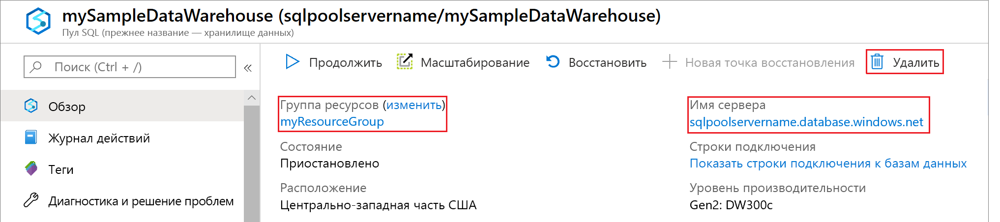

# <a name="quickstart-configure-workload-isolation-using-t-sql"></a>Краткое руководство. Настройка изоляции рабочих нагрузок с помощью T-SQL

В этом кратком руководстве вы быстро создадите группу рабочей нагрузки и классификатор для резервирования ресурсов для загрузки данных. Группа рабочей нагрузки будет выделять 20 % системных ресурсов для загрузки данных.  Классификатор рабочей нагрузки будет назначать запросы к данным, загружаемым группой рабочей нагрузки.  Благодаря изоляции загрузки данных на уровне 20 % использование ресурсов будет соответствовать действующим соглашениям об уровне обслуживания.

Если у вас еще нет подписки Azure, создайте [бесплатную](https://azure.microsoft.com/free/) учетную запись Azure, прежде чем начинать работу.

> [!NOTE]
> Создание хранилища данных SQL может привести к дополнительным расходам.  Дополнительные сведения см. на странице [цен на хранилище данных SQL](https://azure.microsoft.com/pricing/details/sql-data-warehouse/).
>
>

## <a name="prerequisites"></a>Предварительные требования
 
В этом кратком руководстве предполагается, что у вас уже есть Хранилище данных SQL и права доступа к системе управления базой данных. Если его требуется создать, используйте инструкции из раздела [Создание хранилища данных SQL Azure на портале Azure и отправка запросов к этому хранилищу данных](create-data-warehouse-portal.md), чтобы создать хранилище данных **mySampleDataWarehouse**.

## <a name="sign-in-to-the-azure-portal"></a>Вход на портал Azure

Войдите на [портале Azure](https://portal.azure.com/).

## <a name="create-login-for-dataloads"></a>Создание имени для входа для DataLoads

Создайте имя для входа с аутентификацией SQL Server в базе данных `master`, используя оператор [CREATE LOGIN](/sql/t-sql/statements/create-login-transact-sql) для ELTLogin.

```sql
IF NOT EXISTS (SELECT * FROM sys.sql_logins WHERE name = 'ELTLogin')
BEGIN
CREATE LOGIN [ELTLogin] WITH PASSWORD='<strongpassword>'
END
;
```

## <a name="create-user"></a>Создать пользователя

[Создайте пользователя](/sql/t-sql/statements/create-user-transact-sql?view=azure-sqldw-latest) ELTLogin в mySampleDataWarehouse.

```sql
IF NOT EXISTS (SELECT * FROM sys.database_principals WHERE name = 'ELTLogin')
BEGIN
CREATE USER [ELTLogin] FOR LOGIN [ELTLogin]
END
;
```

## <a name="create-a-workload-group"></a>Создание группы рабочей нагрузки
Создайте [группу рабочей нагрузки](/sql/t-sql/statements/create-workload-group-transact-sql?view=azure-sqldw-latest) для DataLoads с уровнем изоляции в 20 %.
```sql
CREATE WORKLOAD GROUP DataLoads
WITH ( MIN_PERCENTAGE_RESOURCE = 20   
      ,CAP_PERCENTAGE_RESOURCE = 100
      ,REQUEST_MIN_RESOURCE_GRANT_PERCENT = 5) 
;
```

## <a name="create-a-workload-classifier"></a>Создание классификатора рабочих нагрузок

Создайте [классификатор рабочей нагрузки](/sql/t-sql/statements/create-workload-classifier-transact-sql?view=azure-sqldw-latest), чтобы связать ELTLogin с группой рабочей нагрузки DataLoads.

```sql
CREATE WORKLOAD CLASSIFIER [wgcELTLogin]
WITH (WORKLOAD_GROUP = 'ELTLogin'
      ,MEMBERNAME = 'DataLoads')
;
```

## <a name="view-existing-workload-groups-and-classifiers"></a>Просмотр существующих групп рабочей нагрузки и классификаторов

```sql
SELECT * FROM 
sys.workload_management_workload_groups

SELECT * FROM 
sys.workload_management_workload_classifiers
```

## <a name="clean-up-resources"></a>Очистка ресурсов

```sql
DROP WORKLOAD CLASSIFIER [wgcELTLogin]
DROP WORKLOAD GROUP [DataLoads]
DROP USER [ELTLogin]
;
```

Плата взимается за единицы хранилища данных и данные, которые содержатся в нем. Плата за вычислительные ресурсы и ресурсы хранилища взимается отдельно.

- Если вы хотите сохранить данные в хранилище, то можете приостановить работу вычислительных ресурсов, когда не используете хранилище данных. При приостановке вычислений плата взимается только за хранение данных. Когда вы будете готовы работать с данными, возобновите вычисление.
- Если вы хотите исключить будущие расходы, то можете удалить хранилище данных.

Выполните следующие действия, чтобы очистить ресурсы.

1. Войдите на [портал Azure](https://portal.azure.com) и выберите хранилище данных.

    

2. Чтобы приостановить вычисление, нажмите кнопку **Пауза**. Если работа хранилища данных приостановлена, вы увидите кнопку **Запуск**.  Чтобы возобновить вычисление, нажмите кнопку **Пуск**.

3. Чтобы удалить хранилище данных во избежание дальнейших платежей за вычисления или хранение, нажмите кнопку **Удалить**.

4. Чтобы удалить созданный вами сервер SQL, выберите сервер **mynewserver-20180430.database.windows.net**, выделенный на предыдущем изображении, а затем нажмите **Удалить**.  Будьте внимательны, так как удаление сервера приведет к удалению всех баз данных, назначенных этому серверу.

5. Чтобы удалить группу ресурсов, выберите **myResourceGroup**, а затем **Удалить группу ресурсов**.

## <a name="next-steps"></a>Дополнительная информация

- Вы создали группу рабочей нагрузки. Теперь выполните несколько запросов как ELTLogin, чтобы проверить, как они работают. Запросы и назначенную группу рабочей нагрузки можно просмотреть в представлении [sys.dm_pdw_exec_requests](/sql/relational-databases/system-dynamic-management-views/sys-dm-pdw-exec-requests-transact-sql).
- Дополнительные сведения об управлении рабочими нагрузками Хранилища данных SQL Azure см. в статьях [Что такое управление рабочей нагрузкой?](sql-data-warehouse-workload-management.md) и [Изоляция группы рабочей нагрузки хранилища данных SQL (предварительная версия)](sql-data-warehouse-workload-isolation.md).
