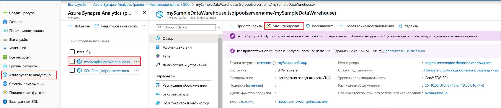

# Краткое руководство. Масштабирование вычислительных ресурсов в хранилище данных SQL Azure с помощью портала Azure

Масштабирование вычислительных ресурсов в хранилище данных SQL Azure с помощью портала Azure [Горизонтально масштабируйте вычислительные ресурсы](sql-data-warehouse-manage-compute-overview.md), чтобы повысить производительность, или уменьшайте их масштаб, чтобы сократить затраты. 

Если у вас еще нет подписки Azure, создайте [бесплатную](https://azure.microsoft.com/free/) учетную запись Azure, прежде чем начинать работу.

## Вход на портал Azure

Войдите на [портале Azure](https://portal.azure.com/).

## Перед началом работы

Вы можете масштабировать уже существующее хранилище данных или создать хранилище данных с именем **mySampleDataWarehouse**, воспользовавшись кратким руководством [Создание хранилища данных SQL Azure на портале Azure и отправка запросов к этому хранилищу данных](create-data-warehouse-portal.md).  В этом кратком руководстве масштабируется хранилище **mySampleDataWarehouse**.

>[!Note]
>Для масштабирования это хранилище данных должно работать. 

## Масштабирование вычислительных ресурсов

Вычислительные ресурсы хранилища данных SQL можно масштабировать путем увеличения или уменьшения единиц использования хранилища данных. В статье "Краткое руководство. Создание хранилища данных SQL Azure на портале Azure и отправка запросов к этому хранилищу данных" мы создали хранилище **mySampleDataWarehouse** и инициализировали его со значением 400 DWU. Ниже описаны шаги по изменению числа единиц DWU для **mySampleDataWarehouse**.

Изменить число единиц использования хранилища данных можно так:

1. На портале Azure на странице слева щелкните **Хранилища данных SQL**.
2. На странице **Хранилища данных SQL** выберите **mySampleDataWarehouse**. Откроется хранилище данных.
3. Щелкните пункт **Масштаб**.

    

2. В области "Масштаб" передвиньте ползунок влево или вправо, чтобы изменить число единиц DWU.

    

3. Выберите команду **Сохранить**. Появится сообщение с подтверждением. Щелкните **Да** для подтверждения или **Нет** для отмены.

    

## Дополнительная информация
Вы научились масштабировать вычислительные ресурсы для хранилища данных. Чтобы узнать больше о хранилище данных SQL Azure, перейдите к руководству по загрузке данных.

> [!div class="nextstepaction"]
>[Загрузка данных в Хранилище данных SQL](load-data-from-azure-blob-storage-using-polybase.md)
