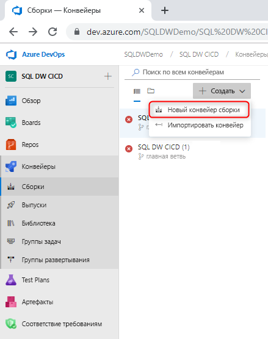
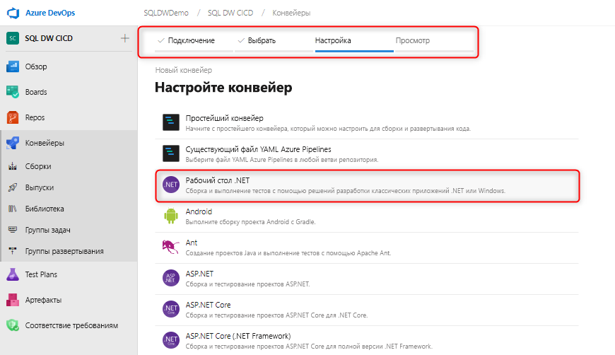
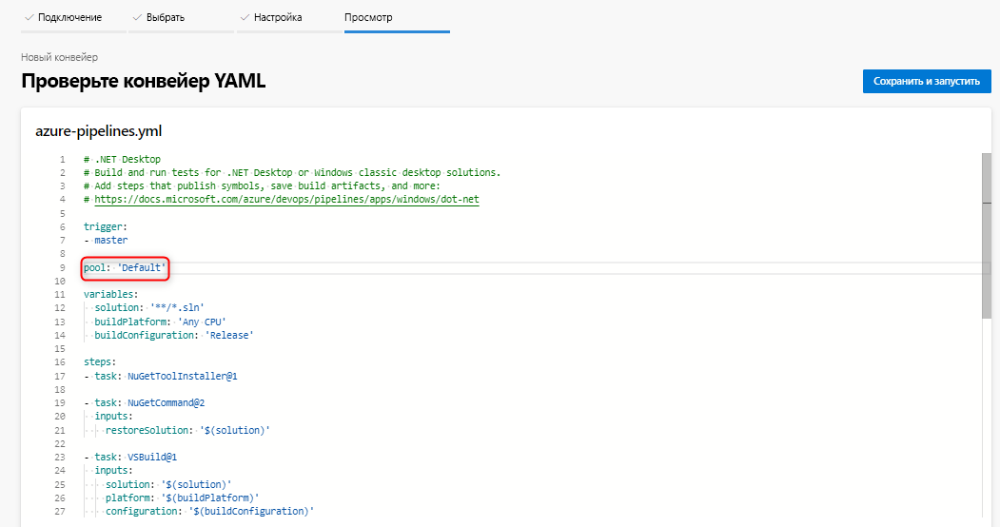
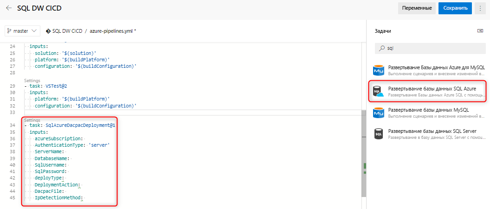
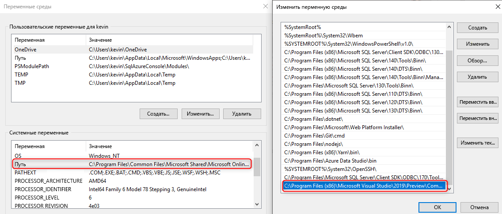

# Непрерывная интеграция и развертывание в Хранилище данных SQL Azure

В этом простом учебнике объясняется, как интегрировать проект базы данных SQL Server Data Tools (SSDT) с Azure DevOps и настроить непрерывную интеграцию и развертывание с помощью Azure Pipelines. Этот учебник является вторым шагом в создании конвейера непрерывной интеграции и развертывания в Хранилище данных SQL. 

## Перед началом работы

- Изучите [учебник по интеграции системы управления версиями](https://docs.microsoft.com/azure/sql-data-warehouse/sql-data-warehouse-source-control-integration).

- Настройка и подключение к Azure DevOps

## Непрерывная интеграция с использованием сборки Visual Studio

1. Перейдите к Azure Pipelines и создайте конвейер сборки.

      

2. Выберите репозиторий исходного кода (Azure Repos Git) и шаблон классического приложения .NET.

       

3. Измените файл YAML, указав соответствующий пул агента. Файл YAML должен выглядеть примерно так:

      

На этом этапе у вас есть простая среда, в которой в результате любого возврата к главной ветви репозитория системы управления версиями автоматически активируется успешная сборка проекта базы данных в Visual Studio. Убедитесь, что автоматизация работает комплексно, внеся изменение в проект локальной базы данных и возвратив это изменение в главную ветвь.

## Непрерывное развертывание с помощью задачи развертывания Data Warehouse (или Базы данных) SQL Azure

1. Добавьте новую задачу с помощью [задачи развертывания Базы данных SQL Azure](https://docs.microsoft.com/azure/devops/pipelines/tasks/deploy/sql-azure-dacpac-deployment?view=azure-devops) и заполните необходимые поля, чтобы подключиться к целевому хранилищу данных. При запуске этой задачи DACPAC, созданный в результате предыдущего процесса сборки, развертывается в целевом хранилище данных. Вы также можете использовать [задачу развертывания Хранилища данных SQL Azure](https://marketplace.visualstudio.com/items?itemName=ms-sql-dw.SQLDWDeployment) 

      

2. При использовании локального агента убедитесь, что для переменной среды задано использование правильного файла SqlPackage.exe для Хранилища данных SQL. Путь должен выглядеть следующим образом:

      

   C:\Program Files (x86)\Microsoft Visual Studio\2019\Preview\Common7\IDE\Extensions\Microsoft\SQLDB\DAC\150  

   Запустите и проверьте свой конвейер. Вы можете вносить изменения локально и возвращать изменения в системе управления версиями, в результате чего должна выполняться автоматическая сборка и развертывание.

## Дополнительная информация

- Изучите [архитектуру хранилища данных SQL Azure](/azure/sql-data-warehouse/massively-parallel-processing-mpp-architecture).
- Быстро [создайте Хранилище данных SQL Azure][create a SQL Data Warehouse].
- [Загрузите демонстрационные данные][load sample data].
- Просмотрите [видео](/azure/sql-data-warehouse/sql-data-warehouse-videos).

<!--Image references-->

[1]: ./media/sql-data-warehouse-overview-what-is/dwarchitecture.png

<!--Article references-->
[Create a support ticket]: ./sql-data-warehouse-get-started-create-support-ticket.md
[load sample data]: ./sql-data-warehouse-load-sample-databases.md
[create a SQL Data Warehouse]: ./sql-data-warehouse-get-started-provision.md
[Migration documentation]: ./sql-data-warehouse-overview-migrate.md
[SQL Data Warehouse solution partners]: ./sql-data-warehouse-partner-business-intelligence.md
[Integrated tools overview]: ./sql-data-warehouse-overview-integrate.md
[Backup and restore overview]: ./sql-data-warehouse-restore-database-overview.md
[Azure glossary]: ../azure-glossary-cloud-terminology.md

<!--MSDN references-->

<!--Other Web references-->
[Blogs]: https://azure.microsoft.com/blog/tag/azure-sql-data-warehouse/
[Customer Advisory Team blogs]: https://blogs.msdn.microsoft.com/sqlcat/tag/sql-dw/
[Feature requests]: https://feedback.azure.com/forums/307516-sql-data-warehouse
[MSDN forum]: https://social.msdn.microsoft.com/Forums/azure/home?forum=AzureSQLDataWarehouse
[Stack Overflow forum]: https://stackoverflow.com/questions/tagged/azure-sqldw
[Twitter]: https://twitter.com/hashtag/SQLDW
[Videos]: https://azure.microsoft.com/documentation/videos/index/?services=sql-data-warehouse
[SLA for SQL Data Warehouse]: https://azure.microsoft.com/support/legal/sla/sql-data-warehouse/v1_0/
[Volume Licensing]: https://www.microsoftvolumelicensing.com/DocumentSearch.aspx?Mode=3&DocumentTypeId=37
[Service Level Agreements]: https://azure.microsoft.com/support/legal/sla/
