# Интеграция системы управления версиями для Хранилища данных SQL Azure

Из этого руководства вы узнаете, как интегрировать проект базы данных SQL Server Data Tools (SSDT) с системой управления версиями.  Интеграция системы управления версиями — это первый шаг в создании конвейера непрерывной интеграции и развертывания с помощью Хранилища данных SQL. 

## Перед началом работы

- Зарегистрируйтесь в [организации Azure DevOps](https://azure.microsoft.com/services/devops/).
- Выполните инструкции из руководства по [созданию и подключению](https://docs.microsoft.com/azure/sql-data-warehouse/create-data-warehouse-portal).
-  [Установите Visual Studio 2019](https://visualstudio.microsoft.com/vs/older-downloads/). 

## Настройка и подключение к Azure DevOps

1. В организации Azure DevOps создайте проект, в котором будет размещаться проект базы данных SSDT через репозиторий Azure Repos.

   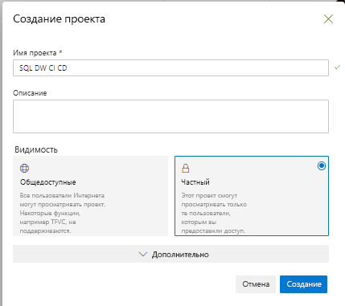

2. Откройте Visual Studio и подключитесь к организации Azure DevOps и к проекту, созданному на шаге 1, выбрав "Управление подключениями".

   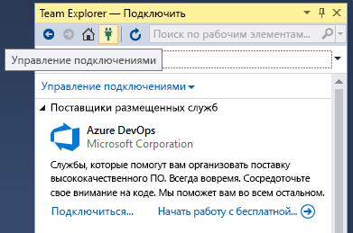

   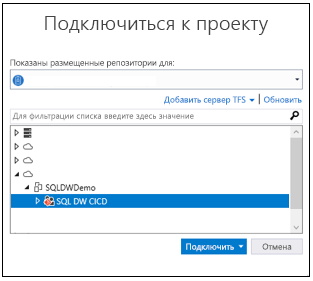

3. Клонируйте репозиторий Azure Repo из проекта на локальный компьютер.

   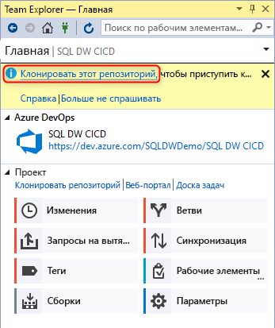

## Создание и подключение проекта

1. В Visual Studio создайте проект базы данных SQL Server с каталогом и локальным репозиторием Git в **локальном клонированном репозитории**.

   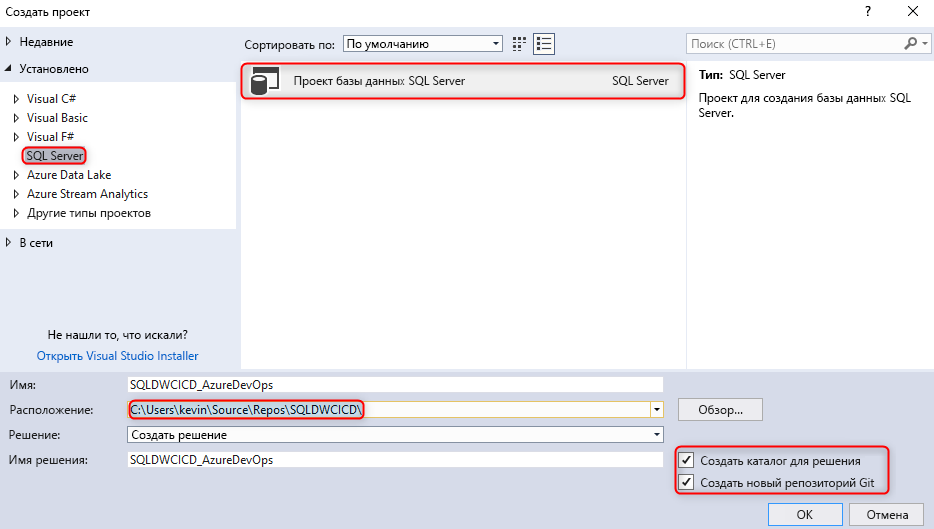  

2. Щелкните правой кнопкой мыши пустой проект SQL и импортируйте хранилище данных в проект базы данных.

   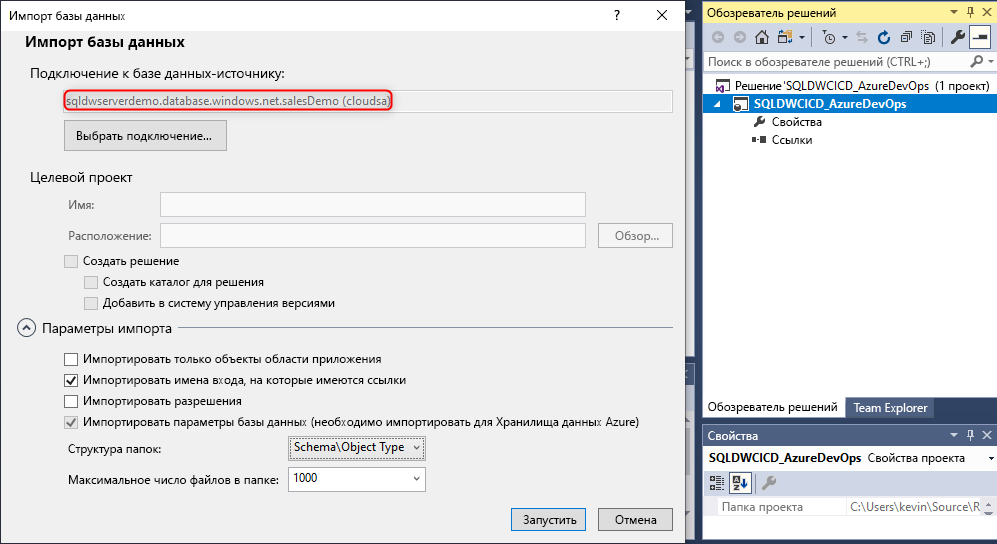  

3. В Team Explorer в Visual Studio зафиксируйте все изменения в локальном репозитории Git. 

   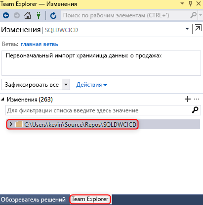  

4. Теперь, когда изменения локально зафиксированы в клонированном репозитории, синхронизируйте и отправьте изменения в репозиторий Azure Repos в проекте Azure DevOps.

   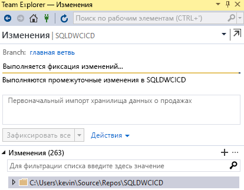

   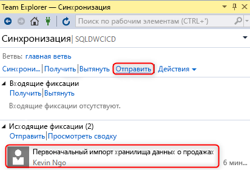  

## Проверка

1. Убедитесь, что изменения были отправлены в Azure Repos, обновив столбец таблицы в проекте базы данных из Visual Studio SQL Server Data Tools (SSDT).

   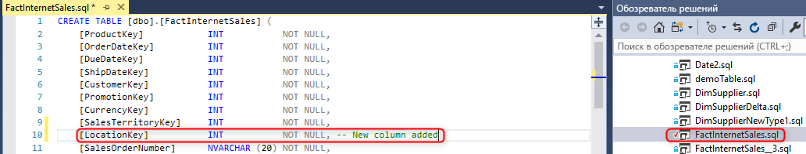

2. Зафиксируйте и отправьте изменения из локального репозитория в Azure Repos.

   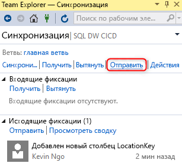

3. Убедитесь, что изменение было отправлено в репозиторий в Azure Repos.

   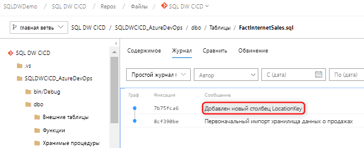

4. (**Необязательно**.) Используйте сравнение схем и обновите изменения в целевом хранилище данных с помощью SSDT, чтобы определения объектов в репозитории Azure в Azure Repos и локальном репозитории отражали изменения в хранилище данных.

## Дополнительная информация

- [Разработка для Хранилища данных SQL Azure](sql-data-warehouse-overview-develop.md)

<!--Image references-->

<!--Article references-->

<!--MSDN references-->

<!--Other Web references-->

