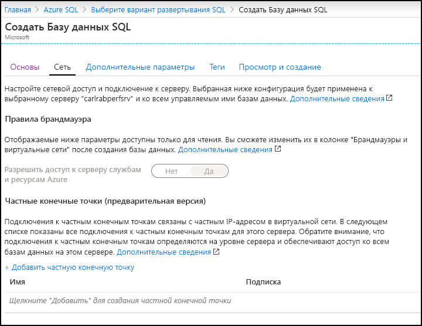

На этом этапе вы создадите отдельную базу данных в службе "База данных SQL Azure". 

> [!IMPORTANT]
> Убедитесь, что правила брандмауэра настроены для использования общедоступного IP-адреса компьютера, на котором выполняются инструкции из этой статьи.
>
> Дополнительные сведения см. в статье о [создании правила брандмауэра на уровне базы данных](/sql/relational-databases/system-stored-procedures/sp-set-database-firewall-rule-azure-sql-database). Чтобы определить IP-адрес, используемый для правила брандмауэра уровня сервера для компьютера, обратитесь к статье о [создании правила брандмауэра на уровне сервера](../sql-database-server-level-firewall-rule.md).  

# <a name="portal"></a>[Портал](#tab/azure-portal)

Создайте группу ресурсов и отдельную базу данных с помощью портала Azure.

1. На [портале Azure](https://portal.azure.com) в меню слева выберите **Azure SQL**. Если **Azure SQL** отсутствует в списке, выберите **Все службы** и в поле поиска введите *Azure SQL*. (Необязательно) Щелкните звезду рядом с **Azure SQL**, чтобы добавить этот элемент в избранное и область навигации слева. 
2. Щелкните **+ Добавить**, чтобы открыть страницу **Выбор варианта развертывания SQL**. Чтобы просмотреть дополнительные сведения о различных базах данных, выберите **Показать сведения** на плитке **Базы данных**.
3. Нажмите кнопку **Создать**.

   

4. На вкладке **Основные сведения**  в разделе **Сведения о проекте** введите или выберите следующие значения:

   - **Подписка**: Раскройте раскрывающийся список и выберите правильную подписку, если она не отобразится автоматически.
   - **Группа ресурсов.** Выберите **Создать**, введите `myResourceGroup` и щелкните **ОК**.

     

5. В разделе **Сведения о базе данных** введите или выберите следующие значения:

   - **Имя базы данных**. Введите `mySampleDatabase`.
   - **Сервер**: Выберите **Создать**, введите следующие значения и щелкните **Выбрать**.
       - **Имя сервера**: Введите `mysqlserver` и несколько цифр для уникальности имени.
       - **Имя для входа администратора сервера**. Введите `azureuser`.
       - **Пароль**. Введите сложный пароль, который соответствует требованиям к паролю.
       - **Расположение.** Выберите расположение из раскрывающегося списка, например `West US`.

         

      > [!IMPORTANT]
      > Запомните или запишите имя входа и пароль администратора сервера, чтобы можно было войти на сервер и в базы данных для выполнения действий, описанных в этом и других кратких руководствах. Если вы забыли имя входа или пароль, получить имя входа или сбросить пароль можно на странице **сервера SQL server**. Чтобы открыть страницу **сервера SQL**, выберите имя сервера на странице **Обзор** для базы данных после создания базы данных.

   - **Хотите использовать пул эластичных БД SQL?** Выберите **Нет**.
   - **Вычисления и хранилище**. Выберите **Настройка базы данных**. 

     

   - Выберите **Подготовлено**.  Кроме того, можно выбрать **Бессерверная**, чтобы создать бессерверную базу данных.

     

   - Проверьте параметры **виртуальных ядер** и **максимального размера данных**. Измените их при необходимости. 
     - При необходимости можно также выбрать команду **Изменить конфигурацию**, чтобы изменить параметры создания оборудования.
   - Нажмите кнопку **Применить**.

6. Щелкните вкладку **Сеть** и выберите [**Разрешить доступ к серверу службам и ресурсам Azure**](../sql-database-networkaccess-overview.md) либо [Добавить частную конечную точку](../../private-link/private-endpoint-overview.md).

   

7. Перейдите на вкладку **Дополнительные параметры**. 
8. В разделе **Источник данных** для параметра **Использовать имеющиеся данные** выберите `Sample`.

   

   > [!IMPORTANT]
   > Не забудьте выбрать данные **Пример (AdventureWorksLT)** , чтобы изучить это руководство и другие краткие руководства по Базе данных SQL Azure, в которых используются эти данные.

9. Оставьте остальные значения заданными по умолчанию и нажмите кнопку **Просмотр и создание** в нижней части формы.
10. Проверьте параметры и нажмите кнопку **Создать**.

11. В форме **База данных SQL** щелкните **Создать**, чтобы развернуть и подготовить группу ресурсов, сервер и базу данных.

# <a name="powershell"></a>[PowerShell](#tab/azure-powershell)

[!INCLUDE [updated-for-az](../../../includes/updated-for-az.md)]

Создайте группу ресурсов и отдельную базу данных с помощью PowerShell.

   ```powershell-interactive
   # Set variables for your server and database
   $subscriptionId = '<SubscriptionID>'
   $resourceGroupName = "myResourceGroup-$(Get-Random)"
   $location = "West US"
   $adminLogin = "azureuser"
   $password = "PWD27!"+(New-Guid).Guid
   $serverName = "mysqlserver-$(Get-Random)"
   $databaseName = "mySampleDatabase"

   # The ip address range that you want to allow to access your server 
   # (leaving at 0.0.0.0 will prevent outside-of-azure connections to your DB)
   $startIp = "0.0.0.0"
   $endIp = "0.0.0.0"

   # Show randomized variables
   Write-host "Resource group name is" $resourceGroupName 
   Write-host "Password is" $password  
   Write-host "Server name is" $serverName 

   # Connect to Azure
   Connect-AzAccount

   # Set subscription ID
   Set-AzContext -SubscriptionId $subscriptionId 

   # Create a resource group
   Write-host "Creating resource group..."
   $resourceGroup = New-AzResourceGroup -Name $resourceGroupName -Location $location -Tag @{Owner="SQLDB-Samples"}
   $resourceGroup

   # Create a server with a system wide unique server name
   Write-host "Creating primary logical server..."
   $server = New-AzSqlServer -ResourceGroupName $resourceGroupName `
      -ServerName $serverName `
      -Location $location `
      -SqlAdministratorCredentials $(New-Object -TypeName System.Management.Automation.PSCredential `
      -ArgumentList $adminLogin, $(ConvertTo-SecureString -String $password -AsPlainText -Force))
   $server

   # Create a server firewall rule that allows access from the specified IP range
   Write-host "Configuring firewall for primary logical server..."
   $serverFirewallRule = New-AzSqlServerFirewallRule -ResourceGroupName $resourceGroupName `
      -ServerName $serverName `
      -FirewallRuleName "AllowedIPs" -StartIpAddress $startIp -EndIpAddress $endIp
   $serverFirewallRule

   # Create General Purpose Gen4 database with 1 vCore
   Write-host "Creating a gen5 2 vCore database..."
   $database = New-AzSqlDatabase  -ResourceGroupName $resourceGroupName `
      -ServerName $serverName `
      -DatabaseName $databaseName `
      -Edition GeneralPurpose `
      -VCore 2 `
      -ComputeGeneration Gen5 `
      -MinimumCapacity 2 `
      -SampleName "AdventureWorksLT"
   $database
   ```

В этом сценарии используются следующие командлеты PowerShell:

| Get-Help | Примечания |
|---|---|
| [New-AzResourceGroup](/powershell/module/az.resources/new-azresourcegroup) | Создает группу ресурсов, в которой хранятся все ресурсы. |
| [New-AzSqlServer](/powershell/module/az.sql/new-azsqlserver) | Создает сервер Базы данных SQL, на котором размещены отдельные базы данных и эластичные пулы. |
| [New-AzSqlServerFirewallRule](/powershell/module/az.sql/new-azsqlserverfirewallrule) | Создание правила брандмауэра для логического сервера. | 
| [New-AzSqlDatabase](/powershell/module/az.sql/new-azsqldatabase) | Создание отдельной базы данных в Базе данных SQL Azure. | 

# <a name="azure-cli"></a>[Azure CLI](#tab/azure-cli)

Создайте группу ресурсов и отдельную базу данных с помощью Azure CLI.

   ```azurecli-interactive
   #!/bin/bash
   # set variables
   $subscription = "<subscriptionID>"
   $randomIdentifier = $(Get-Random)

   $resourceGroup = "resource-$randomIdentifier"
   $location = "East US"
   
   $login = "sampleLogin"
   $password = "samplePassword123!"

   $server = "server-$randomIdentifier"
   $database = "database-$randomIdentifier"
  
   az login # connect to Azure
   az account set -s $subscription # set subscription context for the Azure account

   echo "Creating resource group..."
   az group create --name $resourceGroup --location $location

   echo "Creating primary logical server..."
   az sql server create --name $server --resource-group $resourceGroup --location $location --admin-user $login --admin-password $password

   echo "Creating a gen5 2 vCore database..."
   az sql db create --resource-group $resourceGroup --server $server --name $database --sample-name AdventureWorksLT --edition GeneralPurpose --family Gen5 --capacity 2
   ```

Этот скрипт использует следующие команды. Для каждой команды в таблице приведены ссылки на соответствующую документацию.

| Get-Help | Примечания |
|---|---|
| [az account set](/cli/azure/account?view=azure-cli-latest#az-account-set) | Позволяет указать подписку в качестве текущей активной подписки. | 
| [az group create](/cli/azure/group#az-group-create) | Создает группу ресурсов, в которой хранятся все ресурсы. |
| [az sql server create](/cli/azure/sql/server#az-sql-server-create) | Создает сервер Базы данных SQL, на котором размещены отдельные базы данных и эластичные пулы. |
| [az sql server firewall-rule create](/cli/azure/sql/server/firewall-rule) | Создает правила брандмауэра сервера. | 
| [az sql db create](/cli/azure/sql/db?view=azure-cli-latest) | Создает базу данных. | 


---
