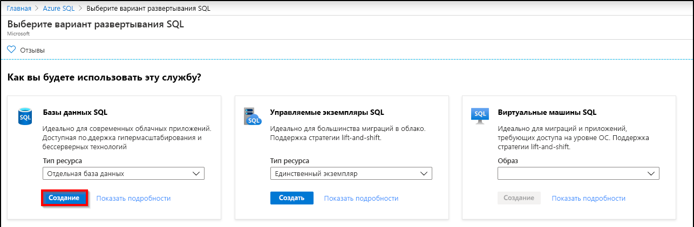
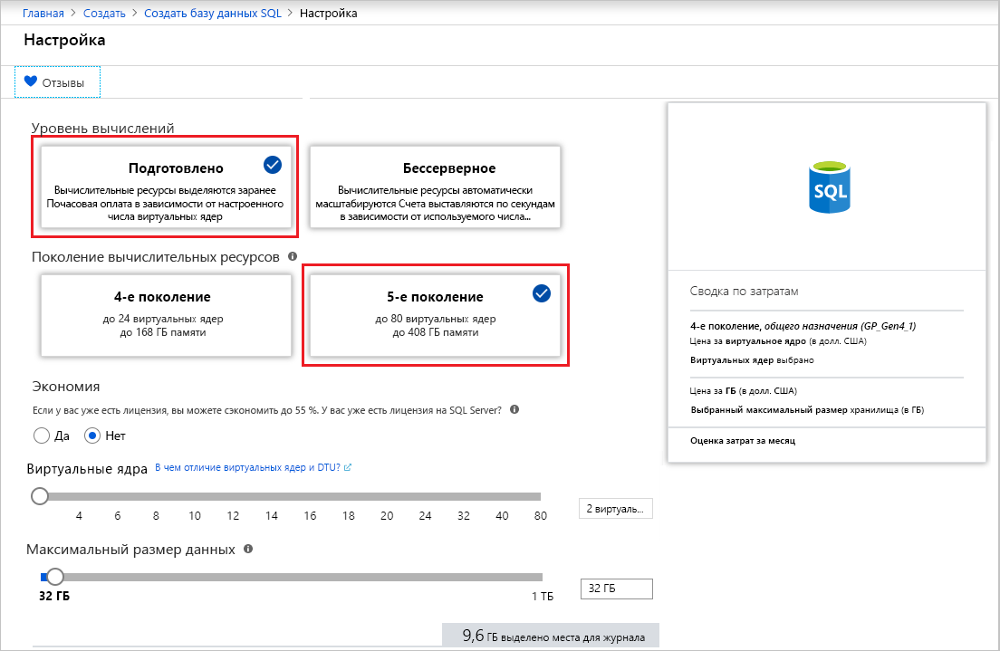

На этом этапе вы создадите отдельную базу данных в службе "База данных SQL Azure". 

> [!IMPORTANT]
> Убедитесь, что правила брандмауэра настроены для использования общедоступного IP-адреса компьютера, на котором выполняются инструкции из этой статьи.
>
> Дополнительные сведения см. в статье о [создании правила брандмауэра на уровне базы данных](/sql/relational-databases/system-stored-procedures/sp-set-database-firewall-rule-azure-sql-database). Чтобы определить IP-адрес, используемый для правила брандмауэра уровня сервера для компьютера, обратитесь к статье о [создании правила брандмауэра на уровне сервера](../sql-database-server-level-firewall-rule.md).  

# <a name="portaltabazure-portal"></a>[Портал](#tab/azure-portal)

Создайте группу ресурсов и отдельную базу данных с помощью портала Azure.

1. На [портале Azure](https://portal.azure.com) в меню слева выберите **Azure SQL**. Если **Azure SQL** отсутствует в списке, выберите **Все службы** и в поле поиска введите *Azure SQL*. (Необязательно) Щелкните звезду рядом с **Azure SQL**, чтобы добавить этот элемент в избранное и область навигации слева. 
2. Щелкните **+ Добавить**, чтобы открыть страницу **Выбор варианта развертывания SQL**. Чтобы просмотреть дополнительные сведения о различных базах данных, выберите **Показать сведения** на плитке **Базы данных**.
3. Нажмите кнопку **Создать**.

   

3. На вкладке **Основные сведения**  в разделе **Сведения о проекте** введите или выберите следующие значения:

   - **Подписка**: Раскройте раскрывающийся список и выберите правильную подписку, если она не отобразится автоматически.
   - **Группа ресурсов.** Выберите **Создать**, введите `myResourceGroup` и щелкните **ОК**.

     

4. В разделе **Сведения о базе данных** введите или выберите следующие значения:

   - **Имя базы данных**. Укажите `mySampleDatabase`.
   - **Сервер** — Выберите **Создать**, введите следующие значения и щелкните **Выбрать**.
       - **Имя сервера**. Введите `mysqlserver` и несколько цифр для уникальности имени.
       - **Учетные данные администратора сервера для входа**. Введите `azureuser`.
       - **Пароль**. Введите сложный пароль, который соответствует требованиям к паролю.
       - **Расположение.** Выберите расположение из раскрывающегося списка, например `West US`.

         

      > [!IMPORTANT]
      > Запомните или запишите имя входа и пароль администратора сервера, чтобы можно было войти на сервер и в базы данных для выполнения действий, описанных в этом и других кратких руководствах. Если вы забыли имя входа или пароль, получить имя входа или сбросить пароль можно на странице **сервера SQL server**. Чтобы открыть страницу **сервера SQL**, выберите имя сервера на странице **Обзор** для базы данных после создания базы данных.

   - **Хотите использовать пул эластичных БД SQL?** Выберите **Нет**.
   - **Вычисления и хранилище**. Выберите **Настройка базы данных**. 

     

   - Выберите **Подготовлено** и **5-е поколение**.

     

   - Проверьте значения параметров **Максимальное число виртуальных ядер**, **Минимальное число виртуальных ядер**, **Задержка перед автоматической приостановкой** и **Максимальный размер данных**. Измените их при необходимости.
   - Примите условия использования предварительной версии и нажмите кнопку **ОК**.
   - Нажмите кнопку **Применить**.

5. Перейдите на вкладку **Дополнительные параметры**. 
6. В разделе **Источник данных** для параметра **Использовать имеющиеся данные** выберите `Sample`.

   

   > [!IMPORTANT]
   > Не забудьте выбрать данные **Пример (AdventureWorksLT)** , чтобы изучить это руководство и другие краткие руководства по Базе данных SQL Azure, в которых используются эти данные.

7. Оставьте остальные значения заданными по умолчанию и нажмите кнопку **Просмотр и создание** в нижней части формы.
8. Проверьте параметры и нажмите кнопку **Создать**.

9. В форме **База данных SQL** щелкните **Создать**, чтобы развернуть и подготовить группу ресурсов, сервер и базу данных.

# <a name="powershelltabazure-powershell"></a>[PowerShell](#tab/azure-powershell)

[!INCLUDE [updated-for-az](../../../includes/updated-for-az.md)]

Создайте группу ресурсов и отдельную базу данных с помощью PowerShell.

   ```powershell-interactive
   # Set variables for your server and database
   $subscriptionId = '<SubscriptionID>'
   $resourceGroupName = "myResourceGroup-$(Get-Random)"
   $location = "West US"
   $adminLogin = "azureuser"
   $password = "PWD27!"+(New-Guid).Guid
   $serverName = "mysqlserver-$(Get-Random)"
   $databaseName = "mySampleDatabase"

   # The ip address range that you want to allow to access your server 
   # (leaving at 0.0.0.0 will prevent outside-of-azure connections to your DB)
   $startIp = "0.0.0.0"
   $endIp = "0.0.0.0"

   # Show randomized variables
   Write-host "Resource group name is" $resourceGroupName 
   Write-host "Password is" $password  
   Write-host "Server name is" $serverName 

   # Connect to Azure
   Connect-AzAccount

   # Set subscription ID
   Set-AzContext -SubscriptionId $subscriptionId 

   # Create a resource group
   Write-host "Creating resource group..."
   $resourceGroup = New-AzResourceGroup -Name $resourceGroupName -Location $location -Tag @{Owner="SQLDB-Samples"}
   $resourceGroup

   # Create a server with a system wide unique server name
   Write-host "Creating primary logical server..."
   $server = New-AzSqlServer -ResourceGroupName $resourceGroupName `
      -ServerName $serverName `
      -Location $location `
      -SqlAdministratorCredentials $(New-Object -TypeName System.Management.Automation.PSCredential `
      -ArgumentList $adminLogin, $(ConvertTo-SecureString -String $password -AsPlainText -Force))
   $server

   # Create a server firewall rule that allows access from the specified IP range
   Write-host "Configuring firewall for primary logical server..."
   $serverFirewallRule = New-AzSqlServerFirewallRule -ResourceGroupName $resourceGroupName `
      -ServerName $serverName `
      -FirewallRuleName "AllowedIPs" -StartIpAddress $startIp -EndIpAddress $endIp
   $serverFirewallRule

   # Create General Purpose Gen4 database with 1 vCore
   Write-host "Creating a gen5 2 vCore database..."
   $database = New-AzSqlDatabase  -ResourceGroupName $resourceGroupName `
      -ServerName $serverName `
      -DatabaseName $databaseName `
      -Edition GeneralPurpose `
      -VCore 2 `
      -ComputeGeneration Gen5 `
      -MinimumCapacity 2 `
      -SampleName "AdventureWorksLT"
   $database
   ```

# <a name="azure-clitabazure-cli"></a>[Интерфейс командной строки Azure](#tab/azure-cli)

Создайте группу ресурсов и отдельную базу данных с помощью Azure CLI.

   ```azurecli-interactive
   #!/bin/bash
   # Set variables
   subscriptionID=<SubscriptionID>
   resourceGroupName=myResourceGroup-$RANDOM
   location=SouthCentralUS
   adminLogin=azureuser
   password="PWD27!"+`openssl rand -base64 18`
   serverName=mysqlserver-$RANDOM
   databaseName=mySampleDatabase
   drLocation=NorthEurope
   drServerName=mysqlsecondary-$RANDOM
   failoverGroupName=failovergrouptutorial-$RANDOM

   # The ip address range that you want to allow to access your DB. 
   # Leaving at 0.0.0.0 will prevent outside-of-azure connections to your DB
   startip=0.0.0.0
   endip=0.0.0.0
  
   # Connect to Azure
   az login

   # Set the subscription context for the Azure account
   az account set -s $subscriptionID

   # Create a resource group
   echo "Creating resource group..."
   az group create \
      --name $resourceGroupName \
      --location $location \
      --tags Owner[=SQLDB-Samples]

   # Create a logical server in the resource group
   echo "Creating primary logical server..."
   az sql server create \
      --name $serverName \
      --resource-group $resourceGroupName \
      --location $location  \
      --admin-user $adminLogin \
      --admin-password $password

   # Configure a firewall rule for the server
   echo "Configuring firewall..."
   az sql server firewall-rule create \
      --resource-group $resourceGroupName \
      --server $serverName \
      -n AllowYourIp \
      --start-ip-address $startip \
      --end-ip-address $endip

   # Create a gen5 1vCore database in the server 
   echo "Creating a gen5 2 vCore database..."
   az sql db create \
      --resource-group $resourceGroupName \
      --server $serverName \
      --name $databaseName \
      --sample-name AdventureWorksLT \
      --edition GeneralPurpose \
      --family Gen5 \
      --capacity 2
   ```

---
