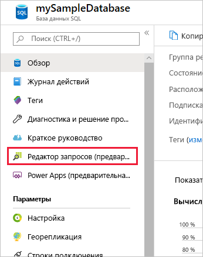
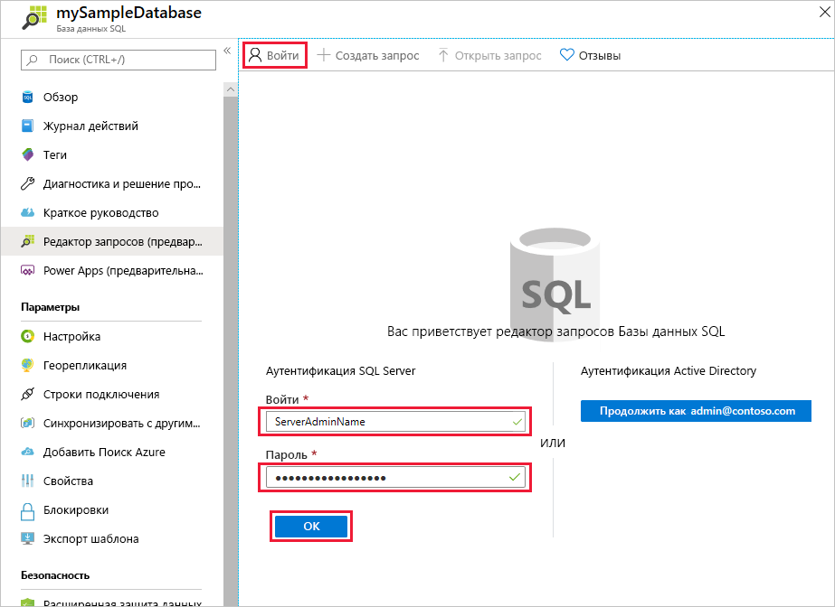
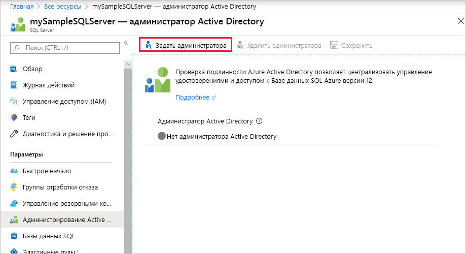
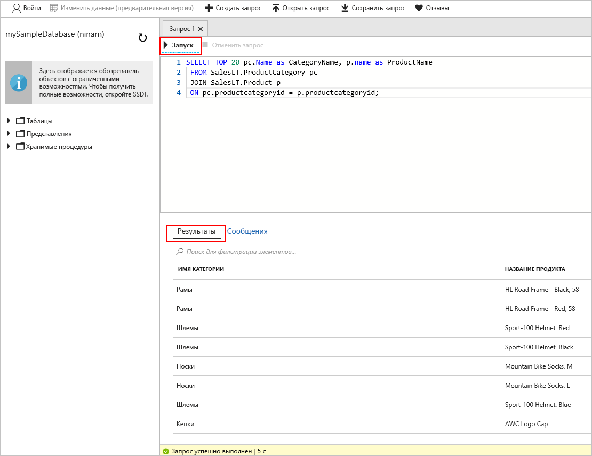

# <a name="quickstart-use-the-azure-portals-sql-query-editor-to-connect-and-query-data"></a>Краткое руководство. Использование редактора SQL-запросов на портале Azure для подключения к данным и их запроса

Редактор SQL-запросов представляет собой браузерное средство на портале Azure, которое обеспечивает простой способ выполнения SQL-запросов в базе данных SQL Azure или хранилище данных SQL Azure. В этом кратком руководстве показано использование редактора запросов для подключения к базе данных SQL, а также выполнение запроса, вставки, обновления и удаления данных с помощью инструкций Transact-SQL.

## <a name="prerequisites"></a>Предварительные требования

Для работы с этим учебником необходимы указанные ниже компоненты.

- База данных SQL Azure. Для создания и настройки базы данных в службе "База данных SQL Azure" можно использовать одно из этих кратких руководств.

  || Отдельная база данных |
  |:--- |:--- |
  | Создание| [Портал](sql-database-single-database-get-started.md) | 
  || [ИНТЕРФЕЙС КОМАНДНОЙ СТРОКИ](scripts/sql-database-create-and-configure-database-cli.md) | 
  || [PowerShell](scripts/sql-database-create-and-configure-database-powershell.md) | 
  | Настройка | [Правило брандмауэра IP-адресов на уровне сервера](sql-database-server-level-firewall-rule.md)| 
  |||

> [!NOTE]
> В параметрах брандмауэра SQL Server задайте для параметра **Разрешить доступ к службам Azure** значение **Вкл**. Таким образом вы предоставите редактору SQL-запросов доступ к базам и хранилищам данных.

## <a name="sign-in-the-azure-portal"></a>Вход на портал Azure

Войдите на [портале Azure](https://portal.azure.com/).

## <a name="connect-using-sql-authentication"></a>Подключение с помощью проверки подлинности SQL

1. В левой области меню щелкните **Базы данных SQL**, а затем выберите **mySampleDatabase**.

2. В левом меню найдите и выберите **Редактор запросов (предварительная версия)** . Откроется страница **входа**.

    

3. В раскрывающемся меню **Тип авторизации** выберите **Проверка подлинности SQL Server** и введите идентификатор пользователя и пароль учетной записи администратора сервера, указанные при создании базы данных.

     

4. Нажмите кнопку **ОК**.


## <a name="connect-using-azure-active-directory"></a>Подключение с помощью Azure Active Directory

Настройка администратора Active Directory (AD) позволит использовать единое удостоверение для входа на портал Azure и в базу данных SQL. Выполните приведенные шаги ниже, чтобы настроить администратора AD для своего сервера SQL Server.

> [!NOTE]
> * Учетные записи электронной почты (например, outlook.com, gmail.com, yahoo.com и др.) пока не поддерживаются как учетные записи администраторов AD. Выберите пользователя, который изначально был создан в Azure AD или же был интегрирован в каталог Azure AD.
> * Выполнить вход администратора Azure AD с помощью учетных записей, в которых включена двухфакторная проверка подлинности, не получится.

1. В левой области меню выберите **Все ресурсы**, а затем выберите свой сервер SQL Server.

2. В меню **параметров** SQL Server выберите **Администратор Active Directory**.

3. На панели инструментов на странице администратора AD щелкните **Задать администратора** и выберите пользователя или группу, которым будет назначена роль администратора AD.

    

4. На панели инструментов на странице администратора AD выберите **Сохранить**.

5. Перейдите к базе данных **mySampleDatabase** и в левом меню выберите **Редактор запросов (предварительная версия)** . Откроется страница **входа**. Если вы обладаете правами администратора AD, справа в разделе **Active Directory single sign-on** (Единый вход Active Directory) отобразится сообщение о входе в систему. 
   
6. Нажмите кнопку **ОК**.


## <a name="view-data"></a>Просмотр данных

1. После того как вы пройдете проверку подлинности, вставьте приведенный ниже SQL-запрос в редактор запросов, чтобы извлечь первые 20 продуктов из категории.

   ```sql
    SELECT TOP 20 pc.Name as CategoryName, p.name as ProductName
    FROM SalesLT.ProductCategory pc
    JOIN SalesLT.Product p
    ON pc.productcategoryid = p.productcategoryid;
   ```

2. На панели инструментов щелкните **Выполнить** и просмотрите выходные данные в области **Результаты**.



## <a name="insert-data"></a>Добавление данных

Выполните указанную ниже инструкцию Transact-SQL [INSERT](https://msdn.microsoft.com/library/ms174335.aspx), чтобы добавить новый продукт в таблицу `SalesLT.Product`.

1. Замените предыдущий запрос следующим содержимым.

   ```sql
   INSERT INTO [SalesLT].[Product]
           ( [Name]
           , [ProductNumber]
           , [Color]
           , [ProductCategoryID]
           , [StandardCost]
           , [ListPrice]
           , [SellStartDate]
           )
     VALUES
           ('myNewProduct'
           ,123456789
           ,'NewColor'
           ,1
           ,100
           ,100
           ,GETDATE() );
   ```


2. Щелкните **Выполнить**, чтобы вставить новую строку в таблицу `Product`. Отобразится панель **сообщений** с результатом: **Запрос выполнен. Затронуто строк: 1**.


## <a name="update-data"></a>Обновление данных

Выполните следующую инструкцию Transact-SQL [UPDATE](https://msdn.microsoft.com/library/ms177523.aspx), чтобы изменить новый продукт.

1. Замените предыдущий запрос следующим содержимым.

   ```sql
   UPDATE [SalesLT].[Product]
   SET [ListPrice] = 125
   WHERE Name = 'myNewProduct';
   ```

2. Щелкните **Выполнить**, чтобы обновить указанную строку в таблице`Product`. Отобразится панель **сообщений** с результатом: **Запрос выполнен. Затронуто строк: 1**.

## <a name="delete-data"></a>Удаление данных

Выполните следующую инструкцию Transact-SQL [DELETE](https://msdn.microsoft.com/library/ms189835.aspx), чтобы удалить новый продукт.

1. Замените предыдущий запрос следующим содержимым:

   ```sql
   DELETE FROM [SalesLT].[Product]
   WHERE Name = 'myNewProduct';
   ```

2. Щелкните **Выполнить**, чтобы удалить указанную строку в таблице`Product`. Отобразится панель **сообщений** с результатом: **Запрос выполнен. Затронуто строк: 1**.


## <a name="query-editor-considerations"></a>Рекомендации по работе с редактором запросов

Ознакомьтесь с рекомендациями по работе с редактором запросов.

* С помощью редактора запросов невозможно выполнять запрос баз данных SQL Server в виртуальной сети.

* Если нажать клавишу F5, страница редактора запросов обновится, а выполняемый запрос будет закрыт.

* Редактор запросов не поддерживает подключение к базе данных `master`.

* Время ожидания для выполнения запроса составляет 5 минут.

* Редактор запросов поддерживает только цилиндрическую проекцию для типов данных geography.

* Поддержка IntelliSense для таблиц и представлений баз данных отсутствует. Однако редактор поддерживает автозаполнение имен, введенных ранее.


## <a name="next-steps"></a>Дополнительная информация

Дополнительные сведения о поддержке Transact-SQL в базах данных SQL Azure см. в статье [Отличия Transact-SQL базы данных SQL Azure](sql-database-transact-sql-information.md).
