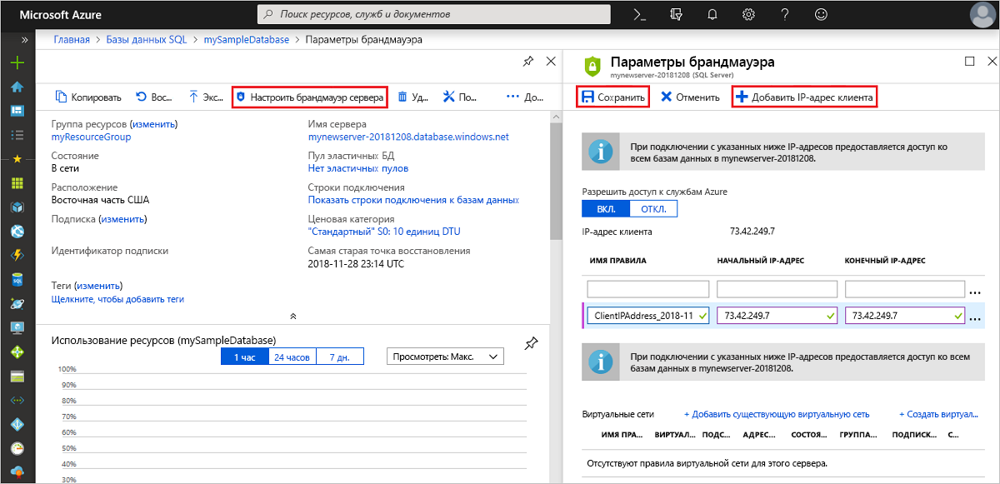

# <a name="azure-sql-database-and-azure-sql-data-warehouse-ip-firewall-rules"></a>Правила брандмауэра IP-адресов для базы данных SQL Azure и хранилища данных SQL Azure

> [!NOTE]
> Эта статья относится к серверам SQL Azure и к базам данных SQL Azure и хранилищам данных SQL Azure на сервере Azure SQL Server. Для простоты *база данных SQL* используется для ссылки на базу данных SQL и хранилище данных SQL.

> [!IMPORTANT]
> Эта статья *не* относится к *Управляемому экземпляру Базы данных SQL Azure*. Сведения о конфигурации сети см. [в статье подключение приложения к управляемый экземпляр базы данных SQL Azure](sql-database-managed-instance-connect-app.md).

Например, при создании нового сервера SQL Azure с именем *MySQLServer*брандмауэр базы данных SQL блокирует доступ к общедоступной конечной точке сервера (который доступен по адресу *MySQLServer.Database.Windows.NET*).

> [!IMPORTANT]
> Хранилище данных SQL поддерживает только правила брандмауэра для IP-адресов уровня сервера. Правила брандмауэра для IP-адресов уровня базы данных не поддерживаются.

## <a name="how-the-firewall-works"></a>Как работает брандмауэр
Попытки подключения из Интернета и Azure должны проходить через брандмауэр перед достижением SQL Server или базы данных SQL, как показано на следующей схеме.

   ![Схема конфигурации брандмауэра][1]

### <a name="server-level-ip-firewall-rules"></a>Правила брандмауэра для IP-адресов на уровне сервера

  Эти правила разрешают клиентам доступ ко всему серверу Azure SQL Server, то есть ко всем базам данных на одном сервере Базы данных SQL. Правила хранятся в базе данных *master* . Вы можете использовать не более 128 правил брандмауэра IP на уровне сервера для SQL Server Azure.
  
  Правила брандмауэра IP на уровне сервера можно настроить с помощью инструкций портал Azure, PowerShell или Transact-SQL.
  - Чтобы использовать портал или PowerShell, необходимо быть владельцем подписки или участником подписки.
  - Чтобы использовать Transact-SQL, необходимо подключиться к экземпляру базы данных SQL в качестве имени входа субъекта уровня сервера или администратора Azure Active Directory. (Правило брандмауэра IP уровня сервера должно быть создано пользователем, имеющим разрешения уровня Azure.)

### <a name="database-level-ip-firewall-rules"></a>Правила брандмауэра для IP-адресов на уровне базы данных

  Эти правила разрешают клиентам доступ к определенным (защищенным) базам данных на одном сервере Базы данных SQL. Правила создаются для каждой базы данных (включая базу данных *master* ) и хранятся в отдельной базе данных.
  
  Создавать и администрировать правила брандмауэра IP уровня базы данных для баз данных master и User можно только с помощью инструкций Transact-SQL и только после настройки первого брандмауэра на уровне сервера.
  
  Если указать диапазон IP-адресов в правиле брандмауэра IP уровня базы данных, который находится за пределами диапазона в правиле брандмауэра IP на уровне сервера, то только те клиенты, у которых есть IP-адреса в диапазоне уровня базы данных, могут получить доступ к базе данных.
  
  Для базы данных можно задать не более 128 правил брандмауэра для IP-адресов на уровне базы данных. Дополнительные сведения о настройке правил брандмауэра для IP-адресов на уровне базы данных см. в примере ниже в этой статье и см. в разделе [sp_set_database_firewall_rule (база данных SQL Azure)](https://msdn.microsoft.com/library/dn270010.aspx).

### <a name="recommendations-for-how-to-set-firewall-rules"></a>Рекомендации по настройке правил брандмауэра

При возможности рекомендуется использовать правила брандмауэра для IP-адресов уровня базы данных. Такой подход повышает безопасность и делает базу данных более переносимой. Используйте правила брандмауэра IP на уровне сервера для администраторов. Их также можно использовать при наличии большого количества баз данных, имеющих одинаковые требования к доступу, и вы не хотите настраивать каждую базу данных по отдельности.

> [!NOTE]
> Сведения о портативных базах данных в контексте непрерывности бизнес-процессов см. в разделе [Требования к проверке подлинности для аварийного восстановления](sql-database-geo-replication-security-config.md).

## <a name="server-level-versus-database-level-ip-firewall-rules"></a>Правила брандмауэра для IP-адресов уровня сервера и уровня базы данных

*Следует ли полностью изолировать пользователей одной базы данных от другой?*

Если *Да*, используйте правила брандмауэра для IP-адресов на уровне базы данных, чтобы предоставить доступ. Этот метод позволяет избежать использования правил брандмауэра IP на уровне сервера, позволяющих получить доступ через брандмауэр ко всем базам данных. Это снизит глубину защиты.

*Требуются ли пользователям с IP-адресами доступ ко всем базам данных?*

Если *Да*, используйте правила брандмауэра IP на уровне сервера, чтобы сократить число попыток настройки правил брандмауэра IP.

*Имеет ли пользователь или группа, которые настраивают правила брандмауэра IP, доступ только через портал Azure, PowerShell или REST API?*

В этом случае необходимо использовать правила брандмауэра для IP-адресов на уровне сервера. Правила брандмауэра IP-адресов уровня базы данных можно настроить только с помощью Transact-SQL.  

*Пользователь или группа, которые настраивают правила брандмауэра IP-адресов, не имеют разрешения высокого уровня на уровне базы данных?*

Если это так, используйте правила брандмауэра IP на уровне сервера. Для настройки правил брандмауэра для IP-адресов уровня базы данных с помощью Transact-SQL требуется по крайней мере разрешение *Control Database* на уровне базы данных.  

*Пользователь или группа, которые настраивают или подлежат аудиту правил брандмауэра IP-адресов, централизованно управляют правилами брандмауэра IP-адресов для многих (возможно, сотен) баз данных?*

В этом сценарии рекомендации определяются вашими потребностями и средой. Правила брандмауэра для IP-адресов на уровне сервера проще настроить, но сценарии позволяют настроить правила уровня базы данных. Даже если используются правила брандмауэра IP на уровне сервера, может потребоваться выполнить аудит правил брандмауэра для IP-адресов на уровне базы данных, чтобы узнать, есть ли пользователи с разрешением *Control* на базу данных создание правил брандмауэра для IP-адресов на уровне базы данных.

*Можно ли использовать правила брандмауэра IP уровня сервера и уровня базы данных?*

Да. Некоторым пользователям, например администраторам, могут потребоваться правила брандмауэра для IP-адресов на уровне сервера. А другим пользователям, например пользователям приложения базы данных, необходимы правила брандмауэра для IP-адресов на уровне базы данных.

### <a name="connections-from-the-internet"></a>Подключения через Интернет

Когда компьютер пытается подключиться к серверу базы данных из Интернета, брандмауэр сначала проверяет исходный IP-адрес запроса по правилам брандмауэра IP уровня базы данных для базы данных, которую запрашивает соединение.

- Если адрес находится в диапазоне, указанном в правилах брандмауэра IP-адресов уровня базы данных, то соединение предоставляется базе данных SQL, содержащей правило.
- Если адрес не входит в диапазон правил брандмауэра для IP-адресов уровня базы данных, брандмауэр проверяет правила брандмауэра IP-адресов на уровне сервера. Если адрес находится в диапазоне, который находится в правилах брандмауэра IP на уровне сервера, соединение предоставляется. Правила брандмауэра для IP-адресов на уровне сервера применяются ко всем базам данных SQL на сервере SQL Azure.  
- Если адрес находится не в диапазоне, который находится в каком-либо из правил брандмауэра на уровне базы данных или на уровне сервера, запрос на подключение завершается ошибкой.

> [!NOTE]
> Чтобы получить доступ к базе данных SQL с локального компьютера, убедитесь, что брандмауэр в сети и локальный компьютер разрешают исходящие подключения через TCP-порт 1433.

### <a name="connections-from-inside-azure"></a>Подключения из Azure

Чтобы разрешить приложениям, размещенным в Azure, подключаться к серверу SQL Server, необходимо включить подключения Azure. Когда приложение из Azure пытается подключиться к серверу базы данных, брандмауэр проверяет, разрешены ли подключения Azure. Параметр брандмауэра с начальным и конечным IP-адресами, равным *0.0.0.0* , указывает, что разрешены подключения Azure. Если соединение не разрешено, запрос не достигает сервера базы данных SQL.

> [!IMPORTANT]
> Этот параметр позволяет настроить брандмауэр для разрешения всех подключений из Azure, включая подключения из подписок других клиентов. При выборе этого параметра убедитесь, что учетные данные и разрешения пользователя ограничивают доступ только для полномочных пользователей.

## <a name="create-and-manage-ip-firewall-rules"></a>Создание правил брандмауэра IP-адресов и управление ими

Первый параметр брандмауэра на уровне сервера создается с помощью [портал Azure](https://portal.azure.com/) или программным путем с помощью [Azure PowerShell](https://docs.microsoft.com/powershell/module/az.sql), [Azure CLI](https://docs.microsoft.com/cli/azure/sql/server/firewall-rule)или [REST API](https://docs.microsoft.com/rest/api/sql/firewallrules/createorupdate)Azure. Вы создаете дополнительные правила брандмауэра IP на уровне сервера и управляете ими с помощью этих методов или Transact-SQL.

> [!IMPORTANT]
> Правила брандмауэра IP уровня базы данных могут создаваться и управляться только с помощью Transact-SQL.

Для повышения производительности правила брандмауэра для IP-адресов на уровне сервера временно кэшируются на уровне базы данных. Сведения об обновлении кэша см. в статье [DBCC FLUSHAUTHCACHE (Transact-SQL)](https://msdn.microsoft.com/library/mt627793.aspx).

> [!TIP]
> Чтобы провести аудит изменений брандмауэра уровня сервера и уровня базы данных, можно использовать [аудит базы данных SQL](sql-database-auditing.md).

### <a name="use-the-azure-portal-to-manage-server-level-ip-firewall-rules"></a>Использование портал Azure для управления правилами брандмауэра IP на уровне сервера

Чтобы задать правило брандмауэра IP на уровне сервера в портал Azure, перейдите на страницу обзора для базы данных SQL Azure или сервера базы данных SQL.

> [!TIP]
> Руководство см. в статье [Создание базы данных SQL Azure на портале Azure](sql-database-single-database-get-started.md).

#### <a name="from-the-database-overview-page"></a>На странице "Обзор базы данных"

1. Чтобы задать правило брандмауэра IP на уровне сервера на странице Обзор базы данных, на панели инструментов выберите **задать брандмауэр сервера** , как показано на следующем рисунке. Откроется страница **параметров брандмауэра** для сервера Базы данных SQL.

      

2. Выберите **Добавить IP-адрес клиента** на панели инструментов для добавления IP-адреса компьютера, который вы используете, а затем нажмите кнопку **сохранить**. Для текущего IP-адреса будет создано правило брандмауэра для IP-адресов на уровне сервера.

      

#### <a name="from-the-server-overview-page"></a>На странице обзора сервера

Откроется страница обзора сервера. Он отображает полное имя сервера (например, *mynewserver20170403.Database.Windows.NET*) и предоставляет параметры для дальнейшей настройки.

1. Чтобы задать правило уровня сервера на этой странице, выберите брандмауэр в меню **Параметры** в левой части **экрана** .

2. Выберите **Добавить IP-адрес клиента** на панели инструментов для добавления IP-адреса компьютера, который вы используете, а затем нажмите кнопку **сохранить**. Для текущего IP-адреса будет создано правило брандмауэра для IP-адресов на уровне сервера.

### <a name="use-transact-sql-to-manage-ip-firewall-rules"></a>Использование Transact-SQL для управления правилами брандмауэра IP-адресов

| Представление каталога или хранимая процедура | Уровень | Описание |
| --- | --- | --- |
| [sys.firewall_rules](https://msdn.microsoft.com/library/dn269980.aspx) |Сервер |Отображает текущие правила брандмауэра для IP-адресов на уровне сервера |
| [sp_set_firewall_rule](https://msdn.microsoft.com/library/dn270017.aspx) |Сервер |Создает или обновляет правила брандмауэра для IP-адресов на уровне сервера |
| [sp_delete_firewall_rule](https://msdn.microsoft.com/library/dn270024.aspx) |Сервер |Удаляет правила брандмауэра для IP-адресов на уровне сервера |
| [sys.database_firewall_rules](https://msdn.microsoft.com/library/dn269982.aspx) |База данных |Отображает текущие правила брандмауэра для IP-адресов на уровне базы данных |
| [sp_set_database_firewall_rule](https://msdn.microsoft.com/library/dn270010.aspx) |База данных |Создает или обновляет правила брандмауэра для IP-адресов на уровне базы данных |
| [sp_delete_database_firewall_rule](https://msdn.microsoft.com/library/dn270030.aspx) |Базы данных |Удаляет правила брандмауэра для IP-адресов на уровне базы данных |

В следующем примере просматриваются существующие правила, включается диапазон IP-адресов на сервере *contoso*и удаляется правило брандмауэра IP-адреса.

```sql
SELECT * FROM sys.firewall_rules ORDER BY name;
```

Затем добавьте правило брандмауэра для IP-адресов на уровне сервера.

```sql
EXECUTE sp_set_firewall_rule @name = N'ContosoFirewallRule',
   @start_ip_address = '192.168.1.1', @end_ip_address = '192.168.1.10'
```

Чтобы удалить правило брандмауэра IP на уровне сервера, выполните хранимую процедуру *sp_delete_firewall_rule* . В следующем примере удаляется правило *ContosoFirewallRule*:

```sql
EXECUTE sp_delete_firewall_rule @name = N'ContosoFirewallRule'
```

### <a name="use-powershell-to-manage-server-level-ip-firewall-rules"></a>Использование PowerShell для управления правилами брандмауэра IP на уровне сервера 

[!INCLUDE [updated-for-az](../../includes/updated-for-az.md)]
> [!IMPORTANT]
> Модуль PowerShell Azure Resource Manager по-прежнему поддерживается базой данных SQL Azure, но теперь для модуля AZ. SQL используется вся разработка. Эти командлеты см. в разделе [AzureRM. SQL](https://docs.microsoft.com/powershell/module/AzureRM.Sql/). Аргументы для команд в модулях AZ и AzureRm существенно идентичны.

| Командлет | Уровень | Описание |
| --- | --- | --- |
| [Get-AzSqlServerFirewallRule](/powershell/module/az.sql/get-azsqlserverfirewallrule) |Сервер |Возвращает текущие правила брандмауэра уровня сервера |
| [New-AzSqlServerFirewallRule](/powershell/module/az.sql/new-azsqlserverfirewallrule) |Сервер |Создает новое правило брандмауэра уровня сервера |
| [Set-AzSqlServerFirewallRule](/powershell/module/az.sql/set-azsqlserverfirewallrule) |Сервер |Обновляет свойства существующего правила брандмауэра уровня сервера |
| [Remove-Азсклсерверфиреваллруле](/powershell/module/az.sql/remove-azsqlserverfirewallrule) |Сервер |Удаляет правила брандмауэра уровня сервера |

В следующем примере с помощью PowerShell задается правило брандмауэра IP на уровне сервера:

```powershell
New-AzSqlServerFirewallRule -ResourceGroupName "myResourceGroup" `
    -ServerName $servername `
    -FirewallRuleName "AllowSome" -StartIpAddress "0.0.0.0" -EndIpAddress "0.0.0.0"
```

> [!TIP]
> Примеры для PowerShell в контексте краткого руководства см. в статьях создание базы данных [PowerShell](sql-database-powershell-samples.md) и [Настройка правила брандмауэра IP-адреса уровня сервера базы данных SQL с помощью PowerShell](scripts/sql-database-create-and-configure-database-powershell.md).

### <a name="use-cli-to-manage-server-level-ip-firewall-rules"></a>Использование интерфейса командной строки для управления правилами брандмауэра IP на уровне сервера

| Командлет | Уровень | Описание |
| --- | --- | --- |
|[az sql server firewall-rule create](/cli/azure/sql/server/firewall-rule#az-sql-server-firewall-rule-create)|Сервер|Создает правило брандмауэра для IP-адресов на уровне сервера|
|[az sql server firewall-rule list](/cli/azure/sql/server/firewall-rule#az-sql-server-firewall-rule-list)|Сервер|Выводит список правил брандмауэра для IP-адресов на сервере|
|[az sql server firewall-rule show](/cli/azure/sql/server/firewall-rule#az-sql-server-firewall-rule-show)|Сервер|Отображение сведений о правиле брандмауэра IP-адресов|
|[az sql server firewall-rule update](/cli/azure/sql/server/firewall-rule##az-sql-server-firewall-rule-update)|Сервер|Обновляет правило брандмауэра IP-адресов.|
|[az sql server firewall-rule delete](/cli/azure/sql/server/firewall-rule#az-sql-server-firewall-rule-delete)|Сервер|Удаление правила брандмауэра IP-адресов|

В следующем примере с помощью интерфейса командной строки задается правило брандмауэра IP на уровне сервера:

```azurecli-interactive
az sql server firewall-rule create --resource-group myResourceGroup --server $servername \
-n AllowYourIp --start-ip-address 0.0.0.0 --end-ip-address 0.0.0.0
```

> [!TIP]
> Пример для интерфейса командной строки в контексте краткого руководства см. в разделе [CREATE DB-Azure CLI](sql-database-cli-samples.md) и [Создание отдельной базы данных и настройка правила брандмауэра для IP-адреса базы данных SQL с помощью Azure CLI](scripts/sql-database-create-and-configure-database-cli.md).

### <a name="use-a-rest-api-to-manage-server-level-ip-firewall-rules"></a>Использование REST API для управления правилами брандмауэра IP на уровне сервера

| API | Уровень | Описание |
| --- | --- | --- |
| [Вывод списка правил брандмауэра](https://docs.microsoft.com/rest/api/sql/firewallrules/listbyserver) |Сервер |Отображает текущие правила брандмауэра для IP-адресов на уровне сервера |
| [Создание или обновление правил брандмауэра](https://docs.microsoft.com/rest/api/sql/firewallrules/createorupdate) |Сервер |Создает или обновляет правила брандмауэра для IP-адресов на уровне сервера |
| [Удаление правил брандмауэра](https://docs.microsoft.com/rest/api/sql/firewallrules/delete) |Сервер |Удаляет правила брандмауэра для IP-адресов на уровне сервера |
| [Получение правил брандмауэра](https://docs.microsoft.com/rest/api/sql/firewallrules/get) | Сервер | Возвращает правила брандмауэра для IP-адресов на уровне сервера |

## <a name="troubleshoot-the-database-firewall"></a>Устранение неполадок брандмауэра базы данных

Если доступ к службе базы данных SQL не работает должным образом, учитывайте следующие моменты.

- **Конфигурация локального брандмауэра**

  Прежде чем компьютер сможет получить доступ к базе данных SQL, может потребоваться создать исключение брандмауэра на компьютере для TCP-порта 1433. Чтобы установить подключения внутри границы облака Azure, может потребоваться открыть дополнительные порты. Дополнительные сведения см. в разделе «База данных SQL: За пределами [1433 для ADO.NET 4,5 и базы данных SQL](sql-database-develop-direct-route-ports-adonet-v12.md)в разделе портов.

- **Преобразование сетевых адресов:**

  В связи с преобразованием сетевых адресов (NAT) IP-адрес, используемый вашим компьютером для подключения к базе данных SQL, может отличаться от IP-адреса в параметрах IP-конфигурации вашего компьютера. Чтобы просмотреть IP-адрес, который используется компьютером для подключения к Azure, сделайте следующее:
    1. Войдите на портал.
    1. Перейдите на вкладку **Настройка** на сервере, на котором размещена ваша база данных.
    1. **IP-адрес текущего клиента** отображается в разделе **Разрешенные IP-адреса** . Выберите **Добавить** для **разрешенных IP-адресов** , чтобы разрешить этому компьютеру доступ к серверу.

- **Изменения в списке разрешений еще не вступили в действие:**

  Чтобы изменения конфигурации брандмауэра базы данных SQL вступили в силу, может потребоваться около 5 минут.

- **Имя входа не имеет полномочий или был использован неверный пароль:**

  Если у имени входа нет разрешений на сервере базы данных SQL или пароль неверен, соединение с сервером будет отклонено. Создание параметра брандмауэра дает клиентам *возможность* попытаться подключиться к серверу. Клиент по-прежнему должен предоставлять необходимые учетные данные безопасности. Дополнительные сведения о подготовке имен входа см. в разделе Управление доступом к базе данных [SQL и хранилище данных SQL и предоставление им доступа к ним](sql-database-manage-logins.md).

- **Динамический IP-адрес**

  Если у вас есть подключение к Интернету, использующее динамическую IP-адресацию, и у вас возникли проблемы с брандмауэром, попробуйте одно из следующих решений.
  
  - Попросите поставщика услуг Интернета указать диапазон IP-адресов, назначенный клиентским компьютерам, обращающимся к серверу базы данных SQL. Добавьте этот диапазон IP-адресов в качестве правила брандмауэра IP.
  - Для клиентских компьютеров следует получить статические IP-адреса. Добавьте IP-адреса в качестве правил брандмауэра IP-адресов.

## <a name="next-steps"></a>Следующие шаги

- Убедитесь, что корпоративная сетевая среда разрешает входящий трафик из диапазонов вычислительных IP-адресов (включая диапазоны SQL), которые используются центрами обработки данных Azure. Может потребоваться добавить эти IP-адреса в список разрешений. См. раздел [диапазоны IP-адресов центра обработки данных Microsoft Azure](https://www.microsoft.com/download/details.aspx?id=41653).  
- Краткое руководство по созданию правила брандмауэра IP на уровне сервера см. в статье [Создание базы данных SQL Azure](sql-database-single-database-get-started.md).
- Дополнительные сведения о подключении к базе данных SQL Azure из приложений с открытым исходным кодом или сторонними приложениями см. [в статье примеры кода для быстрого запуска клиента в базе данных SQL](https://msdn.microsoft.com/library/azure/ee336282.aspx).
- Дополнительные сведения о дополнительных портах, которые может потребоваться открыть, см. в разделе "база данных SQL: За пределами раздела [портов, кроме 1433 для ADO.NET 4,5 и базы данных SQL](sql-database-develop-direct-route-ports-adonet-v12.md)
- Общие сведения о безопасности базы данных SQL Azure см. в разделе [Защита базы данных](sql-database-security-overview.md).

<!--Image references-->
[1]: ./media/sql-database-firewall-configure/sqldb-firewall-1.png
