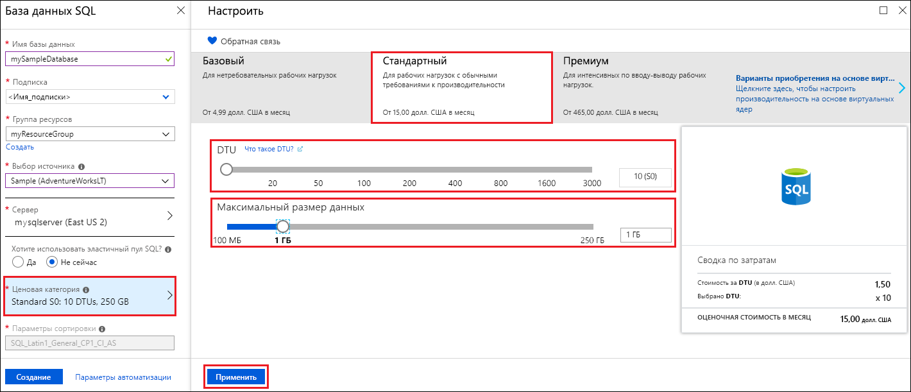
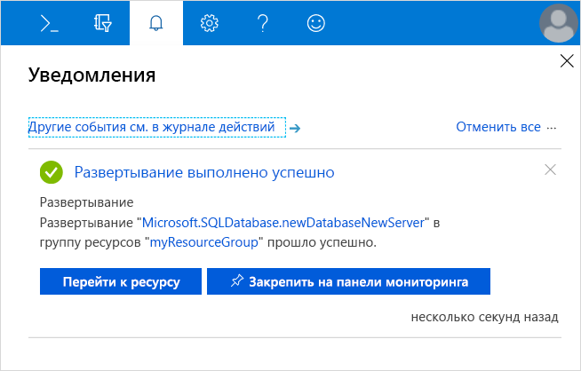
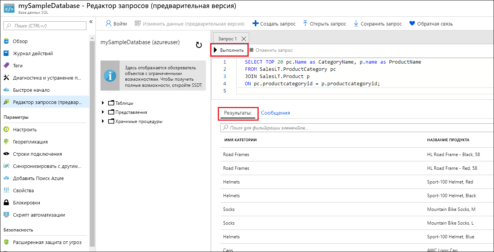

# <a name="quickstart-create-an-azure-sql-database-in-the-azure-portal"></a>Краткое руководство. Создание базы данных SQL Azure на портале Azure

База данных SQL Azure предоставляется в формате *база данных как услуга* и позволяет запускать и масштабировать высокодоступные базы данных SQL Server в облаке. В этом кратком руководстве описано, как создать базу данных Azure SQL и отправлять запросы к ней с помощью портала Azure. 

Если у вас еще нет подписки Azure, [создайте бесплатную учетную запись Azure](https://azure.microsoft.com/free/), прежде чем начинать работу.

Для выполнения всех шагов в этом кратком руководстве войдите на [портал Azure](https://portal.azure.com/).

## <a name="create-a-sql-database"></a>Создание базы данных SQL

База данных Azure SQL обладает определенным набором [вычислительных ресурсов и ресурсов хранения](sql-database-service-tiers-dtu.md). База данных создается на [логическом сервере Базы данных SQL Azure](sql-database-features.md), который размещается в [группе ресурсов Azure](../azure-resource-manager/resource-group-overview.md).

Чтобы создать базу данных SQL, содержащую образец данных AdventureWorksLT, выполните следующее.

1. Щелкните **Создать ресурс** в верхнем левом углу окна портала Azure.
   
1. Выберите **Базы данных**, а затем **База данных SQL**.
   
1. В форме **База данных SQL** введите или выберите следующие значения. 
   
   - **Имя базы данных**. Введите *mySampleDatabase*.
   - **Подписка**: Раскройте раскрывающийся список и выберите правильную подписку, если она не отобразится автоматически.  
   - **Группа ресурсов.** Выберите **Создать**, введите *myResourceGroup* и щелкните **ОК**. 
   - **Выберите источник**. Раскройте раскрывающийся список и выберите значение **Пример (AdventureWorksLT)**. 
   
   >[!IMPORTANT]
   >Не забудьте выбрать данные **Пример (AdventureWorksLT)**, чтобы выполнить это руководство и другие краткие руководства по Базе данных SQL Azure, в которых используются эти данные. 
   
   
   
1. Выберите **Сервер**, а затем **Создание нового сервера**. 
   
1. В форме **Новый сервер** введите или выберите следующие значения. 
   
   - **Имя сервера**. Введите *mysqlserver*.
   - **Имя для входа администратора сервера**. Введите *azureuser*. 
   - **Пароль**. Введите *Azure1234567*. 
   - **Подтверждение пароля**. Повторите ввод пароля.
   - **Расположение.** Раскройте раскрывающийся список и выберите любое действительное расположение.  
   
   >[!IMPORTANT]
   >Запомните или запишите имя входа и пароль администратора сервера, чтобы можно было войти на сервер и в базы данных для выполнения действий в этом и других кратких руководствах. Если вы забыли имя входа или пароль, получить имя входа или сбросить пароль можно на странице **сервера SQL server**. Чтобы открыть страницу **сервера SQL**, выберите имя сервера на странице **Обзор** для базы данных после создания базы данных.
   
1. Щелкните **Выбрать**.
   
   
   
1. В форме **База данных SQL** выберите **Ценовую категорию**. Изучите доступные ресурсы для каждого уровня служб (число DTU и объем хранилища).
   
   >[!NOTE]
   >В этом кратком руководстве используется [модель приобретения на основе DTU](sql-database-service-tiers-dtu.md). Также доступна [модель приобретения на основе числа виртуальных ядер](sql-database-service-tiers-vcore.md).
   
   >[!NOTE]
   >В настоящее время на уровне Premium предоставляется более 1 ТБ хранилища, за исключением следующих регионов: северная часть Соединенного Королевства, центрально-западная часть США, южная часть Соединенного Королевства 2, Восточный Китай, центральный регион US DoD, Центральная Германия, восточный регион US DoD, юго-западный регион US Gov, юго-центральный регион US Gov, Северо-Восточная Германия, Северный Китай и восточный регион US Gov. В этих регионах максимальный объем хранилища категории "Премиум" ограничен 1 ТБ. Дополнительные сведения см. в разделе [о действующих ограничениях для P11-P15](sql-database-dtu-resource-limits-single-databases.md#single-database-limitations-of-p11-and-p15-when-the-maximum-size-greater-than-1-tb).  
   
1. Для работы с этим кратким руководством укажите уровень служб **Стандартный**, а затем с помощью ползунка выберите **10 DTU (S0)** и **1** ГБ хранилища.
   
1. Нажмите кнопку **Применить**.  
   
   
   
1. В форме **База данных SQL** щелкните **Создать**, чтобы развернуть и подготовить группу ресурсов, сервер и базу данных. 
   
   Развертывание займет несколько минут. Вы можете выбрать **Уведомления** на панели инструментов, чтобы отслеживать процесс развертывания.

   

## <a name="query-the-sql-database"></a>Отправка запросов к базе данных SQL

Завершив создание Базы данных Azure, воспользуйтесь встроенным средством запросов на портале Azure, чтобы подключиться к этой базе данных и выполнить запрос данных.

1. На странице **База данных SQL** для этой базы данных найдите и выберите элемент **Редактор запросов (предварительная версия)** в меню слева. 
   
   
   
1. Введите учетные данные и щелкните **ОК**.
   
1. Введите следующий запрос в области **Редактор запросов**.
   
   ```sql
   SELECT TOP 20 pc.Name as CategoryName, p.name as ProductName
   FROM SalesLT.ProductCategory pc
   JOIN SalesLT.Product p
   ON pc.productcategoryid = p.productcategoryid;
   ```
   
1. Щелкните **Выполнить** и просмотрите результаты запроса в области **Результаты**.

   
   
1. Закройте страницу **редактора запросов** и щелкните **ОК**, когда увидите запрос на отмену несохраненных изменений.

## <a name="clean-up-resources"></a>Очистка ресурсов

Сохраните группу ресурсов, сервер SQL и базу данных SQL, если вы планируете перейти к [дальнейшим действиям](#next-steps) и изучить методы подключения к базе данных и отправки запросов к ней. 

Когда вы завершите работу с этими ресурсами, удалите их следующим образом.

1. На портале Azure в меню слева щелкните **Группы ресурсов**, а затем выберите **myResourceGroup**.
1. На странице группы ресурсов щелкните **Удалить группу ресурсов**. 
1. Введите в поле *myResourceGroup* и щелкните **Удалить**.

## <a name="next-steps"></a>Дополнительная информация

- Необходимо создать правило брандмауэра на уровне сервера, чтобы подключаться к Базе данных Azure SQL с помощью локальных или удаленных средств. Подробные сведения см. в разделе [Создание правила брандмауэра на уровне сервера](sql-database-get-started-portal-firewall.md).
- После создания правила брандмауэра на уровне сервера вы сможете [подключаться к базе данных и выполнять запросы](sql-database-connect-query.md) с помощью разных средств и языков. 
  - [подключиться и создать запрос с помощью SQL Server Management Studio](sql-database-connect-query-ssms.md);
  - [подключиться и создать запрос с помощью Azure Data Studio](https://docs.microsoft.com/sql/azure-data-studio/quickstart-sql-database?toc=/azure/sql-database/toc.json).
- Чтобы создать Базу данных Azure SQL с помощью Azure CLI, ознакомьтесь с [примерами сценариев Azure CLI](sql-database-cli-samples.md).
- Чтобы создать Базу данных Azure SQL с помощью Azure PowerShell, ознакомьтесь с [примерами сценариев Azure PowerShell](sql-database-powershell-samples.md)
