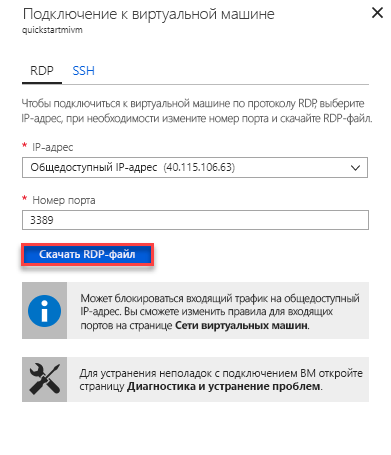

# Краткое руководство. Настройка виртуальной машины Azure для подключения к Управляемому экземпляру Базы данных SQL Azure

В этом кратком руководстве показано, как настроить виртуальную машину Azure для подключения к Управляемому экземпляру Базы данных SQL Azure с помощью SQL Server Management Studio (SSMS). Краткое руководство по подключению с локального клиентского компьютера с использованием подключения "точка — сеть" см. в [этой статье](sql-database-managed-instance-configure-p2s.md)

## Технические условия

В качестве начальной точки используются ресурсы, созданные в кратком руководстве [Создание Управляемого экземпляра Базы данных SQL Azure](sql-database-managed-instance-get-started.md).

## Войдите на портал Azure

Войдите на [портале Azure](https://portal.azure.com/).

## Создание подсети в виртуальной сети Управляемого экземпляра

Здесь показано, как создать подсеть в виртуальной сети Управляемого экземпляра, чтобы виртуальная машина Azure могла подключаться к Управляемому экземпляру. Подсеть Управляемого экземпляра предназначена для Управляемых экземпляров. Вы не сможете создать в ней какие-либо другие ресурсы, например виртуальные машины Azure.

1. Откройте группу ресурсов Управляемого экземпляра, который был создан в кратком руководстве [Создание Управляемого экземпляра Базы данных SQL Azure](sql-database-managed-instance-get-started.md). Выберите виртуальную сеть для Управляемого экземпляра.

   

2. Выберите **Подсети**, а затем щелкните **+ Подсеть**, чтобы создать новую подсеть.

   

3. Заполните форму, используя сведения в этой таблице:

   | Параметр| Предлагаемое значение | Описание |
   | ---------------- | ----------------- | ----------- |
   | **Имя** | Любое допустимое имя|Сведения о допустимых именах см. в статье [Соглашения об именовании](https://docs.microsoft.com/azure/architecture/best-practices/naming-conventions).|
   | **Диапазон адресов (блок CIDR)** | Допустимый диапазон значений | Значение по умолчанию подходит для использования в рамках этого краткого руководства.|
   | **группа безопасности сети**. | Нет | Значение по умолчанию подходит для использования в рамках этого краткого руководства.|
   | **Таблица маршрутов** | Нет | Значение по умолчанию подходит для использования в рамках этого краткого руководства.|
   | **Конечные точки службы** | Выбрано значение 0. | Значение по умолчанию подходит для использования в рамках этого краткого руководства.|
   | **Делегирование подсети** | Нет | Значение по умолчанию подходит для использования в рамках этого краткого руководства.|

   

4. Нажмите кнопку **ОК**, чтобы создать дополнительную подсеть в виртуальной сети Управляемого экземпляра.

## Создание виртуальной машины в новой подсети в виртуальной сети

Ниже показано, как создать виртуальную машину в новой подсети, для подключения к Управляемому экземпляру.

## Подготовка виртуальной машины Azure

Так как Управляемый экземпляр SQL размещается в частной виртуальной сети, необходимо создать виртуальную машину Azure с помощью какого-либо установленного инструмента клиента SQL, например SQL Server Management Studio или Azure Data Studio. Этот инструмент позволяет подключаться к Управляемому экземпляру и выполнять запросы. В этом кратком руководстве используется SQL Server Management Studio.

Самый простой способ создать виртуальную машину клиента со всеми необходимыми инструментами — использовать шаблоны Azure Resource Manager.

1. Убедитесь, что вы вошли на портал Azure в другой вкладке браузера. Затем нажмите следующую кнопку, чтобы создать клиентскую виртуальную машину и установить SQL Server Management Studio:

    

2. Заполните форму, используя сведения из следующей таблицы:

   | Параметр| Предлагаемое значение | Описание |
   | ---------------- | ----------------- | ----------- |
   | **Подписка** | Допустимая подписка | Необходимо использовать подписку, в которой есть разрешение на создание ресурсов. |
   | **Группа ресурсов** |Группа ресурсов, указанная в кратком руководстве по [созданию Управляемого экземпляра](sql-database-managed-instance-get-started.md).|Необходимо использовать группу ресурсов, в которой находится виртуальная сеть.|
   | **Местоположение.** | Расположение группы ресурсов | Это значение заполняется на основе выбранной группы ресурсов. |
   | **Имя виртуальной машины**  | Любое допустимое имя | Сведения о допустимых именах см. в статье [Соглашения об именовании](https://docs.microsoft.com/azure/architecture/best-practices/naming-conventions).|
   |**Имя администратора**|Любое допустимое имя пользователя|Сведения о допустимых именах см. в статье [Соглашения об именовании](https://docs.microsoft.com/azure/architecture/best-practices/naming-conventions). Не используйте serveradmin. Это имя зарезервировано для роли уровня сервера. Используйте это имя пользователя каждый раз при [подключении к виртуальной машине](#connect-to-virtual-machine).|
   |**Пароль**|Любой допустимый пароль|Пароль должен включать минимум 12 символов и соответствовать [определенным требованиям к сложности](../virtual-machines/windows/faq.md#what-are-the-password-requirements-when-creating-a-vm). Используйте этот пароль каждый раз при [подключении к виртуальной машине](#connect-to-virtual-machine).|
   | **Размер виртуальной машины** | Любой допустимый размер | Размера по умолчанию в этом шаблоне **Standard_B2s** достаточно для работы с этим руководством. |
   | **Местоположение.**|[resourceGroup().location].| Не меняйте это значение. |
   | **Имя виртуальной сети**|Виртуальная сеть, в которой вы создали управляемый экземпляр.|
   | **Имя подсети**|Имя подсети, созданной при выполнении предыдущей процедуры| Не выбирайте подсеть, в которой создан Управляемый экземпляр.|
   | **artifacts Location** (Расположение артефактов) | [deployment().properties.templateLink.uri] | Не меняйте это значение. |
   | **artifacts Location Sas token** (Маркер SAS расположения артефактов) | Не указывайте. | Не меняйте это значение. |

   

   Если вы использовали предложенное имя виртуальной сети и подсеть по умолчанию из статьи [Создание Управляемого экземпляра SQL Azure](sql-database-managed-instance-get-started.md), не изменяйте последние два параметра. В противном случае следует заменить эти значения на те, которые вы ввели при настройке сетевой среды.

3. Установите флажок **Я принимаю указанные выше условия**.
4. Выберите **Приобрести**, чтобы развернуть виртуальную машину Azure в вашей сети.
5. Щелкните значок **Уведомления**, чтобы просмотреть состояние развертывания.

> [!IMPORTANT]
> После создания виртуальной машины подождите примерно 15 минут, прежде чем продолжить. Это время требуется, чтобы завершить установку SQL Server Management Studio с помощью скриптов, запускаемых после создания виртуальной машины.

## Подключение к виртуальной машине

В шагах ниже показано, как подключиться к только что созданной виртуальной машине по протоколу удаленного рабочего стола.

1. После завершения развертывания перейдите в ресурс виртуальной машины.

      

2. Нажмите кнопку **Подключиться**.

   Для виртуальной машины отобразится форма файла протокола удаленного рабочего стола (RDP-файл), а также общедоступный IP-адрес и номер порта.

     

3. Щелкните **Скачать RDP-файл**.

   > [!NOTE]
   > Вы также можете подключаться к виртуальной машине по протоколу SSH.

4. Закройте форму **Connect to virtual machine** (Подключение к виртуальной машине).
5. Чтобы подключиться к виртуальной машине, откройте скачанный RDP-файл.
6. При появлении запроса выберите **Подключиться**. На компьютере Mac вам понадобится клиент RDP, например [Remote Desktop Client](https://itunes.apple.com/us/app/microsoft-remote-desktop/id715768417?mt=12) из Mac App Store.

7. Введите имя пользователя и пароль, указанные при создании виртуальной машины, и нажмите кнопку **ОК**.

8. При входе в систему может появиться предупреждение о сертификате. Чтобы продолжить процесс подключения, выберите **Да** или **Продолжить**.

Вы подключились к виртуальной машине на панели мониторинга диспетчера сервера.

## Подключение к Управляемому экземпляру с использованием SSMS

1. На виртуальной машине откройте SQL Server Management Studio (SSMS).

   Так как SSMS запускается впервые, открытие может занять несколько минут ввиду выполнения конфигурации.
2. В диалоговом окне **Подключение к серверу** в поле **Имя сервера** введите полное **имя узла** для Управляемого экземпляра. Выберите **Проверка подлинности SQL Server**, укажите имя пользователя и пароль, а затем нажмите кнопку **Подключиться**.

      

После подключения можно просмотреть системные и пользовательские базы данных на узле "Базы данных" и различные объекты на узлах "Безопасность", "Объекты сервера", "Репликация", "Управление", "Агент SQL Server" и "Профилировщик XEvent".

## Дальнейшие действия

- Краткое руководство по подключению с локального клиентского компьютера с помощью подключения "точка — сеть" см. в [этой статье](sql-database-managed-instance-configure-p2s.md).
- Обзор вариантов подключения для приложений см. в статье [Подключение приложения к Управляемому экземпляру Базы данных SQL](sql-database-managed-instance-connect-app.md).
- Чтобы восстановить имеющуюся базу данных SQL Server из локальной среды в Управляемый экземпляр, можно использовать [Azure Database Migration Service для миграции](../dms/tutorial-sql-server-to-managed-instance.md) или [команду T-SQL RESTORE](sql-database-managed-instance-get-started-restore.md) для восстановления из файла резервной копии базы данных.
