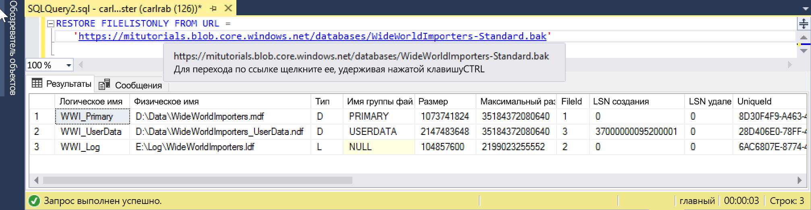

# <a name="quickstart-restore-a-database-to-a-managed-instance"></a>Краткое руководство. Восстановление базы данных в Управляемый экземпляр

В этом кратком руководстве будет использоваться SQL Server Management Studio (SSMS) для восстановления базы данных (Wide World Importers — стандартный файл резервной копии) из хранилища BLOB-объектов Azure в [Управляемый экземпляр](sql-database-managed-instance.md) Базы данных SQL Azure.

> [!VIDEO https://www.youtube.com/embed/RxWYojo_Y3Q]

> [!NOTE]
> Дополнительные сведения об использовании Azure Database Migration Service (DMS) для миграции см. в статье [Руководство. Перенос SQL Server в Управляемый экземпляр Базы данных SQL Azure с помощью DMS в автономном режиме](../dms/tutorial-sql-server-to-managed-instance.md).
> Дополнительные сведения о методах миграции см. в статье [Перенос экземпляра SQL Server в Управляемый экземпляр Базы данных SQL Azure](sql-database-managed-instance-migrate.md).

## <a name="prerequisites"></a>Предварительные требования

В этом кратком руководстве:

- Используйте ресурсы из статьи [Краткое руководство. Создание Управляемого экземпляра Базы данных SQL Azure](sql-database-managed-instance-get-started.md).
- Необходимо, чтобы на вашем компьютере была установлена последняя версия [SQL Server Management Studio](https://docs.microsoft.com/sql/ssms/sql-server-management-studio-ssms).
- SSMS используется для подключения к Управляемому экземпляру. Ознакомьтесь с этими краткими руководствами по подключению.
  - [Connect to an Azure SQL Database Managed Instance from an Azure VM](sql-database-managed-instance-configure-vm.md) (Подключение к Управляемому экземпляру Базы данных SQL Azure с виртуальной машины Azure).
  - [Краткое руководство. Настройка подключения "точка — сеть" к Управляемому экземпляру Базы данных SQL Azure с локального компьютера](sql-database-managed-instance-configure-p2s.md).
- Требует наличия учетной записи хранилища BLOB-объектов Azure (например, Standard_LRS V2) с **общедоступным IP-адресом**, защищенным **учетными данными SAS** с разрешением `rw`. [Частные IP-адреса для хранилища BLOB-объектов, защищенные брандмауэром,](https://docs.microsoft.com/azure/storage/common/storage-network-security) и конечные точки службы хранилища BLOB-объектов Azure в настоящее время не поддерживаются.

> [!NOTE]
> Дополнительные сведения о резервном копировании и восстановлении базы данных SQL Server при помощи хранилища BLOB-объектов Azure и [ключа подписанного URL-адреса (SAS)](https://docs.microsoft.com/azure/storage/common/storage-dotnet-shared-access-signature-part-1) см. в статье [Краткое руководство. Восстановление резервной копии базы данных в Управляемый экземпляр Базы данных SQL Azure](https://docs.microsoft.com/en-us/sql/relational-databases/backup-restore/sql-server-backup-to-url?view=sql-server-2017).

## <a name="restore-the-database-from-a-backup-file"></a>Восстановление базы данных из файла резервной копии

С помощью SSMS выполните следующие шаги для восстановления базы данных Wide World Importers в Управляемый экземпляр. Файл резервной копии базы данных хранится в предварительно настроенной учетной записи хранения больших двоичных объектов Azure.

1. Откройте SMSS и подключитесь к Управляемому экземпляру.
2. В меню слева щелкните правой кнопкой мыши Управляемый экземпляр и выберите **Создать запрос**, чтобы открыть новое окно запроса.
3. Запустите следующий скрипт SQL, в котором используется предварительно настроенная учетная запись хранения и ключ SQL, для [создания учетных данных](https://docs.microsoft.com/sql/t-sql/statements/create-credential-transact-sql) в Управляемом экземпляре.

   ```sql
   CREATE CREDENTIAL [https://mitutorials.blob.core.windows.net/databases]
   WITH IDENTITY = 'SHARED ACCESS SIGNATURE'
   , SECRET = 'sv=2017-11-09&ss=bfqt&srt=sco&sp=rwdlacup&se=2028-09-06T02:52:55Z&st=2018-09-04T18:52:55Z&spr=https&sig=WOTiM%2FS4GVF%2FEEs9DGQR9Im0W%2BwndxW2CQ7%2B5fHd7Is%3D'
   ```

    

4. Чтобы проверить учетные данные, запустите следующий скрипт, который использует URL-адрес [контейнера](https://azure.microsoft.com/services/container-instances/) для получения списка файлов резервной копии.

   ```sql
   RESTORE FILELISTONLY FROM URL =
      'https://mitutorials.blob.core.windows.net/databases/WideWorldImporters-Standard.bak'
   ```

    

5. Запустите следующий скрипт, чтобы восстановить базу данных Wide World Importers.

   ```sql
   RESTORE DATABASE [Wide World Importers] FROM URL =
     'https://mitutorials.blob.core.windows.net/databases/WideWorldImporters-Standard.bak'
   ```

    

6. Запустите следующий скрипт, чтобы отслеживать состояние восстановления.

   ```sql
   SELECT session_id as SPID, command, a.text AS Query, start_time, percent_complete
      , dateadd(second,estimated_completion_time/1000, getdate()) as estimated_completion_time
   FROM sys.dm_exec_requests r
   CROSS APPLY sys.dm_exec_sql_text(r.sql_handle) a
   WHERE r.command in ('BACKUP DATABASE','RESTORE DATABASE')
   ```

7. По завершении восстановления просмотрите восстановленную базу данных в обозревателе объектов.

## <a name="next-steps"></a>Дополнительная информация

- Сведения об устранении неполадок резервного копирования на URL-адрес см. в разделе [Резервное копирование SQL Server на URL-адрес — рекомендации и устранение неполадок](https://docs.microsoft.com/sql/relational-databases/backup-restore/sql-server-backup-to-url-best-practices-and-troubleshooting).
- Обзор вариантов подключения для приложений см. в статье [Подключение приложения к Управляемому экземпляру Базы данных SQL](sql-database-managed-instance-connect-app.md).
- Чтобы отправлять запросы с помощью привычных средств или языков, ознакомьтесь со статьей [Краткие руководства. Подключение и создание запросов к Базе данных SQL Azure](sql-database-connect-query.md).
