# Краткое руководство. Создание управляемого экземпляра Базы данных SQL Azure

В этом кратком руководстве описано создание [управляемого экземпляра](sql-database-managed-instance.md) Базы данных SQL Azure на портале Azure.

> [!IMPORTANT]
> Сведения об ограничениях см. в разделах [Поддерживаемые регионы](sql-database-managed-instance-resource-limits.md#supported-regions) и [Поддерживаемые типы подписок](sql-database-managed-instance-resource-limits.md#supported-subscription-types).

## Вход на портал Azure

Если у вас еще нет подписки Azure, [создайте бесплатную учетную запись](https://azure.microsoft.com/free/).

Войдите на [портал Azure](https://portal.azure.com/).

## Создание управляемого экземпляра

Ниже показано, как создать управляемый экземпляр:

1. Выберите **Azure SQL** в левом меню портала Azure. Если **Azure SQL** отсутствует в списке, выберите **Все службы**, а затем введите **Azure SQL** в поле поиска.
2. Выберите **Добавить**, чтобы открыть страницу **выбора варианта развертывания SQL**. Вы можете просмотреть дополнительную информацию об управляемом экземпляре базы данных SQL Azure, выбрав **Показать подробности** на плитке **Управляемые экземпляры**.
3. Нажмите кнопку **Создать**.

   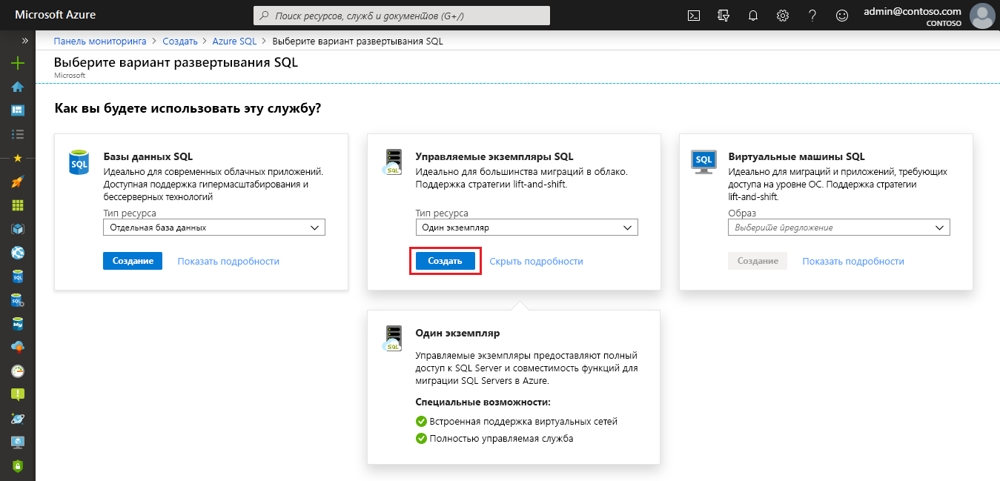

4. Используйте вкладки в форме подготовки **Создать управляемый экземпляр базы данных SQL Azure**, чтобы добавить необходимую и дополнительную информацию. Эти вкладки описываются в разделах ниже.

### Основы

- Укажите обязательные сведения, требуемые на вкладке **Основные сведения**. Это минимальный набор необходимых сведений для подготовки управляемого экземпляра.

   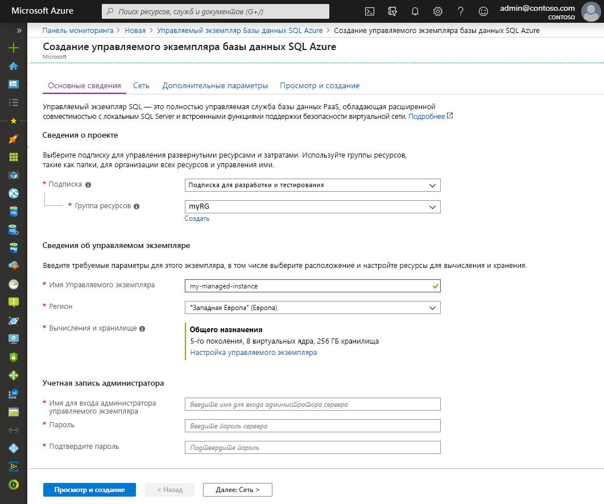

   Используйте приведенную ниже таблицу в качестве справочной информации, необходимой на этой вкладке.

   | Параметр| Рекомендуемое значение | Описание |
   | ------ | --------------- | ----------- |
   | **подписка** | Ваша подписка | Подписка, которая дает вам разрешение на создание ресурсов |
   | **группа ресурсов** | Новая или существующая группа ресурсов.|Допустимые имена групп ресурсов см. в статье о [правилах и ограничениях именования](/azure/cloud-adoption-framework/ready/azure-best-practices/naming-and-tagging).|
   | **Имя управляемого экземпляра** | Любое допустимое имя|Сведения о допустимых именах см. в статье [Соглашения об именовании](/azure/cloud-adoption-framework/ready/azure-best-practices/naming-and-tagging).|
   | **Регион** |Регион, в котором хотите создать управляемый экземпляр.|Дополнительные сведения о регионах Azure см. [здесь](https://azure.microsoft.com/regions/).|
   | **Имя для входа администратора управляемого экземпляра** | Любое допустимое имя пользователя | Сведения о допустимых именах см. в статье [Соглашения об именовании](/azure/cloud-adoption-framework/ready/azure-best-practices/naming-and-tagging). Не используйте serveradmin. Это имя зарезервировано для роли уровня сервера.|
   | **Пароль** | Любой допустимый пароль| Пароль должен включать минимум 16 символов и соответствовать [определенным требованиям к сложности](../virtual-machines/windows/faq.md#what-are-the-password-requirements-when-creating-a-vm).|

- Выберите **Настроить управляемый экземпляр** для определения размера вычислительных ресурсов и ресурсов хранения, а также для просмотра ценовой категории. Укажите нужный объем хранилища и количество виртуальных ядер, используя ползунки или текстовые поля. По завершении щелкните **Применить** для сохранения выбранных параметров. 

   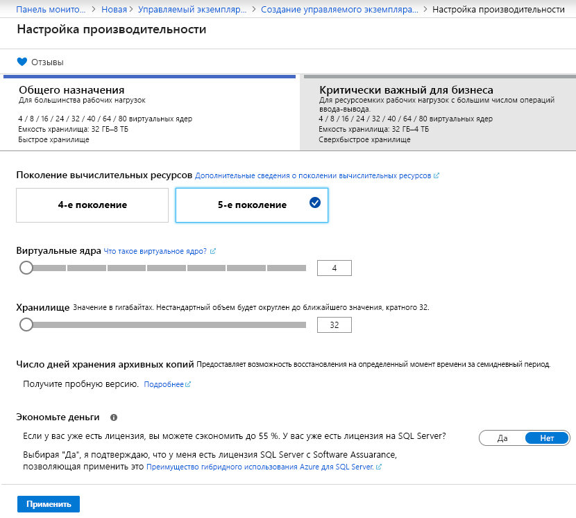

- Чтобы проверить выбранные параметры перед созданием управляемого экземпляра, можно выбрать **Просмотреть и создать**. Или настройте сетевые параметры, выбрав **Далее: сеть**.

### Сеть

- Заполните дополнительные сведения на вкладке **Сетевые подключения**. Если пропустить эти сведения, на портале будут применяться параметры по умолчанию.

   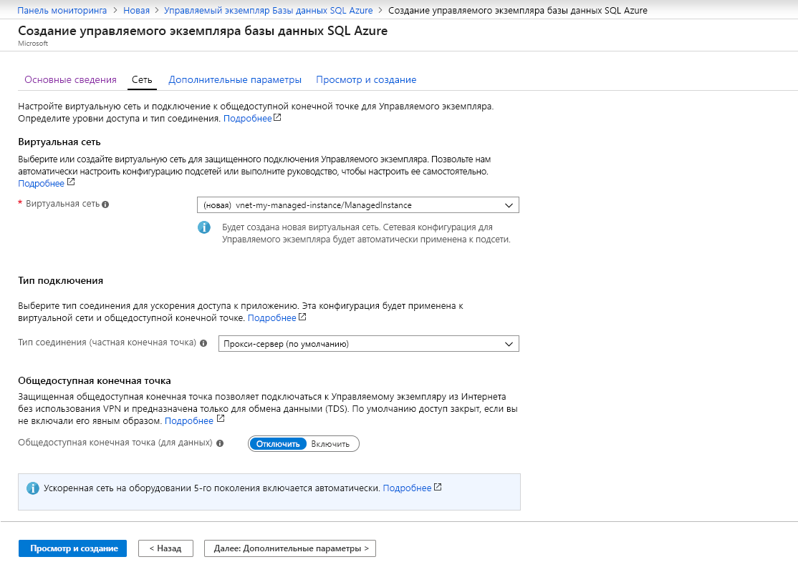

   Используйте приведенную ниже таблицу в качестве справочной информации, необходимой на этой вкладке.

   | Параметр| Рекомендуемое значение | ОПИСАНИЕ |
   | ------ | --------------- | ----------- |
   | **Виртуальная сеть** | Щелкните **Создать виртуальную сеть** или выберите допустимую виртуальную сеть и подсеть.| Если поля сети и подсети недоступны, прежде чем выбирать эти значения в качестве целевого объекта для нового управляемого экземпляра, нужно [изменить их в соответствии с требованиями сети](sql-database-managed-instance-configure-vnet-subnet.md). Сведения о требованиях к настройке сетевой среды для управляемого экземпляра см. в статье [Архитектура подключений к для управляемого экземпляра базы данных SQL Azure](sql-database-managed-instance-connectivity-architecture.md). |
   | **Тип подключения:** | Выберите тип соединения: прокси-сервер или перенаправление.|Дополнительные сведения о типах соединений см. в. статье [Архитектура подключения к SQL Azure](sql-database-connectivity-architecture.md#connection-policy).|
   | **Общедоступная конечная точка**  | Нажмите кнопку **Включить**. | Для того, чтобы управляемый экземпляр был доступен через конечную точку общедоступных данных, необходимо включить эту опцию. | 
   | **Разрешить доступ из** (если **Общедоступная конечная точка** включена) | Выберите один из способов.   |Использование портала позволяет настроить группу безопасности с помощью общедоступной конечной точки.     Выберите один из следующих вариантов, соответствующий вашему сценарию.   <ul> <li>**Службы Azure**: Мы рекомендуем эту опцию при подключении через Power BI или другую многопользовательскую службу. </li> <li> **Интернет**. Используйте для тестирования, если вы хотите быстро запустить управляемый экземпляр. Мы не рекомендуем использовать его для рабочих сред. </li> <li> **Нет доступа**: Эта опция создает правило безопасности **Запретить**. Измените это правило, чтобы сделать управляемый экземпляр доступным через общедоступную конечную точку. </li> </ul>   Дополнительные сведения о безопасности общедоступной конечной точки, см. в статье [Безопасное использование управляемого экземпляра базы данных SQL Azure с помощью общедоступной конечной точки](sql-database-managed-instance-public-endpoint-securely.md).|

- Выберите **Проверка и создание**, чтобы проверить выбор перед созданием управляемого экземпляра. Или настройте дополнительные пользовательские параметры, выбрав **Далее: Дополнительные параметры**.

### Дополнительные параметры

- Заполните дополнительные сведения на вкладке **Дополнительные настройки**. Если пропустить эти сведения, на портале будут применяться параметры по умолчанию.

   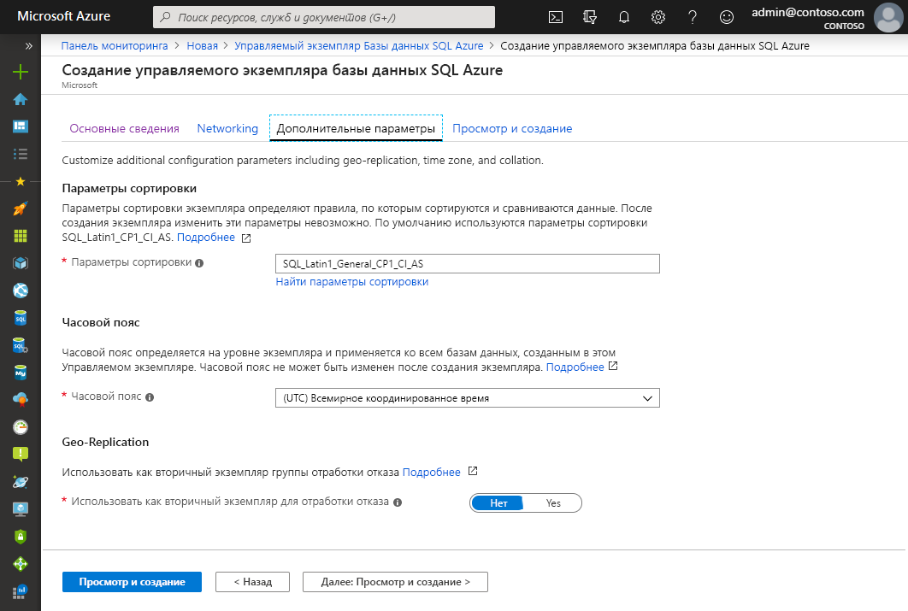

   Используйте приведенную ниже таблицу в качестве справочной информации, необходимой на этой вкладке.

   | Параметр| Рекомендуемое значение | ОПИСАНИЕ |
   | ------ | --------------- | ----------- |
   | **Параметры сортировки** | Выберите параметры сортировки, которые вы хотите использовать для управляемого экземпляра. При переносе баз данных SQL Server необходимо проверить параметры сортировки источника с помощью `SELECT SERVERPROPERTY(N'Collation')` и использовать это значение.| Сведения о параметрах сортировки см. в статье [Задание или изменение параметров сортировки сервера](https://docs.microsoft.com/sql/relational-databases/collations/set-or-change-the-server-collation).|   
   | **Часовой пояс** | Выберите часовой пояс, который будет соблюдать ваш управляемый экземпляр.|Дополнительные сведения см. в статье о [часовых поясах](sql-database-managed-instance-timezone.md).|
   | **Использовать как дополнительную отработку отказа** | Выберите **Да**. | Включите эту опцию, чтобы использовать управляемый экземпляр в качестве дополнительной группы отработки отказа.|
   | **Первичный управляемый экземпляр** (если **Использовать как дополнительную отработку отказа** установлен на **Да**) | Выберите существующий первичный управляемый экземпляр, который будет присоединен в той же зоне DNS к создаваемому управляемому экземпляру. | Этот шаг включит конфигурацию после создания группы отработки отказа. Дополнительные сведения см. в статье [Руководство. Добавление управляемого экземпляра базы данных SQL в группу отработки отказа](sql-database-managed-instance-failover-group-tutorial.md).|

### Отзыв и создание

5. Выберите вкладку **Проверка и создание**, чтобы проверить выбор перед созданием управляемого экземпляра.

   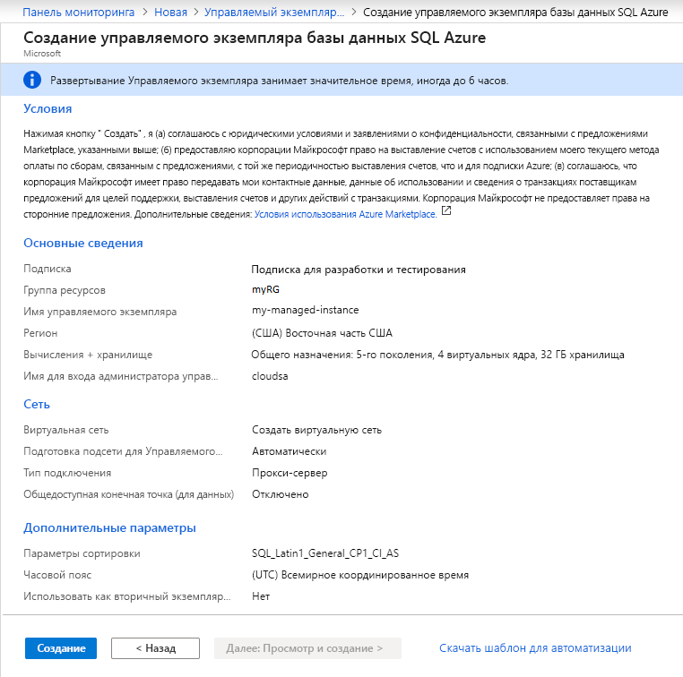

6. Выберите **Создать**, чтобы начать подготовку управляемого экземпляра.

> [!IMPORTANT]
> Развертывание управляемого экземпляра — это длительная операция. Развертывание первого экземпляра в подсети обычно занимает гораздо больше времени, чем развертывание в подсети с существующими управляемыми экземплярами. Среднее время подготовки см. в разделе [Операции управления управляемыми экземплярами](sql-database-managed-instance.md#managed-instance-management-operations).

### Мониторинг хода выполнения развертывания

7. Щелкните значок **Уведомления**, чтобы просмотреть состояние развертывания.

   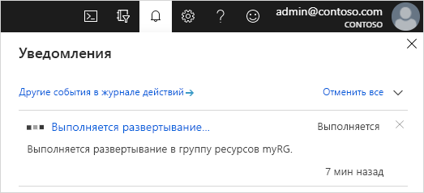

8. Выберите **Выполняется развертывание** в уведомлении, чтобы открыть окно управляемого экземпляра и дополнительно отслеживать ход развертывания. 

> [!TIP]
> Если вы закрыли веб-браузер или перешли с экрана хода выполнения развертывания, выполните следующие действия, чтобы вернутся к экрану выполнения развертывания:
> 1. На портале Azure откройте группу ресурсов (на вкладке **Основные сведения**), в которую развертывается управляемый экземпляр.
> 2. Выберите **Развертывания**.
> 3. Выберите выполняемую операцию развертывания управляемого экземпляра.

## Операции, выполняемые после развертывания

Чтобы ознакомиться с созданными ресурсами, настроить параметры сети и получить сведения о подключении к узлу (FQDN), выполните действия, описанные в этом разделе.

### Просмотр созданных ресурсов

После успешного развертывания управляемого экземпляра выполните приведенные ниже действия, чтобы просмотреть созданные ресурсы.

1. Откройте группу ресурсов для управляемого экземпляра. Просмотрите его ресурсы, которые были созданы для вас в кратком руководстве [Создание управляемого экземпляра](#create-a-managed-instance).

   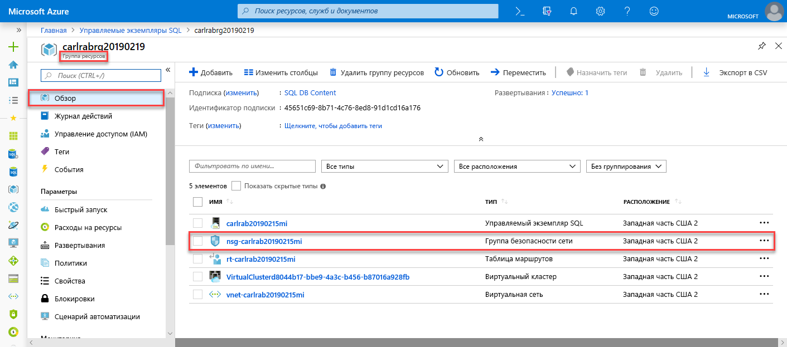

### Просмотр и точная настройка параметров сети

Чтобы точно настроить параметры сети, проверьте приведенные ниже параметры.

1. Выберите таблицу маршрутов, чтобы просмотреть созданный для вас пользовательский маршрут UDR.

   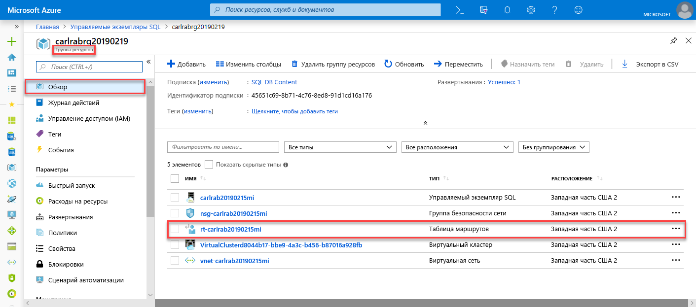

2. В таблице маршрутов просмотрите записи для маршрутизации трафика из виртуальной сети управляемого экземпляра и внутри нее. Если вы создаете или настраиваете свою таблицу маршрутизации вручную, обязательно создайте эти записи в таблице маршрутизации управляемых экземпляров.

   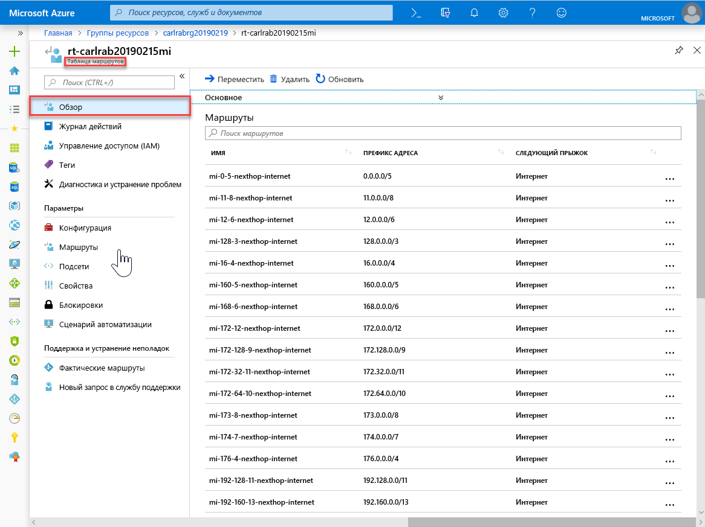

3. Вернитесь в группу ресурсов и выберите группу безопасности сети.

   

4. Просмотрите правила безопасности относительно входящего и исходящего трафика. 

   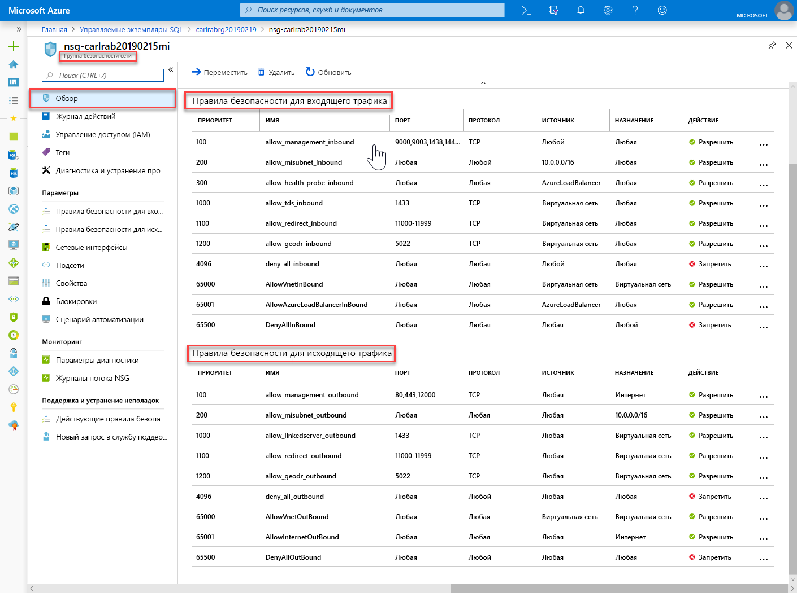

> [!IMPORTANT]
> Если вы настроили общедоступную конечную точку для управляемого экземпляра, необходимо открыть порты, чтобы разрешить сетевой трафик, позволяющий подключения к управляемому экземпляру из Интернета. Дополнительные сведения см. в разделе [Настройка общедоступной конечной точки для управляемого экземпляра](sql-database-managed-instance-public-endpoint-configure.md#allow-public-endpoint-traffic-on-the-network-security-group).
>

### Получение сведений о подключении к управляемому экземпляру

Чтобы подключиться к управляемому экземпляру, выполните следующие действия для получения имени узла и полного доменного имени (FQDN).

1. Вернитесь в группу ресурсов и выберите свой управляемый экземпляр.

   

2. На вкладке **Обзор** найдите свойство **Узел**. Скопируйте имя узла управляемого экземпляра для использования в следующем кратком руководстве.

   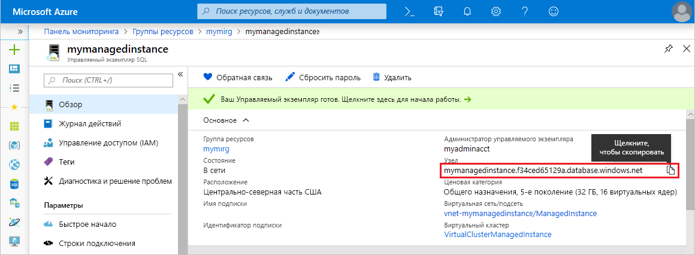

   Скопированное значение являет собой полное доменное имя (FQDN), которое можно использовать для подключения к управляемому экземпляру. Оно похоже на следующий пример адреса: *your_host_name.a1b2c3d4e5f6.database.windows.net*.

## Дополнительная информация

Дополнительные сведения о подключении к управляемому экземпляру см. в следующих статьях.
- Обзор вариантов подключения для приложений см. в статье [Подключение приложения к Управляемому экземпляру Базы данных SQL](sql-database-managed-instance-connect-app.md).
- Краткое руководство по подключению к управляемому экземпляру с виртуальной машины Azure см. [здесь](sql-database-managed-instance-configure-vm.md).
- Краткое руководство по подключению к управляемому экземпляру с локального клиентского компьютера с помощью подключения "точка — сеть" см. [здесь](sql-database-managed-instance-configure-p2s.md).

Чтобы восстановить имеющуюся базу данных SQL Server из локальной среди в управляемый экземпляр, выполните следующие действия. 
- Используйте [Azure Database Migration Service для миграции](../dms/tutorial-sql-server-to-managed-instance.md) для восстановления из файла резервной копии базы данных. 
- Дополнительные сведения о восстановлении из файла резервной копии базы данных см. в статье [Краткое руководство. Восстановление базы данных в Управляемый экземпляр](sql-database-managed-instance-get-started-restore.md).

Сведения о расширенном мониторинге производительности для базы данных управляемого экземпляра с использованием встроенных средств анализа проблем см. в статье о [мониторинге Базы данных SQL Azure с помощью Аналитики SQL Azure](../azure-monitor/insights/azure-sql.md).
