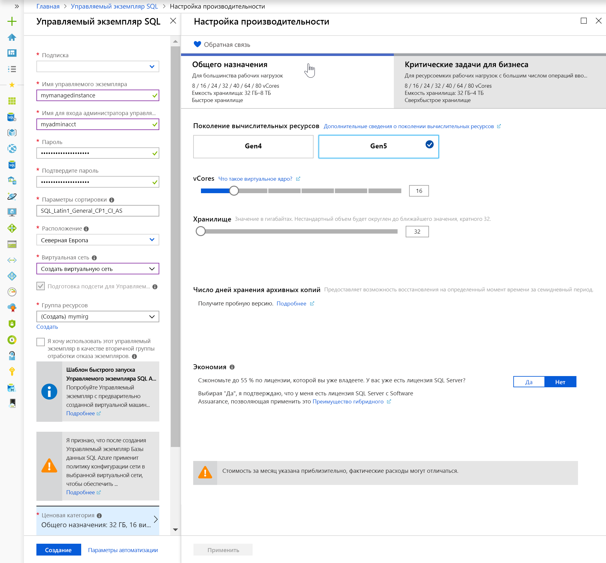

# Краткое руководство. Создание управляемого экземпляра Базы данных SQL Azure

В этом кратком руководстве описано создание [управляемого экземпляра](sql-database-managed-instance.md) Базы данных SQL Azure на портале Azure.

> [!IMPORTANT]
> Сведения об ограничениях см. в разделах [Поддерживаемые регионы](sql-database-managed-instance-resource-limits.md#supported-regions) и [Поддерживаемые типы подписок](sql-database-managed-instance-resource-limits.md#supported-subscription-types).

## Вход на портал Azure

Войдите на [портале Azure](https://portal.azure.com/).

## Создание управляемого экземпляра

Ниже показано, как создать управляемый экземпляр.

1. Выберите **Создать ресурс** в верхнем левом углу окна портала Azure.
2. Найдите **управляемый экземпляр**, а затем выберите **Управляемый экземпляр SQL Azure**.
3. Нажмите кнопку **Создать**.

   

4. Укажите запрошенные сведения в форме **управляемого экземпляра SQL**, используя данные, приведенные в таблице ниже.

   | Параметр| Рекомендуемое значение | ОПИСАНИЕ |
   | ------ | --------------- | ----------- |
   | **Подписка** | Ваша подписка | Подписка, в которой есть разрешение на создание ресурсов |
   |**Имя управляемого экземпляра**|Любое допустимое имя|Сведения о допустимых именах см. в статье [Соглашения об именовании для ресурсов Azure](https://docs.microsoft.com/azure/architecture/best-practices/naming-conventions).|
   |**Имя для входа администратора управляемого экземпляра**|Любое допустимое имя пользователя|Сведения о допустимых именах см. в статье [Соглашения об именовании для ресурсов Azure](https://docs.microsoft.com/azure/architecture/best-practices/naming-conventions). Не используйте serveradmin. Это имя зарезервировано для роли уровня сервера.|
   |**Пароль**|Любой допустимый пароль|Пароль должен включать минимум 16 символов и соответствовать [определенным требованиям к сложности](../virtual-machines/windows/faq.md#what-are-the-password-requirements-when-creating-a-vm).|
   |**Часовой пояс**|Часовой пояс для управляемого экземпляра|Дополнительные сведения см. в статье о [часовых поясах](sql-database-managed-instance-timezone.md).|
   |**Collation**|Параметры сортировки для управляемого экземпляра|При переносе баз данных SQL Server необходимо проверить параметры сортировки источника с помощью `SELECT SERVERPROPERTY(N'Collation')` и использовать это значение. Сведения о параметрах сортировки см. в статье [Задание или изменение параметров сортировки сервера](https://docs.microsoft.com/sql/relational-databases/collations/set-or-change-the-server-collation).|
   |**Расположение**|Расположение, в котором хотите создать управляемый экземпляр|Дополнительные сведения о регионах Azure см. [здесь](https://azure.microsoft.com/regions/).|
   |**Виртуальная сеть**|Щелкните **Создать виртуальную сеть** или выберите допустимую виртуальную сеть и подсеть.| Если поля сети и подсети недоступны, прежде чем выбирать эти значения в качестве целевого объекта для нового управляемого экземпляра, нужно [изменить их в соответствии с требованиями сети](sql-database-managed-instance-configure-vnet-subnet.md). Сведения о требованиях к настройке сетевой среды для управляемого экземпляра см. в статье [Архитектура подключения к Управляемому экземпляру Базы данных SQL Azure](sql-database-managed-instance-connectivity-architecture.md). |
   |**Группа ресурсов**|Новая или существующая группа ресурсов|Допустимые имена групп ресурсов см. в статье о [правилах и ограничениях именования](https://docs.microsoft.com/azure/architecture/best-practices/naming-conventions).|

   

5. Чтобы использовать управляемый экземпляр Базы данных SQL Azure в качестве вторичной группы отработки отказа экземпляра, выберите просмотр и укажите управляемый экземпляр DnsAzurePartner. Эта функция доступна в предварительной версии и не показана на прилагающемся снимке экрана.
6. Щелкните поле **Ценовая категория**, чтобы выбрать размер вычислительных ресурсов и ресурсов хранения, а также просмотреть варианты ценовой категории. Ценовая категория общего назначения с 32 ГБ памяти и 16 виртуальными ядрами — значение по умолчанию.
7. Укажите нужный объем хранилища и количество виртуальных ядер, используя ползунки или текстовые поля.
8. По завершении нажмите кнопку **Применить** для сохранения выбранных параметров.  
9. Нажмите кнопку **Создать**, чтобы развернуть управляемый экземпляр.
10. Щелкните значок **Уведомления**, чтобы просмотреть состояние развертывания.

    

11. Щелкните **Развертывание выполняется**, чтобы открыть окно управляемого экземпляра для дальнейшего мониторинга состояния развертывания.

> [!IMPORTANT]
> Первый экземпляр в подсети обычно развертывается намного дольше, чем последующие экземпляры. Не стоит из-за этого отменять развертывание. Создание второго управляемого экземпляра в подсети занимает всего пару минут.

## Проверка ресурсов и получение полного имени сервера

После успешного завершения развертывания, проверьте созданные ресурсы и получите полное имя сервера для использования в последующих кратких руководствах.

1. Откройте группу ресурсов для управляемого экземпляра и просмотрите его ресурсы, которые были созданы для вас в кратком руководстве [Создание управляемого экземпляра](#create-a-managed-instance).

   

2. Выберите таблицу маршрутов, чтобы просмотреть таблицу пользовательских маршрутов UDR, созданную для вас.

   

3. В таблице маршрутизации просмотрите записи для маршрутизации трафика из виртуальной сети управляемого экземпляра и внутри нее. Если вы создаете или настраиваете свою таблицу маршрутов вручную, вы должны обязательно создать эти записи в таблице маршрутов.

   

4. Вернитесь в группу ресурсов и выберите группу безопасности сети, чтобы просмотреть правила безопасности.

   

5. Просмотрите правила безопасности относительно входящего и исходящего трафика.

   

6. Вернитесь в группу ресурсов и выберите свой управляемый экземпляр.

   

7. На вкладке **Обзор** найдите свойство **Узел** и скопируйте полный адрес узла для управляемого экземпляра.

   

   Имя будет выглядеть примерно так: **имя_компьютера.a1b2c3d4e5f6.database.windows.net**.

## Дополнительная информация

- Дополнительные сведения о подключении к управляемому экземпляру см. в следующих статьях.
  - Обзор вариантов подключения для приложений см. в статье [Подключение приложения к Управляемому экземпляру Базы данных SQL](sql-database-managed-instance-connect-app.md).
  - Краткое руководство по подключению к управляемому экземпляру с виртуальной машины Azure см. [здесь](sql-database-managed-instance-configure-vm.md).
  - Краткое руководство по подключению к управляемому экземпляру с локального клиентского компьютера с помощью подключения "точка — сеть" см. [здесь](sql-database-managed-instance-configure-p2s.md).
- Чтобы восстановить имеющуюся базу данных SQL Server из локальной среды в Управляемый экземпляр, можно использовать [Azure Database Migration Service для миграции](../dms/tutorial-sql-server-to-managed-instance.md) или [команду T-SQL RESTORE](sql-database-managed-instance-get-started-restore.md) для восстановления из файла резервной копии базы данных.
- Сведения о расширенном мониторинге производительности для управляемого экземпляра базы данных с использованием встроенных средств анализа проблем см. в статье о [мониторинге Базы данных SQL Azure с помощью Аналитики SQL Azure](../azure-monitor/insights/azure-sql.md).
