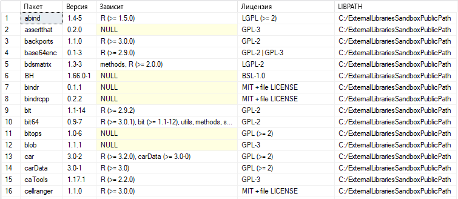

# <a name="create-and-run-simple-r-scripts-in-azure-sql-database-machine-learning-services-preview"></a>Создание и выполнение простых сценариев R в Службах машинного обучения в Базе данных SQL Azure (предварительная версия)

В этом кратком руководстве вы создадите и выполните набор простых сценариев R с помощью общедоступной предварительной версии [Служб машинного обучения (с поддержкой R) в Базе данных SQL Azure](sql-database-machine-learning-services-overview.md). Вы узнаете, как поместить сценарий R с правильным форматом в хранимую процедуру [sp_execute_external_script](https://docs.microsoft.com/sql/relational-databases/system-stored-procedures/sp-execute-external-script-transact-sql) и выполнить этот сценарий в Базе данных SQL.

[!INCLUDE[ml-preview-note](../../includes/sql-database-ml-preview-note.md)]

## <a name="prerequisites"></a>Предварительные требования

- Если у вас еще нет подписки Azure, [создайте учетную запись Azure](https://azure.microsoft.com/free/), прежде чем начинать работу.

- Чтобы запустить пример кода в этих упражнениях, сначала необходимо включить в Базе данных SQL Azure Службы машинного обучения (с поддержкой R). Во время использования общедоступной предварительной версии корпорация Майкрософт подключит вас и включит машинное обучение для имеющейся или новой базы данных. Выполните шаги, приведенные в разделе [Sign up for the preview](sql-database-machine-learning-services-overview.md#signup) (Регистрация для получения предварительной версии).

- Убедитесь, что у вас установлена последняя версия [SQL Server Management Studio](https://docs.microsoft.com/sql/ssms/sql-server-management-studio-ssms) (SSMS). Вы можете выполнять сценарии R с помощью других инструментов управления базами данных или выполнения запросов, но в этом кратком руководстве вы будете использовать SSMS.

- В нем также требуется настройка правила брандмауэра на уровне сервера. Сведения о том, как это сделать, см. в разделе [Краткое руководство. Создание правила брандмауэра на уровне сервера для отдельной базы данных или базы данных в составе пула с помощью портала Azure](sql-database-server-level-firewall-rule.md).

## <a name="run-a-simple-script"></a>Выполнение простого сценария

Чтобы выполнить сценарий R, его нужно передать в качестве аргумента в системную хранимую процедуру [sp_execute_external_script](https://docs.microsoft.com/sql/relational-databases/system-stored-procedures/sp-execute-external-script-transact-sql).

В следующих шагах вы запустите этот сценарий R в Базе данных SQL.

```r
a <- 1
b <- 2
c <- a/b
d <- a*b
print(c(c, d))
```

1. Откройте **SQL Server Management Studio** и подключитесь к базе данных SQL.

   Если вам нужна помощь с подключением, ознакомьтесь с разделом [Краткое руководство. Подключение к базе данных SQL Azure и создание запросов к ней с помощью SQL Server Management Studio](sql-database-connect-query-ssms.md).

1. Передайте полный сценарий R в хранимую процедуру [sp_execute_external_script](https://docs.microsoft.com/sql/relational-databases/system-stored-procedures/sp-execute-external-script-transact-sql).

   Для этого используется аргумент `@script`. Все внутри аргумента `@script` должно быть допустимым кодом R.

    ```sql
    EXECUTE sp_execute_external_script @language = N'R'
        , @script = N'
    a <- 1
    b <- 2
    c <- a/b
    d <- a*b
    print(c(c, d))
    '
    ```

   Если вы получаете какие-либо ошибки, это может быть связано с тем, что общедоступная предварительная версия Служб машинного обучения (с использованием R) не включена для базы данных SQL. См. [предварительные требования](#prerequisites) выше.

   > [!NOTE]
   > Если вы являетесь администратором, можете настроить автоматическое выполнение внешнего кода. Разрешение можно предоставить другим пользователям с помощью команды:
   <br>**GRANT EXECUTE ANY EXTERNAL SCRIPT TO** *\<имя_пользователя\>* .

2. Вычисляется корректный результат, а функция R `print`возвращает результат в окне **Сообщения**.

   Должно отобразиться примерно следующее.

    **Результаты**

    ```text
    STDOUT message(s) from external script:
    0.5 2
    ```

## <a name="run-a-hello-world-script"></a>Выполнение сценария Hello World

Типичный пример сценария — это сценарий, который просто выводит строку "Hello, World!" Выполните следующую команду:

```sql
EXECUTE sp_execute_external_script @language = N'R'
    , @script = N'OutputDataSet<-InputDataSet'
    , @input_data_1 = N'SELECT 1 AS hello'
WITH RESULT SETS(([Hello World] INT));
GO
```

Входные данные для этой хранимой процедуры.

| | |
|-|-|
| @language | Определяет расширение языка для вызова, в данном случае это R. |
| @script | Определяет команды, передаваемые в среду выполнения R. Весь сценарий R должен содержаться в этом аргументе в виде текста в Юникоде. Можно также добавить текст для переменной типа **nvarchar** и затем вызвать ее. |
| @input_data_1 | Данные, возвращаемые запросом, передаются в среду выполнения R, которая возвращает их в SQL Server в качестве кадра данных. |
|WITH RESULT SETS | Это предложение определяет схему возвращаемой таблицы данных для SQL Server, добавляя "Hello, World!" в качестве имени столбца с типом данных **int**. |

Команда выводит следующий текст:

| Hello World |
|-------------|
| 1 |

## <a name="use-inputs-and-outputs"></a>Использование входных и выходных данных

По умолчанию [sp_execute_external_script](https://docs.microsoft.com/sql/relational-databases/system-stored-procedures/sp-execute-external-script-transact-sql) принимает один входной набор данных, который обычно можно указать в форме допустимого SQL-запроса. Затем она возвращает один кадр данных R в качестве выходных данных.

Давайте используем стандартные входные и выходные переменные [sp_execute_external_script](https://docs.microsoft.com/sql/relational-databases/system-stored-procedures/sp-execute-external-script-transact-sql): **InputDataSet** и **OutputDataSet**.

1. Создайте небольшую таблицу тестовых данных.

    ```sql
    CREATE TABLE RTestData (col1 INT NOT NULL)
    
    INSERT INTO RTestData
    VALUES (1);
    
    INSERT INTO RTestData
    VALUES (10);
    
    INSERT INTO RTestData
    VALUES (100);
    GO
    ```

1. Используйте инструкцию `SELECT` для выполнения запроса к таблице.
  
    ```sql
    SELECT *
    FROM RTestData
    ```

    **Результаты**

    

1. Выполните следующий сценарий R. Он извлекает данные из таблицы, используя инструкцию `SELECT`, передает их через среду выполнения R и возвращает в виде кадра данных. Предложение `WITH RESULT SETS` определяет схему возвращаемой таблицы данных для Базы данных SQL, добавляя имя столбца *NewColName*.

    ```sql
    EXECUTE sp_execute_external_script @language = N'R'
        , @script = N'OutputDataSet <- InputDataSet;'
        , @input_data_1 = N'SELECT * FROM RTestData;'
    WITH RESULT SETS(([NewColName] INT NOT NULL));
    ```

    **Результаты**

    

1. Давайте изменим имена входных и выходных переменных. Имена входных и выходных переменных по умолчанию — **InputDataSet** и **OutputDataSet**. Данный сценарий изменяет их на **SQL_in** и **SQL_out**.

    ```sql
    EXECUTE sp_execute_external_script @language = N'R'
        , @script = N' SQL_out <- SQL_in;'
        , @input_data_1 = N' SELECT 12 as Col;'
        , @input_data_1_name = N'SQL_in'
        , @output_data_1_name = N'SQL_out'
    WITH RESULT SETS(([NewColName] INT NOT NULL));
    ```

    Обратите внимание на то, что в R учитывается регистр. Значения входных и выходных переменных, используемых в сценарии R (**SQL_out**, **SQL_in**) должны соответствовать значениям, определяемым с помощью `@input_data_1_name` и `@output_data_1_name`, включая регистр знаков.

   > [!TIP]
   > В качестве параметра может быть передан только один входной набор данных, и можно возвращать только один набор данных. Однако вы можете вызывать другие наборы данных из кода R, а также возвращать выходные данные других типов в дополнение к набору данных. Вы также можете добавить ключевое слово OUTPUT к любому параметру, чтобы он возвращался с результатами.

1. Можно также создать значения только с помощью сценария R без входных данных (для `@input_data_1` задано пустое значение).

   Следующий сценарий выводит текст "hello" и "world".

    ```sql
    EXECUTE sp_execute_external_script @language = N'R'
        , @script = N'
    mytextvariable <- c("hello", " ", "world");
    OutputDataSet <- as.data.frame(mytextvariable);
    '
        , @input_data_1 = N''
    WITH RESULT SETS(([Col1] CHAR(20) NOT NULL));
    ```

    **Результаты**

    

## <a name="check-r-version"></a>Проверка версии R

Если вы хотите узнать, какая версия R установлена в Базе данных SQL, выполните следующий сценарий.

```sql
EXECUTE sp_execute_external_script @language = N'R'
    , @script = N'print(version)';
GO
```

Функция R `print` возвращает версию в окне **Сообщения**. В приведенном ниже примере выходных данных видно, что в этом случае База данных SQL использует версию R 3.4.4.

**Результаты**

```text
STDOUT message(s) from external script:
                   _
platform       x86_64-w64-mingw32
arch           x86_64
os             mingw32
system         x86_64, mingw32
status
major          3
minor          4.4
year           2018
month          03
day            15
svn rev        74408
language       R
version.string R version 3.4.4 (2018-03-15)
nickname       Someone to Lean On
```

## <a name="list-r-packages"></a>Вывод списка пакетов R

Корпорация Майкрософт предоставляет ряд пакетов R, предварительно установленных с помощью Служб машинного обучения в базе данных SQL.

Чтобы просмотреть список установленных пакетов R, включая версию, зависимости, лицензию и сведения о пути к библиотекам, выполните следующий сценарий.

```SQL
EXEC sp_execute_external_script @language = N'R'
    , @script = N'
OutputDataSet <- data.frame(installed.packages()[,c("Package", "Version", "Depends", "License", "LibPath")]);'
WITH result sets((
            Package NVARCHAR(255)
            , Version NVARCHAR(100)
            , Depends NVARCHAR(4000)
            , License NVARCHAR(1000)
            , LibPath NVARCHAR(2000)
            ));
```

Выходные данные извлекаются из `installed.packages()` в R и возвращаются в виде результирующего набора.

**Результаты**



## <a name="next-steps"></a>Дополнительная информация

Чтобы создать модель машинного обучения с помощью языка R в Базе данных SQL, изучите данное краткое руководство.

> [!div class="nextstepaction"]
> [Создание и обучение прогнозной модели на языке R с помощью Служб машинного обучения Azure в Базе данных SQL (предварительная версия)](sql-database-quickstart-r-train-score-model.md)

Дополнительные сведения о Службе машинного обучения с использованием R в Базе данных SQL Azure (предварительная версия) см. в следующих статьях.

- [Azure SQL Database Machine Learning Services with R (preview)](sql-database-machine-learning-services-overview.md) (Служба машинного обучения с использованием R в Базе данных SQL Azure (предварительная версия))
- [Запись расширенных функций R в Базу данных SQL Azure с помощью Служб машинного обучения (предварительная версия)](sql-database-machine-learning-services-functions.md)
- [Work with R and SQL data in Azure SQL Database Machine Learning Services (preview)](sql-database-machine-learning-services-data-issues.md) (Работа с данными R и SQL в Службе машинного обучения в Базе данных SQL Azure)
