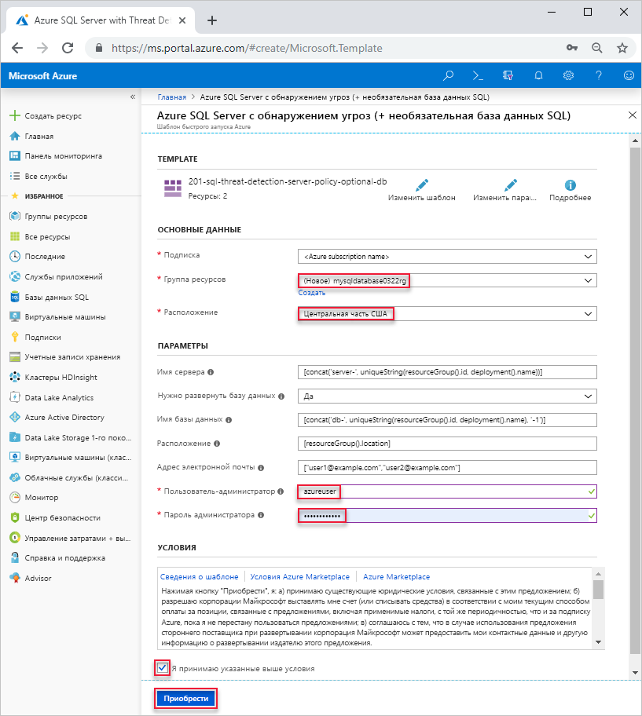

# <a name="quickstart-create-a-single-database-in-azure-sql-database-using-the-azure-resource-manager-template"></a>Краткое руководство. Создание отдельной базы данных в Базе данных SQL с помощью шаблона Azure Resource Manager

Создание [отдельной базы данных](sql-database-single-database.md) — это самый быстрый и простой вариант развертывания для создания базы данных в Базе данных SQL Azure. В этом кратком руководстве описано, как создать отдельную базу данных с помощью шаблона Azure Resource Manager. Дополнительные сведения см. в документации по [Azure Resource Manager](/azure/azure-resource-manager/).

Если у вас еще нет подписки Azure, [создайте бесплатную учетную запись](https://azure.microsoft.com/free/).

## <a name="create-a-single-database"></a>Создание отдельной базы данных

Отдельная база данных имеет заданный набор ресурсов вычислений, памяти, операций ввода-вывода и хранения и доступна в [двух моделях приобретения](sql-database-purchase-models.md). При создании отдельной базы данных можете также определить [Сервер Базы данных SQL](sql-database-servers.md), чтобы управлять им и разместить его в [группе ресурсов Azure](../azure-resource-manager/resource-group-overview.md) в указанном регионе.

Следующий файл JSON — это шаблон, который используется в этой статье. Шаблон хранится в учетной записи хранения Azure. Другие примеры шаблонов базы данных SQL Azure можно найти [здесь](https://azure.microsoft.com/resources/templates/?resourceType=Microsoft.Sql&pageNumber=1&sort=Popular).

```json
{
  "$schema": "https://schema.management.azure.com/schemas/2015-01-01/deploymentTemplate.json#",
  "contentVersion": "1.0.0.0",
  "parameters": {
    "serverName": {
      "type": "string",
      "defaultValue": "[concat('server-', uniqueString(resourceGroup().id, deployment().name))]",
      "metadata": {
        "description": "Name for the SQL server"
      }
    },
    "shouldDeployDb": {
      "type": "string",
      "allowedValues": [
        "Yes",
        "No"
      ],
      "defaultValue": "Yes",
      "metadata": {
        "description": "Whether an Azure SQL Database should be deployed under the server"
      }
    },
    "databaseName": {
      "type": "string",
      "defaultValue": "[concat('db-', uniqueString(resourceGroup().id, deployment().name), '-1')]",
      "metadata": {
        "description": "Name for the SQL database under the SQL server"
      }
    },
    "location": {
      "type": "string",
      "defaultValue": "[resourceGroup().location]",
      "metadata": {
        "description": "Location for server and optional DB"
      }
    },
    "emailAddresses": {
      "type": "array",
      "defaultValue": [
        "user1@example.com",
        "user2@example.com"
      ],
      "metadata": {
        "description": "Email addresses for receiving alerts"
      }
    },
    "adminUser": {
      "type": "string",
      "metadata": {
        "description": "Username for admin"
      }
    },
    "adminPassword": {
      "type": "securestring",
      "metadata": {
        "description": "Password for admin"
      }
    }
  },
  "variables": {
    "databaseServerName": "[toLower(parameters('serverName'))]",
    "databaseName": "[parameters('databaseName')]",
    "shouldDeployDb": "[parameters('shouldDeployDb')]",
    "databaseServerLocation": "[parameters('location')]",
    "databaseServerAdminLogin": "[parameters('adminUser')]",
    "databaseServerAdminLoginPassword": "[parameters('adminPassword')]",
    "emailAddresses": "[parameters('emailAddresses')]"
  },
  "resources": [
    {
      "type": "Microsoft.Sql/servers",
      "name": "[variables('databaseServerName')]",
      "location": "[variables('databaseServerLocation')]",
      "apiVersion": "2015-05-01-preview",
      "properties": {
        "administratorLogin": "[variables('databaseServerAdminLogin')]",
        "administratorLoginPassword": "[variables('databaseServerAdminLoginPassword')]",
        "version": "12.0"
      },
      "tags": {
        "DisplayName": "[variables('databaseServerName')]"
      },
      "resources": [
        {
          "type": "securityAlertPolicies",
          "name": "DefaultSecurityAlert",
          "apiVersion": "2017-03-01-preview",
          "dependsOn": [
            "[variables('databaseServerName')]"
          ],
          "properties": {
            "state": "Enabled",
            "emailAddresses": "[variables('emailAddresses')]",
            "emailAccountAdmins": true
          }
        }
      ]
    },
    {
      "condition": "[equals(variables('shouldDeployDb'), 'Yes')]",
      "type": "Microsoft.Sql/servers/databases",
      "name": "[concat(string(variables('databaseServerName')), '/', string(variables('databaseName')))]",
      "location": "[variables('databaseServerLocation')]",
      "apiVersion": "2017-10-01-preview",
      "dependsOn": [
        "[concat('Microsoft.Sql/servers/', variables('databaseServerName'))]"
      ],
      "properties": {},
      "tags": {
        "DisplayName": "[variables('databaseServerName')]"
      }
    }
  ]
}
```

1. Выберите следующее изображение, чтобы войти на портал Azure и открыть шаблон.

    <a href="https://portal.azure.com/#create/Microsoft.Template/uri/https%3A%2F%2Farmtutorials.blob.core.windows.net%2Fcreatesql%2Fazuredeploy.json"></a>

2. Введите или выберите следующие значения.  

    

    Если значение не указано, используйте значение по умолчанию.

    * **Подписка**. Выберите нужную подписку Azure.
    * **Группа ресурсов**. Щелкните **Создать**, введите уникальное имя новой группы ресурсов и нажмите кнопку **ОК**. 
    * **Расположение**. Выберите расположение.  Например, **центральная часть США**.
    * **Пользователь-администратор.** Укажите имя пользователя администратора сервера базы данных SQL.
    * **Пароль администратора.** Введите пароль администратора. 
    * **I agree to the terms and conditions state above** (Я принимаю указанные выше условия). Установите этот флажок.
3. Щелкните **Приобрести**.

## <a name="query-the-database"></a>Выполнение запросов к базе данных

См. дополнительные сведения о том, как [создать запрос к базе данных](./sql-database-single-database-get-started.md#query-the-database).

## <a name="clean-up-resources"></a>Очистка ресурсов

Сохраните эту группу ресурсов, сервер базы данных и отдельную базу данных, чтобы перейти к [дальнейшим действиям](#next-steps). Далее показано, как установить подключение и выполнить запрос к базе данных с помощью разных методов.

Чтобы удалить группу ресурсов с помощью Azure CLI или Azure PowerShell, выполните следующие действия.

```azurecli-interactive
echo "Enter the Resource Group name:" &&
read resourceGroupName &&
az group delete --name $resourceGroupName 
```

```azurepowershell-interactive
$resourceGroupName = Read-Host -Prompt "Enter the Resource Group name"
Remove-AzResourceGroup -Name $resourceGroupName 
```

## <a name="next-steps"></a>Дополнительная информация

- Создайте правило брандмауэра на уровне сервера, чтобы подключиться к отдельной базе данных с помощью локальных или удаленных средств. Подробные сведения см. в разделе [Создание правила брандмауэра на уровне сервера](sql-database-server-level-firewall-rule.md).
- Создав правило брандмауэра на уровне сервера, вы сможете [устанавливать подключение и выполнять запросы к базе данных](sql-database-connect-query.md) с помощью разных средств и языков.
  - [подключиться и создать запрос с помощью SQL Server Management Studio](sql-database-connect-query-ssms.md);
  - [подключиться и создать запрос с помощью Azure Data Studio](https://docs.microsoft.com/sql/azure-data-studio/quickstart-sql-database?toc=/azure/sql-database/toc.json).
- Чтобы создать отдельную базу данных с помощью Azure CLI, ознакомьтесь с [примерами сценариев Azure CLI](sql-database-cli-samples.md).
- Чтобы создать отдельную базу данных с помощью Azure PowerShell, ознакомьтесь с [примерами сценариев Azure PowerShell](sql-database-powershell-samples.md).
