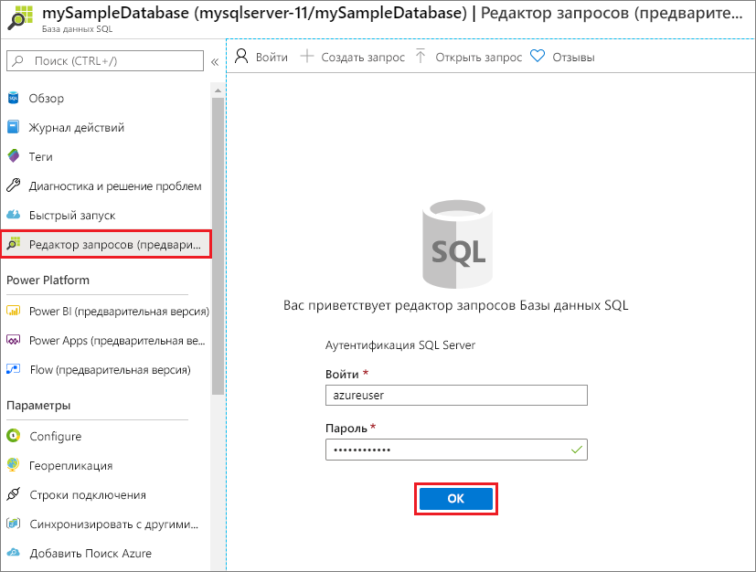
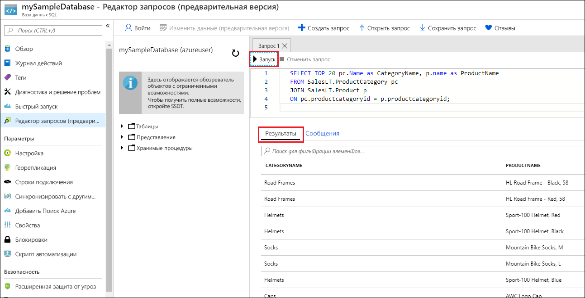

# <a name="quickstart-create-an-azure-sql-database-single-database"></a>Краткое руководство. Создание отдельной базы данных в Базе данных SQL Azure

В этом кратком руководстве вы примените портал Azure, скрипт PowerShell или скрипт Azure CLI для создания отдельной базы данных в Базе данных SQL Azure. Затем вы отправите запросы к этой базе данных через **редактор запросов** на портале Azure. 

[Отдельная база данных](sql-database-single-database.md) — это самый быстрый и простой вариант развертывания в Базе данных SQL Azure. Управление отдельной базой данных выполняется на [сервере Базы данных SQL](sql-database-servers.md), который существует в [группе ресурсов Azure](../azure-resource-manager/management/overview.md) в определенном регионе Azure. В этом кратком руководстве объясняется, как создать группу ресурсов и сервер SQL Server для новой базы данных.

Отдельную базу данных можно создать на уровне *подготовленных* или *бессерверных* вычислительных ресурсов. Подготовленная база данных имеет определенное количество предварительно выделенных вычислительных ресурсов, таких как объем памяти и ЦП, и использует одну из двух [моделей приобретения](sql-database-purchase-models.md). В этом кратком руководстве объясняется, как создать подготовленную базу данных с моделью покупки [на основе виртуальных ядер](sql-database-service-tiers-vcore.md). Но вы можете выбрать модель [на основе DTU](sql-database-service-tiers-DTU.md). 

Уровень бессерверных вычислений доступен только для модели покупки на основе виртуальных ядер. На этом уровне предоставляется автомасштабируемый набор вычислительных ресурсов, таких как объем памяти и ЦП. Чтобы создать отдельную базу данных на уровне бессерверных вычислений, воспользуйтесь статьей [о создании бессерверной базы данных](sql-database-serverless.md#create-new-database-in-serverless-compute-tier).

## <a name="prerequisite"></a>Предварительные требования

- Активная подписка Azure. Если ее нет, создайте [бесплатную учетную запись](https://azure.microsoft.com/free/). 

## <a name="create-a-single-database"></a>Создание отдельной базы данных

[!INCLUDE [sql-database-create-single-database](includes/sql-database-create-single-database.md)]

## <a name="query-the-database"></a>Выполнение запросов к базе данных

Завершив создание базы данных, вы сможете через встроенный **редактор запросов** на портале Azure подключиться к этой базе данных и выполнить запрос по данным.

1. На портале найдите и выберите элемент **Базы данных SQL**, а затем в открывшемся списке выберите нужную базу данных.
1. На странице **База данных SQL** для этой базы данных найдите и выберите элемент **Редактор запросов (предварительная версия)** в меню слева.
1. Введите учетные данные администратора сервера и щелкните **ОК**.
   
   

1. Введите следующий запрос в области **Редактор запросов**.

   ```sql
   SELECT TOP 20 pc.Name as CategoryName, p.name as ProductName
   FROM SalesLT.ProductCategory pc
   JOIN SalesLT.Product p
   ON pc.productcategoryid = p.productcategoryid;
   ```

1. Щелкните **Выполнить** и просмотрите результаты запроса в области **Результаты**.

   

1. Закройте страницу **редактора запросов** и щелкните **ОК**, когда увидите запрос на отмену несохраненных изменений.

## <a name="clean-up-resources"></a>Очистка ресурсов

Сохраните группу ресурсов, сервер и отдельную базу данных, если вы планируете перейти к следующим шагам и изучить разные методы подключения к базе данных и отправки запросов к ней.

Когда вы закончите работу с этими ресурсами, созданную группу ресурсов можно удалить вместе с размещенными в ней сервером и отдельной базой данных.

# <a name="portal"></a>[Портал](#tab/azure-portal)

Чтобы удалить **myResourceGroup** и все ее ресурсы с помощью портала Azure, сделайте следующее:

1. На портале Azure найдите и выберите элемент **Группы ресурсов**, а затем выберите в списке элемент **myResourceGroup**.
1. На странице группы ресурсов выберите **Удалить группу ресурсов**.
1. В поле **Введите имя группы ресурсов** введите *myResourceGroup*, а затем щелкните **Удалить**.

# <a name="azure-cli"></a>[Azure CLI](#tab/azure-cli)

Чтобы удалить группу ресурсов и все ресурсы в ней, выполните следующую команду Azure CLI с именем удаляемой группы ресурсов.

```azurecli-interactive
az group delete --name <your resource group>
```

# <a name="powershell"></a>[PowerShell](#tab/azure-powershell)

Чтобы удалить группу ресурсов и все ресурсы в ней, выполните следующий командлет PowerShell с именем удаляемой группы ресурсов.

 ```azurepowershell-interactive
Remove-AzResourceGroup -Name <your resource group>
```

---
## <a name="next-steps"></a>Дальнейшие действия

[Создайте подключение и выполните запрос](sql-database-connect-query.md) к базе данных с помощью разных средств и языков.
> [!div class="nextstepaction"]
> [подключиться и создать запрос с помощью SQL Server Management Studio](sql-database-connect-query-ssms.md);
> 
> [подключиться и создать запрос с помощью Azure Data Studio](/sql/azure-data-studio/quickstart-sql-database?toc=/azure/sql-database/toc.json).
