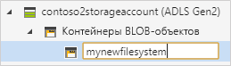
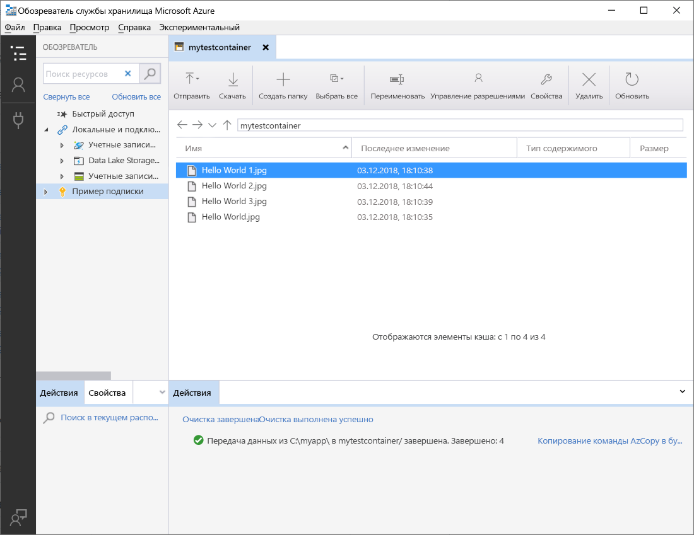

# Управление данными в учетной записи Azure Data Lake Storage 2-го поколения с помощью Обозревателя службы хранилища Azure

В этом кратком руководстве вы научитесь использовать [Обозреватель службы хранилища Azure](https://azure.microsoft.com/features/storage-explorer/) для создания каталога и большого двоичного объекта. Далее вы узнаете, как загружать большой двоичный объект на локальный компьютер и как просматривать все большие двоичные объекты в каталоге. Вы также узнаете, как создавать моментальный снимок большого двоичного объекта, управлять политиками доступа к каталогу и создавать подписанный URL-адрес.

## предварительные требования

[!INCLUDE [storage-quickstart-prereq-include](../../../includes/storage-quickstart-prereq-include.md)]

Для работы с этим кратким руководством необходимо установить Обозреватель службы хранилища Azure. Чтобы установить Обозреватель службы хранилища Azure для Windows, Macintosh или Linux, см. раздел [Обозреватель хранилищ Azure](https://azure.microsoft.com/features/storage-explorer/).

## Вход в Обозреватель службы хранилища

При первом запуске откроется окно **подключения обозревателя службы хранилища Microsoft Azure**. Хотя Обозреватель службы хранилища предоставляет несколько способов подключения к учетным записям хранения, в настоящее время поддерживается только один из способов управления ACL.

|Задача|Цель|
|---|---|
|Добавление учетной записи Azure | Перенаправляет вас на страницу входа организации для аутентификации в Azure. В настоящее время это единственный поддерживаемый метод проверки подлинности, если вы хотите задавать списки ACL и управлять ими. |

Выберите **Добавить учетную запись Azure** и нажмите кнопку **Войти**. Следуйте указаниям на экране, чтобы войти в учетную запись Azure.

После подключения загружается обозреватель службы хранилища Azure с вкладкой **Обозреватель**. В этом представлении вы можете просматривать сведения обо всех учетных записях хранения Azure, а также о локальном хранилище, настроенном с помощью учетных записей [эмулятора службы хранилища Azure](../common/storage-use-emulator.md?toc=%2fazure%2fstorage%2fblobs%2ftoc.json), [Cosmos DB](../../cosmos-db/storage-explorer.md?toc=%2fazure%2fstorage%2fblobs%2ftoc.json) или сред [Azure Stack](/azure-stack/user/azure-stack-storage-connect-se?toc=%2fazure%2fstorage%2fblobs%2ftoc.json).

## Создание файловой системы

Большие двоичные объекты всегда отправляются в каталог. Это позволяет упорядочивать группы BLOB-объектов аналогично организации файлов в папки на компьютере.

Чтобы создать каталог, разверните учетную запись хранения, созданную на предыдущем шаге. Щелкните правой кнопкой мыши элемент **Контейнеры больших двоичных объектов** и выберите пункт **Создать контейнер BLOB-объектов**. Укажите имя файловой системы. Нажмите клавишу **ВВОД**, чтобы создать файловую систему. После успешного создания каталога больших двоичных объектов он отобразится в папке **Контейнеры больших двоичных объектов** выбранной учетной записи хранения.

## Отправка больших двоичных объектов в каталог

Хранилище BLOB-объектов поддерживает блочные, добавочные и страничные BLOB-объекты. VHD-файлы, используемые для резервных виртуальных машин IaaS, являются страничными BLOB-объектами. Добавочные BLOB-объекты используются для ведения журнала, например если требуется выполнить запись в файл и затем добавлять дополнительные сведения. Большинство файлов, находящихся в хранилище BLOB-объектов, представляют собой блочные BLOB-объекты.

На ленте каталога выберите **Передать**. Эта операция позволяет передать папку или файл.

Выберите файлы или папку для передачи. Выберите **тип большого двоичного объекта**. Допустимые варианты больших двоичных объектов: **добавочный**, **страничный** или **блочный**.

Если вы передаете VHD- или VHDX-файл, выберите **Upload .vhd/.vhdx files as page blobs (recommended)** (Передать VHD- или VHDX-файлы как страничные BLOB-объекты (рекомендуется)).

В поле **Upload to folder (optional)** (Передача в папку (необязательно)) укажите папку для хранения файлов или папок в папке каталога. Если папка не выбрана, файлы передаются прямо в каталог.

Если нажать кнопку **ОК**, выбранные файлы помещаются в очередь для передачи, а затем каждый файл передается. После завершения передачи результаты отображаются в окне **Действия**.

## Просмотр больших двоичных объектов в каталоге

В приложении **Обозреватель службы хранилища Azure** выберите каталог в учетной записи хранения. На основной панели отображается список больших двоичных объектов в выбранном каталоге.

## Скачивание больших двоичных объектов

Чтобы скачать большие двоичные объекты с помощью **обозревателя службы хранилища Azure**, выберите большой двоичный объект, а затем на ленте нажмите кнопку **Скачать**. Откроется диалоговое окно, в котором можно ввести имя файла. Нажмите кнопку **Сохранить** чтобы начать скачивание большого двоичного объекта в локальную папку.

## Следующие шаги

Из этого краткого руководства вы узнали, как передавать файлы между локальным диском и хранилищем BLOB-объектов Azure с помощью **обозревателя службы хранилища Azure**. Дополнительные сведения о том, как задать ACL для файлов и каталогов, см. в нашем практическом руководстве по этой теме.

> [!div class="nextstepaction"]
> [Установка разрешений на уровне файлов и каталогов в Azure Data Lake Storage 2-го поколения (предварительная версия) с помощью Обозревателя службы хранилища Azure](data-lake-storage-how-to-set-permissions-storage-explorer.md)
