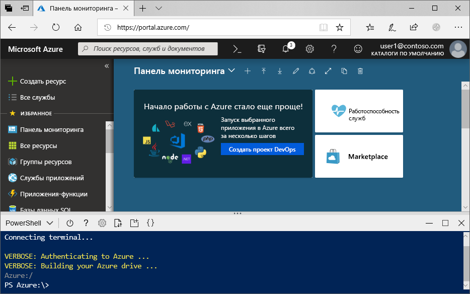

# <a name="create-an-azure-data-lake-storage-gen2-storage-account"></a>Создание поддерживаемой учетной записи хранения Azure Data Lake Storage 2-го поколения

Azure Data Lake Storage 2-го поколения [поддерживает иерархическое пространство имен](data-lake-storage-introduction.md), которое предоставляет собственный контейнер на основе каталогов, предназначенный для работы с распределенной файловой системой Hadoop (HDFS). Доступ к данным Data Lake Storage Gen2 из распределенной файловой системы Hadoop доступен с помощью [драйвера ABFS](data-lake-storage-abfs-driver.md).

This article demonstrates how to create an account using the Azure portal, Azure PowerShell, or via the Azure CLI.

## <a name="prerequisites"></a>Технические условия

Если у вас еще нет подписки Azure, [создайте бесплатную учетную запись Azure](https://azure.microsoft.com/free/), прежде чем начинать работу. 

|           | Необходимое условие |
|-----------|--------------|
|Microsoft Azure     | Нет         |
|PowerShell | This article requires the PowerShell module Az.Storage version **0.7** or later. Чтобы узнать, какая версия используется сейчас, выполните команду `Get-Module -ListAvailable Az.Storage`. Если после выполнения этой команды результаты не отображаются или отображается версия, предшествующая **0.7**, тогда вам нужно обновить модуль PowerShell. Дополнительные сведения см. в разделе [Обновление модуля PowerShell](#upgrade-your-powershell-module) этого руководства.
|CLI        | Вы можете войти в Azure и выполнить команды Azure CLI одним из двух способов: <ul><li>Выполнить команды CLI на портале Azure в Azure Cloud Shell. </li><li>Установить CLI и выполнить команды CLI локально.</li></ul>|

При работе в командной строке можно запустить оболочку Azure Cloud или локально установить интерфейс командной строки.

### <a name="use-azure-cloud-shell"></a>Использование Azure Cloud Shell

Azure Cloud Shell — это бесплатная оболочка Bash, которую можно запускать непосредственно на портале Azure. Она включает предварительно установленный интерфейс Azure CLI и настроена для использования с вашей учетной записью. Нажмите кнопку меню **Cloud Shell** в правом верхнем углу окна портала Azure.

[](https://portal.azure.com)

The button launches an interactive shell that you can use to run the steps in this article:

[](https://portal.azure.com)

### <a name="install-the-cli-locally"></a>Установка CLI локально

Azure CLI также можно установить и применять локально. This article requires that you are running the Azure CLI version 2.0.38 or later. Чтобы узнать версию, выполните команду `az --version`. Если вам необходимо выполнить установку или обновление, см. статью [Установка Azure CLI](/cli/azure/install-azure-cli).

## <a name="create-a-storage-account-with-azure-data-lake-storage-gen2-enabled"></a>Создание учетной записи хранения с поддержкой Azure Data Lake Storage 2-го поколения

Учетная запись хранения Azure содержит все объекты данных службы хранилища Azure: большие двоичные объекты, файлы, очереди, таблицы и диски. The storage account provides a unique namespace for your Azure Storage data that is accessible from anywhere in the world over HTTP or HTTPS. Data in your Azure storage account is durable and highly available, secure, and massively scalable.

> [!NOTE]
> Чтобы воспользоваться преимуществами функций Data Lake Storage Gen2, необходимо создать новые учетные записи хранения типа **StorageV2 (общего назначения V2)** .  

Дополнительные сведения об учетных записях хранения см. в статье [Общие сведения об учетной записи хранения](../common/storage-account-overview.md).

## <a name="create-an-account-using-the-azure-portal"></a>Создание учетной записи с использованием портала Azure

Войдите на [портале Azure](https://portal.azure.com).

### <a name="create-a-storage-account"></a>Создание учетной записи хранилища

Каждая учетная запись хранения должна принадлежать группе ресурсов Azure. Группа ресурсов — это логический контейнер для группирования служб Azure. При создании учетной записи хранения у вас есть возможность создать новую или использовать существующую группу ресурсов. This article shows how to create a new resource group.

Чтобы создать учетную запись хранения общего назначения версии 2 на портале Azure, сделайте следующее:

> [!NOTE]
> Иерархическое пространство имен сейчас доступно во всех общедоступных регионах.

1. Выберите подписку, в которой нужно создать учетную запись хранения.
2. In the Azure portal, choose the **Create a resource** button, then choose **Storage account**.
3. В поле **Группа ресурсов** выберите **Создать**. Введите имя новой группы ресурсов.
   
   Группа ресурсов — это логический контейнер для группирования служб Azure. При создании учетной записи хранения у вас есть возможность создать новую или использовать существующую группу ресурсов.

4. Далее введите имя своей учетной записи хранения. Выбранное вами имя должно быть уникальным в Azure. Также имя должно содержать от 3 до 24 символов и может состоять только из цифр и строчных букв.
5. Выберите расположение.
6. Make sure that **StorageV2 (general purpose v2)** appears as selected in the **Account kind** drop-down list.
7. Optionally change the values in each of these fields: **Performance**, **Replication**, **Access tier**. To learn more about these options, see [Introduction to Azure Storage](https://docs.microsoft.com/azure/storage/common/storage-introduction#azure-storage-services).
8. Choose the **Advanced** tab.
10. В разделе **Data Lake Storage Gen2** задайте параметру **Иерархическое пространство имен** состояние **Включено**.
11. Щелкните **Review + Create** (Просмотр и создание), чтобы создать учетную запись хранения.

Теперь учетная запись хранилища создана с помощью портала.

### <a name="clean-up-resources"></a>Очистка ресурсов

Чтобы удалить группу ресурсов с помощью портала Azure, сделайте следующее:

1. На портале Azure разверните меню слева, чтобы открыть меню служб, и выберите **Resource Groups** (Группы ресурсов), чтобы просмотреть список групп ресурсов.
2. Найдите группу ресурсов, которую нужно удалить, и щелкните правой кнопкой мыши кнопку **More** (Дополнительно) ( **...** ) справа от списка.
3. Выберите **Удалить группу ресурсов** и подтвердите выбор.

## <a name="create-an-account-using-powershell"></a>Создание учетной записи с помощью PowerShell

Сначала установите последнюю версию модуля [PowerShellGet](/powershell/scripting/gallery/installing-psget).

Затем обновите модуль PowerShell, войдите в подписку Azure, создайте группу ресурсов и учетную запись хранения.

### <a name="upgrade-your-powershell-module"></a>Обновление модуля powershell

[!INCLUDE [updated-for-az](../../../includes/updated-for-az.md)]

Для взаимодействия с Data Lake Storage 2-го поколения с помощью PowerShell вам требуется установить модуль Az.Storage версии **0.7** или более поздней.

Сначала откройте сеанс PowerShell с повышенными разрешениями.

Установка модуля Az.Storage

```powershell
Install-Module Az.Storage -Repository PSGallery -AllowClobber -Force
```

### <a name="sign-in-to-your-azure-subscription"></a>Вход в подписку Azure

Чтобы выполнить проверку подлинности, используйте команду `Login-AzAccount` и следуйте инструкциям на экране.

```powershell
Login-AzAccount
```

### <a name="create-a-resource-group"></a>Создание группы ресурсов

Чтобы создать группу ресурсов с помощью PowerShell, выполните команду [New-AzResourceGroup](/powershell/module/az.resources/new-azresourcegroup). 

> [!NOTE]
> Иерархическое пространство имен сейчас доступно во всех общедоступных регионах.

```powershell
# put resource group in a variable so you can use the same group name going forward,
# without hardcoding it repeatedly
$resourceGroup = "storage-quickstart-resource-group"
$location = "westus2"
New-AzResourceGroup -Name $resourceGroup -Location $location
```

### <a name="create-a-general-purpose-v2-storage-account"></a>Создание учетной записи хранения общего назначения v2

Чтобы создать учетную запись хранения общего назначения версии 2 с локально избыточным хранилищем (LRS) с помощью PowerShell, используйте команду [New-AzStorageAccount](/powershell/module/az.storage/New-azStorageAccount).

```powershell
$location = "westus2"

New-AzStorageAccount -ResourceGroupName $resourceGroup `
  -Name "storagequickstart" `
  -Location $location `
  -SkuName Standard_LRS `
  -Kind StorageV2 `
  -EnableHierarchicalNamespace $True
```

### <a name="clean-up-resources"></a>Очистка ресурсов

Чтобы удалить группу ресурсов и связанные с ней ресурсы, включая новую учетную запись хранения, используйте команду [Remove-AzResourceGroup](/powershell/module/az.resources/remove-azresourcegroup): 

```powershell
Remove-AzResourceGroup -Name $resourceGroup
```

## <a name="create-an-account-using-azure-cli"></a>Создание учетной записи с помощью Azure CLI

Чтобы запустить Azure Cloud Shell, войдите на [портал Azure](https://portal.azure.com).

Если вы хотите войти в локальную установку CLI, выполните команду входа:

```cli
az login
```

### <a name="add-the-cli-extension-for-azure-data-lake-gen-2"></a>Добавление расширения CLI для Azure Data Lake 2-го поколения

Чтобы взаимодействовать с Data Lake Storage 2-го поколения через CLI, добавьте расширение в оболочку.

Для этого с помощью Cloud Shell или локальный оболочки введите следующую команду: `az extension add --name storage-preview`

### <a name="create-a-resource-group"></a>Создание группы ресурсов

Чтобы создать группу ресурсов с помощью Azure CLI, используйте команду [az group create](/cli/azure/group).

```azurecli-interactive
az group create `
    --name storage-quickstart-resource-group `
    --location westus2
```

> [!NOTE]
> > Иерархическое пространство имен сейчас доступно во всех общедоступных регионах.

### <a name="create-a-general-purpose-v2-storage-account"></a>Создание учетной записи хранения общего назначения v2

Чтобы создать учетную запись хранения общего назначения версии 2 с локально избыточным хранилищем с помощью Azure CLI, примените команду [az storage account create](/cli/azure/storage/account).

```azurecli-interactive
az storage account create `
    --name storagequickstart `
    --resource-group storage-quickstart-resource-group `
    --location westus2 `
    --sku Standard_LRS `
    --kind StorageV2 `
    --hierarchical-namespace true
```

### <a name="clean-up-resources"></a>Очистка ресурсов

Чтобы удалить группу ресурсов и связанные с ней ресурсы, включая новую учетную запись хранения, используйте команду [az group delete](/cli/azure/group).

```azurecli-interactive
az group delete --name myResourceGroup
```

## <a name="next-steps"></a>Дальнейшие действия

In this article, you've created a storage account with Data Lake Storage Gen2 capabilities. Сведения об отправке и скачивании больших двоичных объектов в учетную запись хранения и из нее см. в следующей статье.

* [Передача данных с помощью AzCopy версии 10 (предварительная версия)](https://docs.microsoft.com/azure/storage/common/storage-use-azcopy-v10?toc=%2fazure%2fstorage%2fblobs%2ftoc.json)
