# <a name="quickstart-analyze-data-in-azure-data-lake-storage-gen2-by-using-azure-databricks"></a>Краткое руководство. Анализ данных в Azure Data Lake Storage 2-го поколения с помощью Azure Databricks

В этом кратком руководстве объясняется, как запускать задания Apache Spark с помощью Azure Databricks для выполнения аналитики хранимых данных в учетной записи хранения с поддержкой Azure Data Lake Storage 2-го поколения.

В рамках задания Spark показано, как анализировать данные подписки на радиоканал, чтобы получить сведения о бесплатном или оплачиваемом использовании на основе демографических данных.

Если у вас еще нет подписки Azure, [создайте бесплатную учетную запись Azure](https://azure.microsoft.com/free/), прежде чем начинать работу.

## <a name="prerequisites"></a>Предварительные требования

- [Создание учетной записи хранения с поддержкой Data Lake Storage 2-го поколения](data-lake-storage-quickstart-create-account.md)

<a id="config"/>

## <a name="get-the-name-of-your-storage-account"></a>Получение имени учетной записи хранения

Чтобы получить имя учетной записи хранения на портале Azure, выберите **Все службы** и выполните фильтрацию по термину *хранилище*. Затем выберите **Учетные записи хранения** и перейдите к учетной записи хранения.

Вставьте это имя в текстовый файл. Оно скоро вам понадобится.

<a id="service-principal"/>

## <a name="create-a-service-principal"></a>Создание субъекта-службы

Создайте субъект-службу, следуя инструкциям в статье [How to: Создание приложения Azure Active Directory и субъект-службы с доступом к ресурсам с помощью портала](https://docs.microsoft.com/azure/active-directory/develop/howto-create-service-principal-portal).

Существует несколько конкретных действий, которые необходимо выполнить при изучении этой статьи.

:heavy_check_mark: При выполнении действий, описанных в разделе [Назначение приложению роли](https://docs.microsoft.com/azure/active-directory/develop/howto-create-service-principal-portal#assign-the-application-to-a-role) этой статьи, не забудьте назначить приложению **роль участника хранилища BLOB-объектов**.

:heavy_check_mark: При выполнении действий, описанных в разделе [Получение значений для входа](https://docs.microsoft.com/azure/active-directory/develop/howto-create-service-principal-portal#get-values-for-signing-in) этой статьи, вставьте идентификатор клиента, код приложения и значения ключа аутентификации в текстовый файл. Они вам скоро понадобятся.

## <a name="create-an-azure-databricks-workspace"></a>Создание рабочей области Azure Databricks

В этом разделе вы создадите рабочую область Azure Databricks с помощью портала Azure.

1. На портале Azure выберите **Создать ресурс** > **Analytics** > **Azure Databricks**.

    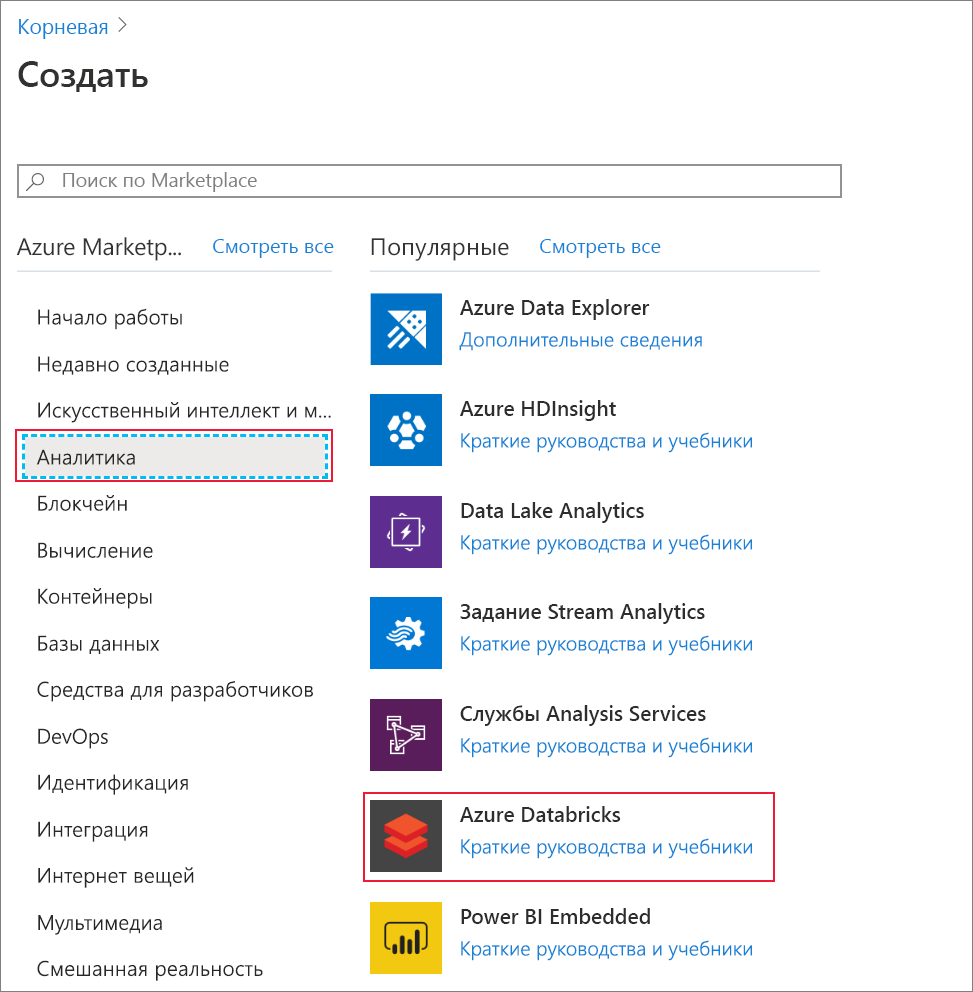

2. В разделе **службы Azure Databricks** укажите значения для создания рабочей области Databricks.

    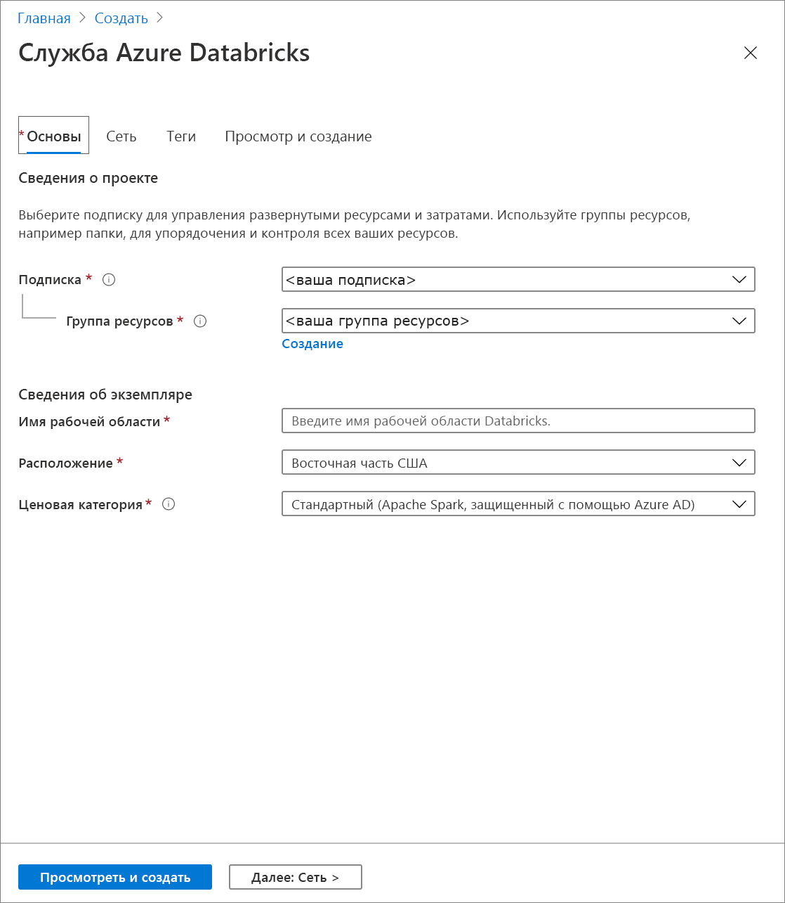

    Укажите следующие значения.

    |Свойство  |ОПИСАНИЕ  |
    |---------|---------|
    |**Имя рабочей области**     | Укажите имя рабочей области Databricks.        |
    |**Подписка**     | Выберите подписку Azure в раскрывающемся списке.        |
    |**Группа ресурсов**     | Укажите, следует ли создать новую группу ресурсов или использовать имеющуюся. Группа ресурсов — это контейнер, содержащий связанные ресурсы для решения Azure. Дополнительные сведения см. в [обзоре группы ресурсов Azure](../../azure-resource-manager/resource-group-overview.md). |
    |**Местоположение.**     | Выберите **Западная часть США 2**. Если хотите, выберите другую публичную область.        |
    |**Ценовая категория**     |  Вы можете выбрать уровень **Стандартный** или **Премиум**. Дополнительные сведения об этих ценовых категориях см. на [странице цен на Databricks](https://azure.microsoft.com/pricing/details/databricks/).       |

    Выберите **Закрепить на панели мониторинга** и щелкните **Создать**.

3. Создание рабочего пространства занимает некоторое время. Во время создания рабочей области на портале с правой стороны отображается плитка **Submitting deployment for Azure Databricks** (Отправка развертывания для Azure Databricks). Чтобы увидеть заголовок, возможно, вам придется прокрутить вправо на панели мониторинга. В верхней части экрана также будет отображаться индикатор хода выполнения. Следить за выполнением можно с помощью любого из этих элементов.

    

## <a name="create-a-spark-cluster-in-databricks"></a>Создание кластера Spark в Databricks

1. На портале Azure перейдите к созданной рабочей области Databricks, а затем выберите **Launch Workspace** (Запуск рабочей области).

2. Вы будете перенаправлены на портал Azure Databricks. На портале выберите **Новый** > **Кластер**.

    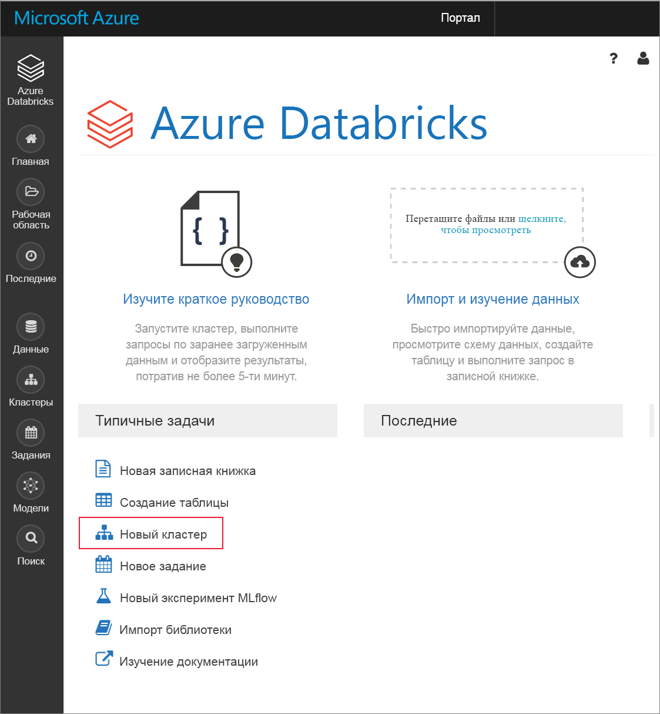

3. На странице **создания кластера** укажите значения для создания кластера.

    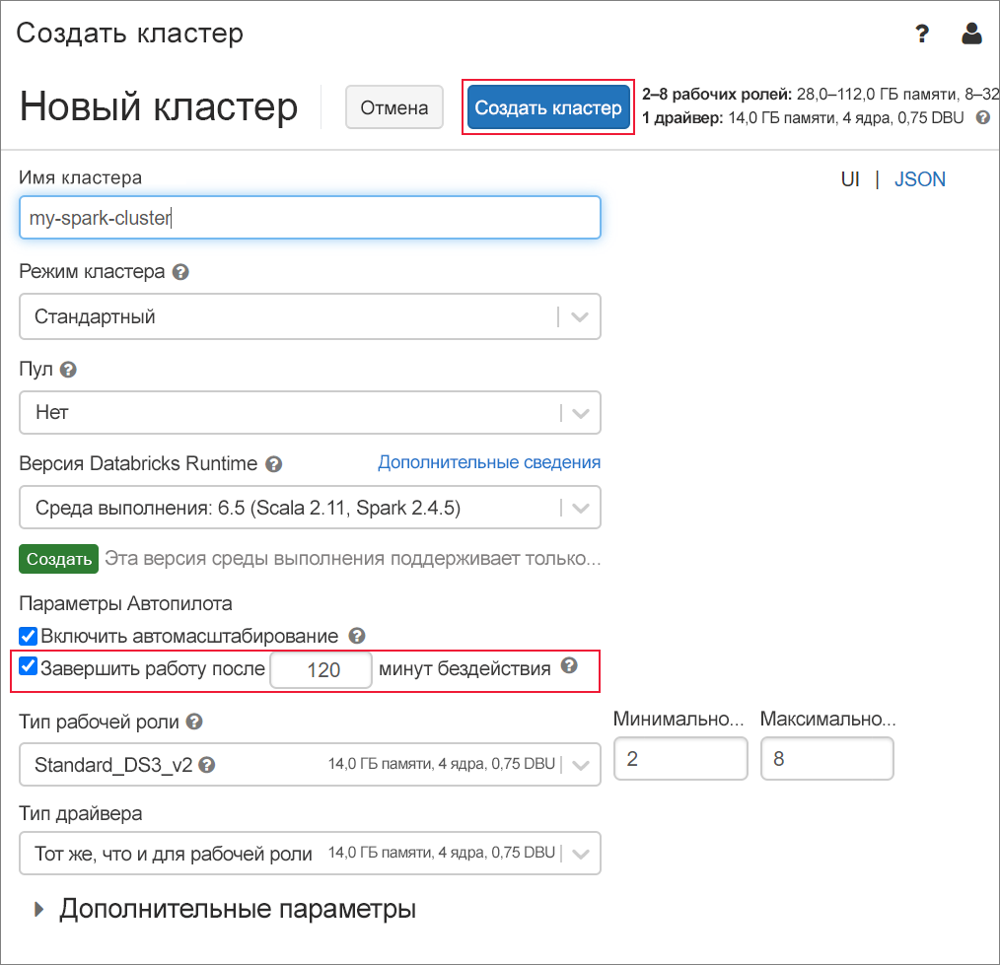

    Для всех остальных параметров, кроме следующих, примите значения по умолчанию:

    * Введите имя кластера.
    * Создайте кластер со средой выполнения **5.1**.
    * Убедитесь, что установлен флажок **Terminate after 120 minutes of activity** (Завершить работу после 120 минут отсутствия активности). Укажите длительность (в минутах) для завершения работы кластера, если тот не используется.

4. Выберите **Create cluster** (Создать кластер). После запуска кластера можно вложить записные книжки в кластер и запустить задания Spark.

Дополнительные сведения о создании кластеров см. в статье [о создании кластера Spark в Azure Databricks](https://docs.azuredatabricks.net/user-guide/clusters/create.html).

## <a name="create-storage-account-file-system"></a>Создание файловой системы учетной записи хранения

В этом разделе показано создание записной книжки в рабочей области Azure Databricks и выполнение фрагментов кода для настройки учетной записи хранения.

1. На [портале Azure](https://portal.azure.com) перейдите к созданной рабочей области Azure Databricks, а затем выберите **Launch Workspace** (Запуск рабочей области).

2. В левой области выберите **Рабочая область**. В раскрывающемся списке **Рабочая область** выберите **Создать** > **Notebook** (Записная книжка).

    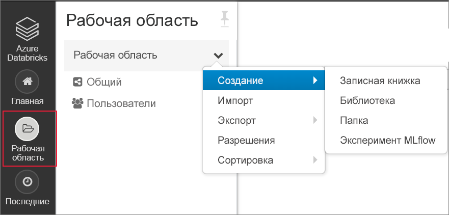

3. В диалоговом окне **создания записной книжки** введите имя записной книжки. Выберите **Scala** в качестве языка, а затем выберите созданный ранее кластер Spark.

    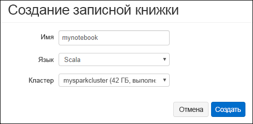

    Нажмите кнопку **Создать**.

4. Скопируйте и вставьте следующий блок кода в первую ячейку, но не запускайте этот код.

   ```scala
   spark.conf.set("fs.azure.account.auth.type.<storage-account-name>.dfs.core.windows.net", "OAuth")
   spark.conf.set("fs.azure.account.oauth.provider.type.<storage-account-name>.dfs.core.windows.net", "org.apache.hadoop.fs.azurebfs.oauth2.ClientCredsTokenProvider")
   spark.conf.set("fs.azure.account.oauth2.client.id.<storage-account-name>.dfs.core.windows.net", "<application-id>")
   spark.conf.set("fs.azure.account.oauth2.client.secret.<storage-account-name>.dfs.core.windows.net", "<authentication-key>")
   spark.conf.set("fs.azure.account.oauth2.client.endpoint.<storage-account-name>.dfs.core.windows.net", "https://login.microsoftonline.com/<tenant-id>/oauth2/token")
   spark.conf.set("fs.azure.createRemoteFileSystemDuringInitialization", "true")
   dbutils.fs.ls("abfss://<file-system-name>@<storage-account-name>.dfs.core.windows.net/")
   spark.conf.set("fs.azure.createRemoteFileSystemDuringInitialization", "false")

   ```
 
    > [!NOTE]
    > Этот блок кода напрямую обращается к конечной точке Data Lake 2-го поколения с помощью OAuth, но есть и другие способы подключения рабочей области Databricks к вашей учетной записи Data Lake Storage 2-го поколения. Например, вы можете вставить файловую систему с помощью OAuth или использовать прямой доступ с общим ключом. <br>Примеры таких подходов см. в статье [Data Lake Storage 2-го поколения](https://docs.azuredatabricks.net/spark/latest/data-sources/azure/azure-datalake-gen2.html) на веб-сайте Azure Databricks.

5. В этом блоке кода замените значения заполнителя `storage-account-name`, `application-id`, `authentication-id` и `tenant-id` значениями, собранными после завершения действий в разделах [Получение имени учетной записи хранения](#config) и [Создание субъекта-службы](#service-principal) этой статьи.  Задайте значение заполнителя `file-system-name` имени файловой системы.

6. Нажмите клавиши **SHIFT + ВВОД**, чтобы запустить код в этом блоке.

## <a name="ingest-sample-data"></a>Принятие демонстрационных данных

Прежде чем приступить к работе с этим разделом, выполните следующие предварительные требования.

Введите следующий код в ячейку записной книжки:

    %sh wget -P /tmp https://raw.githubusercontent.com/Azure/usql/master/Examples/Samples/Data/json/radiowebsite/small_radio_json.json

В ячейке нажмите клавиши **SHIFT+ВВОД**, чтобы выполнить код.

Теперь в новую ячейку под этой введите следующий код и замените значения, которые отображаются в скобках, использованными ранее.

    dbutils.fs.cp("file:///tmp/small_radio_json.json", "abfss://<file-system>@<account-name>.dfs.core.windows.net/")

В ячейке нажмите клавиши **SHIFT+ВВОД**, чтобы выполнить код.

## <a name="run-a-spark-sql-job"></a>Выполнение задания SQL Spark

Выполните следующие задачи для выполнения задания SQL Spark на основе данных.

1. Выполните инструкцию SQL для создания временной таблицы, используя данные образца файла данных JSON, **small_radio_json.json**. В указанном ниже фрагменте кода замените значения заполнителя именем файловой системы и учетной записи хранения. Используя созданные ранее заметки, вставьте фрагмент кода в ячейку нового кода в записной книжке, а затем нажмите сочетание клавиш SHIFT + ВВОД.

    ```sql
    %sql
    DROP TABLE IF EXISTS radio_sample_data;
    CREATE TABLE radio_sample_data
    USING json
    OPTIONS (
     path  "abfss://<file-system-name>@<storage-account-name>.dfs.core.windows.net/<PATH>/small_radio_json.json"
    )
    ```

    После успешного выполнения команды все данные из файла JSON будут отображаться в виде таблицы в кластере Databricks.

    Волшебная команда языка `%sql` позволяет выполнить код SQL из записной книжки, даже если записная книжка другого типа. Дополнительные сведения см. в статье об [объединении языков программирования в записной книжке](https://docs.azuredatabricks.net/user-guide/notebooks/index.html#mixing-languages-in-a-notebook).

2. Рассмотрим моментальный снимок примера данных JSON, чтобы лучше ознакомиться с запросом, который вы выполняете. Вставьте следующий фрагмент кода в ячейку кода и нажмите клавиши **SHIFT + ВВОД**.

    ```sql
    %sql
    SELECT * from radio_sample_data
    ```

3. Отобразятся табличные данные, как показано на следующем снимке экрана (показаны только некоторые столбцы).

    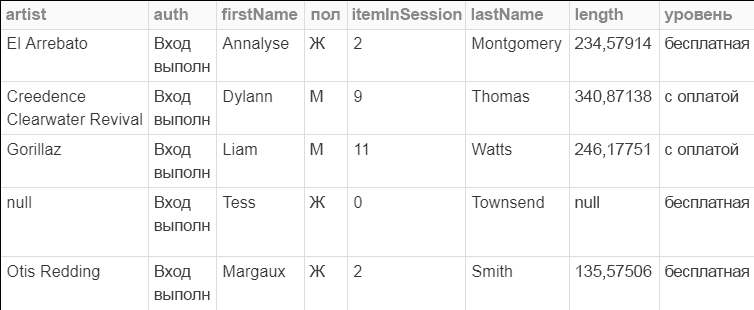

    Среди прочего пример данных демонстрирует пол аудитории радиоканала (имя столбца **gender**), а также категорию подписки (бесплатная или платная) (имя столбца **level**).

4. Теперь можно создать визуальное представление данных по каждому полу, а также по числу пользователей с бесплатными и платными учетными записями. В нижней части выходных табличных данных щелкните значок **линейчатой диаграммы**, а затем — **параметры построения**.

    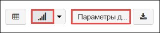

5. В разделе **настроек построения** перетащите значения, как показано на снимке экрана.

    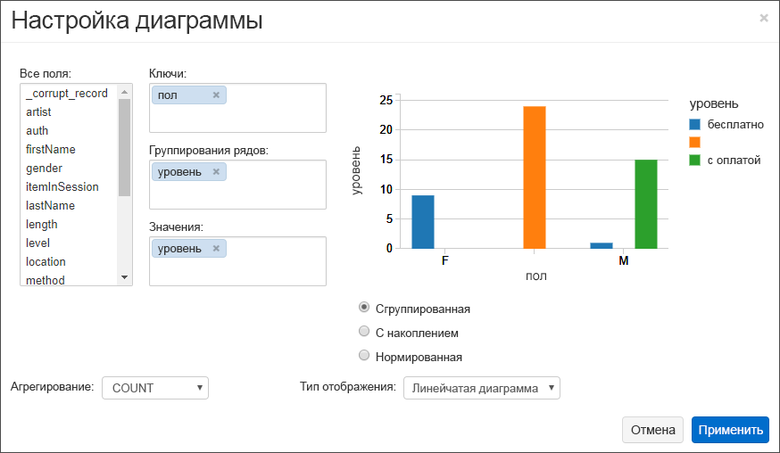

    - Для параметра **Ключи** задайте значение **gender**.
    - Для параметра **Series groupings** (Группирование ряда) задайте значение **level**.
    - Для параметра **Значения** задайте значение **level**.
    - Для параметра **Агрегирование** задайте значение **COUNT**.

6. Нажмите кнопку **Применить**.

7. Выходные данные отображают визуальное представление, как показано на следующем снимке экрана:

     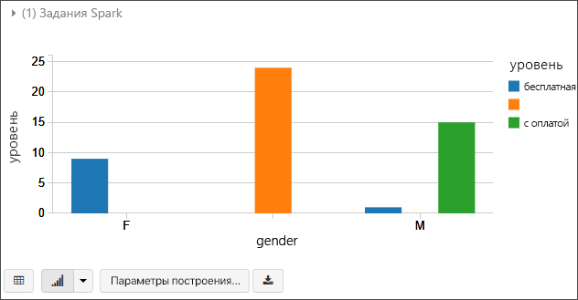

## <a name="clean-up-resources"></a>Очистка ресурсов

Изучив эту статью, вы можете завершить работу кластера. В рабочей области Azure Databricks выберите **Кластеры** и найдите кластер, работу которого необходимо завершить. Наведите указатель мыши на многоточие в столбце **Действия** и выберите значок **Завершить**.

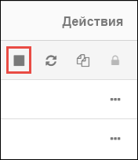

Если не завершить работу кластера вручную, она завершится автоматически, если во время создания кластера вы установили флажок **Terminate after \_\_ minutes of inactivity** (Завершать работу после __ мин бездействия). Если установить эту опцию, кластер завершит роботу после того, как не будет активен в течение заданного промежутка времени.

## <a name="next-steps"></a>Дополнительная информация

Из этой статьи вы узнали, как создать кластер Spark в Azure Databricks и запускать задание Spark с использованием данных, хранящихся в учетной записи хранения с поддержкой Data Lake Storage 2-го поколения. Вы также можете просмотреть [источники данных Spark](https://docs.azuredatabricks.net/spark/latest/data-sources/index.html), чтобы узнать, как импортировать данные из источников данных в Azure Databricks. Перейдите к следующей статье, чтобы узнать, как выполнять операции ETL (извлечения, преобразование и загрузка данных) с помощью Azure Databricks.

> [!div class="nextstepaction"]
>[Извлечение, преобразование и загрузка данных с помощью Azure Databricks](../../azure-databricks/databricks-extract-load-sql-data-warehouse.md)
