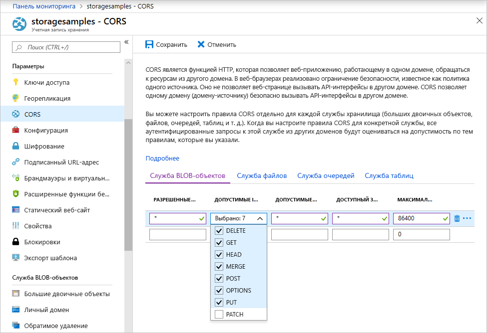

<!-- Customer intent: As a web application developer I want to interface with Azure Blob storage entirely on the client so that I can build a SPA application that is able to upload and delete files on blob storage. -->

# <a name="quickstart-manage-blobs-with-javascript-v12-sdk-in-a-browser"></a>Краткое руководство. Управление большими двоичными объектами с помощью пакета SDK для JavaScript версии 12 в браузере

Хранилище BLOB-объектов Azure оптимизировано для хранения больших объемов неструктурированных данных. Большие двоичные объекты могут содержать текстовые или двоичные данные, включая изображения, документы, потоковое мультимедиа и архивные данные. Из этого краткого руководства вы узнаете, как управлять большими двоичными объектами с использованием JavaScript в браузере. Вы научитесь отправлять большие двоичные объекты, получать список таких объектов, а также создавать и удалять контейнеры.

[Справочная документация по API](/javascript/api/@azure/storage-blob) | [Исходный код библиотеки](https://github.com/Azure/azure-sdk-for-js/tree/master/sdk/storage/storage-blob) | [Пакет (npm)](https://www.npmjs.com/package/@azure/storage-blob) | [Примеры](https://docs.microsoft.com/azure/storage/common/storage-samples-javascript?toc=%2fazure%2fstorage%2fblobs%2ftoc.json#blob-samples)

> [!NOTE]
> Чтобы приступить к работе с предыдущей версией пакета SDK, обратитесь к разделу [Краткое руководство. Управление большими двоичными объектами с помощью пакета SDK для JavaScript версии 10 в Node.js](storage-quickstart-blobs-nodejs-legacy.md).

## <a name="prerequisites"></a>Предварительные требования

* [Учетная запись Azure с активной подпиской](https://azure.microsoft.com/free/?ref=microsoft.com&utm_source=microsoft.com&utm_medium=docs&utm_campaign=visualstudio)
* [Учетная запись хранения Azure](../common/storage-account-create.md)
* [Node.js](https://nodejs.org)
* [Microsoft Visual Studio Code](https://code.visualstudio.com)
* Расширение Visual Studio Code для отладки в браузере, например одно из этих:
    * [отладчик для Microsoft Edge](vscode:extension/msjsdiag.debugger-for-edge);
    * [отладчик для Chrome](vscode:extension/msjsdiag.debugger-for-chrome);
    * [отладчик для Firefox](vscode:extension/firefox-devtools.vscode-firefox-debug).


[!INCLUDE [storage-multi-protocol-access-preview](../../../includes/storage-multi-protocol-access-preview.md)]

## <a name="object-model"></a>Объектная модель

В хранилище BLOB-объектов предлагается три типа ресурсов:

* учетная запись хранения;
* контейнер в учетной записи хранения;
* большой двоичный объект в контейнере.

На следующей схеме показана связь между этими ресурсами.


В рамках этого краткого руководства вы примените следующие классы JavaScript для взаимодействия с этими ресурсами:

* [BlobServiceClient](/javascript/api/@azure/storage-blob/blobserviceclient). Класс `BlobServiceClient` позволяет управлять ресурсами службы хранилища Azure и контейнерами больших двоичных объектов.
* [ContainerClient](/javascript/api/@azure/storage-blob/containerclient). Класс `ContainerClient` позволяет управлять контейнерами службы хранилища Azure и содержащимися в них большими двоичными объектами.
* [BlockBlobClient.](/javascript/api/@azure/storage-blob/blockblobclient) Класс `BlockBlobClient` позволяет управлять большими двоичными объектами службы хранилища Azure.

## <a name="setting-up"></a>Настройка

В этом разделе рассматривается подготовка проекта для работы с клиентской библиотекой хранилища BLOB-объектов Azure версии 12 для JavaScript.

### <a name="create-a-cors-rule"></a>Создание правила CORS

Прежде чем веб-приложение сможет получить доступ к хранилищу BLOB-объектов из клиента, следует включить в учетной записи [предоставление общего доступа к ресурсам между разными источниками](https://docs.microsoft.com/rest/api/storageservices/cross-origin-resource-sharing--cors--support-for-the-azure-storage-services) (CORS).

На портале Azure выберите учетную запись хранения. Чтобы определить новое правило CORS, перейдите к разделу **Параметры** и выберите **CORS**. В этом руководстве создается открытое правило CORS:



В следующей таблице описывается каждый параметр CORS и объясняются значения, используемые для определения правила.

|Параметр  |Значение  | Описание |
|---------|---------|---------|
| **ALLOWED ORIGINS** | **\*** | Принимает список доменов, разделенных запятыми, как допустимые источники. При установке значения `*` разрешает всем доменам получать доступ к учетной записи хранения. |
| **ALLOWED METHODS** | **DELETE**, **GET**, **HEAD**, **MERGE**, **POST**, **OPTIONS** и **PUT** | Список HTTP-команд, которые можно выполнять в учетной записи хранения. В этом руководстве установите все доступные параметры. |
| **ALLOWED HEADERS** | **\*** | Определяет список заголовков запросов (включая заголовки с префиксами), разрешенные учетной записью хранения. При установке значения `*` допустимы все заголовки. |
| **EXPOSED HEADERS** | **\*** | Список допустимых заголовков в учетной записи. При установке значения `*` позволяет учетной записи отправлять любой заголовок. |
| **MAX AGE** | **86400** | Максимальное количество времени, в течение которого обозреватель кэширует предварительный запрос OPTIONS (в секундах). Значение *86400* позволяет ему оставаться в кэше целый день. |

Заполнив поля значениями из этой таблицы, нажмите кнопку **Сохранить**.

> [!IMPORTANT]
> Убедитесь, что все параметры, которые вы используете в рабочей среде, предоставляют минимальные права доступа, необходимые для вашей учетной записи хранения, для обеспечения безопасного доступа. Описанные здесь параметры CORS подходят для краткого руководства, так как задается мягкая политика безопасности. Тем не менее эти параметры не рекомендуются для реального контекста.

### <a name="create-a-shared-access-signature"></a>Создание подписанного URL-адреса

Подписанный URL-адрес (SAS) используется в коде, который выполняется в браузере, для авторизации запросов к хранилищу BLOB-объектов. Используя SAS, клиент может авторизовать доступ к ресурсам хранилища без ключа доступа к учетной записи или строки подключения. Дополнительные сведения см. в статье [Использование подписанных URL-адресов (SAS)](../common/storage-sas-overview.md).

Выполните следующие действия, чтобы получить подписанный URL-адрес службы BLOB-объектов:

1. На портале Azure выберите учетную запись хранения.
2. Перейдите к разделу **Параметры** и выберите элемент **Подписанный URL-адрес**.
3. Прокрутите вниз и нажмите кнопку **Создать SAS и строку подключения**.
4. Прокрутите дальше вниз и найдите поле **URL-адрес SAS службы BLOB-объектов**.
5. Нажмите кнопку **Копировать в буфер обмена** в справа крайней части поля **URL-адрес SAS службы BLOB-объектов**.
6. Сохраните скопированный URL-адрес в любом расположении, откуда вы сможете извлечь его на следующем шаге.

### <a name="add-the-azure-blob-storage-client-library"></a>Добавление клиентской библиотеки хранилища BLOB-объектов Azure

На локальном компьютере создайте новую папку с именем *azure-blobs-js-browser* и откройте ее в Visual Studio Code.

Выберите элементы **Вид > Терминал**, чтобы открыть терминал Visual Studio Code. Выполните указанную ниже команду диспетчера пакетов Node.js (npm) в окне терминала, чтобы создать файл [package.json](https://docs.npmjs.com/files/package.json).

```console
npm init -y
```

Пакет SDK для Azure состоит из множества отдельных пакетов. Вы можете выбрать нужные пакеты в зависимости от служб, которые намерены использовать. Выполните указанную ниже команду `npm` в окне терминала, чтобы установить пакет `@azure/storage-blob`.

```console
npm install --save @azure/storage-blob
```

#### <a name="bundle-the-azure-blob-storage-client-library"></a>Увязка клиентской библиотеки хранилища BLOB-объектов Azure

Чтобы использовать библиотеки Azure SDK на веб-сайте, преобразуйте код для работы в браузере. Это делается с помощью специального средства увязки. При увязке код JavaScript, написанный по соглашениям [Node.js](https://nodejs.org), преобразуется в распознаваемый браузерами формат. В рамках этого краткого руководства используется средство увязки [Parcel](https://parceljs.org/).

Чтобы установить Parcel, выполните следующую команду `npm` в окне терминала:

```console
npm install -g parcel-bundler
```

В Visual Studio Code откройте файл *package.json* и добавьте `browserlist` между записями `license` и `dependencies`. В этом списке `browserlist` указаны последние версии трех самых популярных браузеров. Полный файл *package.json* будет выглядеть следующим образом:

:::code language="json" source="~/azure-storage-snippets/blobs/quickstarts/JavaScript/V12/azure-blobs-js-browser/package.json" highlight="12-16":::

Сохраните файл *package.json*.

### <a name="import-the-azure-blob-storage-client-library"></a>Импорт клиентской библиотеки хранилища BLOB-объектов Azure

Чтобы использовать библиотеки Azure SDK в JavaScript, импортируйте пакет `@azure/storage-blob`. Создайте в Visual Studio Code файл с указанным ниже кодом JavaScript.

:::code language="javascript" source="~/azure-storage-snippets/blobs/quickstarts/JavaScript/V12/azure-blobs-js-browser/index.js" id="snippet_ImportLibrary":::

Сохраните этот файл с именем *index.js* в каталоге *azure-blobs-js-browser*.

### <a name="implement-the-html-page"></a>Реализация страницы HTML

Создайте файл в Visual Studio Code и добавьте в него указанный ниже код HTML.

:::code language="html" source="~/azure-storage-snippets/blobs/quickstarts/JavaScript/V12/azure-blobs-js-browser/index.html":::

Сохраните этот файл с именем *index.html* в каталоге *azure-blobs-js-browser*.

## <a name="code-examples"></a>Примеры кода

В этих примерах кода показано, как с помощью клиентской библиотеки хранилища BLOB-объектов Azure для JavaScript выполнять следующие задачи:

* [объявление полей для элементов пользовательского интерфейса](#declare-fields-for-ui-elements);
* [добавление данных учетной записи хранения](#add-your-storage-account-info);
* [создание клиентских объектов](#create-client-objects);
* [создание и удаление контейнера хранилища](#create-and-delete-a-storage-container);
* [Перечисление больших двоичных объектов](#list-blobs)
* [отправка больших двоичных объектов](#upload-blobs);
* [удаление больших двоичных объектов](#delete-blobs).

Этот код вы выполните после добавления всех фрагментов в файл *index.js*.

### <a name="declare-fields-for-ui-elements"></a>Объявление полей для элементов пользовательского интерфейса

Добавьте приведенный ниже код в конец файла *index.js*.

:::code language="JavaScript" source="~/azure-storage-snippets/blobs/quickstarts/JavaScript/V12/azure-blobs-js-browser/index.js" id="snippet_DeclareVariables":::

Сохраните файл *index.js*.

Этот код позволяет объявить поля для каждого элемента HTML и реализовать функцию `reportStatus` для вывода данных.

В приведенных ниже разделах добавьте каждый новый блок кода JavaScript после предыдущего блока.

### <a name="add-your-storage-account-info"></a>Добавление данных учетной записи хранения

Добавьте код для доступа к учетной записи хранения. Замените заполнитель подписанным URL-адресом службы BLOB-объектов, который вы создали ранее. Добавьте приведенный ниже код в конец файла *index.js*.

:::code language="javascript" source="~/azure-storage-snippets/blobs/quickstarts/JavaScript/V12/azure-blobs-js-browser/index.js" id="snippet_StorageAcctInfo":::

Сохраните файл *index.js*.

### <a name="create-client-objects"></a>Создание клиентских объектов

Создайте объекты [BlobServiceClient](/javascript/api/@azure/storage-blob/blobserviceclient) и [ContainerClient](/javascript/api/@azure/storage-blob/containerclient) для взаимодействия со службой хранилища BLOB-объектов Azure. Добавьте приведенный ниже код в конец файла *index.js*.

:::code language="javascript" source="~/azure-storage-snippets/blobs/quickstarts/JavaScript/V12/azure-blobs-js-browser/index.js" id="snippet_CreateClientObjects":::

Сохраните файл *index.js*.

### <a name="create-and-delete-a-storage-container"></a>Создание и удаление контейнера хранилища

Создавайте и удаляйте контейнер хранилища по нажатию соответствующей кнопки на веб-странице. Добавьте приведенный ниже код в конец файла *index.js*.

:::code language="javascript" source="~/azure-storage-snippets/blobs/quickstarts/JavaScript/V12/azure-blobs-js-browser/index.js" id="snippet_CreateDeleteContainer":::

Сохраните файл *index.js*.

### <a name="list-blobs"></a>Отображение списка больших двоичных объектов

Выводите список содержимого контейнера хранилища по нажатию кнопки **List files** (Список файлов). Добавьте приведенный ниже код в конец файла *index.js*.

:::code language="javascript" source="~/azure-storage-snippets/blobs/quickstarts/JavaScript/V12/azure-blobs-js-browser/index.js" id="snippet_ListBlobs":::

Сохраните файл *index.js*.

Этот код позволяет вызвать функцию [ContainerClient.listBlobsFlat](/javascript/api/@azure/storage-blob/containerclient#listblobsflat-containerlistblobsoptions-), а затем применить итератор для получения имен всех полученных элементов [BlobItem](/javascript/api/@azure/storage-blob/blobitem). После каждого `BlobItem` список **Files** обновляется с добавлением значения свойства [Name](/javascript/api/@azure/storage-blob/blobitem#name).

### <a name="upload-blobs"></a>Отправка больших двоичных объектов

Передавайте файлы в контейнер хранилища по нажатию кнопки **Select and upload files** (Выбрать и передать файлы). Добавьте приведенный ниже код в конец файла *index.js*.

:::code language="javascript" source="~/azure-storage-snippets/blobs/quickstarts/JavaScript/V12/azure-blobs-js-browser/index.js" id="snippet_UploadBlobs":::

Сохраните файл *index.js*.

Этот код связывает кнопку **Select and upload files** (Выбрать и передать файлы) со скрытым элементом `file-input`. Событие кнопки `click` активирует событие ввода файла `click`. Также отображается средство выбора файлов. После выбора файлов и закрытия диалогового окна происходит событие `input` и вызывается функция `uploadFiles`. Эта функция позволяет создать объект [BlockBlobClient](/javascript/api/@azure/storage-blob/blockblobclient) и вызвать браузерную функцию [uploadBrowserData](/javascript/api/@azure/storage-blob/blockblobclient#uploadbrowserdata-blob---arraybuffer---arraybufferview--blockblobparalleluploadoptions-) для каждого выбранного файла. Каждый такой вызов возвращает `Promise`. Каждый `Promise` добавляется в единый список ожидания. Это позволяет передавать файлы в параллельном режиме.

### <a name="delete-blobs"></a>Удаление blob-объектов

Удаляйте файлы из контейнера хранилища по нажатию кнопки **Delete selected files** (Удалить выбранные файлы). Добавьте приведенный ниже код в конец файла *index.js*.

:::code language="javascript" source="~/azure-storage-snippets/blobs/quickstarts/JavaScript/V12/azure-blobs-js-browser/index.js" id="snippet_DeleteBlobs":::

Сохраните файл *index.js*.

Этот код позволяет вызвать функцию [ContainerClient.deleteBlob](/javascript/api/@azure/storage-blob/containerclient#deleteblob-string--blobdeleteoptions-) для удаления каждого файла, выбранного из списка. Затем он вызывает функцию `listFiles`, показанную ранее, чтобы обновить содержимое списка **Files**.

## <a name="run-the-code"></a>Выполнение кода

Чтобы выполнить код в отладчике Visual Studio Code, настройте файл *launch.json* для браузера.

### <a name="configure-the-debugger"></a>Настройка отладчика

Чтобы настроить расширение отладчика для Visual Studio Code, сделайте следующее:

1. Щелкните элементы **Выполнить > Добавить конфигурацию**.
2. Выберите **Edge**, **Chrome** или **Firefox** в зависимости от того, какое расширение вы ранее установили в разделе [предварительных требований](#prerequisites).

При добавлении конфигурации создается файл *launch.json*, который открывается в редакторе. Измените файл *launch.json*, присвоив параметру `url` значение `http://localhost:1234/index.html`, как показано ниже.

:::code language="json" source="~/azure-storage-snippets/blobs/quickstarts/JavaScript/V12/azure-blobs-js-browser/.vscode/launch.json" highlight="11":::

После обновления сохраните файл *launch.json*. Эта конфигурация указывает Visual Studio Code, какой именно браузер запускать и какой URL-адрес открывать.

### <a name="launch-the-web-server"></a>Запуск веб-сервера

Чтобы запустить локальный веб-сервер разработки, выберите элементы **Вид > Терминал**. Откроется окно консоли в Visual Studio Code. Введите в нем указанную ниже команду.

```console
parcel index.html
```

Средство Parcel увязывает код и запускает локальный сервер разработки для страницы по адресу `http://localhost:1234/index.html`. Внесенные в *index.js* изменения будут автоматически компилироваться и появляться на сервере разработки при каждом сохранении файла.

Если вы получаете сообщение о **невозможности использовать настроенный порт 1234**, измените этот порт с помощью команды `parcel -p <port#> index.html`. В файле *launch.json* укажите в URL-адресе тот же самый порт.

### <a name="start-debugging"></a>Начать отладку

Запустите страницу в отладчике и ознакомьтесь с принципами работы хранилища BLOB-объектов. При возникновении любых ошибок сообщения о них отображаются в области **Status** (Состояние) на веб-странице.

Чтобы запустить *index.html* в браузере с подключенным отладчиком Visual Studio Code, выберите элементы **Запуск > Начать отладку** или нажмите клавишу F5 в Visual Studio Code.

### <a name="use-the-web-app"></a>Использование веб-приложения

По мере выполнения следующих шагов и создания вызовов к API вы можете контролировать результаты выполнения на [портале Azure](https://portal.azure.com).

#### <a name="step-1---create-a-container"></a>Шаг 1. Создание контейнера

1. В веб-приложении выберите элемент **Создать контейнер**. Это состояние указывает, что контейнер успешно создан.
2. Чтобы проверить результат на портале Azure, выберите учетную запись хранения. В колонке **Служба BLOB-объектов** щелкните элемент **Контейнеры**. Убедитесь, что здесь появился новый контейнер (возможно, потребуется **обновить** страницу).

#### <a name="step-2---upload-a-blob-to-the-container"></a>Шаг 2. Передача большого двоичного объекта в контейнер

1. На локальном компьютере создайте и сохраните тестовый файл, например *test.txt*.
2. В веб-приложении выберите элемент **Select and upload files** (Выбрать и отправить файлы).
3. Перейдите к тестовому файлу и щелкните элемент **Open** (открыть). В строке состояния будет указано, что файл успешно отправлен. Список файлов обновится.
4. На портале Azure выберите имя контейнера, который был создан ранее. Убедитесь, что здесь появился тестовый файл.

#### <a name="step-3---delete-the-blob"></a>Шаг 3. Удаление большого двоичного объекта

1. В веб-приложении в разделе **Files** (Файлы) выберите тестовый файл.
2. Щелкните элемент **Delete selected files** (Удалить выбранные файлы). В строке состояния будет указано, что файл успешно удален и в контейнере нет файлов.
3. На портале Azure щелкните элемент **Обновить**. Убедитесь, что здесь указано значение **Большие двоичные объекты не найдены**.

#### <a name="step-4---delete-the-container"></a>Шаг 4. Удаление контейнера

1. В веб-приложении выберите элемент **Delete container** (Удалить контейнер). В строке состояния будет указано, что контейнер успешно удален.
2. На портале Azure выберите ссылку **\<имя_учетной_записи\> | Контейнеры** слева в верхней части области портала.
3. Выберите **Обновить**. Новый контейнер исчезнет.
4. Закройте веб-приложение.

### <a name="clean-up-resources"></a>Очистка ресурсов

Щелкните консоль **Терминал** в Visual Studio Code и нажмите клавиши CTRL+C, чтобы остановить веб-сервер.

Чтобы очистить ресурсы, созданные в рамках этого краткого руководства, перейдите на [портал Azure](https://portal.azure.com) и удалите группу ресурсов, созданную в разделе [предварительных требований](#prerequisites).

## <a name="next-steps"></a>Дальнейшие действия

Из этого краткого руководства вы узнали, как передавать, перечислять и удалять большие двоичные объекты с помощью JavaScript. Кроме того, вы научились создавать и удалять контейнер хранилища BLOB-объектов.

Учебники, примеры, краткие руководства и другую документацию можно найти по следующим ссылкам:

> [!div class="nextstepaction"]
> [Документация по работе с Azure для JavaScript](/azure/javascript/).

* Дополнительные сведения см в документации по [клиентской библиотеке Хранилища Blob-объектов Azure для JavaScript](https://github.com/Azure/azure-sdk-for-js/blob/master/sdk/storage/storage-blob).
* Дополнительные примеры приложений для хранилища Blob-объектов Azure версии 12 для JavaScript собраны [здесь](https://github.com/Azure/azure-sdk-for-js/tree/master/sdk/storage/storage-blob/samples).
