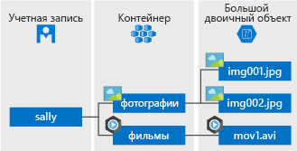

# <a name="introduction-to-azure-blob-storage"></a>Общие сведения о хранилище BLOB-объектов Azure

[!INCLUDE [storage-blob-concepts-include](../../../includes/storage-blob-concepts-include.md)]

## <a name="blob-storage-resources"></a>Ресурсы хранилища BLOB-объектов

В хранилище BLOB-объектов предлагается три типа ресурсов:

- **учетная запись хранения**; 
- **контейнер** в учетной записи хранения;
- **большой двоичный объект** в контейнере. 

На следующей схеме показана связь между этими ресурсами.



### <a name="storage-accounts"></a>учетные записи хранения;

Учетная запись хранения предоставляет для ваших данных уникальное пространство имен в Azure. У каждого объекта, который хранится в службе хранилища Azure, есть адрес, содержащий уникальное имя учетной записи. Сочетание имени учетной записи и конечной точки Azure Storage Blob формирует базовый адрес для объектов в вашей учетной записи хранения.

Например, если учетная запись хранения имеет имя *mystorageaccount*, конечной точкой по умолчанию для хранилища BLOB-объектов будет:

```
http://mystorageaccount.blob.core.windows.net 
```

Чтобы создать учетную запись хранения, см. раздел [Создайте учетную запись хранения](../common/storage-quickstart-create-account.md). Дополнительные сведения об учетных записях хранения Azure см. в [этой статье](../common/storage-account-overview.md?toc=%2fazure%2fstorage%2fblobs%2ftoc.json).

### <a name="containers"></a>Контейнеры

Контейнер упорядочивает набор больших двоичных объектов, как каталог в файловой системе. Учетная запись хранения может содержать неограниченное количество контейнеров. В каждом контейнере может храниться неограниченное количество больших двоичных объектов. 

  > [!NOTE]
  > Все знаки в имени контейнера должны быть строчными. Дополнительные сведения о контейнерах именования см. в статье [Naming and Referencing Containers, Blobs, and Metadata](https://docs.microsoft.com/rest/api/storageservices/Naming-and-Referencing-Containers--Blobs--and-Metadata) (Именование контейнеров, больших двоичных объектов и метаданных и ссылка на них).

### <a name="blobs"></a>BLOB-объекты
 
Хранилище Azure поддерживает три типа больших двоичных объектов.

* **Блочные BLOB-объекты** хранят текст и двоичные данные объемом до 4,7 ТБ. Блочные большие двоичные объекты состоят из блоков данных, которыми можно управлять отдельно.
* **Добавочные BLOB-объекты** состоят из блоков, как и блочные, но оптимизированы для операций добавления. Добавочные большие двоичные объекты идеально подходят для таких сценариев, как сбор данных журналов из виртуальных машин.
* **Страничные BLOB-объекты** используются для хранения файлов произвольного доступа объемом до 8 ТБ. Страничные BLOB-объекты хранят файлы виртуального жесткого диска в качестве дисков для виртуальных машин Azure. Дополнительные сведения о страничных BLOB-объектах см. в статье [Уникальные возможности страничных BLOB-объектов Azure](storage-blob-pageblob-overview.md).

Дополнительные сведения о различных больших двоичных объектах см. в статье [Understanding Block Blobs, Append Blobs, and Page Blobs](https://docs.microsoft.com/rest/api/storageservices/understanding-block-blobs--append-blobs--and-page-blobs) (Основные сведения о блочных, добавочных и страничных BLOB-объектах).

## <a name="move-data-to-blob-storage"></a>Перемещение данных в хранилище BLOB-объектов

Для перемещения существующих данных в хранилище BLOB-объектов существует ряд решений:

- **AzCopy** является простой в использовании программой командной строки для Windows и Linux, которая копирует данные из хранилища BLOB-объектов и в него, между контейнерами и между учетными записями хранения. Дополнительные сведения об AzCopy см. в статье [Передача данных с помощью AzCopy версии 10 (предварительная версия)](../common/storage-use-azcopy-v10.md). 
- **Библиотека перемещения данных для службы хранилища Azure** — это библиотека .NET для перемещения данных между службами хранилища Azure. Служебная программа AzCopy создана с библиотекой перемещения данных. Дополнительные сведения о библиотеке перемещения данных см. в [справочной документации](https://docs.microsoft.com/dotnet/api/microsoft.windowsazure.storage.datamovement). 
- **Фабрика данных Azure** поддерживает копирование данных в хранилище BLOB-объектов и из него с использованием ключа учетной записи, подписанного URL-адреса, субъекта-службы или управляемых удостоверений для проверки подлинности ресурсов Azure. Дополнительные сведения см. в статье [Копирование данных в хранилище BLOB-объектов Azure и обратно с помощью Фабрики данных Azure](https://docs.microsoft.com/azure/data-factory/connector-azure-blob-storage?toc=%2fazure%2fstorage%2fblobs%2ftoc.json). 
- **Blobfuse** — это виртуальный драйвер файловой системы для хранилища BLOB-объектов Azure. Blobfuse можно использовать для доступа к существующим данным блочного BLOB-объекта в учетной записи хранения через файловую систему Linux. Дополнительные сведения см. в статье [Как подключить хранилище BLOB-объектов в качестве файловой системы с использованием blobfuse](storage-how-to-mount-container-linux.md).
- **Диск Azure Data Box** — это служба для передачи локальных данных в хранилище BLOB-объектов, используемая, когда из-за больших наборов данных или ограничений сети отправка данных по сети невозможна. Можно использовать предложение [Диск Azure Data Box](../../databox/data-box-disk-overview.md), чтобы запрашивать твердотельные накопители (SSD) у корпорации Майкрософт. Вы сможете скопировать данные на эти диски и отправить их обратно в Майкрософт для загрузки данных в хранилище BLOB-объектов.
- **Служба импорта и экспорта Azure** предоставляет способ экспортировать большие объемы данных из учетной записи хранения на предоставленные вами жесткие диски, которые корпорация Майкрософт затем возвращает вам обратно. Дополнительные сведения см. в статье [Что такое служба "Импорт и экспорт Azure"?](../common/storage-import-export-service.md).

## <a name="next-steps"></a>Дополнительная информация

* [создать учетную запись хранения;](../common/storage-create-storage-account.md?toc=%2fazure%2fstorage%2fblobs%2ftoc.json)
* [Целевые показатели масштабируемости и производительности службы хранилища Azure](../common/storage-scalability-targets.md)
