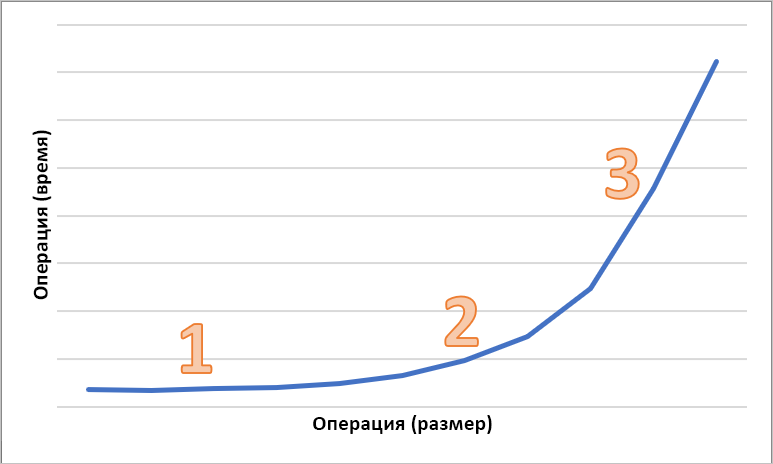

# Задержка в хранилище BLOB-объектов

Задержка, иногда называемая временем отклика, представляет собой период времени, в течение которого приложение должно ждать завершения запроса. Задержка может напрямую влиять на производительность приложения. Минимальная задержка часто важна для сценариев с участием людей, например для проведения транзакций с кредитными картами или загрузки веб-страниц. Системы, которые должны обрабатывать входящие события с высокой скоростью, такие как ведение журнала телеметрии или события Интернета вещей, также требуют минимальной задержки. В этой статье описываются сведения о задержке и ее измерении для операций с блочными BLOB-объектами, а также о том, как разработать приложения для минимальной задержки.

Служба хранилища Azure предлагает два различных варианта производительности для блочных BLOB-объектов: "Премиум" и "Стандартный". Блочные BLOB-объекты категории "Премиум" обеспечивают значительно меньшую и более последовательную задержку, чем блочные BLOB-объекты категории "Стандартный", благодаря высокопроизводительным дискам SSD. Дополнительные сведения см. в разделе **Хранилище блочных BLOB-объектов производительности уровня "Премиум"** статьи [Azure Blob storage: hot, cool, and archive access tiers](storage-blob-storage-tiers.md) (Хранилище BLOB-объектов Azure: горячий, холодный и архивный уровни доступа).

## О задержке службы хранилища Azure

Задержка службы хранилища Azure связана со скоростью запросов для операций службы хранилища Azure. Скорости запросов также известны как операции ввода-вывода в секунду (IOPS).

Чтобы рассчитать скорость запросов, сначала определите продолжительность времени, которое требуется для выполнения каждого запроса, а затем рассчитайте, сколько запросов можно обработать в секунду. Например, предположим, что для выполнения запроса требуется 50 миллисекунд (мс). Приложение, использующее один поток с одной необработанной операцией чтения или записи, должно достичь скорости 20 операций ввода-вывода в секунду (одна секунда или 1000 мс/50 мс на запрос). Теоретически, если количество потоков увеличивается до двух, тогда приложение должно иметь возможность достичь скорости 40 операций ввода-вывода в секунду. Если количество необработанных асинхронных операций чтения или записи для каждого потока увеличено до двух, приложение должно достичь скорости 80 операций ввода-вывода в секунду.

На практике скорости запросов не всегда так линейно масштабируются из-за дополнительных временных затрат в клиенте, связанных с планированием задач, переключением контекста и т. д. На стороне службы могут быть различия в задержке из-за нагрузки на систему службы хранилища Azure, различий в используемых носителях данных, помех от других рабочих нагрузок, задач обслуживания и других факторов. Наконец, сетевое соединение между клиентом и сервером может повлиять на задержку службы хранилища Azure из-за перегрузки, изменения маршрута или других сбоев.

Пропускная способность службы хранилища Azure связана со скоростью запросов и может быть рассчитана путем умножения скорости запросов (операции ввода-вывода в секунду) на размер запроса. Например, при условии 160 запросов в секунду каждые 256 КиБ данных приводят к пропускной способности 40 960 КиБ в секунду или 40 МиБ в секунду.

## Метрики задержки для блочных BLOB-объектов

Служба хранилища Azure предоставляет две метрики задержки для блочных BLOB-объектов. Эти метрики можно просмотреть на портале Azure:

- **Сквозная задержка (E2E)** измеряет интервал с момента, когда служба хранилища Azure получает первый пакет запроса, до тех пор, пока служба хранилища Azure не получит подтверждение клиента по последнему пакету ответа.

- **Задержка сервера** измеряет интервал с момента, когда служба хранилища Azure получает последний пакет запроса, до тех пор, пока первый пакет ответа не будет возвращен из службы хранилища Azure.

На следующем изображении показана **средняя успешная задержка E2E** и **средняя успешная задержка сервера** для примера рабочей нагрузки, которая вызывает операцию `Get Blob`:

В нормальных условиях между сквозной задержкой и задержкой сервера существует небольшой разрыв, который показан на изображении с примером рабочей нагрузки.

Если вы просматриваете метрики сквозной и серверной задержки и обнаруживаете, что сквозная задержка значительно выше, чем задержка сервера, то необходимо исследовать и устранить источник дополнительной задержки.

Если сквозные и серверные задержки одинаковы, но требуется более низкая задержка, рассмотрите возможность перехода на хранилище блочных BLOB-объектов уровня "Премиум".

## Факторы, влияющие на задержку

Основным фактором, влияющим на задержку, является размер операции. Для выполнения более крупных операций требуется больше времени из-за объема данных, передаваемых по сети и обрабатываемых службой хранилища Azure.

На следующей диаграмме отображено общее время для операций различных размеров. Для небольших объемов данных интервал задержки преимущественно расходуется на обработку запроса, а не на передачу данных. Интервал задержки увеличивается незначительно с увеличением размера операции (отмечено цифрой 1 на диаграмме ниже). По мере дальнейшего увеличения размера операции на передачу данных требуется больше времени, поэтому общий интервал задержки делится между обработкой запроса и передачей данных (обозначено цифрой 2 на диаграмме ниже). При больших размерах операций интервал задержки почти исключительно расходуется на передачу данных, а на обработку запросов в значительной степени расходуется незначительно (обозначено цифрой 3 на диаграмме ниже).

Факторы настройки клиента, такие как параллелизм и потоки, также влияют на задержку. Общая пропускная способность зависит от того, сколько запросов к хранилищу выполняется в любой момент времени, и от того, как используемое приложение обрабатывает потоки. Ресурсы клиента, включая ЦП, память, локальное хранилище и сетевые интерфейсы, также могут влиять на задержку.

Для обработки запросов службы хранилища Azure требуются ресурсы ЦП и памяти клиента. Если клиент испытывает нагрузку из-за недостаточной мощности виртуальной машины или какого-либо неконтролируемого процесса в системе, для обработки запросов службы хранилища Azure доступно меньше ресурсов. Любое состязание или недостаток ресурсов клиента приведет к увеличению сквозной задержки без увеличения задержки сервера, при этом увеличивая разрыв между двумя метриками.

Не менее важным является сетевой интерфейс и сетевой канал между клиентом и службой хранилища Azure. Только физическое расстояние может являться существенным фактором, например, находится ли виртуальная машина клиента в другом регионе Azure или локально. Другие факторы, такие как прыжки по сети, маршрутизация поставщика услуг Интернета и состояние Интернета, могут влиять на общую задержку хранилища.

Чтобы оценить задержку, сначала установите базовые метрики для своего сценария. Базовые метрики обеспечивают ожидаемую сквозную задержку и задержку сервера в контексте среды приложения в зависимости от профиля рабочей нагрузки, параметров конфигурации приложения, ресурсов клиента, сетевого канала и других факторов. С помощью базовых метрик можно легко определить ненормальные и нормальные условия. Базовые метрики также позволяют вам наблюдать влияние измененных параметров, таких как конфигурация приложения или размеры виртуальной машины.

## Дополнительная информация

- [Azure Storage scalability and performance targets for storage accounts](../common/storage-scalability-targets.md) (Целевые показатели масштабируемости и производительности службы хранилища Azure для учетных записей хранения)
- [Microsoft Azure Storage performance and scalability checklist](../common/storage-performance-checklist.md) (Контрольный список масштабируемости и производительности службы хранилища Azure)
