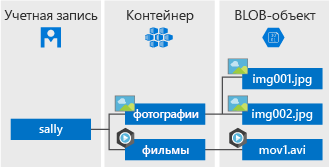

# <a name="quickstart-azure-blob-storage-client-library-for-net"></a>Краткое руководство. Клиентская библиотека хранилища BLOB-объектов Azure для .NET

Приступите к работе с клиентской библиотекой хранилища BLOB-объектов Azure для .NET. Хранилище BLOB-объектов Azure — это решение корпорации Майкрософт для хранения объектов в облаке. Чтобы установить пакет и испробовать пример кода для выполнения базовых задач, выполните приведенные здесь действия. Хранилище BLOB-объектов оптимизировано для хранения больших объемов неструктурированных данных.

Клиентскую библиотеку хранилища BLOB-объектов Azure для .NET можно использовать для выполнения таких задач:

* Создание контейнера
* установка разрешений для контейнера;
* создание большого двоичного объекта в службе хранилища Azure;
* скачивание большого двоичного объекта на локальный компьютер;
* перечисление всех больших двоичных объектов в контейнере;
* Удаление контейнера

[Справочная документация по API](https://docs.microsoft.com/dotnet/api/overview/azure/storage?view=azure-dotnet) | [исходный код библиотеки](https://github.com/Azure/azure-storage-net/tree/master/Blob) | [пакет (NuGet)](https://www.nuget.org/packages/Microsoft.Azure.Storage.Blob/) | [примеры](https://azure.microsoft.com/resources/samples/?sort=0&service=storage&platform=dotnet&term=blob)

[!INCLUDE [storage-multi-protocol-access-preview](../../../includes/storage-multi-protocol-access-preview.md)]

## <a name="required-before-you-begin"></a>Компоненты, требуемые перед началом работы

* Подписка Azure — [создайте бесплатную учетную запись](https://azure.microsoft.com/free/).
* Учетная запись хранения Azure — [создайте такую учетную запись](https://docs.microsoft.com/azure/storage/common/storage-quickstart-create-account).
* [Пакет SDK для .NET Core](https://dotnet.microsoft.com/download/dotnet-core) или более поздней версии для вашей операционной системы. Обязательно получите пакет SDK, а не среду выполнения.

## <a name="setting-up"></a>Настройка

В этом разделе рассматривается подготовка проекта для работы с клиентской библиотекой хранилища BLOB-объектов Azure для .NET.

### <a name="create-the-project"></a>Создание проекта

Сначала создайте приложение .NET Core с именем *blob-quickstart*.

1. В окне консоли (cmd, PowerShell или Bash) выполните команду `dotnet new`, чтобы создать консольное приложение с именем *blob-quickstart*. Эта команда создает простой проект Hello World на языке C# с одним файлом исходного кода: *Program.cs*.

   ```console
   dotnet new console -n blob-quickstart
   ```

2. Перейдите в только что созданную папку *blob-quickstart*, скомпилируйте приложение и убедитесь, что все прошло правильно.

   ```console
   cd blob-quickstart
   ```

   ```console
   dotnet build
   ```

Ожидаемые выходные данные сборки будут выглядеть примерно следующим образом:

```output
C:\QuickStarts\blob-quickstart> dotnet build
Microsoft (R) Build Engine version 16.0.450+ga8dc7f1d34 for .NET Core
Copyright (C) Microsoft Corporation. All rights reserved.

  Restore completed in 44.31 ms for C:\QuickStarts\blob-quickstart\blob-quickstart.csproj.
  blob-quickstart -> C:\QuickStarts\blob-quickstart\bin\Debug\netcoreapp2.1\blob-quickstart.dll

Build succeeded.
    0 Warning(s)
    0 Error(s)

Time Elapsed 00:00:03.08
```

### <a name="install-the-package"></a>Установка пакета

Оставаясь в каталоге приложения, установите клиентскую библиотеку хранилища BLOB-объектов Azure для пакета .NET с помощью команды `dotnet add package`.

```console
dotnet add package Microsoft.Azure.Storage.Blob
```

### <a name="set-up-the-app-framework"></a>Настройка платформы приложения

Из каталога проекта:

1. Откройте файл *Program.cs* в редакторе.
2. Удалите инструкцию `Console.WriteLine`.
3. Добавьте директивы `using`.
4. Создайте метод `ProcessAsync`, где будет размещаться основной код для примера.
5. Выполните асинхронный вызов метода `ProcessAsync` из `Main`.

Вот этот код:

```csharp
using System;
using System.IO;
using System.Threading.Tasks;
using Microsoft.Azure.Storage;
using Microsoft.Azure.Storage.Blob;

namespace blob_quickstart
{
    class Program
    {
        public static void Main()
        {
            Console.WriteLine("Azure Blob Storage - .NET quickstart sample\n");

            // Run the examples asynchronously, wait for the results before proceeding
            ProcessAsync().GetAwaiter().GetResult();

            Console.WriteLine("Press any key to exit the sample application.");
            Console.ReadLine();
        }

        private static async Task ProcessAsync()
        {
        }
    }
}
```

### <a name="copy-your-credentials-from-the-azure-portal"></a>Копирование учетных данных с портала Azure

Когда пример приложения выполняет запрос к службе хранилища Azure, он должен быть авторизован. Для авторизации запроса добавьте в приложение учетные данные учетной записи хранения в виде строки подключения. Чтобы просмотреть учетные данные учетной записи хранения, выполните следующие действия:

1. Перейдите на [портал Azure](https://portal.azure.com).
2. Перейдите к учетной записи хранения.
3. В разделе **Параметры** учетной записи хранения выберите параметр **Ключи доступа**. На этой странице вы увидите ключи доступа к учетной записи и полную строку подключения для каждого ключа.
4. Найдите значение для параметра **Строка подключения** в разделе **Key1** и нажмите кнопку **Скопировать**, чтобы скопировать строку подключения. На следующем этапе вы добавите значение строки подключения в переменную среды.

    

### <a name="configure-your-storage-connection-string"></a>Настройка строки подключения хранилища

После копирования строки подключения запишите ее в переменной среды на локальном компьютере, где выполняется приложение. Чтобы задать переменную среды, откройте окно консоли и следуйте инструкциям для используемой операционной системы. Замените `<yourconnectionstring>` фактической строкой подключения.

#### <a name="windows"></a>Windows

```cmd
setx CONNECT_STR "<yourconnectionstring>"
```

После добавления переменной среды в Windows вам необходимо запустить новый экземпляр командного окна.

#### <a name="linux"></a>Linux

```bash
export CONNECT_STR="<yourconnectionstring>"
```

#### <a name="macos"></a>MacOS

```bash
export CONNECT_STR="<yourconnectionstring>"
```

После добавления переменной среды перезапустите все запущенные программы, которым может понадобиться считать переменную среды. Например, перезапустите среду разработки или редактор, прежде чем продолжить.

## <a name="object-model"></a>Объектная модель

Хранилище BLOB-объектов Azure оптимизировано для хранения больших объемов неструктурированных данных. Неструктурированные данные — это данные, которые не соответствуют определенной модели данных или определению, например текстовых или двоичных данных. В хранилище BLOB-объектов предлагается три типа ресурсов:

* учетная запись хранения;
* контейнер в учетной записи хранения;
* большой двоичный объект в контейнере.

На следующей схеме показана связь между этими ресурсами.



Используйте следующие классы .NET для взаимодействия с этими ресурсами:

* [CloudStorageAccount](/dotnet/api/microsoft.azure.storage.cloudstorageaccount). Класс `CloudStorageAccount` представляет учетную запись хранения Azure. Этот класс используется для авторизации доступа к хранилищу BLOB-объектов с помощью ключей доступа к учетной записи.
* [CloudBlobClient](/dotnet/api/microsoft.azure.storage.blob.cloudblobclient). Класс `CloudBlobClient` предоставляет точку доступа к службе BLOB-объектов в коде.
* [CloudBlobContainer](/dotnet/api/microsoft.azure.storage.blob.cloudblobcontainer). Класс `CloudBlobContainer` представляет контейнер больших двоичных объектов в коде.
* [CloudBlockBlob](/dotnet/api/microsoft.azure.storage.blob.cloudblockblob). Объект `CloudBlockBlob` представляет блочный BLOB-объект в коде. Блочные большие двоичные объекты состоят из блоков данных, которыми можно управлять отдельно.

## <a name="code-examples"></a>Примеры кода

В этих примерах фрагментов кода показано, как выполнять следующие действия с помощью клиентской библиотеки хранилища BLOB-объектов Azure для .NET:

   * [аутентификация клиента](#authenticate-the-client);
   * [Создание контейнера](#create-a-container)
   * [установка разрешений для контейнера](#set-permissions-on-a-container);
   * [отправка больших двоичных объектов в контейнер](#upload-blobs-to-a-container);
   * [перечисление больших двоичных объектов в контейнере](#list-the-blobs-in-a-container);
   * [скачивание больших двоичных объектов](#download-blobs);
   * [Удаление контейнера](#delete-a-container)

### <a name="authenticate-the-client"></a>Аутентификация клиента

В приведенном ниже коде проверяется, содержит ли переменная среды строку подключения, которую можно проанализировать, чтобы создать объект [CloudStorageAccount](/dotnet/api/microsoft.azure.storage.cloudstorageaccount?view=azure-dotnet), указывающий на учетную запись хранения. Чтобы проверить, допустима ли строка подключения, используйте метод [TryParse](/dotnet/api/microsoft.azure.storage.cloudstorageaccount.tryparse?view=azure-dotnet). Если результаты выполнения метода `TryParse` успешны, он инициализирует переменную `storageAccount` и возвращает значение `true`.

Добавьте этот код в метод `ProcessAsync`.

```csharp
// Retrieve the connection string for use with the application. The storage 
// connection string is stored in an environment variable on the machine 
// running the application called CONNECT_STR. If the 
// environment variable is created after the application is launched in a 
// console or with Visual Studio, the shell or application needs to be closed
// and reloaded to take the environment variable into account.
string storageConnectionString = Environment.GetEnvironmentVariable("CONNECT_STR");

// Check whether the connection string can be parsed.
CloudStorageAccount storageAccount;
if (CloudStorageAccount.TryParse(storageConnectionString, out storageAccount))
{
    // If the connection string is valid, proceed with operations against Blob
    // storage here.
    // ADD OTHER OPERATIONS HERE
}
else
{
    // Otherwise, let the user know that they need to define the environment variable.
    Console.WriteLine(
        "A connection string has not been defined in the system environment variables. " +
        "Add an environment variable named 'CONNECT_STR' with your storage " +
        "connection string as a value.");
    Console.WriteLine("Press any key to exit the application.");
    Console.ReadLine();
}
```

> [!NOTE]
> Чтобы выполнить все остальные операции в этой статье, замените `// ADD OTHER OPERATIONS HERE` в приведенном выше коде на фрагменты кода в следующих разделах.

### <a name="create-a-container"></a>Создание контейнера

Для создания контейнера необходимо сначала создать экземпляр объекта [CloudBlobClient](/dotnet/api/microsoft.azure.storage.blob.cloudblobclient), указывающий на хранилище BLOB-объектов в учетной записи хранения. Затем создайте экземпляр объекта [CloudBlobContainer](/dotnet/api/microsoft.azure.storage.blob.cloudblobcontainer). А после этого можно создать контейнер.

В этом случае для создания контейнера код вызывает метод [CreateAsync](/dotnet/api/microsoft.azure.storage.blob.cloudblobcontainer.createasync). Чтобы сделать имя контейнера уникальным, к нему добавляется значение GUID. В рабочей среде для создания контейнера (если он не имеется) предпочтительнее использовать метод [CreateIfNotExistsAsync](/dotnet/api/microsoft.azure.storage.blob.cloudblobcontainer.createifnotexistsasync).

> [!IMPORTANT]
> Имена контейнеров должны состоять из знаков нижнего регистра. Дополнительные сведения об именовании контейнеров и больших двоичных объектов см. в статье [Naming and Referencing Containers, Blobs, and Metadata](https://docs.microsoft.com/rest/api/storageservices/naming-and-referencing-containers--blobs--and-metadata) (Именование контейнеров, больших двоичных объектов и метаданных и ссылка на них).

```csharp
// Create the CloudBlobClient that represents the 
// Blob storage endpoint for the storage account.
CloudBlobClient cloudBlobClient = storageAccount.CreateCloudBlobClient();

// Create a container called 'quickstartblobs' and 
// append a GUID value to it to make the name unique.
CloudBlobContainer cloudBlobContainer = 
    cloudBlobClient.GetContainerReference("quickstartblobs" + 
        Guid.NewGuid().ToString());
await cloudBlobContainer.CreateAsync();
```

### <a name="set-permissions-on-a-container"></a>Установка разрешений для контейнера

Задайте разрешения для контейнера таким образом, чтобы все большие двоичные объекты в контейнере были общедоступными. Если большой двоичный объект общедоступен, к нему может получить анонимный доступ любой клиент.

```csharp
// Set the permissions so the blobs are public.
BlobContainerPermissions permissions = new BlobContainerPermissions
{
    PublicAccess = BlobContainerPublicAccessType.Blob
};
await cloudBlobContainer.SetPermissionsAsync(permissions);
```

### <a name="upload-blobs-to-a-container"></a>Отправка больших двоичных объектов в контейнер

Следующий фрагмент кода получает ссылку на объект `CloudBlockBlob`, вызвав метод [GetBlockBlobReference](/dotnet/api/microsoft.azure.storage.blob.cloudblobcontainer.getblockblobreference) для созданного ранее контейнера. После этого он передает локальный файл в большой двоичный объект, вызвав метод [UploadFromFileAsync](/dotnet/api/microsoft.azure.storage.blob.cloudblockblob.uploadfromfileasync). С помощью этого метода создается большой двоичный объект, если он не был создан ранее, или же, если он имеется, происходит его замещение.

```csharp
// Create a file in your local MyDocuments folder to upload to a blob.
string localPath = Environment.GetFolderPath(Environment.SpecialFolder.MyDocuments);
string localFileName = "QuickStart_" + Guid.NewGuid().ToString() + ".txt";
string sourceFile = Path.Combine(localPath, localFileName);
// Write text to the file.
File.WriteAllText(sourceFile, "Hello, World!");

Console.WriteLine("Temp file = {0}", sourceFile);
Console.WriteLine("Uploading to Blob storage as blob '{0}'", localFileName);

// Get a reference to the blob address, then upload the file to the blob.
// Use the value of localFileName for the blob name.
CloudBlockBlob cloudBlockBlob = cloudBlobContainer.GetBlockBlobReference(localFileName);
await cloudBlockBlob.UploadFromFileAsync(sourceFile);
```

### <a name="list-the-blobs-in-a-container"></a>Перечисление BLOB-объектов в контейнере

Выведите список больших двоичных объектов в контейнере с помощью метода [ListBlobsSegmentedAsync](/dotnet/api/microsoft.azure.storage.blob.cloudblobcontainer.listblobssegmentedasync). В этом случае в контейнер был добавлен лишь один большой двоичный объект, поэтому операция перечисления возвращает только его.

Если больших двоичных объектов для возвращения в одном вызове слишком много (по умолчанию свыше 5000), метод `ListBlobsSegmentedAsync` возвращает сегмент общего результирующего набора и маркер продолжения. Чтобы извлечь следующий сегмент больших двоичных объектов, укажите маркер продолжения, возвращенный предыдущим вызовом. Продолжайте делать это до тех пор, пока значение маркера не будет равно NULL. Маркер продолжения со значением NULL указывает на то, что все большие двоичные объекты были получены. Код показывает, как использовать маркер продолжения.

```csharp
// List the blobs in the container.
Console.WriteLine("List blobs in container.");
BlobContinuationToken blobContinuationToken = null;
do
{
    var results = await cloudBlobContainer.ListBlobsSegmentedAsync(null, blobContinuationToken);
    // Get the value of the continuation token returned by the listing call.
    blobContinuationToken = results.ContinuationToken;
    foreach (IListBlobItem item in results.Results)
    {
        Console.WriteLine(item.Uri);
    }
} while (blobContinuationToken != null); // Loop while the continuation token is not null.

```

### <a name="download-blobs"></a>Скачивание больших двоичных объектов

Скачайте созданный ранее большой двоичный объект в локальную файловую систему с помощью метода [DownloadToFileAsync](/dotnet/api/microsoft.azure.storage.blob.cloudblob.downloadtofileasync). Пример кода добавляет суффикс _DOWNLOADED в имя большого двоичного объекта, чтобы можно было просмотреть оба файла в локальной файловой системе.

```csharp
// Download the blob to a local file, using the reference created earlier.
// Append the string "_DOWNLOADED" before the .txt extension so that you 
// can see both files in MyDocuments.
string destinationFile = sourceFile.Replace(".txt", "_DOWNLOADED.txt");
Console.WriteLine("Downloading blob to {0}", destinationFile);
await cloudBlockBlob.DownloadToFileAsync(destinationFile, FileMode.Create);
```

### <a name="delete-a-container"></a>Удаление контейнера

Следующий код очищает созданные приложением ресурсы, полностью удаляя контейнер с помощью метода [CloudBlobContainer.DeleteAsync](/dotnet/api/microsoft.azure.storage.blob.cloudblobcontainer.deleteasync). Кроме того, при необходимости можно удалить локальные файлы.

```csharp
Console.WriteLine("Press the 'Enter' key to delete the example files, " +
    "example container, and exit the application.");
Console.ReadLine();
// Clean up resources. This includes the container and the two temp files.
Console.WriteLine("Deleting the container");
if (cloudBlobContainer != null)
{
    await cloudBlobContainer.DeleteIfExistsAsync();
}
Console.WriteLine("Deleting the source, and downloaded files");
File.Delete(sourceFile);
File.Delete(destinationFile);
```

## <a name="run-the-code"></a>Выполнение кода

В этом приложении тестовый файл создается в локальной папке *MyDocuments*, а затем отправляется в хранилище BLOB-объектов. После этого выводится список больших двоичных объектов в контейнере, а затем файл загружается с новым именем, чтобы можно было сравнить старый и новый файлы.

Перейдите к каталогу приложения, выполните его сборку и запустите его.

```console
dotnet build
```

```console
dotnet run
```

Выходные данные в этом примере приложения будут выглядеть примерно так:

```output
Azure Blob storage - .NET Quickstart example

Created container 'quickstartblobs33c90d2a-eabd-4236-958b-5cc5949e731f'

Temp file = C:\Users\myusername\Documents\QuickStart_c5e7f24f-a7f8-4926-a9da-96
97c748f4db.txt
Uploading to Blob storage as blob 'QuickStart_c5e7f24f-a7f8-4926-a9da-9697c748f
4db.txt'

Listing blobs in container.
https://storagesamples.blob.core.windows.net/quickstartblobs33c90d2a-eabd-4236-
958b-5cc5949e731f/QuickStart_c5e7f24f-a7f8-4926-a9da-9697c748f4db.txt

Downloading blob to C:\Users\myusername\Documents\QuickStart_c5e7f24f-a7f8-4926
-a9da-9697c748f4db_DOWNLOADED.txt

Press any key to delete the example files and example container.
```

Если нажать клавишу **ВВОД**, приложение удалит контейнер хранилища и файлы. Перед удалением проверьте наличие двух файлов в папке *MyDocuments*. Вы можете открыть их и убедиться, что они идентичны. Скопируйте URL-адрес большого двоичного объекта из окна консоли и вставьте его в адресную строку браузера, чтобы просмотреть содержимое большого двоичного объекта.

После проверки файлов нажмите любую клавишу для завершения демонстрации и удаления тестовых файлов.

## <a name="next-steps"></a>Дополнительная информация

В этом кратком руководстве вы узнали, как передавать, загружать и перечислять файлы в большие двоичные объекты с помощью .NET.

Сведения о создании веб-приложения, которое передает образ в хранилище BLOB-объектов, см. в этой статье:

> [!div class="nextstepaction"]
> [Передача и обработка образа](storage-upload-process-images.md)

* Дополнительные сведения о .NET Core см. в статье [Get started with .NET in 10 minutes](https://www.microsoft.com/net/learn/get-started/) (Быстрое начало работы с .NET).
* Пример приложения, которое можно развернуть из Visual Studio для Windows, см. в записи блога [.NET Photo Gallery Web Application Sample with Azure Blob Storage](https://azure.microsoft.com/resources/samples/storage-blobs-dotnet-webapp/) (Пример веб-приложения .NET "Фотоальбом" с хранилищем BLOB-объектов Azure).
