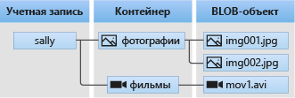

# <a name="quickstart-azure-blob-storage-client-library-v12-for-net"></a>Краткое руководство. Использование библиотеки Хранилища BLOB-объектов Azure версии 12 для .NET

Приступите к работе с клиентской библиотекой Хранилища BLOB-объектов Azure версии 12 для .NET. Хранилище BLOB-объектов Azure — это решение корпорации Майкрософт для хранения объектов в облаке. Чтобы установить пакет и испробовать пример кода для выполнения базовых задач, выполните приведенные здесь действия. Хранилище BLOB-объектов оптимизировано для хранения больших объемов неструктурированных данных.

Клиентскую библиотеку Хранилища BLOB-объектов Azure версии 12 для .NET можно использовать для выполнения таких задач:

* Создание контейнера
* передача большого двоичного объекта в хранилище Azure;
* перечисление всех больших двоичных объектов в контейнере;
* скачивание большого двоичного объекта на локальный компьютер;
* Удаление контейнера

Дополнительные ресурсы:

* [Справочная документация по API](/dotnet/api/azure.storage.blobs)
* [Исходный код библиотеки](https://github.com/Azure/azure-sdk-for-net/tree/master/sdk/storage/Azure.Storage.Blobs)
* [Пакет (NuGet)](https://www.nuget.org/packages/Azure.Storage.Blobs)
* [Примеры](../common/storage-samples-dotnet.md?toc=%2fazure%2fstorage%2fblobs%2ftoc.json#blob-samples)

[!INCLUDE [storage-multi-protocol-access-preview](../../../includes/storage-multi-protocol-access-preview.md)]

## <a name="prerequisites"></a>Предварительные требования

* Подписка Azure — [создайте бесплатную учетную запись](https://azure.microsoft.com/free/).
* Учетная запись хранения Azure — [создайте такую учетную запись](../common/storage-account-create.md).
* [Пакет SDK для .NET Core](https://dotnet.microsoft.com/download/dotnet-core) последней версии для вашей операционной системы. Обязательно получите пакет SDK, а не среду выполнения.

## <a name="setting-up"></a>Настройка

В этом разделе рассматривается подготовка проекта для работы с клиентской библиотекой Хранилища BLOB-объектов Azure версии 12 для .NET.

### <a name="create-the-project"></a>Создание проекта

Создайте приложение .NET Core с именем *BlobQuickstartV12*.

1. В окне консоли (командная строка, PowerShell или Bash) выполните команду `dotnet new`, чтобы создать консольное приложение *BlobQuickstartV12*. Эта команда создает простой проект Hello World на языке C# с одним файлом исходного кода: *Program.cs*.

   ```console
   dotnet new console -n BlobQuickstartV12
   ```

1. Переключитесь на только что созданный каталог *BlobQuickstartV12*.

   ```console
   cd BlobQuickstartV12
   ```

1. В каталоге *BlobQuickstartV12* создайте каталог *data*. Это каталог для создания и хранения файлов данных больших двоичных объектов.

    ```console
    mkdir data
    ```

### <a name="install-the-package"></a>Установка пакета

Оставаясь в каталоге приложения, установите клиентскую библиотеку хранилища BLOB-объектов Azure для пакета .NET с помощью команды `dotnet add package`.

```console
dotnet add package Azure.Storage.Blobs
```

### <a name="set-up-the-app-framework"></a>Настройка платформы приложения

Из каталога проекта:

1. Откройте файл *Program.cs* в редакторе.
1. Удалите инструкцию `Console.WriteLine("Hello World!");`.
1. Добавьте директивы `using`.
1. Обновите объявление метода `Main` для поддержки асинхронного кода.

Вот этот код:

```csharp
using Azure.Storage.Blobs;
using Azure.Storage.Blobs.Models;
using System;
using System.IO;
using System.Threading.Tasks;

namespace BlobQuickstartV12
{
    class Program
    {
        static async Task Main()
        {
        }
    }
}
```

[!INCLUDE [storage-quickstart-credentials-include](../../../includes/storage-quickstart-credentials-include.md)]

## <a name="object-model"></a>Объектная модель

Хранилище BLOB-объектов Azure оптимизировано для хранения больших объемов неструктурированных данных. Неструктурированные данные — это данные, которые не соответствуют определенной модели данных или определению, например текстовых или двоичных данных. В хранилище BLOB-объектов предлагается три типа ресурсов:

* учетная запись хранения;
* контейнер в учетной записи хранения;
* большой двоичный объект в контейнере.

На следующей схеме показана связь между этими ресурсами.



Используйте следующие классы .NET для взаимодействия с этими ресурсами:

* [BlobServiceClient](/dotnet/api/azure.storage.blobs.blobserviceclient). Класс `BlobServiceClient` позволяет управлять ресурсами службы хранилища Azure и контейнерами больших двоичных объектов.
* [BlobContainerClient](/dotnet/api/azure.storage.blobs.blobcontainerclient). Класс `BlobContainerClient` позволяет управлять контейнерами службы хранилища Azure и содержащимися в них большими двоичными объектами.
* [BlobClient](/dotnet/api/azure.storage.blobs.blobclient). Класс `BlobClient` позволяет управлять большими двоичными объектами службы хранилища Azure.
* [BlobDownloadInfo](/dotnet/api/azure.storage.blobs.models.blobdownloadinfo). Класс `BlobDownloadInfo` представляет свойства и содержимое, возвращаемое при скачивании большого двоичного объекта.

## <a name="code-examples"></a>Примеры кода

В этих примерах фрагментов кода показано, как выполнять следующие действия с помощью клиентской библиотеки Хранилища BLOB-объектов Azure для .NET:

* [Получение строки подключения](#get-the-connection-string)
* [Создание контейнера](#create-a-container)
* [отправка больших двоичных объектов в контейнер](#upload-blobs-to-a-container);
* [перечисление больших двоичных объектов в контейнере](#list-the-blobs-in-a-container);
* [скачивание больших двоичных объектов](#download-blobs);
* [Удаление контейнера](#delete-a-container)

### <a name="get-the-connection-string"></a>Получение строки подключения

Приведенный ниже код извлекает строку подключения для учетной записи хранения из переменной среды, созданной в разделе [Настройка строки подключения хранилища](#configure-your-storage-connection-string).

Добавьте этот код в метод `Main`.

```csharp
Console.WriteLine("Azure Blob Storage v12 - .NET quickstart sample\n");

// Retrieve the connection string for use with the application. The storage
// connection string is stored in an environment variable on the machine
// running the application called AZURE_STORAGE_CONNECTION_STRING. If the
// environment variable is created after the application is launched in a
// console or with Visual Studio, the shell or application needs to be closed
// and reloaded to take the environment variable into account.
string connectionString = Environment.GetEnvironmentVariable("AZURE_STORAGE_CONNECTION_STRING");
```

### <a name="create-a-container"></a>Создание контейнера

Выберите имя нового контейнера. Приведенный ниже код добавляет к имени контейнера значение GUID, чтобы сделать это имя уникальным.

> [!IMPORTANT]
> Имена контейнеров должны состоять из знаков нижнего регистра. Дополнительные сведения об именовании контейнеров и больших двоичных объектов см. в статье [Naming and Referencing Containers, Blobs, and Metadata](/rest/api/storageservices/naming-and-referencing-containers--blobs--and-metadata) (Именование контейнеров, больших двоичных объектов и метаданных и ссылка на них).

Создайте экземпляр класса [BlobServiceClient](/dotnet/api/azure.storage.blobs.blobserviceclient). Затем вызовите метод [CreateBlobContainerAsync](/dotnet/api/azure.storage.blobs.blobserviceclient.createblobcontainerasync), чтобы создать контейнер в своей учетной записи хранения.

Добавьте следующий код в конец метода `Main`.

```csharp
// Create a BlobServiceClient object which will be used to create a container client
BlobServiceClient blobServiceClient = new BlobServiceClient(connectionString);

//Create a unique name for the container
string containerName = "quickstartblobs" + Guid.NewGuid().ToString();

// Create the container and return a container client object
BlobContainerClient containerClient = await blobServiceClient.CreateBlobContainerAsync(containerName);
```

### <a name="upload-blobs-to-a-container"></a>Отправка больших двоичных объектов в контейнер

Приведенный ниже фрагмент кода:

1. Создает текстовый файл в локальном каталоге *data*.
1. Возвращает ссылку на объект [BlobClient](/dotnet/api/azure.storage.blobs.blobclient), вызывая метод [GetBlobClient](/dotnet/api/azure.storage.blobs.blobcontainerclient.getblobclient) для контейнера из раздела [Создание контейнера](#create-a-container).
1. Передает локальный текстовый файл в большой двоичный объект, вызывая метод [UploadAsync](/dotnet/api/azure.storage.blobs.blobclient.uploadasync#Azure_Storage_Blobs_BlobClient_UploadAsync_System_IO_Stream_System_Boolean_System_Threading_CancellationToken_). С помощью этого метода создается большой двоичный объект, если он не был создан ранее, или же, если он имеется, происходит его замещение.

Добавьте следующий код в конец метода `Main`.

```csharp
// Create a local file in the ./data/ directory for uploading and downloading
string localPath = "./data/";
string fileName = "quickstart" + Guid.NewGuid().ToString() + ".txt";
string localFilePath = Path.Combine(localPath, fileName);

// Write text to the file
await File.WriteAllTextAsync(localFilePath, "Hello, World!");

// Get a reference to a blob
BlobClient blobClient = containerClient.GetBlobClient(fileName);

Console.WriteLine("Uploading to Blob storage as blob:\n\t {0}\n", blobClient.Uri);

// Open the file and upload its data
using FileStream uploadFileStream = File.OpenRead(localFilePath);
await blobClient.UploadAsync(uploadFileStream, true);
uploadFileStream.Close();
```

### <a name="list-the-blobs-in-a-container"></a>Перечисление BLOB-объектов в контейнере

Выведите список больших двоичных объектов в контейнере, вызвав метод [GetBlobsAsync](/dotnet/api/azure.storage.blobs.blobcontainerclient.getblobsasync). В этом случае в контейнер был добавлен лишь один большой двоичный объект, поэтому операция перечисления возвращает только его.

Добавьте следующий код в конец метода `Main`.

```csharp
Console.WriteLine("Listing blobs...");

// List all blobs in the container
await foreach (BlobItem blobItem in containerClient.GetBlobsAsync())
{
    Console.WriteLine("\t" + blobItem.Name);
}
```

### <a name="download-blobs"></a>Скачивание больших двоичных объектов

Скачайте созданный ранее большой двоичный объект, вызвав метод [DownloadAsync](/dotnet/api/azure.storage.blobs.specialized.blobbaseclient.downloadasync). Пример кода добавляет суффикс "DOWNLOADED" к имени файла, чтобы в локальной файловой системе можно было просмотреть оба файла.

Добавьте следующий код в конец метода `Main`.

```csharp
// Download the blob to a local file
// Append the string "DOWNLOADED" before the .txt extension 
// so you can compare the files in the data directory
string downloadFilePath = localFilePath.Replace(".txt", "DOWNLOADED.txt");

Console.WriteLine("\nDownloading blob to\n\t{0}\n", downloadFilePath);

// Download the blob's contents and save it to a file
BlobDownloadInfo download = await blobClient.DownloadAsync();

using (FileStream downloadFileStream = File.OpenWrite(downloadFilePath))
{
    await download.Content.CopyToAsync(downloadFileStream);
    downloadFileStream.Close();
}
```

### <a name="delete-a-container"></a>Удаление контейнера

Следующий код очищает созданные приложением ресурсы, полностью удаляя контейнер с помощью метода [DeleteAsync](/dotnet/api/microsoft.azure.storage.blob.cloudblobcontainer.deleteasync). Он также удаляет локальные файлы, созданные приложением.

Приложение приостанавливается для ввода пользователя, вызывая `Console.ReadLine`, перед удалением большого двоичного объекта, контейнера и локальных файлов. Это хорошая возможность проверить правильность создания ресурсов перед их удалением.

Добавьте следующий код в конец метода `Main`.

```csharp
// Clean up
Console.Write("Press any key to begin clean up");
Console.ReadLine();

Console.WriteLine("Deleting blob container...");
await containerClient.DeleteAsync();

Console.WriteLine("Deleting the local source and downloaded files...");
File.Delete(localFilePath);
File.Delete(downloadFilePath);

Console.WriteLine("Done");
```

## <a name="run-the-code"></a>Выполнение кода

В этом приложении тестовый файл создается в локальной папке *data*, а затем передается в хранилище BLOB-объектов. После этого выводится список больших двоичных объектов в контейнере, а затем файл загружается с новым именем, чтобы можно было сравнить старый и новый файлы.

Перейдите к каталогу приложения, выполните его сборку и запустите его.

```console
dotnet build
```

```console
dotnet run
```

Вы должны увидеть выходные данные приложения, как показано ниже.

```output
Azure Blob Storage v12 - .NET quickstart sample

Uploading to Blob storage as blob:
         https://mystorageacct.blob.core.windows.net/quickstartblobs60c70d78-8d93-43ae-954d-8322058cfd64/quickstart2fe6c5b4-7918-46cb-96f4-8c4c5cb2fd31.txt

Listing blobs...
        quickstart2fe6c5b4-7918-46cb-96f4-8c4c5cb2fd31.txt

Downloading blob to
        ./data/quickstart2fe6c5b4-7918-46cb-96f4-8c4c5cb2fd31DOWNLOADED.txt

Press any key to begin clean up
Deleting blob container...
Deleting the local source and downloaded files...
Done
```

Прежде чем начать удаление, проверьте наличие двух файлов в папке *data*. Вы можете открыть их и убедиться, что они идентичны.

После проверки файлов нажмите клавишу **ВВОД**, чтобы завершить работу с демонстрационной версией и удалить тестовые файлы.

## <a name="next-steps"></a>Дальнейшие действия

В этом кратком руководстве вы узнали, как передавать, загружать и перечислять файлы в большие двоичные объекты с помощью .NET.

Чтобы просмотреть примеры приложений для хранилища BLOB-объектов, перейдите к следующему разделу:

> [!div class="nextstepaction"]
> [Примеры для пакета SDK Хранилища BLOB-объектов Azure версии 12 для .NET](https://github.com/Azure/azure-sdk-for-net/tree/master/sdk/storage/Azure.Storage.Blobs/samples)

* Руководства, примеры, краткие руководства и другую документацию можно найти на странице [Azure для разработчиков .NET и .NET Core](/dotnet/azure/).
* Дополнительные сведения о .NET Core см. в статье [Get started with .NET in 10 minutes](https://www.microsoft.com/net/learn/get-started/) (Быстрое начало работы с .NET).
