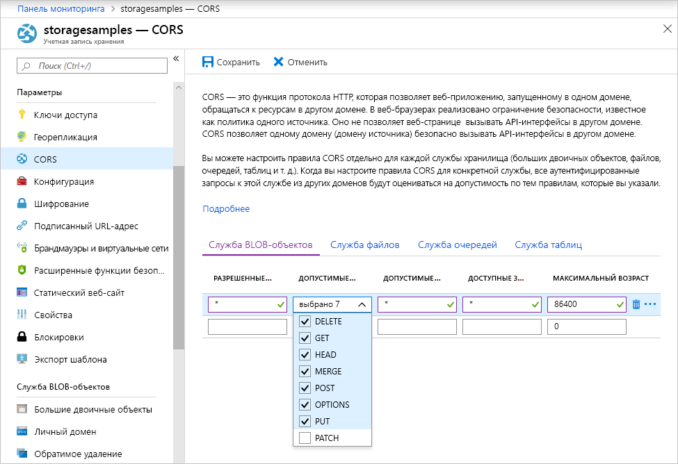

<!-- Customer intent: As a web application developer I want to interface with Azure Blob storage entirely on the client so that I can build a SPA application that is able to upload and delete files on blob storage. -->

# <a name="quickstart-upload-list-and-delete-blobs-using-azure-storage-v10-sdk-for-javascripthtml-in-the-browser"></a>Краткое руководство. Передача, вывод списка и удаление больших двоичных объектов с помощью пакета SDK версии 10 службы хранилища Azure для JavaScript и HTML в браузере

Из этого краткого руководства вы узнаете, как использовать библиотеку [пакета SDK службы хранилища Azure версии 10 для JavaScript](https://github.com/Azure/azure-sdk-for-js/tree/master/sdk/storage/storage-blob#readme) для управления большими двоичными объектами из кода JavaScript, полностью выполняемого в браузере. Этот подход позволяет реализовать требуемые меры безопасности, чтобы обеспечить безопасный доступ к вашей учетной записи хранилища больших двоичных объектов.

## <a name="prerequisites"></a>Предварительные требования

[!INCLUDE [storage-quickstart-prereq-include](../../../includes/storage-quickstart-prereq-include.md)]

Клиентские библиотеки JavaScript для службы хранилища Azure не работают непосредственно из файловой системы и должны обрабатываться с веб-сервера. В этом разделе для запуска базового сервера используется [Node.js](https://nodejs.org). Если вы предпочтете не устанавливать Node.js, то вы можете использовать любые другие средства запуска локального веб-сервера.

Чтобы выполнить действия по отладке, вам потребуется [Visual Studio Code](https://code.visualstudio.com) и либо расширение [Debugger for Chrome](vscode:extension/msjsdiag.debugger-for-chrome), либо расширение [Debugger for Microsoft Edge](vscode:extension/msjsdiag.debugger-for-edge).

## <a name="setting-up-storage-account-cors-rules"></a>Настройка учетных записей хранения CORS

Прежде чем веб-приложение сможет получить доступ к хранилищу BLOB-объектов из клиента, в своей учетной записи следует включить [предоставление общего доступа к ресурсам между разными источниками](https://docs.microsoft.com/rest/api/storageservices/cross-origin-resource-sharing--cors--support-for-the-azure-storage-services) или CORS.

Вернитесь на портал Azure и выберите вашу учетную запись хранения. Чтобы определить новое правило CORS, перейдите к разделу **Параметры** и выберите ссылку **CORS**. Далее нажмите кнопку **Добавить**, чтобы открыть окно **Добавление правила CORS**. В этом руководстве создается открытое правило CORS:



В следующей таблице описывается каждый параметр CORS и объясняются значения, используемые для определения правила.

|Параметр  |Значение  | ОПИСАНИЕ |
|---------|---------|---------|
| Разрешенные источники | * | Принимает список доменов, разделенных запятыми, как допустимые источники. При установке значения `*` разрешает всем доменам получать доступ к учетной записи хранения. |
| Допустимые команды     | DELETE, GET, HEAD, MERGE, POST, OPTIONS и PUT | Список HTTP-команд, которые можно выполнять в учетной записи хранения. В этом руководстве установите все доступные параметры. |
| Допустимые заголовки | * | Определяет список заголовков запросов (включая заголовки с префиксами), разрешенные учетной записью хранения. При установке значения `*` допустимы все заголовки. |
| Предоставляемые заголовки | * | Список допустимых заголовков в учетной записи. При установке значения `*` позволяет учетной записи отправлять любой заголовок.  |
| Максимальная длительность (в секундах) | 86400 | Максимальное количество времени, в течение которого обозреватель кэширует предварительный запрос OPTIONS. Значение *86400* позволяет ему оставаться в кэше целый день. |

> [!IMPORTANT]
> Убедитесь, что все параметры, которые вы используете в рабочей среде, предоставляют минимальные права доступа, необходимые для вашей учетной записи хранения, для обеспечения безопасного доступа. Описанные здесь параметры CORS подходят для краткого руководства, так как задается мягкая политика безопасности. Тем не менее эти параметры не рекомендуются для реального контекста.

Затем используйте оболочку облака Azure для создания маркера безопасности.

[!INCLUDE [Open the Azure cloud shell](../../../includes/cloud-shell-try-it.md)]

## <a name="create-a-shared-access-signature"></a>Создание подписанного URL-адреса

Подписанный URL-адрес (SAS) используется кодом, запущенным в браузере, для авторизации запросов к хранилищу BLOB-объектов. Используя SAS, клиент может авторизовать доступ к ресурсам хранилища без ключа доступа к учетной записи или строки подключения. Дополнительные сведения см. в статье [Использование подписанных URL-адресов (SAS)](../common/storage-dotnet-shared-access-signature-part-1.md).

Можно создать подписанный URL-адрес с помощью Azure CLI с использованием Azure Cloud Shell или с помощью портала Azure либо Обозревателя службы хранилища Azure. В таблице ниже описаны параметры, для которых необходимо указать значения, чтобы создать подписанный URL-адрес с помощью интерфейса командной строки.

| Параметр      |ОПИСАНИЕ  | Placeholder |
|----------------|-------------|-------------|
| *expiry*       | Дата окончания срока действия маркера доступа в формате ГГГГ-ММ-ДД. Введите завтрашнюю дату для использования в этом руководстве. | *FUTURE_DATE* |
| *account-name* | имя учетной записи хранения. Используйте имя из предыдущего шага. | *YOUR_STORAGE_ACCOUNT_NAME* |
| *account-key*  | Ключ учетной записи хранения. Используйте ключ из предыдущего шага. | *YOUR_STORAGE_ACCOUNT_KEY* |

Выполните приведенную ниже команду интерфейса командной строки, заменив заполнители фактическими значениями, чтобы создать подписанный URL-адрес, который можно использовать в коде JavaScript.

```azurecli-interactive
az storage account generate-sas \
  --permissions racwdl \
  --resource-types sco \
  --services b \
  --expiry FUTURE_DATE \
  --account-name YOUR_STORAGE_ACCOUNT_NAME \
  --account-key YOUR_STORAGE_ACCOUNT_KEY
```

Ряд значений после некоторых параметров могут показаться немного странными. Эти значения параметров берутся из первой буквы соответствующего разрешения. В следующей таблице поясняется, откуда берутся значения:

| Параметр        | Значение   | ОПИСАНИЕ  |
|------------------|---------|---------|
| *разрешения*    | racwdl  | Этот SAS позволяет выполнять *чтение*, *добавление*, *создание*, *запись*, *удаление* и *перечисление*. |
| *resource-types* | SCO     | SAS влияет на такие ресурсы, как *службы*, *контейнеры* и *объекты*. |
| *services*       | b       | SAS влияет на службу *BLOB-объектов*. |

Теперь, когда подписанный URL-адрес создан, скопируйте возвращаемое значение и сохраните его, чтобы использовать на последующем шаге. Если вы создали подписанный URL-адрес не с помощью Azure CLI, необходимо будет удалить начальный знак `?`, если он имеется. Этот знак является разделителем URL-адреса, который уже содержится в шаблоне URL-адреса, приведенном далее в этом разделе, где используется подписанный URL-адрес.

> [!IMPORTANT]
> В рабочей среде всегда передавайте маркеры SAS с помощью SSL. Кроме того, маркеры SAS должны создаваться на сервере и отправляться на страницу HTML, чтобы вернуться обратно в хранилище BLOB-объектов Azure. Как вариант, для создания маркеров SAS можно использовать бессерверные функции. Портал Azure содержит шаблоны функций, которые могут создавать SAS с помощью функции JavaScript.

## <a name="implement-the-html-page"></a>Реализация страницы HTML

В этом разделе вы создадите базовую веб-страницу и настроите VS Code для запуска и отладки этой страницы. Перед запуском, тем не менее, необходимо будет использовать Node.js, чтобы запустить локальный веб-сервер и обслуживать страницу, когда браузер ее запрашивает. Далее вы добавите код JavaScript для вызова различных интерфейсов API хранилища BLOB-объектов и отображения результатов на странице. Также вы сможете просмотреть результаты этих вызовов на [портале Azure](https://portal.azure.com), в [Обозревателе службы хранилища Azure](https://azure.microsoft.com/features/storage-explorer) и [расширении службы хранилища Azure](vscode:extension/ms-azuretools.vscode-azurestorage) для VS Code.

### <a name="set-up-the-web-application"></a>Настройка веб-приложения

Сначала создайте папку *azure-blobs-javascript* и откройте ее в VS Code. Затем создайте файл в VS Code, добавьте в него приведенный ниже код HTML и сохраните как *index.html* в папке *azure-blobs-javascript*.

```html
<!DOCTYPE html>
<html>

<body>
    <button id="create-container-button">Create container</button>
    <button id="delete-container-button">Delete container</button>
    <button id="select-button">Select and upload files</button>
    <input type="file" id="file-input" multiple style="display: none;" />
    <button id="list-button">List files</button>
    <button id="delete-button">Delete selected files</button>
    <p><b>Status:</b></p>
    <p id="status" style="height:160px; width: 593px; overflow: scroll;" />
    <p><b>Files:</b></p>
    <select id="file-list" multiple style="height:222px; width: 593px; overflow: scroll;" />
</body>

<!-- You'll add code here later in this quickstart. -->

</html>
```

### <a name="configure-the-debugger"></a>Настройка отладчика

Чтобы установить расширение отладчика в VS Code, выберите **Отладка > Добавить конфигурацию…** , а затем выберите **Chrome** или **Edge** в зависимости от того, какое расширение вы установили, выполняя предварительные требования. Будет создан *launch.json*, который откроется в редакторе.

Измените файл *launch.json*, чтобы значение `url` включало в себя `/index.html`, как показано ниже.

```json
{
    // Use IntelliSense to learn about possible attributes.
    // Hover to view descriptions of existing attributes.
    // For more information, visit: https://go.microsoft.com/fwlink/?linkid=830387
    "version": "0.2.0",
    "configurations": [
        {
            "type": "chrome",
            "request": "launch",
            "name": "Launch Chrome against localhost",
            "url": "http://localhost:8080/index.html",
            "webRoot": "${workspaceFolder}"
        }
    ]
}
```

Эта конфигурация указывает VS Code, какой именно браузер запускать и какой URL-адрес открывать.

### <a name="launch-the-web-server"></a>Запуск веб-сервера

Чтобы запустить локальный веб-сервер Node.js, выберите **Вид > Терминал**. Откроется окно консоли в VS Code. Введите в нем следующую команду.

```console
npx http-server
```

Эта команда установит пакет *http-server* и запустит сервер, сделав текущую папку доступной по URL-адресам по умолчанию, включая адрес, указанный на предыдущем шаге.

### <a name="start-debugging"></a>Запуск отладки

Чтобы запустить *index.html* в браузере с подключенным отладчиком VS Code, выберите **Отладка > Начать отладку** или нажмите клавишу F5 в VS Code.

Отображаемый пользовательский интерфейс пока ничего не выполняет, но вы добавите код JavaScript в следующем разделе, чтобы реализовать каждую показанную функцию. Затем можно будет установить точки останова и взаимодействовать с отладчиком, когда он приостановит выполнение вашего кода.

При внесении изменений в *index.html* не забудьте перезагрузить страницу, чтобы увидеть изменения в браузере. В VS Code можно также выбрать **Отладка > Перезапустить отладку** или нажать клавиши CTRL+SHIFT+F5.

### <a name="add-the-blob-storage-client-library"></a>Добавление клиентской библиотеки хранилища BLOB-объектов

Чтобы обеспечить вызовы API хранилища BLOB-объектов, сначала [скачайте клиентскую библиотеку пакета SDK службы хранилища Azure для JavaScript для управления большими двоичными объектами](https://aka.ms/downloadazurestoragejsblob), извлеките содержимое ZIP-файла и поместите файл *azure-storage.blob.js* в папку *azure-blobs-javascript*.

Затем вставьте приведенный ниже код HTML в *index.html* после закрывающего тега `</body>`, заменив заполняющий комментарий.

```html
<script src="azure-storage.blob.js" charset="utf-8"></script>

<script>
// You'll add code here in the following sections.
</script>
```

Этот код добавляет ссылку на файл сценария и предоставляет место для вашего кода JavaScript. В рамках этого краткого руководства мы используем файл сценария *azure-storage.blob.js*, чтобы его можно было открыть в VS Code, прочесть его содержимое и задать точки останова. В рабочей среде следует использовать более компактный файл *azure-storage.blob.min.js*, который также предоставлен в ZIP-файле.

Дополнительную информацию о каждой функции хранилища BLOB-объектов можно найти в [справочной документации](https://docs.microsoft.com/javascript/api/%40azure/storage-blob/index). Обратите внимание на то, что некоторые функции в пакете SDK доступны только в Node.js или только в браузере.

Код *azure-storage.blob.js* экспортирует глобальную переменную `azblob`, которая будет использоваться в вашем коде JavaScript для обращения к интерфейсам API хранилища BLOB-объектов.

### <a name="add-the-initial-javascript-code"></a>Добавление начального кода JavaScript

Вставьте приведенный ниже код в элемент `<script>`, показанный в предыдущем блоке кода, заменив заполняющий комментарий.

```javascript
const createContainerButton = document.getElementById("create-container-button");
const deleteContainerButton = document.getElementById("delete-container-button");
const selectButton = document.getElementById("select-button");
const fileInput = document.getElementById("file-input");
const listButton = document.getElementById("list-button");
const deleteButton = document.getElementById("delete-button");
const status = document.getElementById("status");
const fileList = document.getElementById("file-list");

const reportStatus = message => {
    status.innerHTML += `${message}<br/>`;
    status.scrollTop = status.scrollHeight;
}
```

Этот код создает поля для каждого элемента HTML, который будет использовать следующий код, и реализует функцию `reportStatus` для вывода данных.

В приведенных ниже разделах добавьте каждый новый блок кода JavaScript после предыдущего блока.

### <a name="add-your-storage-account-info"></a>Добавление данных учетной записи хранения

Добавьте код для доступа к учетной записи хранения, заменив заполнители именем своей учетной записи и подписанным URL-адресом, созданным на предыдущем шаге.

```javascript
const accountName = "<Add your storage account name>";
const sasString = "<Add the SAS you generated earlier>";
const containerName = "testcontainer";
const containerURL = new azblob.ContainerURL(
    `https://${accountName}.blob.core.windows.net/${containerName}?${sasString}`,
    azblob.StorageURL.newPipeline(new azblob.AnonymousCredential));
```

Этот код использует данные учетной записи и подписанный URL-адрес для создания экземпляра [ContainerURL](https://docs.microsoft.com/javascript/api/@azure/storage-blob/ContainerURL), который удобно использовать для создания контейнера хранилища и управления им.

### <a name="create-and-delete-a-storage-container"></a>Создание и удаление контейнера хранилища

Далее добавьте код для создания и удаления контейнера хранилища при нажатии соответствующих кнопок.

```javascript
const createContainer = async () => {
    try {
        reportStatus(`Creating container "${containerName}"...`);
        await containerURL.create(azblob.Aborter.none);
        reportStatus(`Done.`);
    } catch (error) {
        reportStatus(error.body.message);
    }
};

const deleteContainer = async () => {
    try {
        reportStatus(`Deleting container "${containerName}"...`);
        await containerURL.delete(azblob.Aborter.none);
        reportStatus(`Done.`);
    } catch (error) {
        reportStatus(error.body.message);
    }
};

createContainerButton.addEventListener("click", createContainer);
deleteContainerButton.addEventListener("click", deleteContainer);
```

Этот код вызывает функции [create](https://docs.microsoft.com/javascript/api/@azure/storage-blob/ContainerURL#create-aborter--icontainercreateoptions-) и [delete](https://docs.microsoft.com/javascript/api/@azure/storage-blob/ContainerURL#delete-aborter--icontainerdeletemethodoptions-) экземпляра ContainerURL без использования экземпляра [Aborter](https://docs.microsoft.com/javascript/api/@azure/storage-blob/aborter). Для упрощения кода в этом кратком руководстве предполагается, что ваша учетная запись хранения создана и включена. В рабочей среде следует использовать экземпляр Aborter, чтобы добавить функцию времени ожидания.

### <a name="list-blobs"></a>Отображение списка больших двоичных объектов

Добавьте код для вывода списка содержимого контейнера хранилища при нажатии кнопки **List files** (Список файлов).

```javascript
const listFiles = async () => {
    fileList.size = 0;
    fileList.innerHTML = "";
    try {
        reportStatus("Retrieving file list...");
        let marker = undefined;
        do {
            const listBlobsResponse = await containerURL.listBlobFlatSegment(
                azblob.Aborter.none, marker);
            marker = listBlobsResponse.nextMarker;
            const items = listBlobsResponse.segment.blobItems;
            for (const blob of items) {
                fileList.size += 1;
                fileList.innerHTML += `<option>${blob.name}</option>`;
            }
        } while (marker);
        if (fileList.size > 0) {
            reportStatus("Done.");
        } else {
            reportStatus("The container does not contain any files.");
        }
    } catch (error) {
        reportStatus(error.body.message);
    }
};

listButton.addEventListener("click", listFiles);
```

Этот код вызывает функцию [ContainerURL.listBlobFlatSegment](https://docs.microsoft.com/javascript/api/@azure/storage-blob/ContainerURL#listblobflatsegment-aborter--string--icontainerlistblobssegmentoptions-) в цикле, чтобы гарантировать получение всех сегментов. Для каждого сегмента код циклически проходит по списку содержащихся в этом сегменте элементов больших двоичных объектов и обновляет список **Files**.

### <a name="upload-blobs"></a>Отправка больших двоичных объектов

Далее добавьте код для передачи файлов в контейнер хранилища при нажатии кнопки **Select and upload files** (Выбрать и передать файлы).

```javascript
const uploadFiles = async () => {
    try {
        reportStatus("Uploading files...");
        const promises = [];
        for (const file of fileInput.files) {
            const blockBlobURL = azblob.BlockBlobURL.fromContainerURL(containerURL, file.name);
            promises.push(azblob.uploadBrowserDataToBlockBlob(
                azblob.Aborter.none, file, blockBlobURL));
        }
        await Promise.all(promises);
        reportStatus("Done.");
        listFiles();
    } catch (error) {
        reportStatus(error.body.message);
    }
}

selectButton.addEventListener("click", () => fileInput.click());
fileInput.addEventListener("change", uploadFiles);
```

Этот код связывает кнопку **Select and upload files** (Выбрать и передать файлы) со скрытым элементом `file-input`. Таким образом событие кнопки `click` активирует событие ввода файла `click` и отображает средство выбора файлов. После выбора файлов и закрытия диалогового окна происходит событие `input` и вызывается функция `uploadFiles`. Эта функция вызывает браузерную функцию [uploadBrowserDataToBlockBlob](https://docs.microsoft.com/javascript/api/@azure/storage-blob/#uploadbrowserdatatoblockblob-aborter--blob---arraybuffer---arraybufferview--blockbloburl--iuploadtoblockbloboptions-) для каждого файла, который вы выбрали. Каждый вызов возвращает обещание, которое добавляется в список, чтобы они могли ожидать передачи вместе, что позволяет передавать файлы в параллельном режиме.

### <a name="delete-blobs"></a>Удаление blob-объектов

Далее добавьте код для удаления файлов из контейнера хранилища при нажатии кнопки **Delete selected files** (Удалить выбранные файлы).

```javascript
const deleteFiles = async () => {
    try {
        if (fileList.selectedOptions.length > 0) {
            reportStatus("Deleting files...");
            for (const option of fileList.selectedOptions) {
                const blobURL = azblob.BlobURL.fromContainerURL(containerURL, option.text);
                await blobURL.delete(azblob.Aborter.none);
            }
            reportStatus("Done.");
            listFiles();
        } else {
            reportStatus("No files selected.");
        }
    } catch (error) {
        reportStatus(error.body.message);
    }
};

deleteButton.addEventListener("click", deleteFiles);
```

Этот код вызывает функцию [BlobURL.delete](https://docs.microsoft.com/javascript/api/@azure/storage-blob/BlobURL#delete-aborter--iblobdeleteoptions-) для удаления каждого файла, выбранного из списка. Затем он вызывает функцию `listFiles`, показанную ранее, чтобы обновить содержимое списка **Files**.

### <a name="run-and-test-the-web-application"></a>Запуск и тестирование веб-приложения

На этом этапе можно запустить страницу и провести эксперимент, чтобы понять, как работает хранилище BLOB-объектов. Если возникли ошибки (например, при попытке вывести список файлов прежде, чем вы создали контейнер), в области **Состояние** отобразится полученное сообщение об ошибке. Можно также установить точки останова в коде JavaScript, чтобы проверить значения, возвращаемые интерфейсами API хранилища.

## <a name="clean-up-resources"></a>Очистка ресурсов

Чтобы очистить ресурсы, созданные в этом кратком руководстве, перейдите на [портал Azure](https://portal.azure.com) и удалите группу ресурсов, созданную при выполнении предварительных требований.

## <a name="next-steps"></a>Дополнительная информация

В этом кратком руководстве вы создали простой веб-сайт, который обращается к хранилищу BLOB-объектов из кода JavaScript в браузере. Чтобы узнать, как разместить сам веб-сайт в хранилище BLOB-объектов, перейдите к следующему руководству:

> [!div class="nextstepaction"]
> [Руководство. Размещение статического веб-сайта в хранилище BLOB-объектов](https://docs.microsoft.com/azure/storage/blobs/storage-blob-static-website-host)
