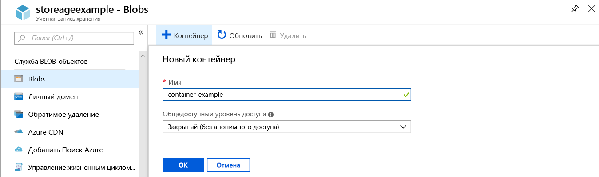
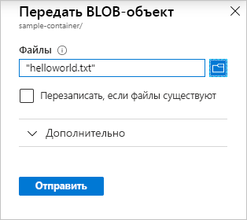

# Краткое руководство. Передача, скачивание и составление списка больших двоичных объектов с помощью портала Azure

В этом кратком руководстве вы узнаете, как использовать [портал Azure](https://portal.azure.com/), чтобы создать контейнер в службе хранилища Azure, а также отправлять и загружать блочные BLOB-объекты в этот контейнер.

## Предварительные требования

[!INCLUDE [storage-quickstart-prereq-include](../../../includes/storage-quickstart-prereq-include.md)]

## Создание контейнера

Чтобы создать контейнер на портале Azure, сделайте следующее:

1. Войдите в новую учетную запись хранения на портале Azure.
2. В меню слева для учетной записи хранения перейдите к разделу **Служба BLOB-объектов**, а затем выберите **Большие двоичные объекты**.
3. Нажмите кнопку **+ Контейнер**.
4. Введите имя для нового контейнера. Все знаки в имени контейнера должны быть строчными. Оно должно начинаться с буквы или цифры и может содержать только буквы, цифры и дефисы (-). Дополнительные сведения об именовании контейнеров и больших двоичных объектов см. в статье [Naming and Referencing Containers, Blobs, and Metadata](https://docs.microsoft.com/rest/api/storageservices/naming-and-referencing-containers--blobs--and-metadata) (Именование контейнеров, больших двоичных объектов и метаданных и ссылка на них).
5. Задайте для контейнера уровень общего доступа. Уровень по умолчанию — **Private (no anonymous access)** (Частный (не разрешать анонимный доступ)).
6. Нажмите кнопку **ОК**, чтобы создать контейнер.

    

## Передача блочного BLOB-объекта

Блочные BLOB-объекты состоят из блоков данных, создающих большой двоичный объект. В большинстве сценариев, использующих хранилище BLOB-объектов, применяются блочные BLOB-объекты. Блочные BLOB-объекты идеально подходят для хранения текстовых и двоичных данных в облаке (например, файлы, образы и видео). В этом кратком руководстве показано, как работать с блочными BLOB-объектами. 

Чтобы передать блочный BLOB-объект в новый контейнер на портале Azure, сделайте следующее:

1. На портале Azure перейдите к контейнеру, созданному в предыдущем разделе.
2. Выберите контейнер, чтобы просмотреть список больших двоичных объектов, содержащихся в нем. Так как это новый контейнер, он пока не содержит больших двоичных объектов.
3. Нажмите кнопку **Upload** (Отправить), чтобы передать большой двоичный объект в контейнер.
4. Просмотрите локальную файловую систему, чтобы найти файл, который нужно отправить в виде большого двоичного объекта, и щелкните **Upload** (Отправить).
     
    

5. Выберите значение параметра **Тип проверки подлинности**. По умолчанию используется **SAS**.
6. Таким способом можно отправить необходимое количество больших двоичных объектов. Вы увидите, что новые большие двоичные объекты содержатся в контейнере.

## Скачивание блочного BLOB-объекта

Вы можете скачать блочный BLOB-объект, чтобы просмотреть его в браузере или сохранить в локальной файловой системе. Чтобы скачать блочный BLOB-объект, сделайте следующее:

1. Перейдите к списку больших двоичных объектов, отправленному в предыдущем разделе. 
2. Щелкните правой кнопкой мыши большой двоичный объект, который нужно загрузить, и выберите **Download** (Загрузить). 

## Очистка ресурсов

Чтобы удалить ресурсы, созданные при работе с этим кратким руководством, удалите контейнер. Все большие двоичные объекты в контейнере будут также удалены.

Чтобы удалить контейнер, сделайте следующее:

1. На портале Azure перейдите к списку контейнеров в учетной записи хранения.
2. Выберите контейнер, который нужно удалить.
3. Нажмите кнопку **Дополнительно** (**...**) и выберите **Удалить**.
4. Подтвердите, что вы действительно хотите удалить контейнер.

## Дополнительная информация

В этом кратком руководстве вы узнали, как передавать файлы между локальным диском и хранилищем BLOB-объектов Azure с помощью портала Azure. Дополнительные сведения о работе с хранилищем BLOB-объектов см. в соответствующем практическом руководстве.

> [!div class="nextstepaction"]
> [Практическое руководство по операциям в хранилище BLOB-объектов](storage-dotnet-how-to-use-blobs.md)

