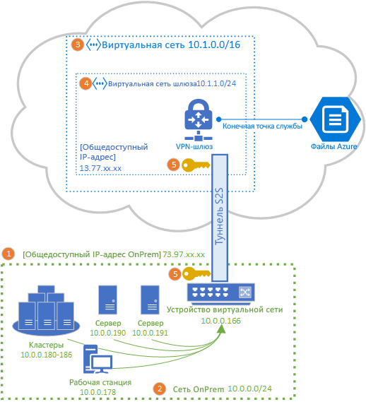
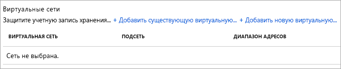
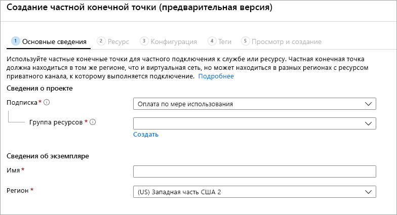

# Настройка VPN-подключения "сеть — сеть" для использования с Файлами Azure
Вы можете использовать VPN-подключение "сеть — сеть" (S2S) для подключения файловых ресурсов Azure по протоколу SMB в локальной сети, не открывая порт 445. VPN-подключение "сеть — сеть" можно настроить с помощью [VPN-шлюза Azure](../../vpn-gateway/vpn-gateway-about-vpngateways.md), который является ресурсом Azure, предлагающим службы VPN, и развертывается в группе ресурсов вместе с учетными записями хранения или другими ресурсами Azure.

Мы настоятельно рекомендуем ознакомиться с [общими сведениями о службе "Файлы Azure"](storage-files-networking-overview.md) перед продолжением работы с этой статьей, чтобы подробно ознакомиться с возможностями сети, доступными для службы "Файлы Azure".

В статье подробно описано, как настроить VPN-подключение "сеть — сеть" для подключения общих файловых ресурсов Azure локально. Если вы хотите направить трафик синхронизации для Синхронизации файлов Azure через VPN-подключение "сеть — сеть", см. статью [Azure File Sync proxy and firewall settings](storage-sync-files-firewall-and-proxy.md) (Параметры брандмауэра и прокси-сервера службы "Синхронизация файлов Azure").

## Предварительные требования
- Общая папка Azure, которую вы хотите подключить локально. Вы можете использовать общую папку Azure уровня [Стандартный](storage-how-to-create-file-share.md) или [Премиум](storage-how-to-create-premium-fileshare.md) с VPN-подключением "сеть — сеть".

- Сетевое устройство или сервер в локальном центре обработки данных, совместимый с VPN-шлюзом Azure. Служба "Файлы Azure" не зависит от выбранного локального сетевого устройства, но VPN-шлюз Azure поддерживает [список протестированных устройств](../../vpn-gateway/vpn-gateway-about-vpn-devices.md). Различные сетевые устройства предлагают различные функции, характеристики производительности и возможности управления, поэтому их следует учитывать при выборе сетевого устройства.

    Если у вас нет сетевого устройства, Windows Server содержит встроенную роль сервера (маршрутизация и удаленный доступ (RRAS)), которую можно использовать в качестве локального сетевого устройства. Дополнительные сведения о настройке маршрутизации и удаленного доступа в Windows Server см. в статье [RAS Gateway](https://docs.microsoft.com/windows-server/remote/remote-access/ras-gateway/ras-gateway) (Шлюз RAS-сервера).

## Добавление учетной записи хранения в виртуальную сеть
На портале Azure перейдите к учетной записи хранения, содержащей общую папку Azure, которую вы хотите подключить локально. В содержании учетной записи хранения выберите запись **Брандмауэры и виртуальные сети**. Если виртуальная сеть не была добавлена в учетную запись хранения при ее создании, в результирующей области должен быть установлен переключатель **Разрешить доступ из** для параметра **Все сети**.

Чтобы добавить учетную запись хранения в нужную виртуальную сеть, щелкните **Выбранные сети**. В подзаголовке **Виртуальные сети** щелкните либо **+ Add existing virtual network** (+ Добавить существующую виртуальную сеть), либо **+Add new virtual network** (+ Добавить новую виртуальную сеть) в зависимости от требуемого состояния. Создание виртуальной сети приведет к созданию ресурса Azure. Новый или имеющийся ресурс виртуальной сети не обязательно должен находиться в той же группе ресурсов или подписке, что и учетная запись хранения, однако он должен находиться в том же регионе, что и учетная запись хранения, а группа ресурсов и подписка, в которые развертывается виртуальная сеть, должны соответствовать той, в которую будет развертываться ваш VPN-шлюз. 

Если вы добавляете имеющуюся виртуальную сеть, вам будет предложено выбрать одну или несколько подсетей виртуальной сети, в которую должна быть добавлена учетная запись хранения. Если вы выбираете новую виртуальную сеть, создайте подсеть в процессе создания виртуальной сети, и позже вы сможете добавить дополнительные ресурсы Azure для виртуальной сети.

Если вы ранее не добавили учетную запись хранения в подписку, необходимо добавить конечную точку службы Microsoft.Storage в виртуальную сеть. Это может занять некоторое время, и пока эта операция не завершится, вы не сможете получить доступ к общим файлам Azure в этой учетной записи хранения, в том числе через VPN-подключение. 

## Развертывание VPN-шлюза Azure
В содержании портала Azure щелкните **Создать ресурс** и найдите *шлюз виртуальной сети*. Шлюз виртуальной сети должен располагаться в той же подписке, том же регионе Azure и той же группе ресурсов, что и виртуальная сеть, развернутая на предыдущем шаге (обратите внимание, что группа ресурсов выбирается автоматически при выборе виртуальной сети). 

В рамках развертывания VPN-шлюза Azure необходимо заполнить следующие поля:

- **Имя.** Имя ресурса Azure для VPN-шлюза. Этим именем может быть любое имя, которое можно использовать для управления.
- **Регион**. Регион, в котором будет развернут VPN-шлюз.
- **Тип шлюза.** В рамках развертывания VPN "сеть — сеть" необходимо выбрать **VPN**.
- **Тип VPN.** В зависимости от VPN-устройства можно выбрать вариант *На основе маршрута** либо **На основе политики**. Виртуальные частные сети на основе маршрутов поддерживают IKEv2, тогда как виртуальные частные сети на основе политик поддерживают только IKEv1. Дополнительные сведения о двух типах VPN-шлюзов см. в разделе [VPN-шлюзы на основе политики и маршрутов](../../vpn-gateway/vpn-gateway-connect-multiple-policybased-rm-ps.md#about).
- **SKU.** Номер SKU определяет количество разрешенных туннелей "сеть — сеть" и требуемую производительность VPN. Чтобы выбрать соответствующий номер SKU для своего варианта использования, просмотрите список [номеров SKU шлюза](../../vpn-gateway/vpn-gateway-about-vpngateways.md#gwsku). При необходимости номер SKU VPN-шлюза можно изменить позже.
- **Виртуальная сеть.** Виртуальная сеть, созданная на предыдущем шаге.
- **Общедоступный IP-адрес**. IP-адрес VPN-шлюза, который будет доступен из Интернета. Скорее всего, потребуется создать IP-адрес, но при необходимости можно также использовать имеющийся неиспользуемый IP-адрес. Если щелкнуть раздел **Создать**, в той же группе ресурсов, что и VPN-шлюз, будет создан ресурс Azure с IP-адресом, а **общедоступный IP-адрес** будет именем только что созданного IP-адреса. Если выбрать **Использовать существующие**, необходимо выбрать имеющийся неиспользуемый IP-адрес.
- **Включить режим "активный — активный"** . Параметр **Включено** следует использовать, только если вы настраиваете конфигурацию шлюза в режиме "активный — активный". В противном случае следует выбрать параметр **Отключено**. Дополнительные сведения о режиме "активный — активный" см. в статье [Highly available cross-premises and VNet-to-VNet connectivity](../../vpn-gateway/vpn-gateway-highlyavailable.md) (Настройка высокодоступных подключений: распределенных и между виртуальными сетями).
- **Настроить ASN BGP**. Параметр **Включено** следует использовать, только если конфигурация требует этого параметра. Дополнительные сведения об этом параметре см. в статье [About BGP with Azure VPN Gateway](../../vpn-gateway/vpn-gateway-bgp-overview.md) (Использования BGP с VPN-шлюзами Azure).

Щелкните **Просмотр и создание** для создания VPN-шлюза. Полное создание и развертывание VPN-шлюза может занять до 45 минут.

### Создание шлюза локальной сети для локального шлюза 
Шлюз локальной сети — это ресурс Azure, который представляет локальное сетевое устройство. В содержании портала Azure щелкните **Создать ресурс** и найдите *шлюз локальной сети*. Шлюз локальной сети — это ресурс Azure, который будет развернут вместе с учетной записью хранения, виртуальной сетью и VPN-шлюзом, но не обязательно должен находиться в той же группе ресурсов или подписке, что и учетная запись хранения. 

В рамках развертывания ресурса шлюза локальной сети необходимо заполнить следующие поля:

- **Имя.** Имя ресурса Azure для шлюза локальной сети. Этим именем может быть любое имя, которое можно использовать для управления.
- **IP-адрес**. Общедоступный IP-адрес локального шлюза.
- **Диапазон адресов**: Это диапазон адресов для сети, которую представляет этот шлюз локальной сети. Можно добавить несколько диапазонов адресного пространства, но убедитесь, что указанные диапазоны не перекрывают диапазоны других сетей, к которым необходимо подключиться. 
- **Настроить параметры BGP**. Настройте параметры BGP, только если это требуется для конфигурации. Дополнительные сведения об этом параметре см. в статье [About BGP with Azure VPN Gateway](../../vpn-gateway/vpn-gateway-bgp-overview.md) (Использования BGP с VPN-шлюзами Azure).
- **Подписка**: Нужная подписка. Это не обязательно должна быть подписка, используемая для VPN-шлюза или учетной записи хранения.
- **Группа ресурсов.** Требуемая группа ресурсов. Это не обязательно должна быть группа ресурсов, используемая для VPN-шлюза или учетной записи хранения.
- **Расположение.** Регион Azure, в котором следует создать ресурс шлюза локальной сети. Он должен соответствовать региону, выбранному для VPN-шлюза и учетной записи хранения.

Нажмите кнопку **Создать**, чтобы создать ресурс шлюза локальной сети.  

## Настройка локального сетевого устройства
Конкретные действия по настройке локального сетевого устройства зависят от сетевого устройства, выбранного в организации. В зависимости от устройства, выбранного в организации, в [списке протестированных устройств](../../vpn-gateway/vpn-gateway-about-vpn-devices.md) может быть ссылка на инструкции поставщика устройства по настройке с помощью VPN-шлюза Azure.

## Создание частной конечной точки (предварительная версия)
При создании частной конечной точки для учетной записи хранения она получает IP-адрес в пространстве IP-адресов виртуальной сети. При подключении общей папки Azure из локальной среды с помощью этого частного IP-адреса правила маршрутизации, автоматически определяемые установкой VPN, будут маршрутизировать запрос на подключение к учетной записи хранения через VPN. 

В колонке учетной записи хранения щелкните **Подключения к частной конечной точке** в оглавлении слева и выберите **+ Private endpoint** (+ Частная конечная точка), чтобы создать частную конечную точку. В результате выполнения мастера нужно будет заполнить несколько страниц:

На вкладке **Основные сведения** выберите нужную группу ресурсов, имя и регион для частной конечной точки. Они могут быть любыми, но не должны совпадать с учетной записью хранения. Тем не менее необходимо создать частную конечную точку в том же регионе, что и виртуальная сеть, в которой вы хотите создать частную конечную точку.

На вкладке **Ресурс** выберите переключатель **Connect to an Azure resource in my directory** (Подключение к ресурсу Azure в моем каталоге). В разделе **Тип ресурса** выберите **Microsoft.Storage/storageAccounts** в качестве типа. Поле **Ресурсы** — это учетная запись хранения с общей папкой Azure, к которой требуется подключиться. Целевой подресурс — это **файл**, так как это требуется для Файлов Azure.

Вкладка **Конфигурация** позволяет выбрать определенную виртуальную сеть и подсеть, в которую вы хотите добавить частную конечную точку. Выберите созданную ранее виртуальную сеть. В подсети, в которую вы добавили конечную точку службы, необходимо выбрать отдельную подсеть.

Вкладка **Конфигурация** также позволяет настроить частную зону DNS. Это не обязательно, но позволяет использовать понятный UNC-путь (например, `\\mystorageaccount.privatelink.file.core.windows.net\myshare`) вместо UNC-пути, который используется для подключения файлового ресурса Azure. Это также можно сделать с помощью собственных DNS-серверов в виртуальной сети.

Щелкните **Просмотр и создание**, чтобы создать частную конечную точку. После создания частной конечной точки вы увидите два новых ресурса: ресурс частной конечной точки и сопряженный виртуальный сетевой интерфейс. Ресурс интерфейса виртуальной сети будет иметь выделенный частный IP-адрес учетной записи хранения. 

## Создание подключения "сеть — сеть"
Чтобы завершить развертывание VPN-подключения "сеть — сеть", необходимо создать подключение между локальным сетевым устройством (представленным ресурсом локального сетевого шлюза) и VPN-шлюзом. Для этого перейдите к VPN-шлюзу, созданному ранее. В оглавлении VPN-шлюза щелкните **Подключения** и нажмите кнопку **Добавить**. В открывшейся панели **Добавление подключения** введите следующие поля.

- **Имя.** Имя подключения. VPN-шлюз может содержать несколько подключений, поэтому выберите имя, которое будет полезно для управления, чтобы отличать это конкретное подключение.
- **Тип подключения**. Так как это подключение "сеть — сеть", выберите в раскрывающемся списке **Сеть — сеть (IPsec)** .
- **Шлюз виртуальной сети.** Это поле выбрано для VPN-шлюза, с которым устанавливается подключение, и не может быть изменено.
- **Локальный сетевой шлюз**. Это шлюз локальной сети, который требуется подключить к VPN-шлюзу. В результате область выбора должна иметь имя локального сетевого шлюза, созданного ранее.
- **Общий ключ (PSK)** . Сочетание букв и цифр, которое используется для шифрования подключения. В шлюзах локальной и виртуальной сети следует использовать один общий ключ. Если устройство шлюза не предоставляет его, вы можете создать и предоставить его для своего устройства здесь.

Нажмите кнопку **ОК**, чтобы создать подключение. Убедиться, что подключение успешно установлено, можно на странице **Подключения**.

## Подключение файлового ресурса Azure 
Заключительным шагом в настройке VPN "сеть — сеть" будет проверка работы подключения для Файлов Azure. Это можно сделать, подключив файловый ресурс Azure в локальной среде с вашей предпочитаемой ОС. Ниже приведены инструкции по подключению к различным ОС:

- [Windows](storage-how-to-use-files-windows.md)
- [macOS](storage-how-to-use-files-mac.md)
- [Linux](storage-how-to-use-files-linux.md)

## См. также
- [Рекомендации по работе с сетями службы "Файлы Azure"](storage-files-networking-overview.md)
- [Настройка VPN-подключения "точка — сеть" (P2S) в Linux для использования с Файлами Azure](storage-files-configure-p2s-vpn-windows.md)
- [Настройка VPN-подключения "точка — сеть" (P2S) в Linux для использования с Файлами Azure](storage-files-configure-p2s-vpn-linux.md)