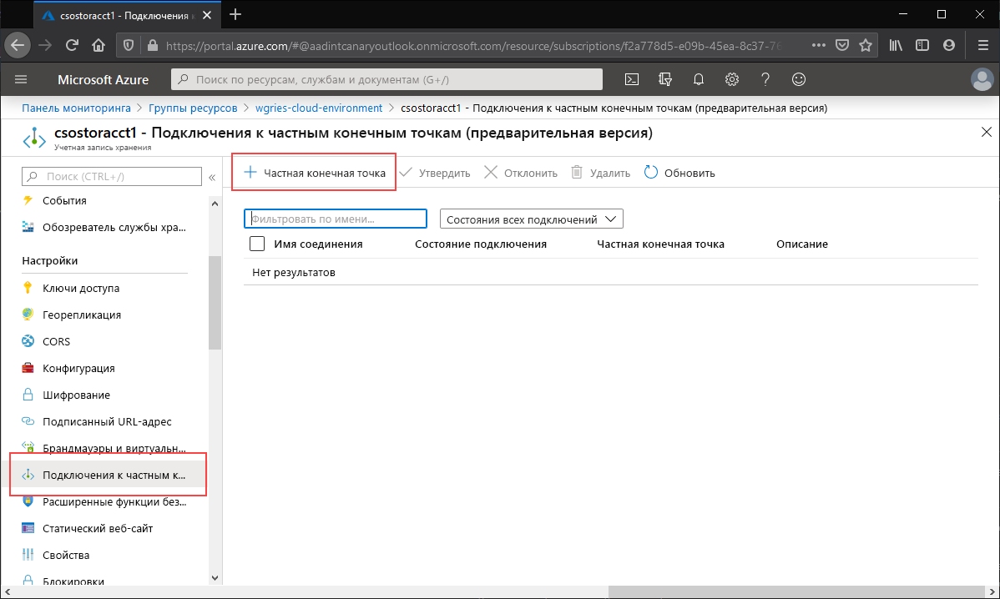
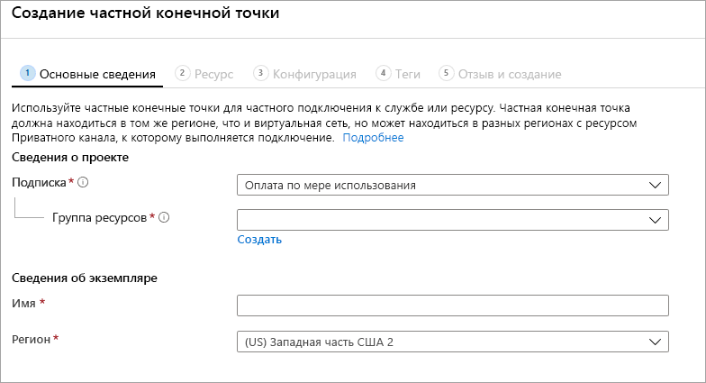
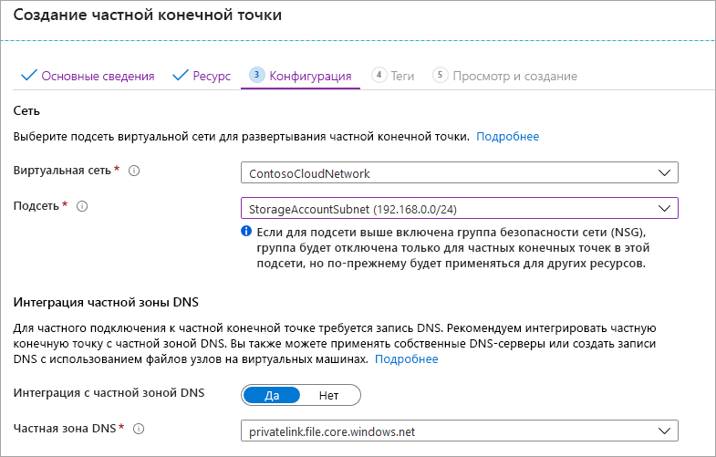
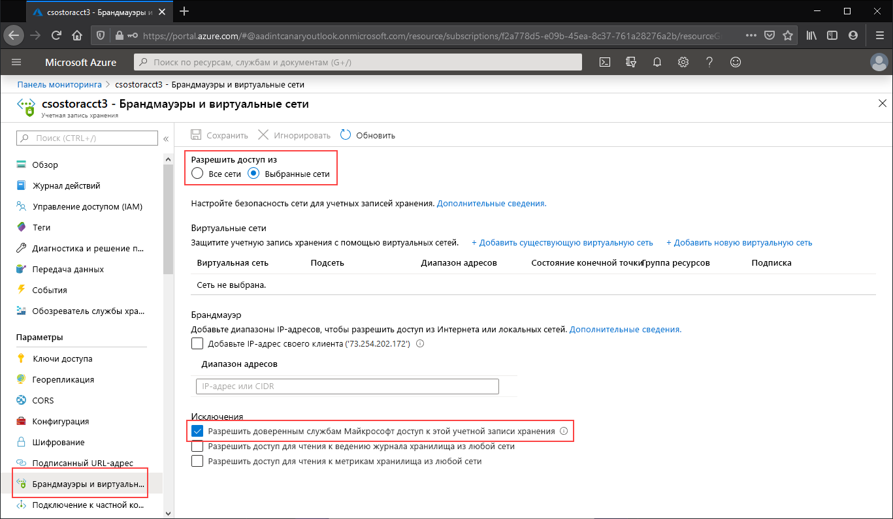
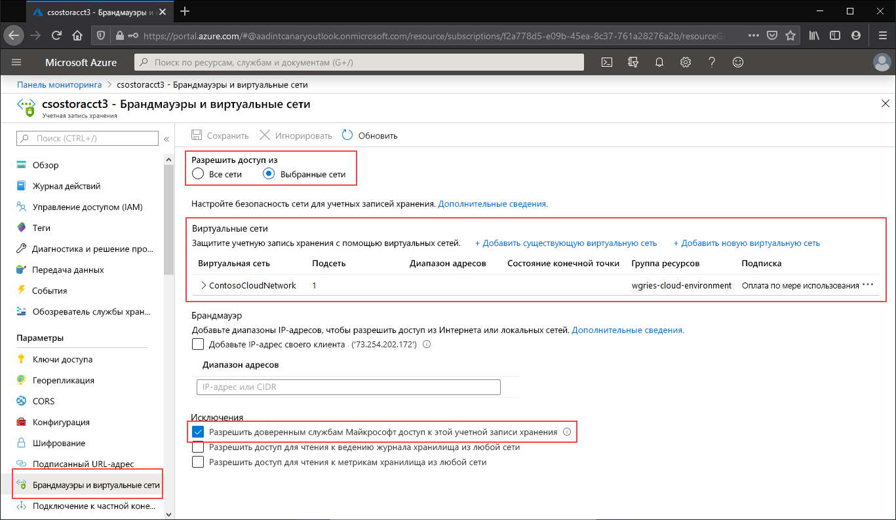

# <a name="configuring-azure-files-network-endpoints"></a>Настройка сетевых конечных точек Файлов Azure
Файлы Azure предоставляют два основных типа конечных точек для доступа к общим папкам Azure: 
- общедоступные конечные точки, у которых есть общедоступный IP-адрес и к которым можно обращаться из любой точки мира;
- частные конечные точки, которые существуют только в виртуальной сети и имеют частный IP-адрес в пределах адресного пространства этой виртуальной сети.

Общедоступные и частные конечные точки размещаются в учетной записи хранения Azure. Учетная запись хранения — это конструкция управления, представляющая собой общий пул носителей, который можно использовать для развертывания нескольких общих папок и других ресурсов хранения, например контейнеров больших двоичных объектов или очередей.

В этой статье показано, как настроить конечные точки учетной записи хранения для получения доступа к общей папке Azure напрямую. Здесь также описываются особенности взаимодействия между Синхронизацией файлов Azure и общедоступными и частными конечными точками учетной записи хранения. См. сведения о требованиях к сети для развертывания Синхронизации файлов Azure в описании [параметров брандмауэра и прокси-сервера Синхронизации файлов Azure](storage-sync-files-firewall-and-proxy.md).

Мы рекомендуем ознакомиться с [рекомендациями по работе с сетью в Файлах Azure](storage-files-networking-overview.md) перед изучением этого руководства.

## <a name="prerequisites"></a>Предварительные требования
- В этой статье подразумевается, что вы уже создали подписку Azure. Если у вас еще нет подписки, вы можете [создать бесплатную учетную запись Azure](https://azure.microsoft.com/free/?WT.mc_id=A261C142F), прежде чем начинать работу.
- В этой статье также предполагается, что вы уже создали общую папку Azure в учетной записи хранения, к которой вы будете подключаться из локальной среды. Чтобы узнать, как создать общую папку Azure, ознакомьтесь с [этой статьей](storage-how-to-create-file-share.md).
- Если вы хотите использовать Azure PowerShell, [установите последнюю версию](https://docs.microsoft.com/powershell/azure/install-az-ps).
- Если вы хотите использовать Azure CLI, [установите последнюю версию](https://docs.microsoft.com/cli/azure/install-azure-cli?view=azure-cli-latest).

## <a name="create-a-private-endpoint"></a>Создание частной конечной точки
Создание частной конечной точки для учетной записи хранения приведет к развертыванию следующих ресурсов Azure:

- **Частная конечная точка.** Ресурс Azure, представляющий частную конечную точку учетной записи хранения. Его можно рассматривать как ресурс для подключения учетной записи хранения к сетевому интерфейсу.
- **Сетевой интерфейс.** Сетевой интерфейс с поддержкой частного IP-адреса в указанной виртуальной сети или подсети. Это тот же ресурс, который автоматически развертывается при развертывании виртуальной машины, но он назначается не виртуальной машине, а частной конечной точке.
- **Частная зона DNS.** Если вы никогда не развертывали частную конечную точку для этой виртуальной сети, для нее будет развернута новая частная зона DNS. В этой зоне DNS будет создана запись DNS типа A для учетной записи хранения. Если вы уже развертывали частную конечную точку в этой виртуальной сети, новая запись типа A для учетной записи хранения будет добавлена в существующую зону DNS. Развертывание зоны DNS не является обязательным, но мы настоятельно рекомендуем его выполнять. Это обязательное действие при подключении общих папок Azure с помощью субъекта-службы AD или API FileREST.

> [!Note]  
> В этой статье используется DNS-суффикс учетной записи хранения `core.windows.net`, выделенный для общедоступных регионов Azure. Этот комментарий применим и к национальным облакам Azure, таким как облако Azure для государственных организаций США и облако Azure для Китая. Вам придется лишь заменить суффиксы на другие, соответствующие вашей среде. 

# <a name="portal"></a>[Портал](#tab/azure-portal)
Перейдите к учетной записи хранения, для которой вы хотите создать частную конечную точку. В таблице содержимого для учетной записи хранения щелкните **Подключения к частной конечной точке**, а затем выберите **+ Частная конечная точка**, чтобы создать частную конечную точку. 



В мастере нужно будет заполнить несколько страниц.

В колонке **Основные сведения** выберите нужную группу ресурсов, имя и регион для частной конечной точки. Они могут быть любыми, но не должны совпадать с учетной записью хранения. Тем не менее необходимо создать частную конечную точку в том же регионе, что и виртуальная сеть, в которой вы хотите создать частную конечную точку.



В колонке **Ресурс** установите переключатель рядом с пунктом **Подключиться к ресурсу Azure в моем каталоге**. В разделе **Тип ресурса** выберите **Microsoft.Storage/storageAccounts** в качестве типа. Поле **Ресурсы** — это учетная запись хранения с общей папкой Azure, к которой требуется подключиться. Целевой подресурс — это **файл**, так как это требуется для Файлов Azure.

В колонке **Конфигурация** можно выбрать определенную виртуальную сеть и подсеть, в которую вы хотите добавить частную конечную точку. Выберите созданную ранее виртуальную сеть. В подсети, в которую вы добавили конечную точку службы, необходимо выбрать отдельную подсеть. В колонке "Конфигурация" также содержатся сведения для создания или обновления частной зоны DNS. Мы рекомендуем использовать стандартную зону `privatelink.file.core.windows.net`.



Щелкните **Просмотр и создание**, чтобы создать частную конечную точку. 

Если у вас есть виртуальная машина в виртуальной сети или [настроена переадресация DNS](storage-files-networking-dns.md), правильность настройки частной конечной точки можно проверить, выполнив следующие команды в PowerShell, командной строке или терминале (работает для Windows, Linux или macOS). Замените `<storage-account-name>` реальным именем учетной записи хранения.

```
nslookup <storage-account-name>.file.core.windows.net
```

Если все пройдет успешно, вы увидите следующие выходные данные, где `192.168.0.5` обозначает частный IP-адрес частной конечной точки в виртуальной сети (здесь представлены выходные данные в среде Windows):

```Output
Server:  UnKnown
Address:  10.2.4.4

Non-authoritative answer:
Name:    storageaccount.privatelink.file.core.windows.net
Address:  192.168.0.5
Aliases:  storageaccount.file.core.windows.net
```

# <a name="powershell"></a>[PowerShell](#tab/azure-powershell)
Чтобы создать частную конечную точку для учетной записи хранения, сначала нужно получить ссылку на учетную запись хранения и подсеть виртуальной сети, в которую вы хотите добавить частную конечную точку. Замените `<storage-account-resource-group-name>`, `<storage-account-name>`, `<vnet-resource-group-name>`, `<vnet-name>` и `<vnet-subnet-name>` ниже:

```PowerShell
$storageAccountResourceGroupName = "<storage-account-resource-group-name>"
$storageAccountName = "<storage-account-name>"
$virtualNetworkResourceGroupName = "<vnet-resource-group-name>"
$virtualNetworkName = "<vnet-name>"
$subnetName = "<vnet-subnet-name>"

# Get storage account reference, and throw error if it doesn't exist
$storageAccount = Get-AzStorageAccount `
        -ResourceGroupName $storageAccountResourceGroupName `
        -Name $storageAccountName `
        -ErrorAction SilentlyContinue

if ($null -eq $storageAccount) {
    $errorMessage = "Storage account $storageAccountName not found "
    $errorMessage += "in resource group $storageAccountResourceGroupName."
    Write-Error -Message $errorMessage -ErrorAction Stop
}

# Get virtual network reference, and throw error if it doesn't exist
$virtualNetwork = Get-AzVirtualNetwork `
        -ResourceGroupName $virtualNetworkResourceGroupName `
        -Name $virtualNetworkName `
        -ErrorAction SilentlyContinue

if ($null -eq $virtualNetwork) {
    $errorMessage = "Virtual network $virtualNetworkName not found "
    $errorMessage += "in resource group $virtualNetworkResourceGroupName."
    Write-Error -Message $errorMessage -ErrorAction Stop
}

# Get reference to virtual network subnet, and throw error if it doesn't exist
$subnet = $virtualNetwork | `
    Select-Object -ExpandProperty Subnets | `
    Where-Object { $_.Name -eq $subnetName }

if ($null -eq $subnet) {
    Write-Error `
            -Message "Subnet $subnetName not found in virtual network $virtualNetworkName." `
            -ErrorAction Stop
}
```

Чтобы создать частную конечную точку, необходимо создать подключение службы Приватного канала к учетной записи хранения. Подключение службы Приватного канала передается как входные данные для создания частной конечной точки. 

```PowerShell
# Disable private endpoint network policies
$subnet.PrivateEndpointNetworkPolicies = "Disabled"
$virtualNetwork | Set-AzVirtualNetwork | Out-Null

# Create a private link service connection to the storage account.
$privateEndpointConnection = New-AzPrivateLinkServiceConnection `
        -Name "$storageAccountName-Connection" `
        -PrivateLinkServiceId $storageAccount.Id `
        -GroupId "file"

# Create a new private endpoint.
$privateEndpoint = New-AzPrivateEndpoint `
        -ResourceGroupName $storageAccountResourceGroupName `
        -Name "$storageAccountName-PrivateEndpoint" `
        -Location $virtualNetwork.Location `
        -Subnet $subnet `
        -PrivateLinkServiceConnection $privateEndpointConnection `
        -ErrorAction Stop
```

Создание частной зоны DNS в Azure позволяет использовать для учетной записи хранения оригинальное имя, например `storageaccount.file.core.windows.net`, которое будет разрешаться в частный IP-адрес в пределах виртуальной сети. Это не нужно для создания частной конечной точки, но требуется при подключении общей папки Azure с использованием субъекта-пользователя AD или REST API.  

```PowerShell
# Get the desired storage account suffix (core.windows.net for public cloud).
# This is done like this so this script will seamlessly work for non-public Azure.
$storageAccountSuffix = Get-AzContext | `
    Select-Object -ExpandProperty Environment | `
    Select-Object -ExpandProperty StorageEndpointSuffix

# For public cloud, this will generate the following DNS suffix:
# privatelink.file.core.windows.net.
$dnsZoneName = "privatelink.file.$storageAccountSuffix"

# Find a DNS zone matching desired name attached to this virtual network.
$dnsZone = Get-AzPrivateDnsZone | `
    Where-Object { $_.Name -eq $dnsZoneName } | `
    Where-Object {
        $privateDnsLink = Get-AzPrivateDnsVirtualNetworkLink `
                -ResourceGroupName $_.ResourceGroupName `
                -ZoneName $_.Name `
                -ErrorAction SilentlyContinue
        
        $privateDnsLink.VirtualNetworkId -eq $virtualNetwork.Id
    }

if ($null -eq $dnsZone) {
    # No matching DNS zone attached to virtual network, so create new one.
    $dnsZone = New-AzPrivateDnsZone `
            -ResourceGroupName $virtualNetworkResourceGroupName `
            -Name $dnsZoneName `
            -ErrorAction Stop

    $privateDnsLink = New-AzPrivateDnsVirtualNetworkLink `
            -ResourceGroupName $virtualNetworkResourceGroupName `
            -ZoneName $dnsZoneName `
            -Name "$virtualNetworkName-DnsLink" `
            -VirtualNetworkId $virtualNetwork.Id `
            -ErrorAction Stop
}
```

Теперь, когда у вас есть ссылка на частную зону DNS, нужно создать запись типа A для учетной записи хранения.

```PowerShell
$privateEndpointIP = $privateEndpoint | `
    Select-Object -ExpandProperty NetworkInterfaces | `
    Select-Object @{ 
        Name = "NetworkInterfaces"; 
        Expression = { Get-AzNetworkInterface -ResourceId $_.Id } 
    } | `
    Select-Object -ExpandProperty NetworkInterfaces | `
    Select-Object -ExpandProperty IpConfigurations | `
    Select-Object -ExpandProperty PrivateIpAddress

$privateDnsRecordConfig = New-AzPrivateDnsRecordConfig `
        -IPv4Address $privateEndpointIP

New-AzPrivateDnsRecordSet `
        -ResourceGroupName $virtualNetworkResourceGroupName `
        -Name $storageAccountName `
        -RecordType A `
        -ZoneName $dnsZoneName `
        -Ttl 600 `
        -PrivateDnsRecords $privateDnsRecordConfig `
        -ErrorAction Stop | `
    Out-Null
```

Если у вас есть виртуальная машина в виртуальной сети или [настроена переадресация DNS](storage-files-networking-dns.md), правильность настройки частной конечной точки можно проверить, выполнив следующие команды.

```PowerShell
$storageAccountHostName = [System.Uri]::new($storageAccount.PrimaryEndpoints.file) | `
    Select-Object -ExpandProperty Host

Resolve-DnsName -Name $storageAccountHostName
```

Если все пройдет успешно, вы увидите следующие выходные данные, где `192.168.0.5` обозначает частный IP-адрес частной конечной точки в виртуальной сети:

```Output
Name                             Type   TTL   Section    NameHost
----                             ----   ---   -------    --------
storageaccount.file.core.windows CNAME  60    Answer     storageaccount.privatelink.file.core.windows.net
.net

Name       : storageaccount.privatelink.file.core.windows.net
QueryType  : A
TTL        : 600
Section    : Answer
IP4Address : 192.168.0.5
```

# <a name="azure-cli"></a>[Azure CLI](#tab/azure-cli)
Чтобы создать частную конечную точку для учетной записи хранения, сначала нужно получить ссылку на учетную запись хранения и подсеть виртуальной сети, в которую вы хотите добавить частную конечную точку. Замените `<storage-account-resource-group-name>`, `<storage-account-name>`, `<vnet-resource-group-name>`, `<vnet-name>` и `<vnet-subnet-name>` ниже:

```bash
storageAccountResourceGroupName="<storage-account-resource-group-name>"
storageAccountName="<storage-account-name>"
virtualNetworkResourceGroupName="<vnet-resource-group-name>"
virtualNetworkName="<vnet-name>"
subnetName="<vnet-subnet-name>"

# Get storage account ID 
storageAccount=$(az storage account show \
        --resource-group $storageAccountResourceGroupName \
        --name $storageAccountName \
        --query "id" | \
    tr -d '"')

# Get virtual network ID
virtualNetwork=$(az network vnet show \
        --resource-group $virtualNetworkResourceGroupName \
        --name $virtualNetworkName \
        --query "id" | \
    tr -d '"')

# Get subnet ID
subnet=$(az network vnet subnet show \
        --resource-group $virtualNetworkResourceGroupName \
        --vnet-name $virtualNetworkName \
        --name $subnetName \
        --query "id" | \
    tr -d '"')
```

Чтобы создать частную конечную точку, необходимо убедиться, что для частной конечной точки подсети отключена политика сети. Затем создайте частную конечную точку с помощью команды `az network private-endpoint create`.

```bash
# Disable private endpoint network policies
az network vnet subnet update \
        --ids $subnet \
        --disable-private-endpoint-network-policies \
        --output none

# Get virtual network location
region=$(az network vnet show \
        --ids $virtualNetwork \
        --query "location" | \
    tr -d '"')

# Create a private endpoint
privateEndpoint=$(az network private-endpoint create \
        --resource-group $virtualNetworkResourceGroupName \
        --name "$storageAccountName-PrivateEndpoint" \
        --location $region \
        --subnet $subnet \
        --private-connection-resource-id $storageAccount \
        --group-ids "file" \
        --connection-name "$storageAccountName-Connection" \
        --query "id" | \
    tr -d '"')
```

Создание частной зоны DNS в Azure позволяет использовать для учетной записи хранения оригинальное имя, например `storageaccount.file.core.windows.net`, которое будет разрешаться в частный IP-адрес в пределах виртуальной сети. Это не нужно для создания частной конечной точки, но требуется при подключении общей папки Azure с использованием субъекта-пользователя AD или REST API.  

```bash
# Get the desired storage account suffix (core.windows.net for public cloud).
# This is done like this so this script will seamlessly work for non-public Azure.
storageAccountSuffix=$(az cloud show \
        --query "suffixes.storageEndpoint" | \
    tr -d '"')

# For public cloud, this will generate the following DNS suffix:
# privatelink.file.core.windows.net.
dnsZoneName="privatelink.file.$storageAccountSuffix"

# Find a DNS zone matching desired name attached to this virtual network.
possibleDnsZones=$(az network private-dns zone list \
        --query "[?name == '$dnsZoneName'].id" \
        --output tsv)

for possibleDnsZone in $possibleDnsZones
do
    possibleResourceGroupName=$(az resource show \
            --ids $possibleDnsZone \
            --query "resourceGroup" | \
        tr -d '"')
    
    link=$(az network private-dns link vnet list \
            --resource-group $possibleResourceGroupName \
            --zone-name $dnsZoneName \
            --query "[?virtualNetwork.id == '$virtualNetwork'].id" \
            --output tsv)
    
    if [ -z $link ]
    then
        1 > /dev/null
    else 
        dnsZoneResourceGroup=$possibleResourceGroupName
        dnsZone=$possibleDnsZone
        break
    fi  
done

if [ -z $dnsZone ]
then
    # No matching DNS zone attached to virtual network, so create a new one
    dnsZone=$(az network private-dns zone create \
            --resource-group $virtualNetworkResourceGroupName \
            --name $dnsZoneName \
            --query "id" | \
        tr -d '"')
    
    az network private-dns link vnet create \
            --resource-group $resourceGroupName \
            --zone-name $zoneName \
            --name "$virtualNetworkName-DnsLink" \
            --virtual-network $virtualNetwork \
            --registration-enabled false \
            --output none
fi
```

Теперь, когда у вас есть ссылка на частную зону DNS, нужно создать запись типа A для учетной записи хранения.

```bash
privateEndpointNIC=$(az network private-endpoint show \
        --ids $privateEndpoint \
        --query "networkInterfaces[0].id" | \
    tr -d '"')

privateEndpointIP=$(az network nic show \
        --ids $privateEndpointNIC \
        --query "ipConfigurations[0].privateIpAddress" | \
    tr -d '"')

az network private-dns record-set a create \
        --resource-group $dnsZoneResourceGroup \
        --zone-name $dnsZoneName \
        --name $storageAccountName \
        --output none

az network private-dns record-set a add-record \
        --resource-group $dnsZoneResourceGroup \
        --zone-name $dnsZoneName \
        --record-set-name $storageAccountName \
        --ipv4-address $privateEndpointIP \
        --output none
```

Если у вас есть виртуальная машина в виртуальной сети или [настроена переадресация DNS](storage-files-networking-dns.md), правильность настройки частной конечной точки можно проверить, выполнив следующие команды.

```bash
httpEndpoint=$(az storage account show \
        --resource-group $storageAccountResourceGroupName \
        --name $storageAccountName \
        --query "primaryEndpoints.file" | \
    tr -d '"')

hostName=$(echo $httpEndpoint | cut -c7-$(expr length $httpEndpoint) | tr -d "/")
nslookup $hostName
```

Если все пройдет успешно, вы увидите следующие выходные данные, где `192.168.0.5` обозначает частный IP-адрес частной конечной точки в виртуальной сети:

```Output
Server:         127.0.0.53
Address:        127.0.0.53#53

Non-authoritative answer:
storageaccount.file.core.windows.net      canonical name = storageaccount.privatelink.file.core.windows.net.
Name:   storageaccount.privatelink.file.core.windows.net
Address: 192.168.0.5
```

---

## <a name="restrict-access-to-the-public-endpoint"></a>Ограничение доступа к общедоступной конечной точке
Вы можете ограничить доступ к общедоступной конечной точке, настроив параметры брандмауэра учетной записи хранения. Как правило, большинство политик брандмауэра учетной записи хранения разрешают сетевой доступ из одной или нескольких виртуальных сетей. Вы можете использовать два подхода к ограничению доступа к учетной записи хранения из виртуальных сетей.

- [Создайте одну или несколько частных конечных точек для учетной записи хранения](#create-a-private-endpoint) и запретите любой доступ к общедоступной конечной точке. Так вы будете уверены, что доступ к общим папкам Azure в этой учетной записи хранения возможен только для запросов, создаваемых внутри настроенных виртуальных сетей.
- Ограничьте доступ к общедоступной конечной точке одной или несколькими виртуальными сетями. Это достигается за счет возможности виртуальной сети под названием *конечная точка службы*. Ограничивая трафик к учетной записи хранения путем использования конечной точки службы, вы сохраняете доступ через общедоступный IP-адрес.

### <a name="restrict-all-access-to-the-public-endpoint"></a>Запрет любого доступа к общедоступной конечной точке
Если доступ к общедоступной конечной точке закрыт, к учетной записи хранения можно обращаться только через частные конечные точки. Даже допустимые запросы к общедоступной конечной точке учетной записи хранения будут отклоняться. 

# <a name="portal"></a>[Портал](#tab/azure-portal)
Перейдите к учетной записи хранения, для которой вы хотите запретить доступ к общедоступной конечной точке. В таблице содержимого для учетной записи хранения выберите **Брандмауэры и виртуальные сети**.

В верхней части страницы установите переключатель рядом с пунктом **Выбранные сети**. Это действие отобразит ряд скрытых параметров для управления ограничениями общедоступной конечной точки. Установите флажок **Разрешить доверенным службам Майкрософт доступ к этой учетной записи службы**, чтобы доверенные службы Майкрософт (например, Синхронизация файлов Azure) могли обращаться к этой учетной записи хранения.



# <a name="powershell"></a>[PowerShell](#tab/azure-powershell)
Следующая команда PowerShell блокирует весь трафик к общедоступной конечной точке учетной записи хранения. Обратите внимание, что в этой команде параметр `-Bypass` имеет значение `AzureServices`. Это значение разрешает доступ к учетной записи хранения через общедоступную конечную точку для доверенных служб корпорации Майкрософт, таких как Синхронизация файлов Azure.

```PowerShell
# This assumes $storageAccount is still defined from the beginning of this of this guide.
$storageAccount | Update-AzStorageAccountNetworkRuleSet `
        -DefaultAction Deny `
        -Bypass AzureServices `
        -WarningAction SilentlyContinue `
        -ErrorAction Stop | `
    Out-Null
```

# <a name="azure-cli"></a>[Azure CLI](#tab/azure-cli)
Следующая команда CLI блокирует весь трафик к общедоступной конечной точке учетной записи хранения. Обратите внимание, что в этой команде параметр `-bypass` имеет значение `AzureServices`. Это значение разрешает доступ к учетной записи хранения через общедоступную конечную точку для доверенных служб корпорации Майкрософт, таких как Синхронизация файлов Azure.

```bash
# This assumes $storageAccountResourceGroupName and $storageAccountName 
# are still defined from the beginning of this guide.
az storage account update \
    --resource-group $storageAccountResourceGroupName \
    --name $storageAccountName \
    --bypass "AzureServices" \
    --default-action "Deny" \
    --output none
```
---

### <a name="restrict-access-to-the-public-endpoint-to-specific-virtual-networks"></a>Ограничьте доступ к общедоступной конечной точке определенными виртуальными сетями.
Определив доступ к учетной записи хранения для определенных виртуальных сетей, вы разрешите доступ к общедоступной конечной точке только из этих виртуальных сетей. Это достигается за счет возможности виртуальной сети под названием *конечная точка службы*. Ее можно использовать с частными конечными точками или без них.

# <a name="portal"></a>[Портал](#tab/azure-portal)
Перейдите к учетной записи хранения, для которой вы хотите разрешить доступ к общедоступной конечной точке только из нескольких виртуальных сетей. В таблице содержимого для учетной записи хранения выберите **Брандмауэры и виртуальные сети**. 

В верхней части страницы установите переключатель рядом с пунктом **Выбранные сети**. Это действие отобразит ряд скрытых параметров для управления ограничениями общедоступной конечной точки. Щелкните **+Добавить существующую виртуальную сеть**, чтобы выбрать конкретную виртуальную сеть, из которой будет разрешен доступ к учетной записи хранения через общедоступную конечную точку. Для этого действия нужно выбрать виртуальную сеть и подсеть внутри этой виртуальной сети. 

Установите флажок **Разрешить доверенным службам Майкрософт доступ к этой учетной записи службы**, чтобы доверенные службы Майкрософт (например, Синхронизация файлов Azure) могли обращаться к этой учетной записи хранения.



# <a name="powershell"></a>[PowerShell](#tab/azure-powershell)
Чтобы разрешить доступ к общедоступной конечной точке учетной записи хранения только из определенных виртуальных сетей через конечные точки службы, сначала необходимо собрать информацию об учетной записи хранения и виртуальной сети. Для сбора этой информации заполните параметры `<storage-account-resource-group>`, `<storage-account-name>`, `<vnet-resource-group-name>`, `<vnet-name>` и `<subnet-name>`.

```PowerShell
$storageAccountResourceGroupName = "<storage-account-resource-group>"
$storageAccountName = "<storage-account-name>"
$restrictToVirtualNetworkResourceGroupName = "<vnet-resource-group-name>"
$restrictToVirtualNetworkName = "<vnet-name>"
$subnetName = "<subnet-name>"

$storageAccount = Get-AzStorageAccount `
        -ResourceGroupName $storageAccountResourceGroupName `
        -Name $storageAccountName `
        -ErrorAction Stop

$virtualNetwork = Get-AzVirtualNetwork `
        -ResourceGroupName $restrictToVirtualNetworkResourceGroupName `
        -Name $restrictToVirtualNetworkName `
        -ErrorAction Stop

$subnet = $virtualNetwork | `
    Select-Object -ExpandProperty Subnets | `
    Where-Object { $_.Name -eq $subnetName }

if ($null -eq $subnet) {
    Write-Error `
            -Message "Subnet $subnetName not found in virtual network $restrictToVirtualNetworkName." `
            -ErrorAction Stop
}
```

Чтобы разрешить трафик из виртуальной сети к общедоступной конечной точке учетной записи хранения в структуре сети Azure, подсеть этой виртуальной сети должна предоставлять конечную точку службы `Microsoft.Storage`. Следующие команды PowerShell добавляют в подсеть конечную точку службы `Microsoft.Storage`, если она еще не существует.

```PowerShell
$serviceEndpoints = $subnet | `
    Select-Object -ExpandProperty ServiceEndpoints | `
    Select-Object -ExpandProperty Service

if ($serviceEndpoints -notcontains "Microsoft.Storage") {
    if ($null -eq $serviceEndpoints) {
        $serviceEndpoints = @("Microsoft.Storage")
    } elseif ($serviceEndpoints -is [string]) {
        $serviceEndpoints = @($serviceEndpoints, "Microsoft.Storage")
    } else {
        $serviceEndpoints += "Microsoft.Storage"
    }

    $virtualNetwork = $virtualNetwork | Set-AzVirtualNetworkSubnetConfig `
            -Name $subnetName `
            -AddressPrefix $subnet.AddressPrefix `
            -ServiceEndpoint $serviceEndpoints `
            -WarningAction SilentlyContinue `
            -ErrorAction Stop | `
        Set-AzVirtualNetwork `
            -ErrorAction Stop
}
```

Последним шагом для ограничения трафика к учетной записи хранения будет создание правила сети и добавление его в набор правил сети для этой учетной записи хранения.

```PowerShell
$networkRule = $storageAccount | Add-AzStorageAccountNetworkRule `
    -VirtualNetworkResourceId $subnet.Id `
    -ErrorAction Stop

$storageAccount | Update-AzStorageAccountNetworkRuleSet `
        -DefaultAction Deny `
        -Bypass AzureServices `
        -VirtualNetworkRule $networkRule `
        -WarningAction SilentlyContinue `
        -ErrorAction Stop | `
    Out-Null
```

# <a name="azure-cli"></a>[Azure CLI](#tab/azure-cli)
Чтобы разрешить доступ к общедоступной конечной точке учетной записи хранения только из определенных виртуальных сетей через конечные точки службы, сначала необходимо собрать информацию об учетной записи хранения и виртуальной сети. Для сбора этой информации заполните параметры `<storage-account-resource-group>`, `<storage-account-name>`, `<vnet-resource-group-name>`, `<vnet-name>` и `<subnet-name>`.

```bash
storageAccountResourceGroupName="<storage-account-resource-group>"
storageAccountName="<storage-account-name>"
restrictToVirtualNetworkResourceGroupName="<vnet-resource-group-name>"
restrictToVirtualNetworkName="<vnet-name>"
subnetName="<subnet-name>"

storageAccount=$(az storage account show \
        --resource-group $storageAccountResourceGroupName \
        --name $storageAccountName \
        --query "id" | \
    tr -d '"')

virtualNetwork=$(az network vnet show \
        --resource-group $restrictToVirtualNetworkResourceGroupName \
        --name $restrictToVirtualNetworkName \
        --query "id" | \
    tr -d '"')

subnet=$(az network vnet subnet show \
        --resource-group $restrictToVirtualNetworkResourceGroupName \
        --vnet-name $restrictToVirtualNetworkName \
        --name $subnetName \
        --query "id" | \
    tr -d '"')
```

Чтобы разрешить трафик из виртуальной сети к общедоступной конечной точке учетной записи хранения в структуре сети Azure, подсеть этой виртуальной сети должна предоставлять конечную точку службы `Microsoft.Storage`. Следующие команды CLI добавляют в подсеть конечную точку службы `Microsoft.Storage`, если она еще не существует.

```bash
serviceEndpoints=$(az network vnet subnet show \
        --resource-group $restrictToVirtualNetworkResourceGroupName \
        --vnet-name $restrictToVirtualNetworkName \
        --name $subnetName \
        --query "serviceEndpoints[].service" \
        --output tsv)

foundStorageServiceEndpoint=false
for serviceEndpoint in $serviceEndpoints
do
    if [ $serviceEndpoint = "Microsoft.Storage" ]
    then
        foundStorageServiceEndpoint=true
    fi
done

if [ $foundStorageServiceEndpoint = false ] 
then
    serviceEndpointList=""

    for serviceEndpoint in $serviceEndpoints
    do
        serviceEndpointList+=$serviceEndpoint
        serviceEndpointList+=" "
    done
    
    serviceEndpointList+="Microsoft.Storage"

    az network vnet subnet update \
            --ids $subnet \
            --service-endpoints $serviceEndpointList \
            --output none
fi
```

Последним шагом для ограничения трафика к учетной записи хранения будет создание правила сети и добавление его в набор правил сети для этой учетной записи хранения.

```bash
az storage account network-rule add \
        --resource-group $storageAccountResourceGroupName \
        --account-name $storageAccountName \
        --subnet $subnet \
        --output none

az storage account update \
        --resource-group $storageAccountResourceGroupName \
        --name $storageAccountName \
        --bypass "AzureServices" \
        --default-action "Deny" \
        --output none
```

---

## <a name="see-also"></a>См. также раздел
- [Рекомендации по работе с сетями Файлов Azure](storage-files-networking-overview.md)
- [Настройка перенаправления DNS для Файлов Azure](storage-files-networking-dns.md)
- [Настройка S2S VPN для Файлов Azure](storage-files-configure-s2s-vpn.md)
