# Краткое руководство. Создание общей папки службы "Файлы Azure" и управление ею с помощью виртуальных машин Windows

В статье описано, как создать и использовать общую папку службы "Файлы Azure". В этом кратком руководстве описано, как быстро настроить общую папку службы "Файлы Azure", чтобы вы получили общее представление о работе этой службы. Если вам нужны более подробные инструкции по созданию и использованию общих папок Azure в локальной среде, см. статью [Использование общей папки Azure в Windows](storage-how-to-use-files-windows.md).

Если у вас еще нет подписки Azure, [создайте бесплатную учетную запись Azure](https://azure.microsoft.com/free/?WT.mc_id=A261C142F), прежде чем начинать работу.

## Вход в Azure

Войдите на [портале Azure](https://portal.azure.com).

## Подготовка среды

В этом кратком руководстве вы настроите следующие элементы:

- учетную запись хранения Azure и общую папку Azure;
- виртуальную машину под управлением Windows Server 2016 Datacenter.

### Создание учетной записи хранения

Прежде чем приступить к работе с общей папкой Azure, необходимо создать учетную запись хранения Azure. Учетная запись хранения общего назначения версии 2 предоставляет доступ ко всем службам хранилища Azure (большим двоичным объектам, файлам, очередям и таблицам). Это краткое руководство создает учетную запись хранения общего назначения версии 2, но создание любого типа учетной записи хранения происходит таким же образом. Учетная запись хранения может содержать неограниченное число файловых ресурсов. В общем ресурсе может храниться любое число файлов, насколько это позволяет емкость учетной записи хранения.

[!INCLUDE [storage-create-account-portal-include](../../../includes/storage-create-account-portal-include.md)]

### создать файловый ресурс Azure;

Затем вы создадите общий файловый ресурс.

1. После развертывания учетной записи хранения Azure выберите **Перейти к ресурсу**.
1. Выберите **Файлы** из области учетной записи хранения.

    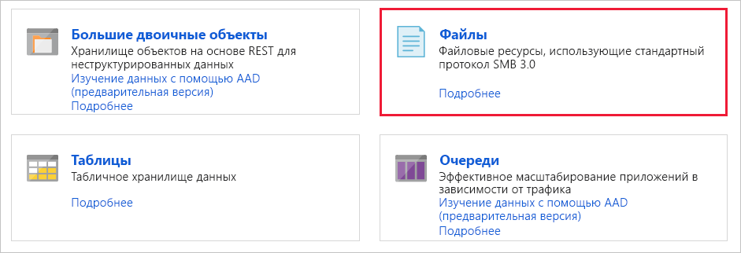

1. Выберите **Общая папка**.

    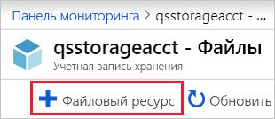

1. Задайте новой папке имя *qsfileshare*, укажите значение 1 в меню **Квота** и выберите **Создать**. Размер квоты не может превышать 5 ТиБ, а для этого руководства будет достаточно 1 ГиБ.
1. Создайте новый файл TXT с именем *qsTestFile* на локальном компьютере.
1. Выберите новую общую папку и в расположении общей папки выберите **Отправить**.

    

1. Перейдите в расположение созданного файла TXT, выберите *qsTestFile.txt*, а затем — **Отправить**.

Итак, вы создали учетную запись хранения Azure и общую папку Azure с одним файлом внутри. Теперь вы создадите виртуальную машину Azure с Windows Server 2016 Datacenter, выполняющую роль локального сервера в этом кратком руководстве.

### Развертывание виртуальной машины

1. Затем разверните меню в левой части портала и выберите **Создать ресурс** в верхнем левом углу портала Azure.
1. В поле поиска над списком ресурсов **Azure Marketplace** найдите и выберите **Windows Server 2016 Datacenter**, затем выберите **Создать**.
1. На вкладке **Основные сведения** в разделе **Сведения о проекте** выберите группу ресурсов, созданную для этого краткого руководства.

   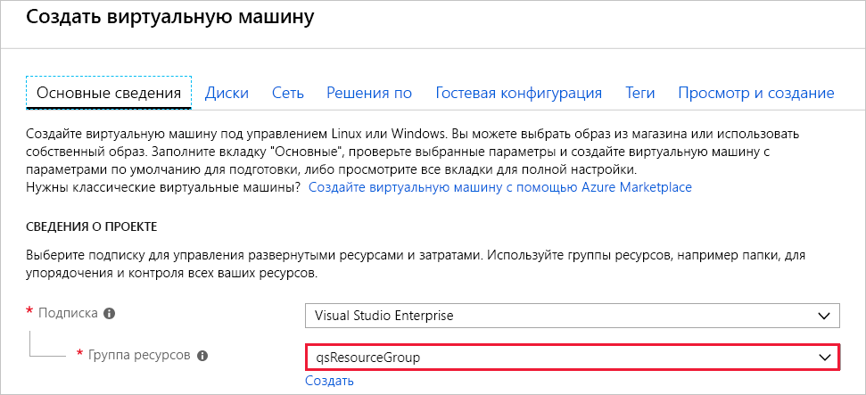

1. В разделе **Сведения об экземпляре** задайте виртуальной машине имя *qsVM*.
1. Оставьте значения по умолчанию для **региона**, **параметров доступности**, **образа** и **размера**.
1. В разделе **Учетная запись администратора** укажите *VMadmin* в поле **Имя пользователя** и в поле **Пароль** установите пароль для виртуальной машины.
1. В разделе **Правила входящего порта**, щелкните **Разрешить выбранные порты**, а затем выберите **RDP (3389)** и **HTTP** из раскрывающегося списка.
1. Выберите **Review + create** (Просмотреть и создать).
1. Нажмите кнопку **Создать**. Создание виртуальной машины займет несколько минут.

1. После развертывания виртуальной машины выберите**Перейти к ресурсу**.

На этом этапе вы создали виртуальную машину и подключили диск данных. Теперь необходимо подключиться к виртуальной машине.

### Подключение к виртуальной машине

1. На странице свойств виртуальной машины выберите **Подключиться**.

   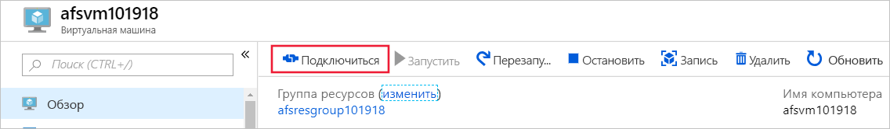

1. На странице **Подключение к виртуальной машине** сохраните значения по умолчанию, чтобы использовать подключение по **IP-адресу** через **порт номер** *3389*, и выберите **Скачать RDP-файл**.
1. Откройте скачанный RDP-файл и при появлении запроса щелкните **Подключиться**.
1. В окне **Безопасность Windows** выберите **Варианты выбора** и нажмите **Использовать другую учетную запись**. Введите имя пользователя в формате *localhost\имя_пользователя*, где &lt;имя_пользователя&gt; — это имя администратора виртуальной машины. Введите пароль, заданный для виртуальной машины, и нажмите кнопку **ОК**.

   

1. При входе в систему может появиться предупреждение о сертификате. Выберите **Да** или **Продолжить**, чтобы создать подключение.

## Сопоставление общей папки Azure с диском Windows

1. На портале Azure перейдите к общей папке *qsfileshare* и выберите **Подключиться**.
1. Скопируйте содержимое второго поля и вставьте его в **Блокнот**.

   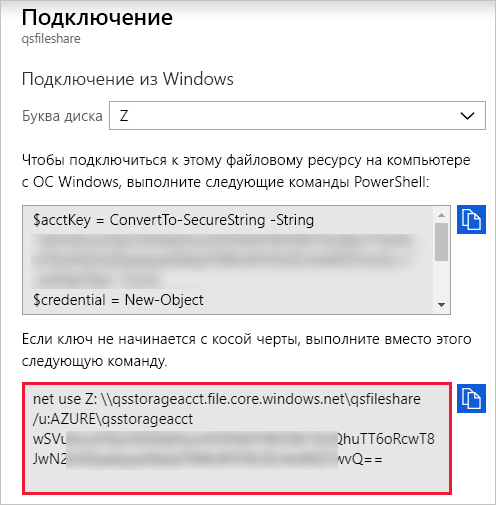

1. На виртуальной машине откройте **проводник** и в окне выберите **Этот ПК**. В результате изменятся меню, доступные на ленте. В меню **Компьютер** выберите **Подключить сетевой диск**.
1. Выберите букву диска и введите UNC-путь. Если вы следовали рекомендациям по именованию из этого краткого руководства, скопируйте *\\qsstorageacct.file.core.windows.net\qsfileshare* из **Блокнота**.

   Убедитесь, что установлены оба флажка.

   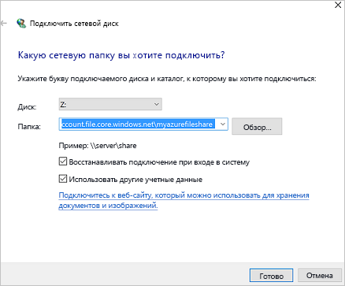

1. Выберите **Готово**.
1. В диалоговом окне **Безопасность Windows** выполните следующее:

   - Скопируйте из Блокнота имя учетной записи хранения, начинающееся с AZURE\, и вставьте его в диалоговом окне **Безопасность Windows** в качестве имени пользователя. Если вы следовали рекомендациям по именованию из этого краткого руководства, скопируйте *AZURE\qsstorageacct*.
   - Скопируйте из Блокнота ключ учетной записи хранения и вставьте его в диалоговом окне **Безопасность Windows** в качестве пароля.

      

## Создание моментального снимка общего ресурса

Теперь, после сопоставления диска, можно создать моментальный снимок.

1. На портале перейдите к общей папке и выберите **Создать моментальный снимок**.

   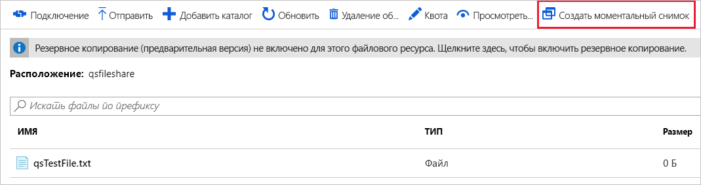

1. На виртуальной машине откройте файл *qstestfile.txt*, введите текст "этот файл изменен", сохраните изменения и закройте файл.
1. Создайте еще один моментальный снимок.

## Просмотр моментальных снимков общей папки

1. В общей папке выберите **Просмотреть моментальные снимки**.
1. В области **Моментальные снимки файловых ресурсов**  выберите первый моментальный снимок в списке.

   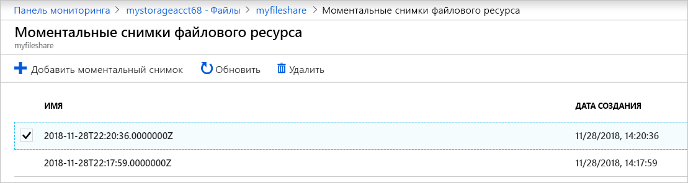

1. В области этого моментального снимка выберите файл *qsTestFile.txt*.

## Восстановление с использованием моментального снимка

1. В колонке моментального снимка общей папки щелкните файл *qsTestFile* правой кнопкой мыши и нажмите кнопку **Восстановить**.
1. Выберите **Перезаписать исходный файл**.

   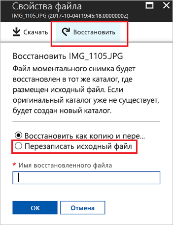

1. Откройте файл на виртуальной машине. Файл был восстановлен в первоначальной редакции.

## Удаление моментального снимка общего ресурса

1. В общей папке выберите **Просмотреть моментальные снимки**.
1. В области **Моментальные снимки файловых ресурсов**  выберите последний моментальный снимок в списке и щелкните **Удалить**.

   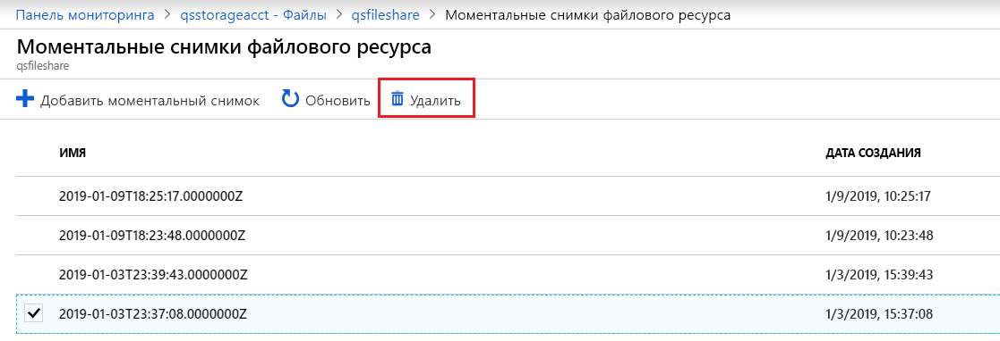

## Использование в Windows моментальных снимков общей папки

Как и локальные моментальные снимки VSS, моментальные снимки подключенной общей папки Azure можно просматривать на вкладке "Предыдущие версии".

1. В проводнике перейдите в подключенную общую папку.

   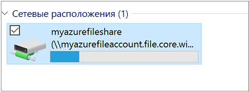

1. Выберите файл *qsTestFile.txt*, щелкните правой кнопкой мыши и в меню выберите **Свойства**.

   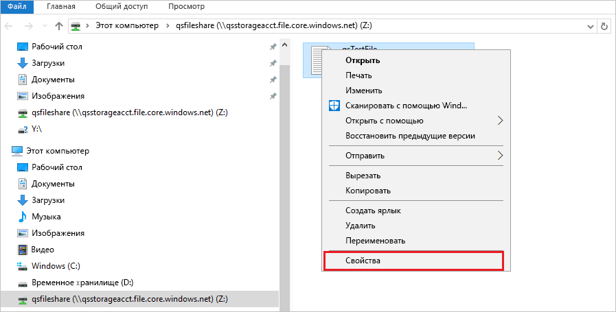

1. Выберите пункт **Предыдущие версии**, чтобы просмотреть список моментальных снимков общих ресурсов для этого каталога.

1. Чтобы открыть моментальный снимок, выберите **Открыть**.

   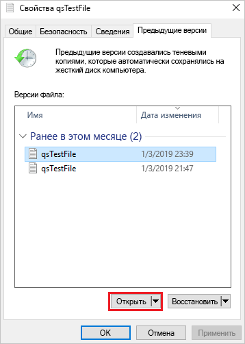

## Восстановление из предыдущей версии

1. Выберите **Восстановить**. Это действие рекурсивно копирует содержимое всего каталога в исходное расположение на момент создания моментального снимка.

   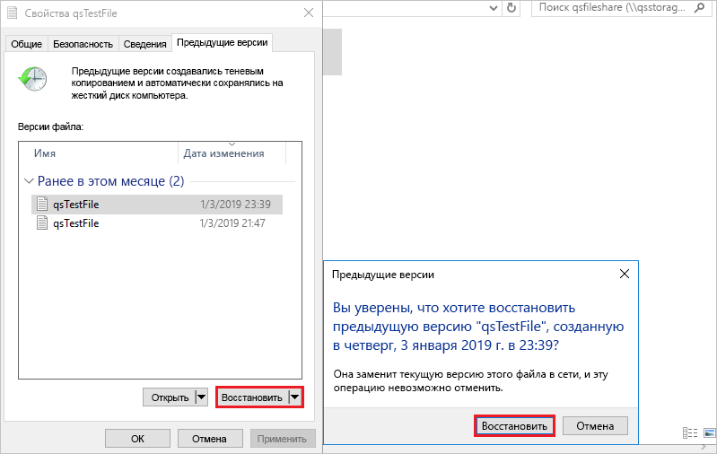 Примечание. Если файл не был изменен, предыдущая версия для этого файла не будет отображаться, так как этот файл совпадает с версией в моментальном снимке. Это схоже с принципом работы на файловом сервере Windows.

## Очистка ресурсов

[!INCLUDE [storage-files-clean-up-portal](../../../includes/storage-files-clean-up-portal.md)]

## Дополнительная информация

> [!div class="nextstepaction"]
> [Использование общей папки Azure в Windows](storage-how-to-use-files-windows.md)
