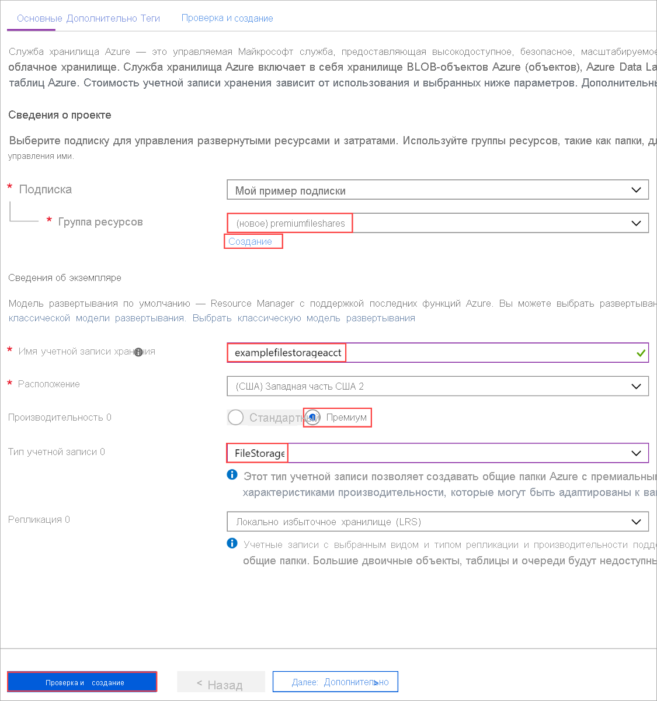

# <a name="how-to-create-an-premium-azure-file-share"></a>Создание файлового ресурса Azure уровня "Премиум"
Общие файловые ресурсы уровня "Премиум" предоставляются на носителях с твердотельным накопителем (SSD) и полезны для рабочих нагрузок, интенсивно использующих ввод-вывод, включая размещение баз данных и высокопроизводительных вычислений (HPC). Общие файловые ресурсы уровня "Премиум" размещаются в специальном типе учетной записи хранения, который называется учетной записью Филестораже. Файловые ресурсы уровня "Премиум" предназначены для высокопроизводительных и масштабируемых приложений, обеспечивая постоянную задержку, высокую скорость операций ввода-вывода и высокую пропускную способность.

В этой статье показано, как создать новый тип учетной записи с помощью [портал Azure](https://portal.azure.com/), Azure PowerShell и Azure CLI.

## <a name="prerequisites"></a>предварительным требованиям

Чтобы получить доступ к ресурсам Azure, включая общие файловые ресурсы Azure уровня "Премиум", вам потребуется подписка Azure. Если у вас еще нет подписки, вы можете [создать бесплатную учетную запись Azure](https://azure.microsoft.com/free/?WT.mc_id=A261C142F), прежде чем начинать работу.

## <a name="create-a-premium-file-share-using-the-azure-portal"></a>Создайте общую папку уровня "Премиум" с помощью портал Azure

### <a name="sign-in-to-azure"></a>Вход в Azure

Войдите на [портале Azure](https://portal.azure.com/).

### <a name="create-a-filestorage-storage-account"></a>Создание учетной записи хранения филестораже

Теперь все готово для создания учетной записи хранения.

Каждая учетная запись хранения должна принадлежать группе ресурсов Azure. Группа ресурсов — это логический контейнер для группирования служб Azure. При создании учетной записи хранения у вас есть возможность создать новую или использовать существующую группу ресурсов. В этой статье показано, как создать новую группу ресурсов.

1. В портал Azure выберите **учетные записи хранения** в меню слева.

    

1. В появившемся окне **Учетные записи хранения** выберите **добавить**.
1. Выберите подписку, в которой будет создана учетная запись хранения.
1. В поле **Группа ресурсов** выберите **Создать**. Введите имя для новой группы ресурсов, как показано на следующем рисунке.

1. Далее введите имя своей учетной записи хранения. Выбранное вами имя должно быть уникальным в Azure. Также имя должно содержать от 3 до 24 символов и может состоять только из цифр и строчных букв.
1. Выберите расположение учетной записи хранения или используйте расположение по умолчанию.
1. Для **повышения производительности** выберите **Premium**.
1. Выберите **тип учетной записи** и щелкните **филестораже**.
1. Оставьте для параметра **репликация** значение по умолчанию **локально избыточное хранилище (LRS)** .

    

1. Выберите **Просмотр и создание**, чтобы просмотреть настройки учетной записи хранения и создать учетную запись.
1. Нажмите кнопку **Создать**.

После создания ресурса учетной записи хранения перейдите к нему.

### <a name="create-a-premium-file-share"></a>Создание общей папки (цен. категория "Премиум")

1. В меню слева для учетной записи хранения перейдите к разделу **Файловая служба** , а затем выберите **файлы**.
1. Выберите Общая **Папка** , чтобы создать общую папку Premium.
1. Введите имя и требуемую квоту для общей папки, а затем нажмите кнопку **создать**.

> [!NOTE]
> Подготовленные размеры общих ресурсов задаются квотой общего доступа. Общие ресурсы выставляются по подготовленному размеру. Дополнительные сведения см. на [странице с ценами](https://azure.microsoft.com/pricing/details/storage/files/) .

   

### <a name="clean-up-resources"></a>Очистка ресурсов

Если вы хотите очистить ресурсы, созданные в этой статье, можно просто удалить группу ресурсов. При удалении группы ресурсов также удаляется связанная учетная запись хранения, а также другие ресурсы, связанные с группой ресурсов.

## <a name="create-a-premium-file-share-using-powershell"></a>Создание общей папки Premium с помощью PowerShell

### <a name="create-an-account-using-powershell"></a>Создание учетной записи с помощью PowerShell

Сначала установите последнюю версию модуля [PowerShellGet](/powershell/scripting/gallery/installing-psget).

Затем обновите модуль PowerShell, войдите в подписку Azure, создайте группу ресурсов и учетную запись хранения.

### <a name="upgrade-your-powershell-module"></a>Обновление модуля PowerShell

Для взаимодействия с файловым ресурсом уровня "Премиум" из с помощью PowerShell необходимо установить модуль AZ. Storage версии 1.4.0 или последний модуль AZ. Storage.

Сначала откройте сеанс PowerShell с повышенными разрешениями.

Установите модуль AZ. Storage.

```powershell
Install-Module Az.Storage -Repository PSGallery -AllowClobber -Force
```

### <a name="sign-in-to-your-azure-subscription"></a>Вход в подписку Azure

Чтобы выполнить проверку подлинности, используйте команду `Connect-AzAccount` и следуйте инструкциям на экране.

```powershell
Connect-AzAccount
```

### <a name="create-a-resource-group"></a>Создание группы ресурсов

Чтобы создать группу ресурсов с помощью PowerShell, выполните команду [New-AzResourceGroup](/powershell/module/az.resources/new-azresourcegroup).

```powershell
# put resource group in a variable so you can use the same group name going forward,
# without hardcoding it repeatedly
$resourceGroup = "storage-how-to-resource-group"
$location = "westus2"
New-AzResourceGroup -Name $resourceGroup -Location $location
```

### <a name="create-a-filestorage-storage-account"></a>Создание учетной записи хранения Филестораже

Чтобы создать учетную запись хранения филестораже из PowerShell, используйте команду [New-азсторажеаккаунт](/powershell/module/az.storage/New-azStorageAccount) :

```powershell
$storageAcct = New-AzStorageAccount -ResourceGroupName $resourceGroup -Name "fileshowto" -SkuName "Premium_LRS" -Location "westus2" -Kind "FileStorage"
```

### <a name="create-a-premium-file-share"></a>Создание общей папки (цен. категория "Премиум")

Теперь, когда у вас есть учетная запись Филестораже, можно создать файловый ресурс уровня "Премиум". Используйте командлет [New-азсторажешаре](/powershell/module/az.storage/New-AzStorageShare) , чтобы создать его.

> [!NOTE]
> Подготовленные размеры общих ресурсов задаются квотой общего доступа. Общие ресурсы выставляются по подготовленному размеру. Дополнительные сведения см. на [странице с ценами](https://azure.microsoft.com/pricing/details/storage/files/) .

```powershell
New-AzStorageShare `
   -Name myshare `
   -Context $storageAcct.Context
```

### <a name="clean-up-resources"></a>Очистка ресурсов

Чтобы удалить группу ресурсов и связанные с ней ресурсы, включая новую учетную запись хранения, используйте команду [Remove-AzResourceGroup](/powershell/module/az.resources/remove-azresourcegroup): 

```powershell
Remove-AzResourceGroup -Name $resourceGroup
```

## <a name="create-a-premium-file-share-using-azure-cli"></a>Создание общей папки Premium с помощью Azure CLI

Чтобы запустить Azure Cloud Shell, войдите на [портал Azure](https://portal.azure.com).

Если вы хотите войти в локальную установку интерфейса командной строки, сначала убедитесь, что у вас установлена последняя версия, а затем выполните команду Login:

```cli
az login
```

### <a name="create-a-resource-group"></a>Создание группы ресурсов

Чтобы создать группу ресурсов с помощью Azure CLI, используйте команду [az group create](/cli/azure/group).

```azurecli-interactive
az group create `
    --name files-howto-resource-group `
    --location westus2
```

### <a name="create-a-filestorage-storage-account"></a>Создание учетной записи хранения Филестораже

Чтобы создать учетную запись хранения Филестораже из Azure CLI, используйте команду [AZ Storage Account Create](/cli/azure/storage/account) .

```azurecli-interactive
az storage account create `
    --name fileshowto `
    --resource-group files-howto-resource-group `
    --location westus `
    --sku Premium_LRS `
    --kind FileStorage
```

### <a name="get-the-storage-account-key"></a>Получение ключа учетной записи хранения

Ключи учетной записи хранения контролируют доступ к ресурсам в учетной записи хранения. в этой статье мы используем ключ, чтобы создать файловый ресурс уровня "Премиум". Эти ключи автоматически создаются при создании учетной записи хранения. Ключи учетной записи хранения можно получить с помощью команды [az storage account keys list](/cli/azure/storage/account/keys).

```azurecli-interactive 
STORAGEKEY=$(az storage account keys list \
    --resource-group "myResourceGroup" \
    --account-name $STORAGEACCT \
    --query "[0].value" | tr -d '"')
```

### <a name="create-a-premium-file-share"></a>Создание общей папки (цен. категория "Премиум")

Теперь, когда у вас есть учетная запись филестораже, можно создать файловый ресурс уровня "Премиум". Чтобы создать его, используйте команду [AZ Storage Share Create](/cli/azure/storage/share) .

> [!NOTE]
> Подготовленные размеры общих ресурсов задаются квотой общего доступа. Общие ресурсы выставляются по подготовленному размеру. Дополнительные сведения см. на [странице с ценами](https://azure.microsoft.com/pricing/details/storage/files/) .

```azurecli-interactive
az storage share create \
    --account-name $STORAGEACCT \
    --account-key $STORAGEKEY \
    --name "myshare" 
```

### <a name="clean-up-resources"></a>Очистка ресурсов

Чтобы удалить группу ресурсов и связанные с ней ресурсы, включая новую учетную запись хранения, используйте команду [az group delete](/cli/azure/group).

```azurecli-interactive
az group delete --name myResourceGroup
```

## <a name="next-steps"></a>Дополнительная информация

В этой статье вы создали файловый ресурс уровня "Премиум". Чтобы узнать о производительности, предлагаемой этой учетной записью, перейдите к разделу "уровень производительности" в разделе "планирование по планированию".

> [!div class="nextstepaction"]
> [Уровни производительности файловых ресурсов](storage-files-planning.md#file-share-performance-tiers)