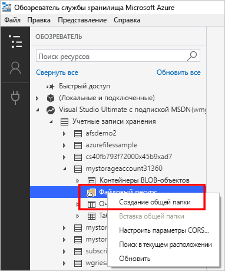
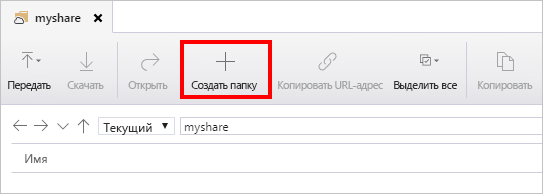

# Краткое руководство. Создание общих файловых ресурсов Azure и управление ими с помощью Обозревателя службы хранилища Azure
В этом руководстве рассматриваются основы работы с [файловыми ресурсами Azure](storage-files-introduction.md) с помощью Обозревателя службы хранилища Azure. Общие файловые ресурсы Azure отличаются от других ресурсов тем, что хранятся в облаке и поддерживаются платформой Azure. Общие файловые ресурсы Azure поддерживают отраслевой протокол SMB и позволяют совместно использовать файлы на нескольких компьютерах, а также в нескольких приложениях и экземплярах. 

Обозреватель службы хранилища Azure является популярным клиентским инструментом, доступным для Windows, macOS и Linux. Его можно использовать для управления файловыми ресурсами Azure и другими ресурсами хранения.

Если у вас еще нет подписки Azure, [создайте бесплатную учетную запись Azure](https://azure.microsoft.com/free/?WT.mc_id=A261C142F), прежде чем начинать работу.

## Предварительные требования
Для работы с этим кратким руководством необходимо установить Обозреватель службы хранилища. Чтобы загрузить и установить Обозреватель службы хранилища Azure, [перейдите по этой ссылке](https://azure.microsoft.com/features/storage-explorer/).

## Создание учетной записи хранения
С помощью Обозревателя службы хранилища невозможно создать новые ресурсы. Для этого демонстрационного проекта мы создадим учетную запись хранения на [портале Azure](https://portal.azure.com/). 

[!INCLUDE [storage-files-create-storage-account-portal](../../../includes/storage-files-create-storage-account-portal.md)]

## Подключение Обозревателя службы хранилища к ресурсам Azure
При первом запуске Обозревателя службы хранилища Microsoft Azure появляется окно **подключения**. Обозреватель службы хранилища предоставляет несколько способов подключения к учетным записям хранения. 

- **Вход через учетную запись Azure**. Вы можете выполнить вход с учетными данными пользователя вашей организации или учетной записью Майкрософт. 
- **Подключение к определенной учетной записи хранения с использованием строки подключения или токена SAS**. Строка подключения содержит имя учетной записи хранения и ключ или токен SAS этой учетной записи. При наличии токена Обозреватель службы хранилища напрямую обращается к учетной записи хранения (а не просто просматривает список всех учетных записей хранения в учетной записи Azure). Дополнительные сведения о строках подключения см. в статье [Настройка строк подключения службы хранилища Azure](../common/storage-configure-connection-string.md?toc=%2fazure%2fstorage%2ffiles%2ftoc.json).
- **Подключение к определенной учетной записи хранения с использованием ее имени и ключа**. Используйте имя и ключ учетной записи хранения для подключения к службе хранилища Azure.

В целях этого краткого руководства войдите в систему со своей учетной записью Azure. Выберите **Add an Azure Account** (Добавить учетную запись Azure), а затем нажмите кнопку **Войти**. Следуйте указаниям по входу в учетную запись Azure.

### Создание общей папки
Для создания первого файлового ресурса Azure в учетной записи `storageacct<random number>` сделайте следующее:

1. Разверните созданную учетную запись хранения.
2. Щелкните правой кнопкой мыши **Общие файловые ресурсы** и выберите **Create File Share** (Создать файловый ресурс).  
    

3. Для файлового ресурса введите *myshare* и нажмите клавишу ВВОД.

Имена общих ресурсов должны содержать только строчные буквы, цифры и отдельные дефисы, и они не могут начинаться с дефиса. Дополнительные сведения о присвоении имен общим папкам и файлам см. в статье [Naming and Referencing Shares, Directories, Files, and Metadata](https://docs.microsoft.com/rest/api/storageservices/Naming-and-Referencing-Shares--Directories--Files--and-Metadata) (Именование общих ресурсов, каталогов, файлов и метаданных и ссылка на них).

После создания файлового ресурса на правой панели откроется вкладка для него. 

## Использование общего файлового ресурса Azure
Теперь, когда файловый ресурс Azure создан, его можно подключить с помощью SMB к [Windows](storage-how-to-use-files-windows.md), [Linux](storage-how-to-use-files-linux.md) или [macOS](storage-how-to-use-files-mac.md). Кроме того, с файловым ресурсом Azure можно работать с помощью Обозревателя службы хранилища Azure. Преимущество использования Обозревателя службы хранилища Azure вместо подключения файлового ресурса по протоколу SMB заключается в том, что все запросы, созданные с помощью Обозревателя службы хранилища Azure, выполняются через REST API службы файлов. Файловый REST API можно использовать для создания, изменения и удаления файлов и каталогов на клиентах, у которых нет доступа по SMB.

### создать каталог;
Добавление каталога обеспечивает иерархическую структуру для управления файловым ресурсом. В вашем каталоге можно создать несколько уровней. Однако прежде, чем создавать подкаталог, необходимо убедиться в наличии всех родительских каталогов. Например, для пути myDirectory/mySubDirectory необходимо сначала создать каталог *myDirectory*. Затем создается *mySubDirectory*. 

1. На вкладке для файлового ресурса в верхнем меню нажмите кнопку **New Folder** (Создать папку). Откроется панель **Создать новый каталог**.
    

2. Введите имя каталога *myDirectory*, а затем нажмите кнопку **ОК**. 

Каталог *MyDirectory* будет указан на вкладке файлового ресурса *myshare*.

### Отправка файла 
Вы можете отправить файл с локального компьютера в новый каталог в вашем файловом ресурсе. Можно отправить или всю папку, или только один файл.

1. В верхнем меню выберите **Отправить**. Эта операция позволяет передать папку или файл.
2. Нажмите кнопку **Отправка файлов**, а затем выберите нужный файл на локальном компьютере.
3. В поле **Отправка в каталог** введите *myDirectory* и нажмите кнопку **Отправить**. 

По окончании процесса передачи файл появится в соответствующем списке на панели *myDirectory*.

### скачать файл;
Чтобы загрузить копию файла из файлового ресурса, щелкните файл правой кнопкой мыши и выберите пункт **Загрузить**. Выберите целевое расположение файла на своем локальном компьютере, а затем нажмите кнопку **Сохранить**.

Ход выполнения загрузки отображается в нижней части окна на панели **Действия**.

## Очистка ресурсов
Обозреватель службы хранилища невозможно использовать для удаления ресурсов. Чтобы удалить ресурсы, созданные при работе с этим кратким руководством, можно воспользоваться [порталом Azure](https://portal.azure.com/). 

[!INCLUDE [storage-files-clean-up-portal](../../../includes/storage-files-clean-up-portal.md)]

## Дополнительная информация

> [!div class="nextstepaction"]
> [Что представляет собой служба "Файлы Azure"?](storage-files-introduction.md)
