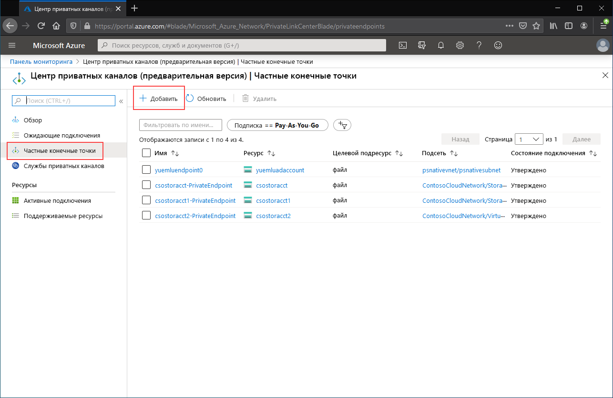
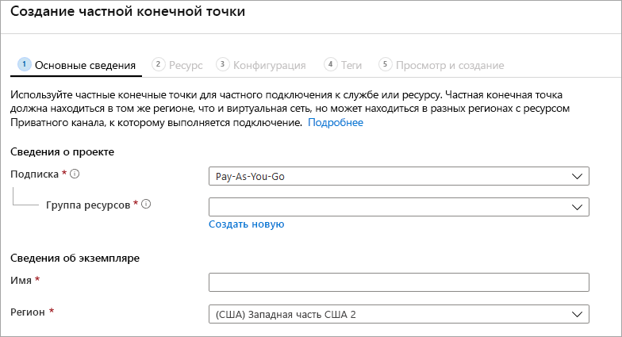

# <a name="configuring-azure-file-sync-network-endpoints"></a>Настройка сетевых конечных точек для службы "Синхронизация файлов Azure"
Службы "Файлы Azure" и "Синхронизация файлов Azure" предоставляют два основных типа конечных точек для доступа к общим папкам Azure: 
- общедоступные конечные точки, у которых есть общедоступный IP-адрес и к которым можно обращаться из любой точки мира;
- частные конечные точки, которые существуют только в виртуальной сети и имеют частный IP-адрес в пределах адресного пространства этой виртуальной сети.

Для служб "Файлы Azure" и "Синхронизация файлов Azure" объекты управления Azure, учетная запись хранения и служба синхронизации хранилища, соответственно, управляют общедоступными и частными конечными точками. Учетная запись хранения — это конструкция управления, представляющая собой общий пул носителей, который можно использовать для развертывания нескольких общих папок и других ресурсов хранения, например контейнеров больших двоичных объектов или очередей. Служба синхронизации хранилища — это управляющая конструкция, представляющая зарегистрированные серверы, которые являются файловыми серверами Windows с установленными отношениями доверия с Синхронизацией файлов Azure и группами синхронизации, определяющими топологию отношения синхронизации. 

В этой статье рассматривается настройка конечных сетевых точек для служб "Файлы Azure" и "Синхронизация файлов Azure". Дополнительные сведения о настройке сетевых конечных точек для прямого доступа к общей папке Azure вместо кэширования в локальной среде с помощью Синхронизации файлов Azure см. в статье [Настройка сетевых конечных точек в службе "Файлы Azure"](storage-files-networking-endpoints.md).

Перед изучением этого практического руководства рекомендуется ознакомиться с [рекомендациями по настройке сети для службы "Синхронизация файлов Azure"](storage-sync-files-networking-overview.md).

## <a name="prerequisites"></a>Предварительные требования 
В этой статье предполагается, что:
- у вас есть подписка Azure. Если у вас еще нет подписки, вы можете [создать бесплатную учетную запись Azure](https://azure.microsoft.com/free/?WT.mc_id=A261C142F), прежде чем начинать работу.
- Вы уже создали общую папку Azure в учетной записи хранения, к которой вы будете подключаться из локальной среды. Чтобы узнать, как создать общую папку Azure, ознакомьтесь с [этой статьей](storage-how-to-create-file-share.md).
- Вы уже создали службу синхронизации хранилища и зарегистрировали в ней свой файловый сервер Windows. Сведения о развертывании службы "Синхронизация файлов Azure" см. в разделе [Развертывание службы "Синхронизация файлов Azure"](storage-sync-files-deployment-guide.md).

Дополнительно:
- Если вы хотите использовать Azure PowerShell, [установите последнюю версию](/powershell/azure/install-az-ps).
- Если вы хотите использовать Azure CLI, [установите последнюю версию](/cli/azure/install-azure-cli?view=azure-cli-latest&preserve-view=true).

## <a name="create-the-private-endpoints"></a>Создание частной конечной точки
При создании частной конечной точки для ресурса Azure развертываются следующие ресурсы.

- **Частная конечная точка.** Ресурс Azure, представляющий частную конечную точку для учетной записи хранения или службу синхронизации хранилища. Его можно рассматривать как ресурс для подключения вашего ресурса Azure и сетевого интерфейса.
- **Сетевой интерфейс.** Сетевой интерфейс с поддержкой частного IP-адреса в указанной виртуальной сети или подсети. Это тот же ресурс, который автоматически развертывается при развертывании виртуальной машины, но он назначается не виртуальной машине, а частной конечной точке.
- **Частная зона DNS.** Если вы никогда не развертывали частную конечную точку для этой виртуальной сети, для нее будет развернута новая частная зона DNS. В этой зоне DNS также будет создана запись DNS типа A для ресурса Azure. Если вы уже развертывали частную конечную точку в этой виртуальной сети, новая запись типа A для ресурса Azure будет добавлена в существующую зону DNS. Развертывание зоны DNS не обязательно, но настоятельно рекомендуется для упрощения необходимого управления DNS.

> [!Note]  
> В этой статье используются DNS-суффиксы для общедоступных регионов Azure: `core.windows.net` для учетных записей хранения и `afs.azure.net` для служб синхронизации хранилища. Этот комментарий также относится и к национальным облакам Azure, таким как облако Azure для государственных организаций США. Вам придется лишь заменить суффиксы на другие, соответствующие вашей среде.

### <a name="create-the-storage-account-private-endpoint"></a>Создание частной конечной точки для учетной записи хранения
# <a name="portal"></a>[Портал](#tab/azure-portal)
[!INCLUDE [storage-files-networking-endpoints-private-portal](../../../includes/storage-files-networking-endpoints-private-portal.md)]

Если у вас есть виртуальная машина в виртуальной сети или настроена переадресация DNS, как описано в разделе [Настройка переадресации DNS для Файлов Azure](storage-files-networking-dns.md), правильность настройки частной конечной точки можно проверить, выполнив следующие команды в PowerShell, командной строке или терминале (работает для Windows, Linux или macOS). Замените `<storage-account-name>` реальным именем учетной записи хранения.

```
nslookup <storage-account-name>.file.core.windows.net
```

Если все пройдет успешно, вы увидите следующие выходные данные, где `192.168.0.5` обозначает частный IP-адрес частной конечной точки в виртуальной сети (здесь представлены выходные данные в среде Windows):

```Output
Server:  UnKnown
Address:  10.2.4.4

Non-authoritative answer:
Name:    storageaccount.privatelink.file.core.windows.net
Address:  192.168.0.5
Aliases:  storageaccount.file.core.windows.net
```

# <a name="powershell"></a>[PowerShell](#tab/azure-powershell)
[!INCLUDE [storage-files-networking-endpoints-private-powershell](../../../includes/storage-files-networking-endpoints-private-powershell.md)]

Если у вас есть виртуальная машина в виртуальной сети или настроена переадресация DNS, как описано в разделе [Настройка переадресации DNS для Файлов Azure](storage-files-networking-dns.md), правильность настройки частной конечной точки можно проверить, выполнив следующие команды:

```PowerShell
$storageAccountHostName = [System.Uri]::new($storageAccount.PrimaryEndpoints.file) | `
    Select-Object -ExpandProperty Host

Resolve-DnsName -Name $storageAccountHostName
```

Если все пройдет успешно, вы увидите следующие выходные данные, где `192.168.0.5` обозначает частный IP-адрес частной конечной точки в виртуальной сети:

```Output
Name                             Type   TTL   Section    NameHost
----                             ----   ---   -------    --------
storageaccount.file.core.windows CNAME  60    Answer     storageaccount.privatelink.file.core.windows.net
.net

Name       : storageaccount.privatelink.file.core.windows.net
QueryType  : A
TTL        : 600
Section    : Answer
IP4Address : 192.168.0.5
```

# <a name="azure-cli"></a>[Azure CLI](#tab/azure-cli)
[!INCLUDE [storage-files-networking-endpoints-private-cli](../../../includes/storage-files-networking-endpoints-private-cli.md)]

Если у вас есть виртуальная машина в виртуальной сети или настроена переадресация DNS, как описано в разделе [Настройка переадресации DNS для Файлов Azure](storage-files-networking-dns.md), правильность настройки частной конечной точки можно проверить, выполнив следующие команды:

```bash
httpEndpoint=$(az storage account show \
        --resource-group $storageAccountResourceGroupName \
        --name $storageAccountName \
        --query "primaryEndpoints.file" | \
    tr -d '"')

hostName=$(echo $httpEndpoint | cut -c7-$(expr length $httpEndpoint) | tr -d "/")
nslookup $hostName
```

Если все пройдет успешно, вы увидите следующие выходные данные, где `192.168.0.5` обозначает частный IP-адрес частной конечной точки в виртуальной сети:

```Output
Server:         127.0.0.53
Address:        127.0.0.53#53

Non-authoritative answer:
storageaccount.file.core.windows.net      canonical name = storageaccount.privatelink.file.core.windows.net.
Name:   storageaccount.privatelink.file.core.windows.net
Address: 192.168.0.5
```

---

### <a name="create-the-storage-sync-private-endpoint"></a>Создание частной конечной точки для службы синхронизации хранилища
> [!Important]  
> Чтобы использовать частные конечные точки в ресурсе службы синхронизации хранилища, необходим агент Синхронизации файлов Azure версии 10.1 или более поздней версии. Версии агента до 10.1 не поддерживают частные конечные точки в службе синхронизации хранилища. Все предыдущие версии агентов поддерживают частные конечные точки в ресурсе учетной записи хранения.

# <a name="portal"></a>[Портал](#tab/azure-portal)
Перейдите в **Центр приватных каналов**, введя *Private Link* (Приватный канал) в поле поиска, которое находится вверху на портале Azure. В списке содержимого Центра приватных каналов выберите **Частные конечные точки**, а затем нажмите кнопку **+ Добавить**, чтобы создать новую частную конечную точку.

[](media/storage-sync-files-networking-endpoints/create-storage-sync-private-endpoint-0.png#lightbox)

В мастере нужно будет заполнить несколько страниц.

В колонке **Основные сведения** выберите нужную группу ресурсов, имя и регион для частной конечной точки. Они могут быть любыми, но не должны каким-либо образом соответствовать службе синхронизации хранилища, хотя вы должны создать частную конечную точку в том же регионе, что и виртуальная сеть, в которой вы хотите ее создать.



В колонке **Ресурс** установите переключатель рядом с пунктом **Подключиться к ресурсу Azure в моем каталоге**. В разделе **Тип ресурса** выберите **Microsoft.StorageSync/storageSyncServices** в качестве типа. 

В колонке **Конфигурация** можно выбрать определенную виртуальную сеть и подсеть, в которую вы хотите добавить частную конечную точку. Выберите ту же виртуальную сеть, которую использовали выше для учетной записи хранения. В колонке "Конфигурация" также содержатся сведения для создания или обновления частной зоны DNS.

Щелкните **Просмотр и создание**, чтобы создать частную конечную точку.

Чтобы проверить правильность настройки вашей частной конечной точки, выполните в PowerShell следующие команды. 

```powershell
$privateEndpointResourceGroupName = "<your-private-endpoint-resource-group>"
$privateEndpointName = "<your-private-endpoint-name>"

Get-AzPrivateEndpoint `
        -ResourceGroupName $privateEndpointResourceGroupName `
        -Name $privateEndpointName `
        -ErrorAction Stop | `
    Select-Object -ExpandProperty NetworkInterfaces | `
    Select-Object -ExpandProperty Id | `
    ForEach-Object { Get-AzNetworkInterface -ResourceId $_ } | `
    Select-Object -ExpandProperty IpConfigurations | `
    Select-Object -ExpandProperty PrivateLinkConnectionProperties | `
    Select-Object -ExpandProperty Fqdns | `
    ForEach-Object { Resolve-DnsName -Name $_ } | `
    Format-List
```

Если все пройдет успешно, вы увидите следующие выходные данные, где `192.168.1.4`, `192.168.1.5`, `192.168.1.6` и `192.168.1.7` — частные IP-адреса, назначенные этой частной конечной точке.

```Output
Name     : mysssmanagement.westus2.afs.azure.net
Type     : CNAME
TTL      : 60
Section  : Answer
NameHost : mysssmanagement.westus2.privatelink.afs.azure.net


Name       : mysssmanagement.westus2.privatelink.afs.azure.net
QueryType  : A
TTL        : 60
Section    : Answer
IP4Address : 192.168.1.4

Name     : myssssyncp.westus2.afs.azure.net
Type     : CNAME
TTL      : 60
Section  : Answer
NameHost : myssssyncp.westus2.privatelink.afs.azure.net


Name       : myssssyncp.westus2.privatelink.afs.azure.net
QueryType  : A
TTL        : 60
Section    : Answer
IP4Address : 192.168.1.5

Name     : myssssyncs.westus2.afs.azure.net
Type     : CNAME
TTL      : 60
Section  : Answer
NameHost : myssssyncs.westus2.privatelink.afs.azure.net


Name       : myssssyncs.westus2.privatelink.afs.azure.net
QueryType  : A
TTL        : 60
Section    : Answer
IP4Address : 192.168.1.6

Name     : mysssmonitoring.westus2.afs.azure.net
Type     : CNAME
TTL      : 60
Section  : Answer
NameHost : mysssmonitoring.westus2.privatelink.afs.azure.net


Name       : mysssmonitoring.westus2.privatelink.afs.azure.net
QueryType  : A
TTL        : 60
Section    : Answer
IP4Address : 192.168.1.7

```

# <a name="powershell"></a>[PowerShell](#tab/azure-powershell)
Чтобы создать частную конечную точку для вашей службы синхронизации хранилища, сначала нужно получить ссылку на эту службу синхронизации хранилища. Не забудьте заменить `<storage-sync-service-resource-group>` и `<storage-sync-service>` соответствующими значениями из своей среды. В следующих командах PowerShell предполагается, что вы уже заполнили сведения о виртуальной сети, как описано выше. 

```powershell
$storageSyncServiceResourceGroupName = "<storage-sync-service-resource-group>"
$storageSyncServiceName = "<storage-sync-service>"

$storageSyncService = Get-AzStorageSyncService `
        -ResourceGroupName $storageSyncServiceResourceGroupName `
        -Name $storageSyncServiceName `
        -ErrorAction SilentlyContinue

if ($null -eq $storageSyncService) {
    $errorMessage = "Storage Sync Service $storageSyncServiceName not found "
    $errorMessage += "in resource group $storageSyncServiceResourceGroupName."
    Write-Error -Message $errorMessage -ErrorAction Stop
}
```

Чтобы создать частную конечную точку, необходимо создать подключение службы Приватного канала к службе синхронизации хранилища. Подключение Приватного канала передается как входные данные для создания частной конечной точки.

```PowerShell 
# Disable private endpoint network policies
$subnet.PrivateEndpointNetworkPolicies = "Disabled"
$virtualNetwork = $virtualNetwork | `
    Set-AzVirtualNetwork -ErrorAction Stop

# Create a private link service connection to the storage account.
$privateEndpointConnection = New-AzPrivateLinkServiceConnection `
        -Name "$storageSyncServiceName-Connection" `
        -PrivateLinkServiceId $storageSyncService.ResourceId `
        -GroupId "Afs" `
        -ErrorAction Stop

# Create a new private endpoint.
$privateEndpoint = New-AzPrivateEndpoint `
        -ResourceGroupName $storageSyncServiceResourceGroupName `
        -Name "$storageSyncServiceName-PrivateEndpoint" `
        -Location $virtualNetwork.Location `
        -Subnet $subnet `
        -PrivateLinkServiceConnection $privateEndpointConnection `
        -ErrorAction Stop
```

Создание частной зоны DNS Azure позволяет разрешать имена узлов для службы синхронизации хранилища, такие как `mysssmanagement.westus2.afs.azure.net`, в правильные частные IP-адреса для службы синхронизации хранилища в виртуальной сети. Это не нужно для создания частной конечной точки, но требуется для доступа агента Синхронизации файлов Azure к службе синхронизации хранилища. 

```powershell
# Get the desired Storage Sync Service suffix (afs.azure.net for public cloud).
# This is done like this so this script will seamlessly work for non-public Azure.
$azureEnvironment = Get-AzContext | `
    Select-Object -ExpandProperty Environment | `
    Select-Object -ExpandProperty Name

switch($azureEnvironment) {
    "AzureCloud" {
        $storageSyncSuffix = "afs.azure.net"
    }

    "AzureUSGovernment" {
        $storageSyncSuffix = "afs.azure.us"
    }
    
    default {
        Write-Error 
                -Message "The Azure environment $_ is not currently supported by Azure File Sync." `
                -ErrorAction Stop
    }
}

# For public cloud, this will generate the following DNS suffix:
# privatelink.afs.azure.net
$dnsZoneName = "privatelink.$storageSyncSuffix"

# Find a DNS zone matching desired name attached to this virtual network.
$dnsZone = Get-AzPrivateDnsZone | `
    Where-Object { $_.Name -eq $dnsZoneName } | `
    Where-Object {
        $privateDnsLink = Get-AzPrivateDnsVirtualNetworkLink `
                -ResourceGroupName $_.ResourceGroupName `
                -ZoneName $_.Name `
                -ErrorAction SilentlyContinue
        
        $privateDnsLink.VirtualNetworkId -eq $virtualNetwork.Id
    }

if ($null -eq $dnsZone) {
    # No matching DNS zone attached to virtual network, so create new one.
    $dnsZone = New-AzPrivateDnsZone `
            -ResourceGroupName $virtualNetworkResourceGroupName `
            -Name $dnsZoneName `
            -ErrorAction Stop

    $privateDnsLink = New-AzPrivateDnsVirtualNetworkLink `
            -ResourceGroupName $virtualNetworkResourceGroupName `
            -ZoneName $dnsZoneName `
            -Name "$virtualNetworkName-DnsLink" `
            -VirtualNetworkId $virtualNetwork.Id `
            -ErrorAction Stop
}
```
Теперь, когда у вас есть ссылка на частную зону DNS, нужно создать запись типа A для службы синхронизации хранилища.

```PowerShell 
$privateEndpointIpFqdnMappings = $privateEndpoint | `
    Select-Object -ExpandProperty NetworkInterfaces | `
    Select-Object -ExpandProperty Id | `
    ForEach-Object { Get-AzNetworkInterface -ResourceId $_ } | `
    Select-Object -ExpandProperty IpConfigurations | `
    ForEach-Object { 
        $privateIpAddress = $_.PrivateIpAddress; 
        $_ | `
            Select-Object -ExpandProperty PrivateLinkConnectionProperties | `
            Select-Object -ExpandProperty Fqdns | `
            Select-Object `
                @{ 
                    Name = "PrivateIpAddress"; 
                    Expression = { $privateIpAddress } 
                }, `
                @{ 
                    Name = "FQDN"; 
                    Expression = { $_ } 
                } 
    }

foreach($ipFqdn in $privateEndpointIpFqdnMappings) {
    $privateDnsRecordConfig = New-AzPrivateDnsRecordConfig `
        -IPv4Address $ipFqdn.PrivateIpAddress
    
    $dnsEntry = $ipFqdn.FQDN.Substring(0, 
        $ipFqdn.FQDN.IndexOf(".", $ipFqdn.FQDN.IndexOf(".") + 1))

    New-AzPrivateDnsRecordSet `
            -ResourceGroupName $virtualNetworkResourceGroupName `
            -Name $dnsEntry `
            -RecordType A `
            -ZoneName $dnsZoneName `
            -Ttl 600 `
            -PrivateDnsRecords $privateDnsRecordConfig `
            -ErrorAction Stop | `
        Out-Null
}
```

# <a name="azure-cli"></a>[Azure CLI](#tab/azure-cli)
Чтобы создать частную конечную точку для вашей службы синхронизации хранилища, сначала нужно получить ссылку на эту службу синхронизации хранилища. Не забудьте заменить `<storage-sync-service-resource-group>` и `<storage-sync-service>` соответствующими значениями из своей среды. В следующих командах CLI предполагается, что вы уже заполнили сведения о виртуальной сети, как описано выше. 

```bash
storageSyncServiceResourceGroupName="<storage-sync-service-resource-group>"
storageSyncServiceName="<storage-sync-service>"

storageSyncService=$(az resource show \
        --resource-group $storageSyncServiceResourceGroupName \
        --name $storageSyncServiceName \
        --resource-type "Microsoft.StorageSync/storageSyncServices" \
        --query "id" | \
    tr -d '"')

storageSyncServiceRegion=$(az resource show \
        --resource-group $storageSyncServiceResourceGroupName \
        --name $storageSyncServiceName \
        --resource-type "Microsoft.StorageSync/storageSyncServices" \
        --query "location" | \
    tr -d '"')
```

Чтобы создать частную конечную точку, необходимо убедиться, что для частной конечной точки подсети отключена политика сети. Затем создайте частную конечную точку с помощью команды `az network private-endpoint create`.

```bash
# Disable private endpoint network policies
az network vnet subnet update \
        --ids $subnet \
        --disable-private-endpoint-network-policies \
        --output none

# Get virtual network location
region=$(az network vnet show \
        --ids $virtualNetwork \
        --query "location" | \
    tr -d '"')

# Create a private endpoint
privateEndpoint=$(az network private-endpoint create \
        --resource-group $storageSyncServiceResourceGroupName \
        --name "$storageSyncServiceName-PrivateEndpoint" \
        --location $region \
        --subnet $subnet \
        --private-connection-resource-id $storageSyncService \
        --group-id "Afs" \
        --connection-name "$storageSyncServiceName-Connection" \
        --query "id" | \
    tr -d '"')
```

Создание частной зоны DNS Azure позволяет разрешать имена узлов для службы синхронизации хранилища, такие как `mysssmanagement.westus2.afs.azure.net`, в правильные частные IP-адреса для службы синхронизации хранилища в виртуальной сети. Это не нужно для создания частной конечной точки, но требуется для доступа агента Синхронизации файлов Azure к службе синхронизации хранилища. 

```bash
# Get the desired storage account suffix (afs.azure.net for public cloud).
# This is done like this so this script will seamlessly work for non-public Azure.
azureEnvironment=$(az cloud show \
        --query "name" |
    tr -d '"')

storageSyncSuffix=""
if [ $azureEnvironment == "AzureCloud" ]
then
    storageSyncSuffix="afs.azure.net"
elif [ $azureEnvironment == "AzureUSGovernment" ]
then
    storageSyncSuffix="afs.azure.us"
else
    echo "Unsupported Azure environment $azureEnvironment."
fi

# For public cloud, this will generate the following DNS suffix:
# privatelinke.afs.azure.net.
dnsZoneName="privatelink.$storageSyncSuffix"

# Find a DNS zone matching desired name attached to this virtual network.
possibleDnsZones=""
possibleDnsZones=$(az network private-dns zone list \
        --query "[?name == '$dnsZoneName'].id" \
        --output tsv)

dnsZone=""
possibleDnsZone=""
for possibleDnsZone in $possibleDnsZones
do
    possibleResourceGroupName=$(az resource show \
            --ids $possibleDnsZone \
            --query "resourceGroup" | \
        tr -d '"')
    
    link=$(az network private-dns link vnet list \
            --resource-group $possibleResourceGroupName \
            --zone-name $dnsZoneName \
            --query "[?virtualNetwork.id == '$virtualNetwork'].id" \
            --output tsv)
    
    if [ -z $link ]
    then
        echo "1" > /dev/null
    else 
        dnsZoneResourceGroup=$possibleResourceGroupName
        dnsZone=$possibleDnsZone
        break
    fi  
done

if [ -z $dnsZone ]
then
    # No matching DNS zone attached to virtual network, so create a new one
    dnsZone=$(az network private-dns zone create \
            --resource-group $virtualNetworkResourceGroupName \
            --name $dnsZoneName \
            --query "id" | \
        tr -d '"')
    
    az network private-dns link vnet create \
            --resource-group $virtualNetworkResourceGroupName \
            --zone-name $dnsZoneName \
            --name "$virtualNetworkName-DnsLink" \
            --virtual-network $virtualNetwork \
            --registration-enabled false \
            --output none
    
    dnsZoneResourceGroup=$virtualNetworkResourceGroupName
fi
```

Теперь, когда у вас есть ссылка на частную зону DNS, нужно создать запись типа A для службы синхронизации хранилища.

```bash
privateEndpointNIC=$(az network private-endpoint show \
        --ids $privateEndpoint \
        --query "networkInterfaces[0].id" | \
    tr -d '"')

privateIpAddresses=$(az network nic show \
        --ids $privateEndpointNIC \
        --query "ipConfigurations[].privateIpAddress" \
        --output tsv) 

hostNames=$(az network nic show \
        --ids $privateEndpointNIC \
        --query "ipConfigurations[].privateLinkConnectionProperties.fqdns[]" \
        --output tsv)

i=0
for privateIpAddress in $privateIpAddresses
do
    j=0
    targetHostName=""
    for hostName in $hostNames
    do
        if [ $i == $j ]
        then
            targetHostName=$hostName
            break
        fi

        j=$(expr $j + 1)
    done

    endpointName=$(echo $targetHostName | \
        cut -c1-$(expr $(expr index $targetHostName ".") - 1))

    az network private-dns record-set a create \
        --resource-group $dnsZoneResourceGroup \
        --zone-name $dnsZoneName \
        --name "$endpointName.$storageSyncServiceRegion" \
        --output none
    
    az network private-dns record-set a add-record \
        --resource-group $dnsZoneResourceGroup \
        --zone-name $dnsZoneName \
        --record-set-name "$endpointName.$storageSyncServiceRegion" \
        --ipv4-address $privateIpAddress \
        --output none

    i=$(expr $i + 1)
done
```
---

## <a name="restrict-access-to-the-public-endpoints"></a>Ограничение доступа к общедоступным конечным точкам
Вы можете ограничить доступ к общедоступным конечным точкам как учетной записи хранения, так и службы синхронизации хранилища. Ограничение доступа к общедоступной конечной точке позволяет повысить уровень защиты, так как будут приниматься только сетевые пакеты из утвержденных расположений. 

### <a name="restrict-access-to-the-storage-account-public-endpoint"></a>Ограничение доступа к общедоступной конечной точке учетной записи хранения
Вы можете ограничить доступ к общедоступной конечной точке, настроив параметры брандмауэра учетной записи хранения. Как правило, большинство политик брандмауэра учетной записи хранения разрешают сетевой доступ из одной или нескольких виртуальных сетей. Вы можете использовать два подхода к ограничению доступа к учетной записи хранения из виртуальных сетей.

- [Создайте одну или несколько частных конечных точек для учетной записи хранения](#create-the-storage-account-private-endpoint) и отключите доступ к общедоступной конечной точке. Так вы будете уверены, что доступ к общим папкам Azure в этой учетной записи хранения возможен только для запросов, создаваемых внутри настроенных виртуальных сетей.
- Ограничьте доступ к общедоступной конечной точке одной или несколькими виртуальными сетями. Это достигается за счет возможности виртуальной сети под названием *конечная точка службы*. Ограничивая трафик к учетной записи хранения путем использования конечной точки службы, вы сохраняете доступ через общедоступный IP-адрес.

#### <a name="disable-access-to-the-storage-account-public-endpoint"></a>Отключение доступа к общедоступной конечной точке учетной записи хранения
Если доступ к общедоступной конечной точке отключен, к учетной записи хранения можно обращаться только через частные конечные точки. Даже допустимые запросы к общедоступной конечной точке учетной записи хранения будут отклоняться. 

# <a name="portal"></a>[Портал](#tab/azure-portal)
[!INCLUDE [storage-files-networking-endpoints-public-disable-portal](../../../includes/storage-files-networking-endpoints-public-disable-portal.md)]

# <a name="powershell"></a>[PowerShell](#tab/azure-powershell)
[!INCLUDE [storage-files-networking-endpoints-public-disable-powershell](../../../includes/storage-files-networking-endpoints-public-disable-powershell.md)]

# <a name="azure-cli"></a>[Azure CLI](#tab/azure-cli)
[!INCLUDE [storage-files-networking-endpoints-public-disable-cli](../../../includes/storage-files-networking-endpoints-public-disable-cli.md)]

---

#### <a name="restrict-access-to-the-storage-account-public-endpoint-to-specific-virtual-networks"></a>Ограничьте доступ к общедоступной конечной точке учетной записи хранения определенными виртуальными сетями.
Определив доступ к учетной записи хранения для определенных виртуальных сетей, вы разрешите доступ к общедоступной конечной точке только из этих виртуальных сетей. Это достигается за счет возможности виртуальной сети под названием *конечная точка службы*. Ее можно использовать с частными конечными точками или без них.

# <a name="portal"></a>[Портал](#tab/azure-portal)
[!INCLUDE [storage-files-networking-endpoints-public-restrict-portal](../../../includes/storage-files-networking-endpoints-public-restrict-portal.md)]

# <a name="powershell"></a>[PowerShell](#tab/azure-powershell)
[!INCLUDE [storage-files-networking-endpoints-public-restrict-powershell](../../../includes/storage-files-networking-endpoints-public-restrict-powershell.md)]

# <a name="azure-cli"></a>[Azure CLI](#tab/azure-cli)
[!INCLUDE [storage-files-networking-endpoints-public-restrict-cli](../../../includes/storage-files-networking-endpoints-public-restrict-cli.md)]

---

### <a name="disable-access-to-the-storage-sync-service-public-endpoint"></a>Отключение доступа к общедоступной конечной точке службы синхронизации хранилища
Синхронизация файлов Azure позволяет разрешать доступ к определенным виртуальным сетям только через частные конечные точки; Синхронизация файлов Azure не поддерживает конечные точки служб для разрешения доступа к общедоступной конечной точке только определенным виртуальным сетям. Это означает, что общедоступная конечная точка для службы синхронизации хранилища может быть либо включена, либо отключена.

# <a name="portal"></a>[Портал](#tab/azure-portal)
На портале Azure это сделать невозможно. Перейдите на вкладку Azure PowerShell, чтобы получить инструкции по отключению общедоступной конечной точки службы синхронизации хранилища. 

# <a name="powershell"></a>[PowerShell](#tab/azure-powershell)
Для отключения доступа к общедоступной точке доступа службы синхронизации хранилища мы установим значение `AllowVirtualNetworksOnly` для свойства `incomingTrafficPolicy` службы синхронизации хранилища. Если вы захотите включить доступ к общедоступной конечной точке службы синхронизации хранилища, установите для свойства `incomingTrafficPolicy` значение `AllowAllTraffic`. Не забудьте заменить `<storage-sync-service-resource-group>` и `<storage-sync-service>`.

```powershell
$storageSyncServiceResourceGroupName = "<storage-sync-service-resource-group>"
$storageSyncServiceName = "<storage-sync-service>"

$storageSyncService = Get-AzResource `
        -ResourceGroupName $storageSyncServiceResourceGroupName `
        -ResourceName $storageSyncServiceName `
        -ResourceType "Microsoft.StorageSync/storageSyncServices"

$storageSyncService.Properties.incomingTrafficPolicy = "AllowVirtualNetworksOnly"
$storageSyncService = $storageSyncService | Set-AzResource -Confirm:$false -Force -UsePatchSemantics
```

# <a name="azure-cli"></a>[Azure CLI](#tab/azure-cli)
<a name="azure-cli-does-not-support-setting-the-incomingtrafficpolicy-property-on-the-storage-sync-service-please-select-the-azure-powershell-tab-to-get-instructions-on-how-to-disable-the-storage-sync-service-public-endpoint"></a>Azure CLI не поддерживает задание `incomingTrafficPolicy` свойства в службе синхронизации хранилища. Перейдите на вкладку Azure PowerShell, чтобы получить инструкции по отключению общедоступной конечной точки службы синхронизации хранилища.
---

## <a name="see-also"></a>См. также раздел
- [Планирование развертывания службы синхронизации файлов Azure (предварительная версия)](storage-sync-files-planning.md)
- [Развертывание Синхронизации файлов Azure](storage-sync-files-deployment-guide.md)
