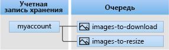

# Что такое очереди Azure?

Хранилище очередей Azure — это служба для хранения большого количества сообщений, к которым можно получить доступ практически из любой точки мира с помощью вызовов с проверкой подлинности по протоколам HTTP или HTTPS. Одно сообщение очереди может быть размером до 64 КБ, а очередь может содержать миллионы сообщений до общего ограничения емкости учетной записи хранения.

## Распространенные варианты использования

Наиболее частые способы использования хранилища очередей включают:

* создание списка невыполненных работ для асинхронной обработки;
* передачу сообщений из веб-роли Azure в рабочую роль Azure.

## Основные понятия службы очередей

Служба очереди содержит следующие компоненты:

* **Формат URL-адреса**. К очереди можно обратиться, используя следующий формат URL-адреса:   
    https://`<storage account>`.queue.core.windows.net/`<queue>` 
  
    Следующий URL-адрес позволяет обратиться к очереди на схеме:  
  
    `https://myaccount.queue.core.windows.net/images-to-download`

* **Учетная запись хранения**. Весь доступ к хранилищу Azure осуществляется с помощью учетной записи хранения. Сведения об емкости учетной записи хранения см. в статье [Целевые показатели масштабируемости и производительности службы хранилища Azure](../common/storage-scalability-targets.md?toc=%2fazure%2fstorage%2fqueues%2ftoc.json).

* **Очередь**. Очередь содержит набор сообщений. Все сообщения должны находиться в очереди. Обратите внимание: имя очереди должно содержать только строчные символы. Дополнительные сведения см. в статье о [присвоении имен очередям и метаданным](https://msdn.microsoft.com/library/azure/dd179349.aspx).

* **Сообщение**. Сообщение в любом формате размером до 64 КБ. Сообщение может оставаться в очереди не более 7 дней.

## Дополнительная информация

* [создать учетную запись хранения;](../storage-create-storage-account.md?toc=%2fazure%2fstorage%2fqueues%2ftoc.json)
* [Начало работы с очередями с использованием .NET](storage-dotnet-how-to-use-queues.md)
