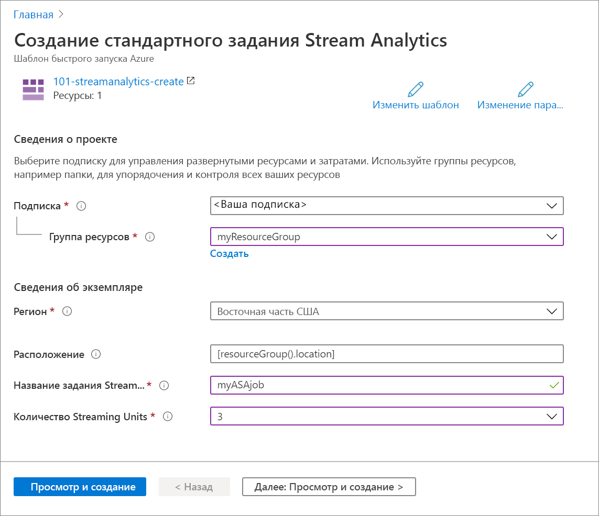

# <a name="quickstart-create-an-azure-stream-analytics-job-by-using-an-arm-template"></a>Краткое руководство. Создание задания Azure Stream Analytics с помощью шаблона ARM

В этом кратком руководстве для создания задания Azure Stream Analytics используется шаблон Azure Resource Manager (ARM). После создания задания необходимо проверить развертывание.

[!INCLUDE [About Azure Resource Manager](../../includes/resource-manager-quickstart-introduction.md)]

Если среда соответствует предварительным требованиям и вы знакомы с использованием шаблонов ARM, нажмите кнопку **Развертывание в Azure**. Шаблон откроется на портале Azure.

[](https://portal.azure.com/#create/Microsoft.Template/uri/https%3A%2F%2Fraw.githubusercontent.com%2FAzure%2Fazure-quickstart-templates%2Fmaster%2F101-streamanalytics-create%2Fazuredeploy.json)

## <a name="prerequisites"></a>Предварительные требования

Для работы с этой статьей необходимо иметь:

* подписку Azure ([создайте бесплатную учетную запись](https://azure.microsoft.com/free/)).

## <a name="review-the-template"></a>Изучение шаблона

Шаблон, используемый в этом кратком руководстве, взят из [шаблонов быстрого запуска Azure](https://azure.microsoft.com/resources/templates/101-streamanalytics-create/).

:::code language="json" source="~/quickstart-templates/101-streamanalytics-create/azuredeploy.json":::

Ресурс Azure, определенный в шаблоне — [Microsoft.StreamAnalytics/StreamingJobs](/azure/templates/microsoft.streamanalytics/streamingjobs). Создайте задание Azure Stream Analytics.

## <a name="deploy-the-template"></a>Развертывание шаблона

В этом разделе описано, как создать задание Azure Stream Analytics с помощью шаблона ARM.

1. Выберите следующее изображение, чтобы войти на портал Azure и открыть шаблон. Шаблон создает задание Azure Stream Analytics.

   [](https://portal.azure.com/#create/Microsoft.Template/uri/https%3A%2F%2Fraw.githubusercontent.com%2FAzure%2Fazure-quickstart-templates%2Fmaster%2F101-streamanalytics-create%2Fazuredeploy.json)

2. Укажите необходимые значения для создания задания Azure Stream Analytics.

   

   Укажите следующие значения.

   |Свойство  |Описание  |
   |---------|---------|
   |**Подписка**     | Выберите подписку Azure в раскрывающемся списке.        |
   |**Группа ресурсов**     | Укажите, следует ли создать новую группу ресурсов или использовать имеющуюся. Группа ресурсов — это контейнер, содержащий связанные ресурсы для решения Azure. Дополнительные сведения см. в [обзоре группы ресурсов Azure](../azure-resource-manager/management/overview.md). |
   |**Регион**     | Выберите **Восточная часть США**. Другие доступные регионы см. в статье о [доступности служб Azure по регионам](https://azure.microsoft.com/regions/services/).        |
   |**Имя задания Stream Analytics**     | Укажите имя задания Stream Analytics.      |
   |**Количество единиц потоковой передачи**     |  Выберите необходимое число единиц потоковой передачи. Дополнительные сведения см. в статье [Обзор и настройка единиц потоковой передачи](stream-analytics-streaming-unit-consumption.md).       |

3. Выберите **Проверить и создать**, а затем — **Создать**.

## <a name="review-deployed-resources"></a>Просмотр развернутых ресурсов

Вы можете использовать портал Azure, чтобы проверить задание Azure Stream Analytics, а также следующие скрипты Azure CLI или Azure PowerShell, чтобы просмотреть ресурс.

### <a name="azure-cli"></a>Azure CLI

```azurecli-interactive
echo "Enter your Azure Stream Analytics job name:" &&
read streamAnalyticsJobName &&
echo "Enter the resource group where the Azure Stream Analytics job exists:" &&
read resourcegroupName &&
az stream-analytics job show -g $resourcegroupName -n $streamAnalyticsJobName
```

### <a name="azure-powershell"></a>Azure PowerShell

```azurepowershell-interactive
$resourceGroupName = Read-Host -Prompt "Enter the resource group name where your Azure Stream Analytics job exists"
(Get-AzResource -ResourceType "Microsoft.StreamAnalytics/StreamingJobs" -ResourceGroupName $resourceGroupName).Name
 Write-Host "Press [ENTER] to continue..."
```

## <a name="clean-up-resources"></a>Очистка ресурсов

Если вы планируете продолжить работу с последующими учебниками, эти ресурсы можно пока сохранить. Удалите ненужную группу ресурсов. Задание Azure Stream Analytics будет также удалено. Чтобы удалить группу ресурсов с помощью Azure CLI или Azure PowerShell, выполните следующие действия.

### <a name="azure-cli"></a>Azure CLI

```azurecli-interactive
echo "Enter the Resource Group name:" &&
read resourceGroupName &&
az group delete --name $resourceGroupName &&
echo "Press [ENTER] to continue ..."
```

### <a name="azure-powershell"></a>Azure PowerShell

```azurepowershell-interactive
$resourceGroupName = Read-Host -Prompt "Enter the Resource Group name"
Remove-AzResourceGroup -Name $resourceGroupName
Write-Host "Press [ENTER] to continue..."
```

## <a name="next-steps"></a>Дальнейшие действия

В этом кратком руководстве вы создали задание Azure Stream Analytics с помощью шаблона ARM и проверили развертывание. Перейдите к следующей статье, чтобы узнать, как экспортировать шаблон ARM для существующего задания с помощью VS Code.

> [!div class="nextstepaction"]
> [Экспорт шаблона ARM для создания задания Azure Stream Analytics](resource-manager-export.md)
