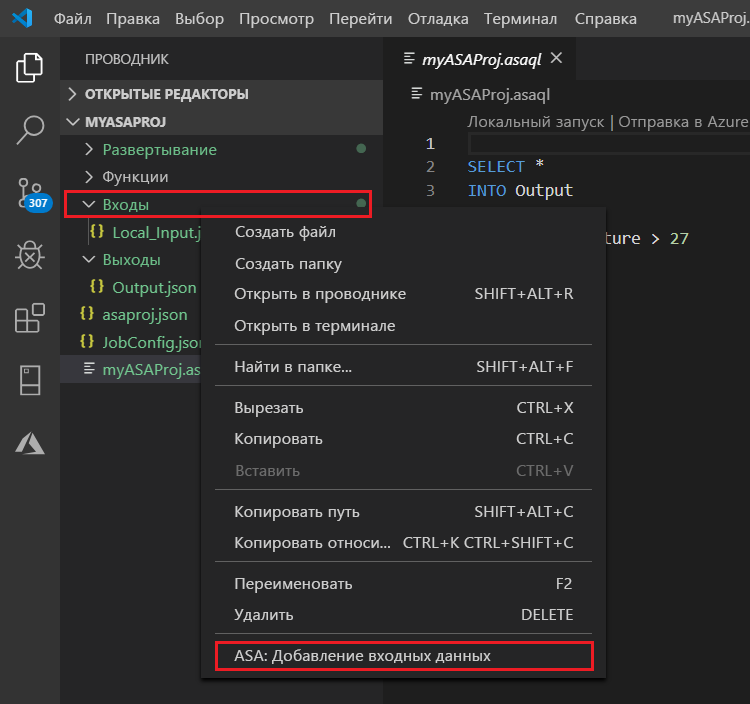
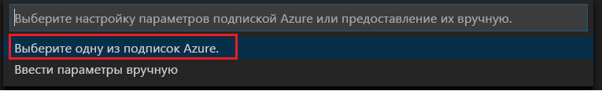
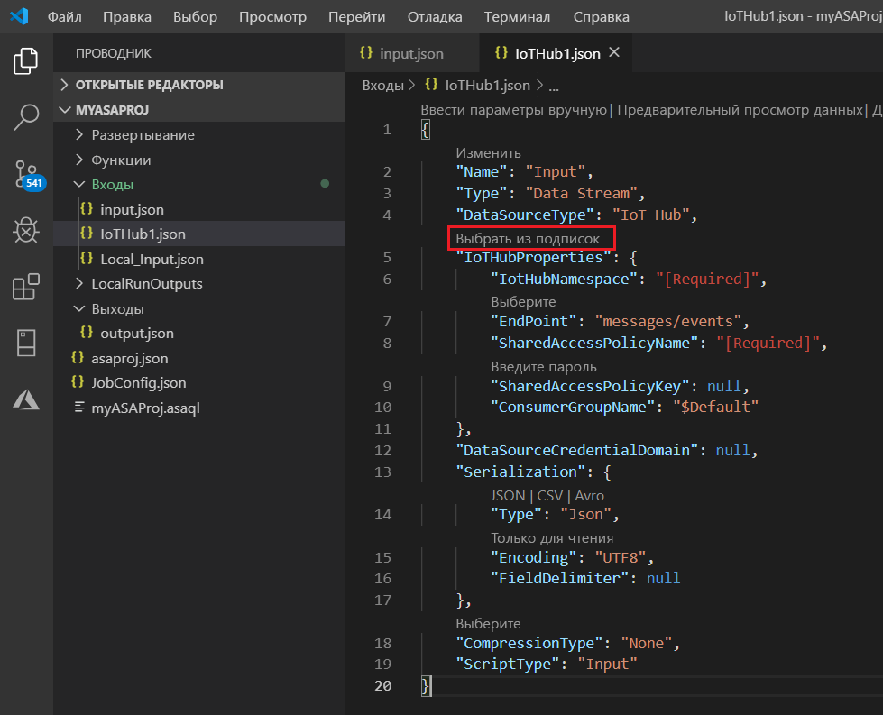
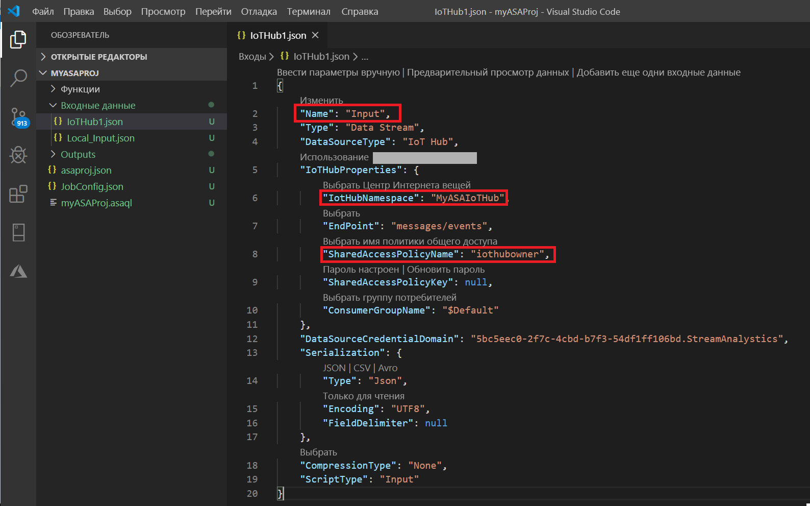
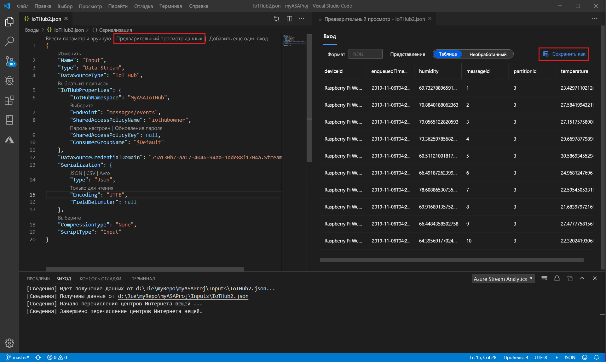
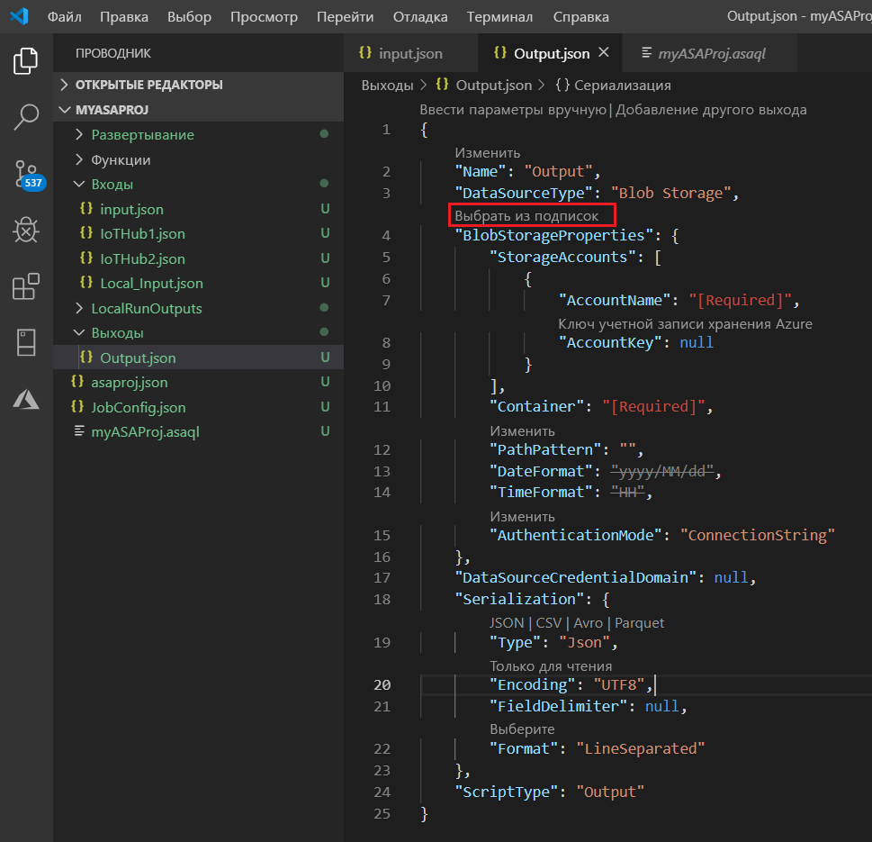
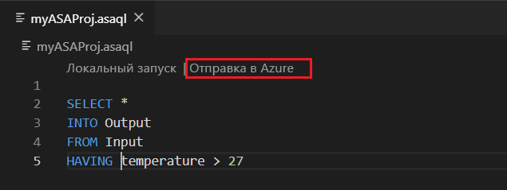
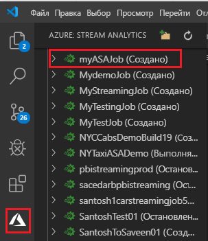

# <a name="quickstart-create-an-azure-stream-analytics-job-in-visual-studio-code-preview"></a>Краткое руководство. Создание задания Azure Stream Analytics в Visual Studio Code (предварительная версия)

В этом кратком руководстве показано, как запустить задание Stream Analytics с помощью расширения "Инструменты Azure Stream Analytics" для Visual Studio Code. Пример задания считывает данные потоковой передачи из устройства Центра Интернета вещей. Вы определяете задание, которое вычисляет среднюю температуру, когда она превышает 27 °, и записывает полученный результат события в новый файл в хранилище BLOB-объектов.

## <a name="before-you-begin"></a>Перед началом

* Если у вас еще нет подписки Azure, создайте [бесплатную учетную запись Azure](https://azure.microsoft.com/free/).

* Войдите на [портал Azure](https://portal.azure.com/).

* Установите [Visual Studio Code](https://code.visualstudio.com/).

## <a name="install-the-azure-stream-analytics-tools-extension"></a>Установка расширения "Инструменты Azure Stream Analytics"

1. Откройте Visual Studio Code.

2. В разделе **Расширения** на панели слева выполните поиск по строке **Stream Analytics** и выберите действие **Установить** для расширения **Инструменты Azure Stream Analytics**.

3. Завершив установку расширения, проверьте наличие нового элемента **Инструменты Azure Stream Analytics** в списке **Включенные расширения**.

   

## <a name="activate-the-azure-stream-analytics-tools-extension"></a>Включение расширения "Инструменты Azure Stream Analytics"

1. Щелкните значок **Azure** на панели действий Visual Studio Code. В разделе **Stream Analytics** на боковой панели выберите **Войти в Azure**.

   

2. Когда вы войдете, в строке состояния в левом нижнем углу окна Visual Studio Code появится имя учетной записи Azure.

> [!NOTE]
> Если вы не выполните выход, расширение инструментов Azure Stream Analytics автоматически выполнит вход при следующем запуске. Если для вашей учетной записи настроена двухфакторная проверка подлинности, мы рекомендуем выполнять ее с использованием телефона, а не PIN-кода.
> Если при получении списка возникают проблемы, их, как правило, можно устранить, выйдя и повторно войдя. Чтобы выйти, введите команду `Azure: Sign Out`.

## <a name="prepare-the-input-data"></a>Подготовка входных данных

Прежде чем определить задание Stream Analytics, необходимо подготовить данные, которые позже указываются в качестве входных данных для этого задания. Чтобы подготовить необходимые для задания входные данные, выполните следующие действия.

1. Войдите на [портал Azure](https://portal.azure.com/).

2. Выберите **Создать ресурс** > **Интернет вещей** > **Центр Интернета вещей**.

3. В области **Центр Интернета вещей** введите следующие сведения:

   |**Параметр**  |**Рекомендуемое значение**  |**Описание**  |
   |---------|---------|---------|
   |Подписка  | \<Ваша подписка\> |  Выберите подписку Azure, которую нужно использовать. |
   |Группа ресурсов   |   asaquickstart-resourcegroup  |   Выберите **Создать** и введите новое имя группы ресурсов для учетной записи. |
   |Регион  |  \<Выберите ближайший к пользователям регион\> | Выберите географическое расположение для центра Интернета вещей. Используйте ближайшее к пользователям расположение. |
   |Имя Центра Интернета вещей  | MyASAIoTHub  |   Выберите имя для центра Интернета вещей.   |

   

4. По завершении выберите **Next: Set size and scale** (Далее: задать размер и масштаб).

5. Выберите **ценовую категорию и уровень масштабирования**. Для этого краткого руководства выберите уровень **F1 — "Бесплатный"** , если он доступен для вашей подписки. Если ценовая категория "Бесплатный" недоступна, выберите минимальную доступную категорию. Дополнительные сведения см. на странице с [ценами на Центр Интернета вещей Azure](https://azure.microsoft.com/pricing/details/iot-hub/).

   

6. Выберите **Review + create** (Просмотреть и создать). Просмотрите сведения о центре Интернета вещей и щелкните **Создать**. Создание Центра Интернета вещей может занять несколько минут. Ход выполнения можно отслеживать на панели **Уведомления**.

7. В меню навигации центра Интернета вещей щелкните **Добавить** в области **Устройства Интернета вещей**. Добавьте идентификатор в поле **Идентификатор устройства**и щелкните **Сохранить**.

   

8. Создав устройство, откройте его в списке **Устройства Интернета вещей**. Скопируйте строку **Строка подключения — первичный ключ** и сохраните ее в Блокнот для последующего использования.

   

## <a name="run-the-iot-simulator"></a>Запуск IoT-симулятора

1. Откройте [онлайн-симулятор Raspberry Pi для Интернета вещей Azure](https://azure-samples.github.io/raspberry-pi-web-simulator/) в новой вкладке или новом окне браузера.

2. Замените заполнитель в строке 15 реальной строкой подключения к устройству центра Интернета вещей, которую вы сохранили.

3. Выберите **Запуск**. В выходных данных должны присутствовать показания датчика и сообщения, отправляемые в центр Интернета вещей.

   

## <a name="create-blob-storage"></a>Создание хранилища BLOB-объектов

1. В верхнем левом углу окна портала Azure щелкните **Создать ресурс** > **Хранилище** > **Учетная запись хранения**.

2. В области **создания учетной записи хранения** введите имя для учетной записи хранения, расположение и группу ресурсов. Выберите такое же расположение и группу ресурсов, как и для созданного центра Интернета вещей. Щелкните **Просмотр и создание**, чтобы создать учетную запись.

   

3. Создав учетную запись хранения, щелкните плитку **BLOB-объекты** в области **Обзор**.

   

4. На странице **службы BLOB-объектов** выберите **Контейнер**, укажите имя для контейнера, такое как **container1**. Для параметра **Общедоступный уровень доступа** сохраните значение **Частный (без анонимного доступа)** и щелкните **ОК**.

   

## <a name="create-a-stream-analytics-project"></a>Создание проекта Stream Analytics

1. В Visual Studio Code нажмите клавиши **CTRL+SHIFT+P**, чтобы открыть палитру команд. Затем введите **ASA** и выберите **ASA: создать проект**.

   

2. Введите имя проекта, например **myASAproj**, и выберите папку для этого проекта.

    

3. Новый проект будет добавлен в рабочую область. Проект Stream Analytics содержит следующие три папки: **Inputs**, **Outputs** и **Functions**. Также он включает скрипт запроса **(*.asaql)** , файл **JobConfig.json** и файл конфигурации **asaproj.json**.

    Файл конфигурации **Asaproj.json** содержит сведения о входных и выходных данных, а также о файлах конфигурации заданий, которые нужны для отправки задания Stream Analytics в Azure.

    

> [!Note]
> При добавлении входных и выходных данных с помощью палитры команд все соответствующие пути автоматически добавляются в файл **asaproj.json**. Если вы добавляете входные или выходные данные непосредственно на диск или удаляете их оттуда, используйте для этого файл **asaproj.json**. Вы можете поместить все входные и выходные данные в одно расположение, а затем создать ссылки на них в разных заданиях, указав пути в каждом файле **asaproj.json**.

## <a name="define-the-transformation-query"></a>Определение запроса преобразования

1. Откройте файл **myASAproj.asaql** из папки проекта.

2. Добавьте следующий запрос:

   ```sql
   SELECT *
   INTO Output
   FROM Input
   HAVING Temperature > 27
   ```

## <a name="test-the-query-locally-with-sample-data"></a>Локальное тестирование запроса с использованием примеров данных

Прежде чем выполнять запрос в облаке, его можно протестировать локально для проверки логики, используя локальный файл с примерами данных или динамически переданные на вход данные.

См. сведения о том, как [локально тестировать запросы с использованием примеров данных](visual-studio-code-local-run.md).

 

## <a name="define-a-live-input"></a>Определение источника динамических входных данных

1. Щелкните правой кнопкой мыши папку **Inputs** в проекте Stream Analytics. Теперь выберите **ASA: добавить входные данные** в контекстном меню.

    

    Можно также открыть палитру команд с помощью клавиш **CTRL+SHIFT+P** и ввести **ASA: добавить входные данные**.

   

2. Выберите в качестве типа входных данных **Центр Интернета вещей**.

   

3. Если вы добавили источник входных данных с помощью палитры команд, выберите скрипт запроса Stream Analytics, который будет использовать этот источник. Здесь будет автоматически указан путь к файлу **myASAproj.asaql**.

   

4. Щелкните **Выбрать подписку Azure** в раскрывающемся списке.

    

5. Измените следующие значения в созданном файле **IoTHub1.json**. Сохраните значения по умолчанию для всех полей, которые не упомянуты здесь.

   |Параметр|Рекомендуемое значение|Описание|
   |-------|---------------|-----------|
   |Имя|Входные данные|Введите имя для этого источника входных данных для задания.|
   |IotHubNamespace|MyASAIoTHub|Выберите или введите имя центра Интернета вещей. Имена центров Интернета вещей обнаруживаются автоматически, если они созданы в той же подписке.|
   |SharedAccessPolicyName|iothubowner| |

   Функция CodeLens помогает вводить строки, выбирать значения в раскрывающихся списках и редактировать текст непосредственно в файле. На следующем снимке экрана показано, как **выбрать подписку в списке**. Учетные данные автоматически включаются в список и сохраняются в локальном диспетчере учетных данных.

   

   

## <a name="preview-input"></a>Предварительный просмотр входных данных

Щелкните **Предварительный просмотр данных** для **IoTHub1.json** в верхней строке. Некоторые входные данные будут извлечены из центра Интернета вещей и отображены в окне предварительного просмотра. Этот процесс может занять некоторое время.

 

## <a name="define-an-output"></a>Определение выходных данных.

1. Нажмите клавиши **CTRL+SHIFT+P**, чтобы открыть палитру команд. Затем введите **ASA: добавить выходные данные**.

   

2. Выберите в качестве типа приемника **Хранилище BLOB-объектов**.

3. Выберите скрипт запроса Stream Analytics, который будет использовать этот источник выходных данных.

4. Введите **BlobStorage** как имя выходного файла.

5. Измените следующие значения в файла **BlobStorage**. Сохраните значения по умолчанию для всех полей, которые не упомянуты здесь. Функция CodeLens помогает вводить строки и выбирать значения в раскрывающемся списке.

   |Параметр|Рекомендуемое значение|Описание|
   |-------|---------------|-----------|
   |Имя|Выходные данные| Введите имя, которое будет обозначать выходные данные задания.|
   |Учетная запись хранения|asaquickstartstorage|Выберите или введите имя учетной записи хранения. Имена учетных записей обнаруживаются автоматически, если они создаются в той же подписке.|
   |Контейнер|container1|Выберите существующий контейнер, созданный в вашей учетной записи хранения.|
   |Шаблон пути|output|Введите путь к файлу, который будет создан в контейнере.|

   

## <a name="compile-the-script"></a>Компиляция скрипта

При компиляции скрипта проверяется синтаксис и создаются шаблоны Azure Resource Manager для автоматического развертывания.

Есть два способа запустить компиляцию скрипта:

- Выберите скрипт в рабочей области и выполните компиляцию из палитры команд.

   

- Щелкните скрипт правой кнопкой мыши и выберите **ASA: Compile Script** (ADL: компилировать сценарий).

    

После компиляции вы увидите два шаблона Azure Resource Manager, созданные в папке **Deploy** текущего проекта. Эти два файла используются для автоматического развертывания.


## <a name="submit-a-stream-analytics-job-to-azure"></a>Отправка запроса Stream Analytics в Azure

1. В окне редактора скриптов, где открыт скрипт запроса, щелкните **Отправить в Azure**.

   

2. Выберите нужную подписку в раскрывающемся списке.

3. Щелкните **Выбрать задание**. Затем щелкните **Создать задание**.

4. Введите имя задания **myASAjob**. Теперь выполните инструкции по выбору группы ресурсов и расположения.

5. Выберите **Отправить в Azure**. Журналы можно найти в окне выходных данных. 

6. Когда задание будет создано, вы увидите его в **обозревателе Stream Analytics**.

    

## <a name="start-the-stream-analytics-job-and-check-output"></a>Запуск задания Stream Analytics и просмотр выходных данных

1. Откройте **обозреватель Stream Analytics** в Visual Studio Code и найдите задание с именем **myASAJob**.

2. Щелкните имя задания правой кнопкой мыши. В контекстном меню выберите **Запустить**.

   

3. Выберите **Сейчас** во всплывающем окне, чтобы запустить задание.

4. Вы увидите, что состояние задания примет значение **Выполняется**. Щелкните имя задания правой кнопкой мыши и выберите **Открыть представление задания на портале**, чтобы просмотреть метрики событий для входных и выходных данных. Это действие будет выполняться несколько минут.

5. Чтобы просмотреть результаты, откройте хранилище BLOB-объектов в расширении Visual Studio Code или на портале Azure.

## <a name="clean-up-resources"></a>Очистка ресурсов

Вы можете удалить ставшие ненужными группу ресурсов, задание потоковой передачи и все связанные ресурсы. Удаление задания позволяет избежать оплаты единиц потоковой передачи, которые потребляются этим заданием. 

Если вы планируете использовать это задание в будущем, его можно остановить и снова запустить позже. Если вы не планируете продолжать работу с ним, удалите все созданные в ходе работы с этим руководством ресурсы, выполнив следующие действия.

1. В меню слева на портале Azure выберите **Группы ресурсов**, а затем щелкните имя созданного ресурса.  

2. На странице группы ресурсов щелкните **Удалить**. В следующем окне введите имя удаляемого ресурса и щелкните **Удалить**.

## <a name="next-steps"></a>Дальнейшие действия

В этом кратком руководстве описано, как развернуть простое задание Stream Analytics, используя Visual Studio Code. Вы также можете развертывать задания Stream Analytics, используя [портал Azure](stream-analytics-quick-create-portal.md), [PowerShell](stream-analytics-quick-create-powershell.md) и [Visual Studio](stream-analytics-quick-create-vs.md).

Чтобы узнать о расширении "Инструменты Azure Stream Analytics" для Visual Studio Code, перейдите к следующим статьям:

* [Локальное тестирование запросов Azure Stream Analytics с использованием источника динамических входных данных в Visual Studio Code](visual-studio-code-local-run-live-input.md)

* [Просмотр заданий Azure Stream Analytics в Visual Studio Code](visual-studio-code-explore-jobs.md)

* [Настройка конвейеров CI/CD с использованием пакета npm](setup-cicd-vs-code.md)
