# <a name="quickstart-create-an-azure-stream-analytics-cloud-job-in-visual-studio-code-preview"></a>Краткое руководство. Создание облачного задания Azure Stream Analytics в Visual Studio Code (предварительная версия)

В этом кратком руководстве показано, как запустить задание Stream Analytics с помощью расширения Azure Stream Analytics для Visual Studio Code. Пример задания считывает данные потоковой передачи из устройства Центра Интернета вещей. Вы определяете задание, которое вычисляет среднюю температуру, когда она превышает 27 °, и записывает полученный результат события в новый файл в хранилище BLOB-объектов.

## <a name="before-you-begin"></a>Перед началом работы

* Если у вас еще нет подписки Azure, создайте [бесплатную учетную запись Azure](https://azure.microsoft.com/free/).

* Войдите на [портале Azure](https://portal.azure.com/).

* Установите [Visual Studio Code](https://code.visualstudio.com/).

## <a name="install-the-azure-stream-analytics-extension"></a>Установка расширения Azure Stream Analytics

1. Откройте Visual Studio Code.

2. В разделе **Расширения** на панели слева выполните поиск по строке **Stream Analytics** и выберите действие **Установить** для расширения **Azure Stream Analytics**.

3. Завершив установку расширения, проверьте наличие нового элемента **Средства Azure Stream Analytics** в списке **Включенные расширения**.

   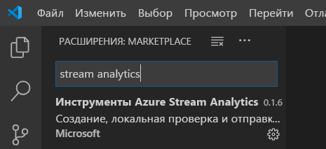

## <a name="activate-the-azure-stream-analytics-extension"></a>Активация расширения Azure Stream Analytics

1. Щелкните значок **Azure** на панели действий VS Code. **Stream Analytics** появится на боковой панели. В разделе **Stream Analytics** выберите **Войти в Azure**. 

   

2. Когда вы войдете, в строке состояния в левом нижнем углу окна VS Code появится имя учетной записи Azure.

> [!NOTE]
> Пока вы не выйдете, средства Azure Stream Analytics будут каждый раз автоматически выполнять вход. Если для вашей учетной записи настроена двухфакторная проверка подлинности, мы рекомендуем выполнять ее с помощью телефона, а не PIN-кода.
> Если при получении списка возникают проблемы, их, как правило, можно устранить, выйдя и повторно войдя. Чтобы выйти, введите команду `Azure: Sign Out`.

## <a name="prepare-the-input-data"></a>Подготовка входных данных

Прежде чем определить задание Stream Analytics, необходимо подготовить данные, которые позже настраиваются в качестве входных данных для задания. Чтобы подготовить входные данные, необходимые для задания, выполните следующие действия:

1. Войдите на [портале Azure](https://portal.azure.com/).

2. Выберите **Создать ресурс** > **Интернет вещей** > **Центр Интернета вещей**.

3. В области **Центр Интернета вещей** введите следующие сведения:
   
   |**Параметр**  |**Рекомендуемое значение**  |**Описание**  |
   |---------|---------|---------|
   |Подписка  | \<Ваша подписка\> |  Выберите подписку Azure, которую нужно использовать. |
   |Группа ресурсов   |   asaquickstart-resourcegroup  |   Выберите **Создать** и введите новое имя группы ресурсов для учетной записи. |
   |Регион  |  \<Выберите ближайший к пользователям регион\> | Выберите географическое расположение для Центра Интернета вещей. Используйте ближайшее к пользователям расположение. |
   |Имя Центра Интернета вещей  | MyASAIoTHub  |   Выберите имя для Центра Интернета вещей.   |

   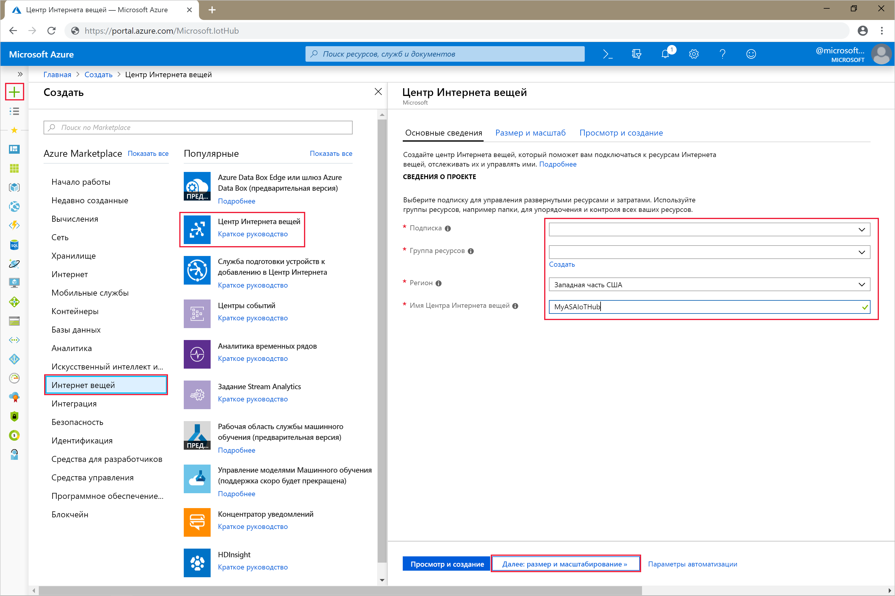

4. По завершении выберите **Next: Set size and scale** (Далее: задать размер и масштаб).

5. Выберите **ценовую категорию и уровень масштабирования**. Для этого краткого руководства выберите уровень **F1 — "Бесплатный"**, если он доступен для вашей подписки. Если ценовая категория "Бесплатный" недоступна, выберите минимальную доступную категорию. Дополнительные сведения см. на странице [цен на Центр Интернета вещей Azure](https://azure.microsoft.com/pricing/details/iot-hub/).

   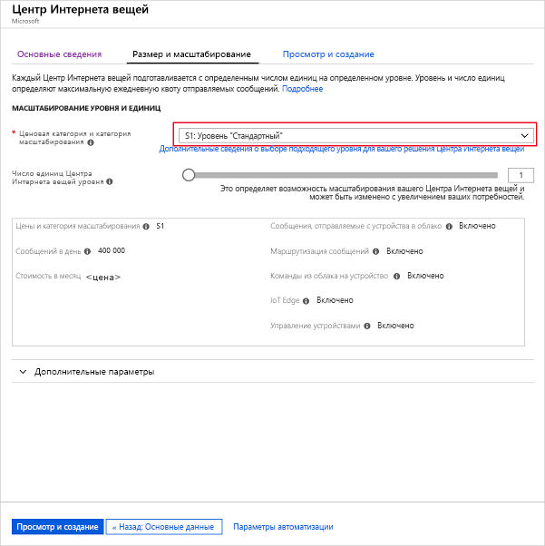

6. Выберите **Review + create** (Просмотреть и создать). Просмотрите сведения о Центре Интернета вещей и щелкните **Создать**. Создание Центра Интернета вещей может занять несколько минут. Ход создания можно отслеживать на панели **уведомлений**.

7. В меню навигации Центра Интернета вещей щелкните **Добавить** в области **устройств Интернета вещей**. Добавьте **идентификатор устройства** и щелкните **Сохранить**.

   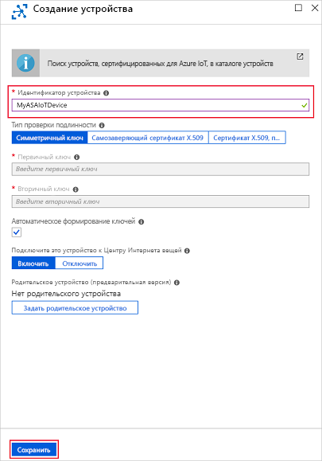

8. Создав устройство, откройте его из списка **устройств Интернета вещей**. Скопируйте значение из поля **Connection string -- primary key** (Строка подключения — первичный ключ) и сохраните его с помощью Блокнота для последующего использования.

   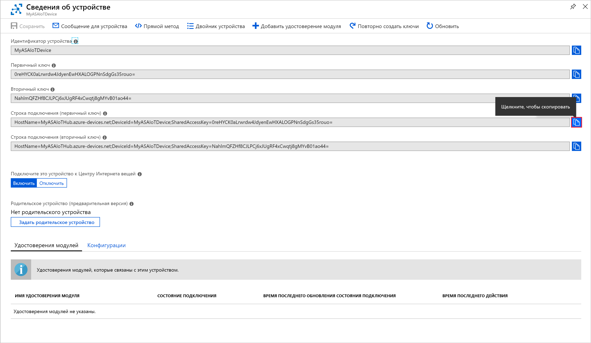

## <a name="create-blob-storage"></a>Создание хранилища BLOB-объектов

1. В верхнем левом углу окна портала Azure выберите **Создать ресурс** > **Хранилище** > **Учетная запись хранения**.

2. В области **создания учетной записи хранения** введите имя для учетной записи хранения, расположение и группу ресурсов. Выберите такое же расположение и группу ресурсов, как и для созданного Центра Интернета вещей. Щелкните **Просмотр и создание**, чтобы создать учетную запись.

   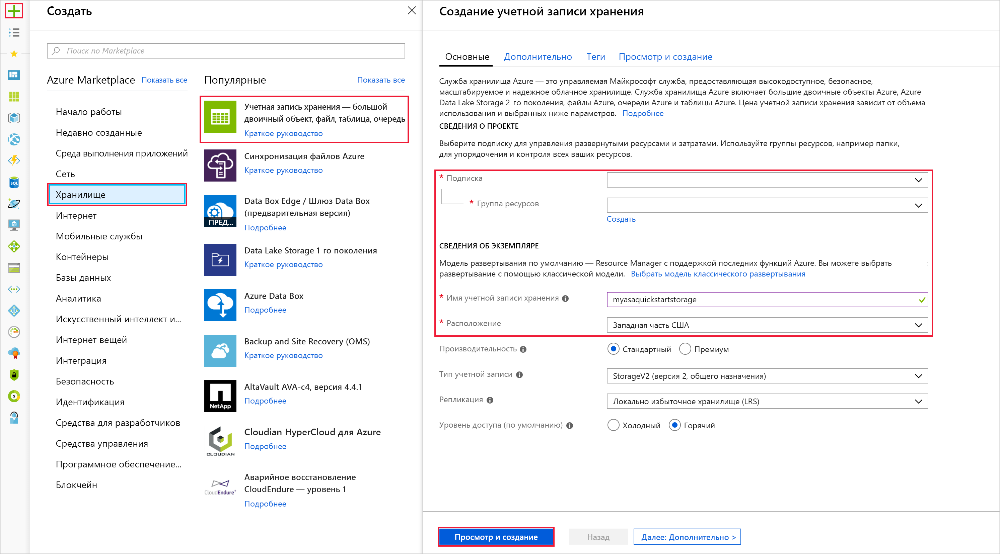

3. После создания учетной записи хранения щелкните плитку **BLOB-объекты** в области **Обзор**.

   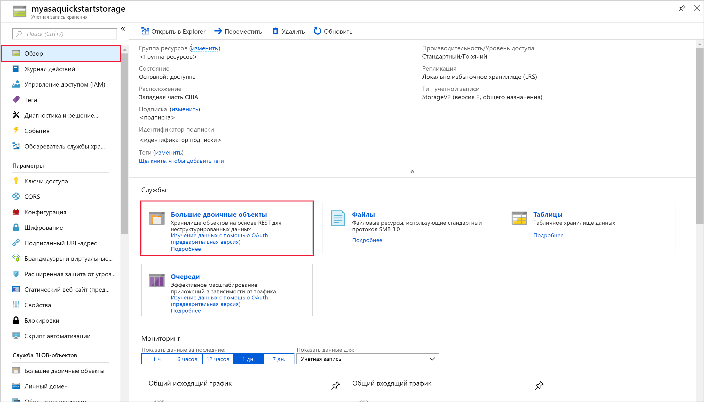

4. На странице **службы BLOB-объектов** выберите **Контейнер**, укажите имя для контейнера, такое как *container1*. Для параметра **уровня общего доступа** оставьте значение **Private (no anonymous access)** (Частный (без анонимного доступа)) и нажмите кнопку **ОК**.

   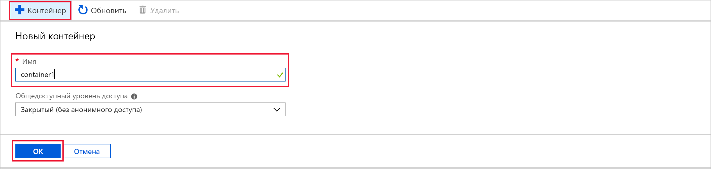

## <a name="create-a-stream-analytics-project"></a>Создание проекта Stream Analytics

1. В Visual Studio Code нажмите клавиши **CTRL+SHIFT+P**, чтобы открыть палитру команд. Затем введите **ASA** и выберите **ASA: создать проект**.

   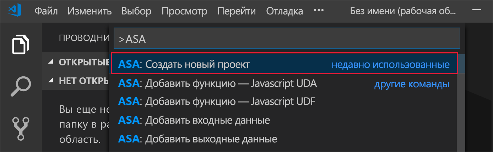

2. Введите имя проекта, например **myASAproj**, и выберите папку для этого проекта.

    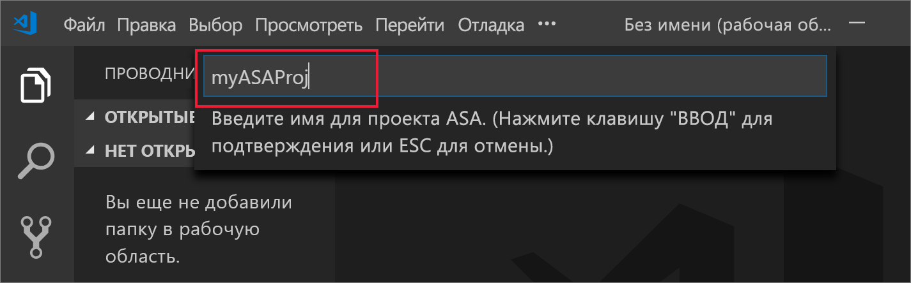

3. Новый проект будет добавлен в рабочую область. Проект ASA состоит из скрипта запроса **(*.asaql)**, файла **JobConfig.json** и файла конфигурации **asaproj.json**.

   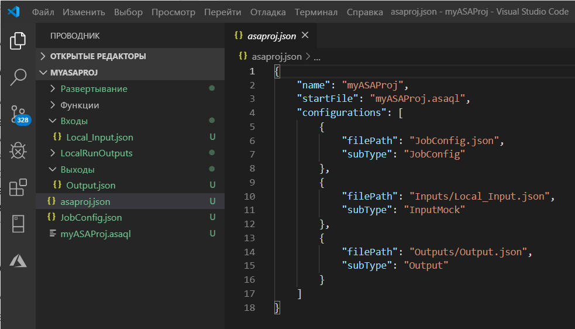

4. Файл конфигурации **Asaproj.json** содержит сведения о входных и выходных данных, а также о файлах конфигурации заданий, которые нужны для отправки задания Stream Analytics в Azure.

   

> [!Note]
> При добавлении входных и выходных данных с палитры команд в файл **asaproj.json** автоматически добавляются соответствующие пути. Если вы добавляете входные или выходные данные непосредственно на диск или удаляете их оттуда, используйте для этого файл **asaproj.json**. Вы можете поместить все входные и выходные данные в одно расположение, чтобы не указывать ссылки на них в каждом файле **asaproj.json** в разных заданиях.

## <a name="define-an-input"></a>Определение входных данных.

1. Нажмите клавиши **CTRL+SHIFT+P**, чтобы открыть палитру команд, и введите **ASA: добавить входные данные**.

   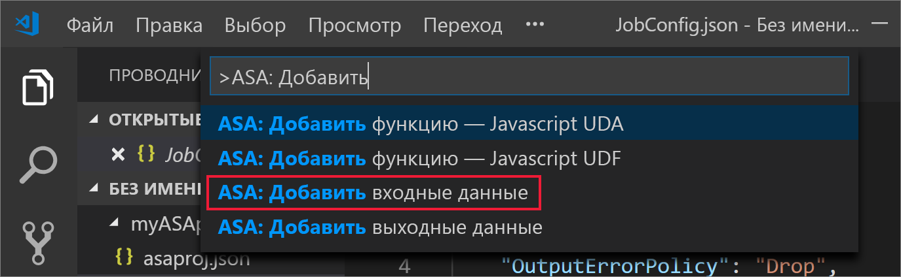

2. Выберите в качестве типа входных данных **Центр Интернета вещей**.

   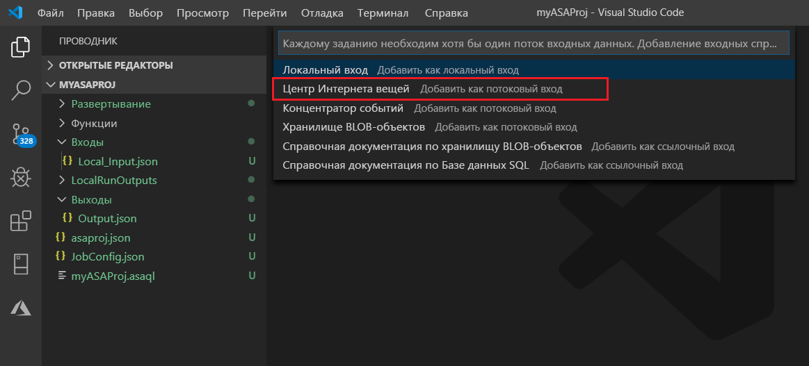

3. Выберите скрипт запроса ASA, который будет использовать эти входные данные. Будет автоматически указан путь к файлу **myASAproj.asaql**.

   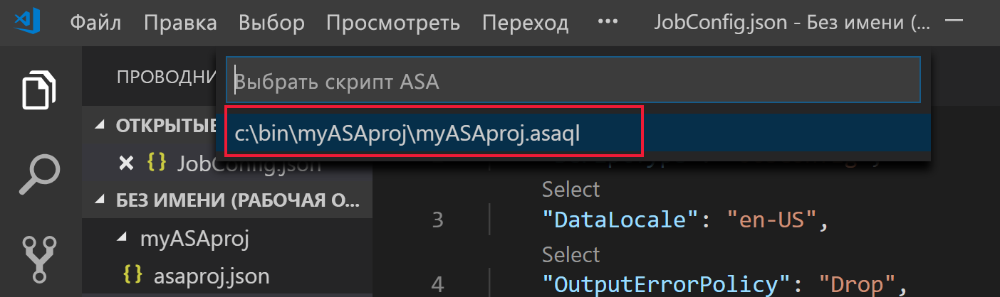

4. Введите имя входного файла **IotHub.json**.

5. Измените файл **IoTHub.json**, указав следующие значения. Сохраните значения по умолчанию для всех полей, которые не упомянуты ниже. CodeLens поможет вводить строки, выбирать значения из раскрывающихся списков и редактировать текст непосредственно в файле.

   |Параметр|Рекомендуемое значение|ОПИСАНИЕ|
   |-------|---------------|-----------|
   |ИМЯ|Входные данные|Введите имя для определения входных данных задания.|
   |IotHubNamespace|MyASAIoTHub|Выберите или введите имя вашего Центра Интернета вещей. Имена Центра Интернета вещей автоматически обнаруживаются, если они создаются в одной и той же подписке.|
   |EndPoint|Обмен сообщениями| |
   |SharedAccessPolicyName|iothubowner| |

## <a name="define-an-output"></a>Определение выходных данных.

1. Нажмите клавиши **CTRL+SHIFT+P**, чтобы открыть палитру команд. Затем введите **ASA: добавить выходные данные**.

   

2. Выберите в качестве типа приемника **Хранилище BLOB-объектов**.

3. Выберите скрипт запроса ASA, который будет использовать эти выходные данные.

4. Введите имя выходного файла **BlobStorage.json**.

5. Измените файл **BlobStorage.json**, указав следующие значения. Сохраните значения по умолчанию для всех полей, которые не упомянуты ниже. CodeLens поможет вводить строки и выбирать значения из раскрывающегося списка.

   |Параметр|Рекомендуемое значение|ОПИСАНИЕ|
   |-------|---------------|-----------|
   |ИМЯ|Выходные данные| Введите имя, которое будет обозначать выходные данные задания.|
   |Учетная запись хранения|asaquickstartstorage|Выберите или введите имя учетной записи хранения. Имена учетных записей автоматически обнаруживаются, если они создаются в одной и той же подписке.|
   |Контейнер|container1|Выберите существующий контейнер, созданный в вашей учетной записи хранения.|
   |Шаблон пути|output|Введите путь к файлу, который будет создан в контейнере.|

## <a name="define-the-transformation-query"></a>Определение запроса преобразования

1. Откройте файл **myASAproj.asaql** из папки проекта.

2. Добавьте следующий запрос:

   ```sql
   SELECT * 
   INTO Output
   FROM Input
   HAVING Temperature > 27
   ```

## <a name="compile-the-script"></a>Компиляция скрипта

Компиляция скрипта позволяет проверить синтаксис и создать шаблоны Azure Resource Manager для автоматического развертывания.

Есть два способа запустить компиляцию скрипта:

1. Выберите скрипт из рабочей области и запустите действие компиляции из палитры команд. 

   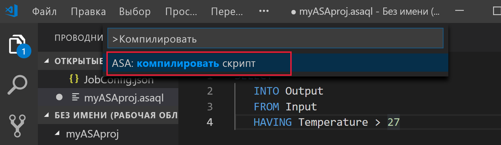

2. Щелкните скрипт правой кнопкой мыши и выберите **ASA: компилировать скрипт**.

    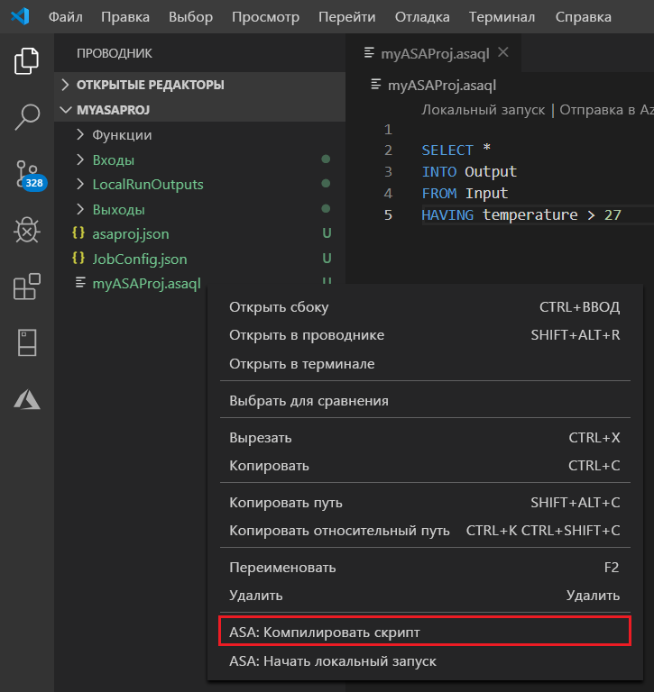

3. После компиляции вы увидите два шаблона Azure Resource Manager, созданные в папке проекта **Deploy**. Эти файлы используются для автоматического развертывания.

    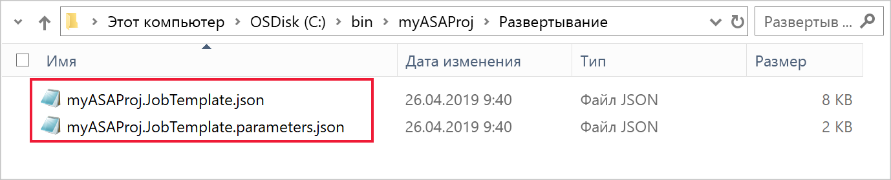

## <a name="submit-a-stream-analytics-job-to-azure"></a>Отправка запроса Stream Analytics в Azure

1. В окне редактора скриптов Visual Studio Code выберите **Выбрать из подписок**.

   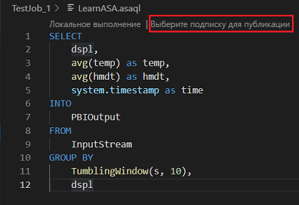

2. Выберите нужную подписку в раскрывающемся списке.

3. Выберите задание**. Затем щелкните "Создать задание".

4. Введите имя задания **myASAjob** и выполните инструкции по выбору группы ресурсов и расположения.

5. Выберите **Отправить в Azure**. Журналы можно найти в окне выходных данных. 

6. Когда задание будет создано, вы увидите его в обозревателе Stream Analytics.

## <a name="run-the-iot-simulator"></a>Запуск IoT-симулятора

1. Откройте [онлайн-симулятор Raspberry Pi для Интернета вещей Azure](https://azure-samples.github.io/raspberry-pi-web-simulator/) в новой вкладке или новом окне браузера.

2. Замените значения заполнителя в 15 строке строкой подключения устройства Центра Интернета вещей, которую вы сохранили при работе с предыдущим разделом.

3. Щелкните **Выполнить**. В выходных данных должны присутствовать показания датчика и сообщения, отправляемые в Центр Интернета вещей.

   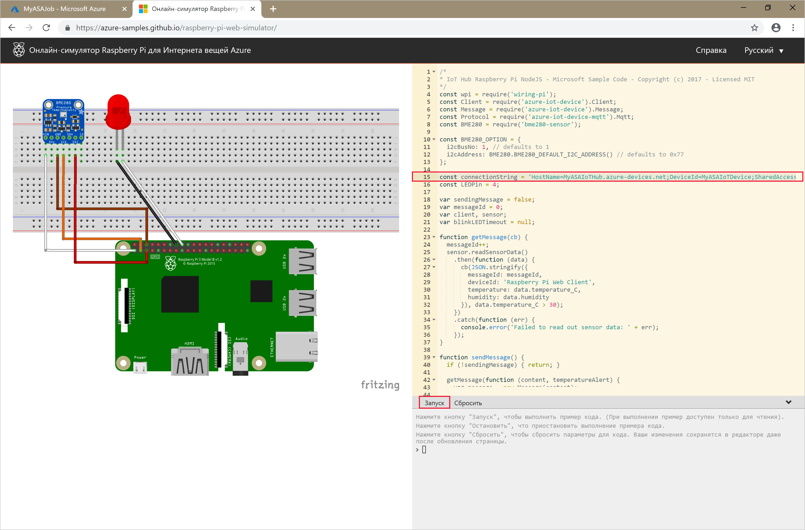

## <a name="start-the-stream-analytics-job-and-check-output"></a>Запуск задания Stream Analytics и просмотр выходных данных

1. Откройте **обозреватель Stream Analytics** в Visual Studio Code и найдите задание с именем **myASAJob**.

2. Щелкните имя задания правой кнопкой мыши. В контекстном меню выберите **Запустить**.

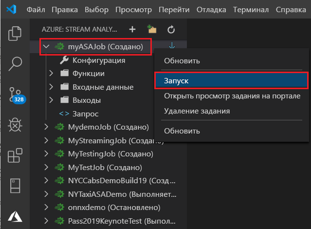

3. Выберите **Сейчас** во всплывающем окне, чтобы запустить задание.

4. Обратите внимание, что состояние задания изменилось на **Выполняется**. Щелкните имя задания правой кнопкой мыши и выберите **Открыть представление задания на портале**, чтобы просмотреть метрики событий для входных и выходных данных. Это действие может занять несколько минут.

5. Чтобы просмотреть результаты, откройте хранилище BLOB-объектов в расширении Visual Studio Code или на портале Azure.

## <a name="clean-up-resources"></a>Очистка ресурсов

Ставшие ненужными группу ресурсов, задание потоковой передачи и все связанные ресурсы можно удалить. При удалении задания будет прекращена тарификация за единицы потоковой передачи, потребляемые заданием. Если вы планируете использовать это задание в будущем, вы можете остановить и перезапустить его позже. Если вы не собираетесь использовать это задание дальше, удалите все ресурсы, созданные в ходе работы с этим руководством, выполнив следующие шаги:

1. В меню слева на портале Azure выберите **Группы ресурсов**, а затем выберите имя созданного ресурса.  

2. На странице группы ресурсов выберите **Удалить**, в текстовом поле введите имя ресурса для удаления и щелкните **Удалить**.

## <a name="next-steps"></a>Дополнительная информация

В этом кратком руководстве описано, как развернуть простое задание Stream Analytics, используя Visual Studio Code. Вы также можете развертывать задания Stream Analytics, используя [портал Azure](stream-analytics-quick-create-portal.md), [PowerShell](stream-analytics-quick-create-powershell.md) и Visual Studio (stream-analytics-quick-create-vs.md). 

Чтобы узнать об инструментах Azure Stream Analytics для Visual Studio, перейдите к следующей статье:

> [!div class="nextstepaction"]
> [Просмотр заданий Azure Stream Analytics с помощью Visual Studio](stream-analytics-vs-tools.md)