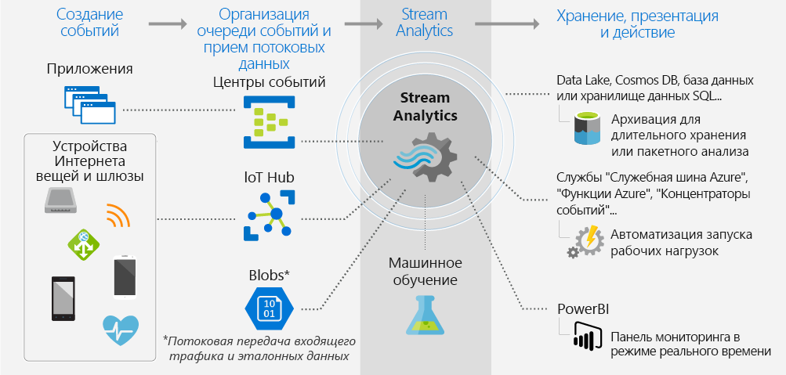
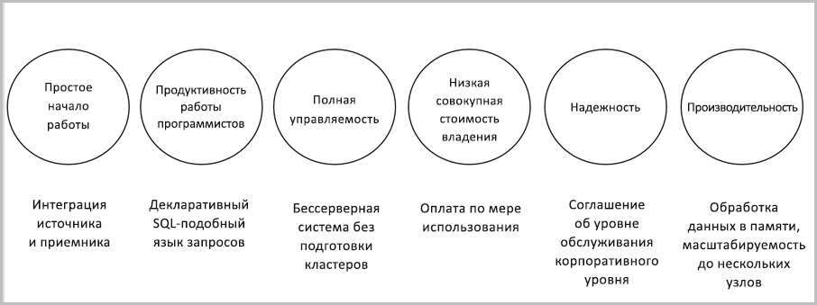

# Знакомство с Azure Stream Analytics

Azure Stream Analytics — это модуль обработки событий, который разработан для исследования больших потоков данных. Он позволяет определять закономерности и связи в данных, извлеченных из нескольких источников, таких как устройства, датчики, веб-сайты, каналы социальных сетей и приложения. На основе этих закономерностей можно активировать другие действия, например создавать оповещения, отправлять информацию в средства создания отчетов или сохранять преобразованные данные для последующего использования.

Ниже описаны примеры сценариев, в которых удобно использовать Azure Stream Analytics:

* интеграция данных датчика Интернета вещей и аналитика в реальном времени на основе телеметрии устройства;
* анализ веб-журналов и сведений о посещении сайта;
* геопространственная аналитика для управления транспортной системой и автономными транспортными средствами;
* удаленный мониторинг и прогнозное обслуживание высокоценных ресурсов;
* аналитика данных точки продаж в режиме реального времени для контроля запасов и обнаружения аномалий.

## Как работает Stream Analytics?

Задание Azure Stream Analytics состоит из входных данных, запроса преобразования и выходных данных. Если события, полученные от программного обеспечения или устройств, поступают на обработку в Центр событий Azure, Центр Интернета вещей Azure или хранилище BLOB-объектов, вы можете указать одну или несколько этих служб в качестве источника данных для задания. Запрос преобразования создается на специальном языке, основанном на языке SQL-запросов, который позволяет легко выполнять фильтрацию, сортировку, статистическую обработку и объединение данных, поступивших за определенный период времени. Вы можете настроить параметры упорядочения событий и продолжительность временных окон при выполнении операций агрегирования.

Каждое задание поддерживает вывод преобразованных данных. Вы можете также настроить действия по результатам анализа информации. Например, вы можете просматривать:

* отправлять данные в контролируемую очередь для запуска оповещений или подчиненных пользовательских рабочих потоков;
* отправлять данные на панель мониторинга Power BI для визуализации в режиме реального времени;
* сохранять данные в других службах хранилища Azure, чтобы обучать модель машинного обучения на основе данных журнала или выполнять пакетную аналитику.

На следующем рисунке показано, как данные отправляются в Stream Analytics, анализируются и направляются для выполнения других действий, например хранения или отображения:

## Основные возможности и преимущества

Служба Azure Stream Analytics должна быть простой в использовании, гибкой, надежной и масштабируемой до любого размера задания. Она доступна в нескольких регионах Azure. На следующем рисунке показаны ключевые возможности Azure Stream Analytics.

## Простое начало работы

Приступить к работе с Azure Stream Analytics несложно. Подключиться к нескольким источникам и приемникам и создать конвейер можно в несколько щелчков. Служба Stream Analytics может подключаться к [Центрам событий Azure](/azure/event-hubs/) и [Центру Интернета вещей Azure](/azure/iot-hub/) для приема потоковых данных, а также к [хранилищу BLOB-объектов Azure](/azure/storage/storage-introduction) для приема исторических данных. Входные данные для задания также могут содержать статические или редко меняющиеся эталонные данные из хранилища BLOB-объектов Azure или [Базы данных SQL](stream-analytics-use-reference-data.md#azure-sql-database-preview), которые можно подключить к потоковым данным для операций поиска.

Stream Analytics может направлять выходные данные задания к нескольким системам хранения, таким как [хранилище BLOB-объектов](/azure/storage/storage-introduction), [База данных SQL Azure](/azure/sql-database/), [Azure Data Lake Store](/azure/data-lake-store/) и [Azure Cosmos DB](/azure/cosmos-db/introduction). Вы можете выполнить пакетную аналитику с использованием сохраненных данных с помощью Azure HDInsight или направить выходные данные в другую службу, например в Центры событий для обработки или в [Power BI](https://docs.microsoft.com/power-bi/) для визуализации в режиме реального времени.

Полный список поддерживаемых выходов Stream Analytics см. в статье о [выходных данных Azure Stream Analytics](stream-analytics-define-outputs.md).

## Производительность работы программиста

Azure Stream Analytics использует простой язык запросов на основе SQL, который был дополнен эффективными темпоральными ограничениями для анализа перемещаемых данных. Для определения преобразований задания используется простой, декларативный [язык запросов Stream Analytics](https://docs.microsoft.com/stream-analytics-query/stream-analytics-query-language-reference), который позволяет создавать сложные временные запросы и аналитику с использованием простых конструкций SQL. Язык запросов Stream Analytics очень похож на SQL, поэтому понимания языка SQL достаточно, чтобы приступить к созданию заданий. Задания можно также создавать с помощью инструментов разработчика, таких как Azure PowerShell, [средства Stream Analytics Visual Studio](stream-analytics-tools-for-visual-studio-install.md), [расширение Stream Analytics для Visual Studio Code](quick-create-vs-code.md) или шаблоны Azure Resource Manager. С помощью инструментов разработчика можно создавать запросы на преобразование автономно и использовать [конвейер непрерывной интеграции и поставки](stream-analytics-tools-for-visual-studio-cicd.md) для отправки заданий в Azure.

Язык запросов Stream Analytics предлагает широкий набор функций для анализа и обработки данных потоковой передачи. Этот язык запросов поддерживает простые операции с данными, функции статистических вычислений и сложные геопространственные функции. На портале можно редактировать запросы и тестировать их на выборке данных из потоковых данных.

Вы можете расширить возможности языка запросов. Для этого нужно определить или вызвать дополнительные функции. Вызовы функций можно определить в службе "Машинное обучение Azure", чтобы воспользоваться преимуществами решений этой службы и интегрировать определяемые пользователем функции или статистические выражения JavaScript или C# для выполнения сложных вычислений в рамках запроса Stream Analytics.

## Полная управляемость

Azure Stream Analytics является полностью управляемым независимым от сервера предложением (PaaS) в Azure. Вам не нужно подготавливать оборудование или управлять кластерами для запуска заданий. Azure Stream Analytics полностью управляет заданием, настраивая сложные вычислительные кластеры в облаке и обеспечивая необходимую производительность для выполнения задания. Благодаря интеграции с Центрами событий Azure и Центром Интернета вещей Azure задания могут ежесекундно принимать миллионы событий от подключенных устройств, посещаемых пользователями ресурсов и файлов журналов. С помощью функции секционирования Центров событий вы можете разделять вычисления на логические шаги и дополнительно разделять каждый шаг для улучшения масштабируемости.

## Запуск в облаке на интеллектуальной границе

Azure Stream Analytics можно запускать в облаке для крупномасштабной аналитики или в IoT Edge для аналитики со сверхмалой задержкой. Azure Stream Analytics использует одинаковый язык запросов в облаке и в IoT Edge, что позволяет разработчикам создавать настоящие гибридные архитектуры для обработки потоков.

## Низкая совокупная стоимость владения

Облачная служба Stream Analytics оптимизирована для затрат. Первоначальные затраты отсутствуют. Вы платите только за [использованные единицы потоковой передачи](stream-analytics-streaming-unit-consumption.md) и объем обработанных данных. Нет обязательств по объемам потребления и не требуется подготовка кластера, а задания легко масштабировать в соответствии с текущими потребностями бизнеса.

## Критически важная доступность

Служба Azure Stream Analytics доступна в нескольких регионах по всему миру и предназначена для запуска критически важных рабочих нагрузок, обеспечивая надежность, безопасность и соответствие требованиям.

### Надежность

Azure Stream Analytics гарантирует обработку событий только один раз и по крайней мере одну доставку событий. Таким образом, события не теряются. Такая обработка гарантируется для выбранного набора выходных данных, как описано в статье о [гарантиях доставки событий](/stream-analytics-query/event-delivery-guarantees-azure-stream-analytics).

Azure Stream Analytics имеет встроенные возможности восстановления в случае сбоя доставки события. Stream Analytics также предоставляет встроенные контрольные точки для сохранения состояния заданий и обеспечивает воспроизводимые результаты.

Являясь управляемой службой, Stream Analytics гарантирует доступность 99,9 % для обработки событий в небольших количествах. Дополнительные сведения см. на странице [Соглашение об уровне обслуживания для Azure Stream Analytics](https://azure.microsoft.com/support/legal/sla/stream-analytics/v1_0/). 

### Безопасность

С точки зрения безопасности Azure Stream Analytics выполняет шифрование всех входящих и исходящих подключений и поддерживает TLS 1.2. Встроенные контрольные точки также шифруются. Stream Analytics не хранит входящие данные, так как все задачи обработки выполняются в памяти.

### Соответствие требованиям

Azure Stream Analytics отвечает требованиям многих сертификатов соответствия, как описано на странице [Overview of Microsoft Azure compliance](https://gallery.technet.microsoft.com/Overview-of-Azure-c1be3942) (Общие сведения о соответствии Azure). 

## Производительность

Stream Analytics может обрабатывать миллионы событий в секунду и предоставлять результаты с низкой задержкой. Это позволяет выполнять вертикальное и горизонтальное масштабирование для обработки больших сложных событий и событий в реальном времени в приложениях. Stream Analytics поддерживает определенный уровень производительности за счет секционирования, что позволяет параллельно выполнять и обрабатывать сложные запросы на нескольких узлах потоковой передачи. Azure Stream Analytics создан на основе [Trill](https://github.com/Microsoft/Trill). Эта служба является высокопроизводительным аналитическим модулем потоковой передачи, выполняемой в памяти, который разработан в сотрудничестве с Microsoft Research.

## Дополнительная информация

Теперь у вас есть общие сведения об Azure Stream Analytics. Теперь вы можете вникнуть в детали и создать свое первое задание Stream Analytics:

* [Руководство по созданию задания Stream Analytics с помощью портала Azure](stream-analytics-quick-create-portal.md)
* [Руководство по созданию задания Stream Analytics с помощью Azure PowerShell](stream-analytics-quick-create-powershell.md)
* [Краткое руководство. Создание задания Stream Analytics с использованием инструментов Azure Stream Analytics для Visual Studio](stream-analytics-quick-create-vs.md).
* [Краткое руководство. Создание облачного задания Azure Stream Analytics в Visual Studio Code (предварительная версия)](quick-create-vs-code.md).
