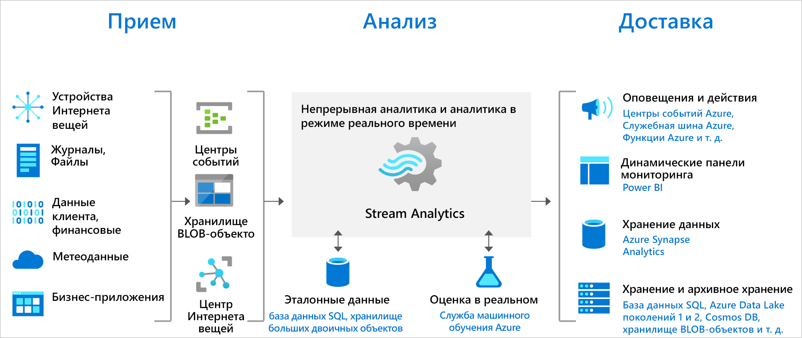

# Добро пожаловать в Azure Stream Analytics

Azure Stream Analytics — это служба аналитики, работающая в режиме реального времени, которая представляет собой сложный механизм обработки событий. Она позволяет анализировать и обрабатывать большие объемы быстро передающихся потоковых данных из многочисленных источников одновременно. Она обеспечивает определение закономерностей и связей в данных, извлеченных из нескольких источников, таких как устройства, датчики, данные посещений сайта, каналы социальных сетей и приложения. На основе этих закономерностей можно активировать действия и инициировать рабочие процессы, например создавать оповещения, отправлять данные в средства составления отчетов или сохранять преобразованные данные для дальнейшего использования. Кроме того, служба Stream Analytics доступна в среде выполнения Azure IoT Edge, что позволяет обрабатывать данные на устройствах Интернета вещей.

Ниже описаны примеры сценариев, в которых удобно использовать Azure Stream Analytics:

* анализ потоковой передачи данных телеметрии в реальном времени с устройств Интернета вещей;
* анализ веб-журналов и сведений о посещении сайта;
* геопространственная аналитика для управления транспортной системой и автономными транспортными средствами;
* удаленный мониторинг и прогнозное обслуживание высокоценных ресурсов;
* аналитика данных точки продаж в режиме реального времени для контроля запасов и обнаружения аномалий.

Вы можете опробовать Azure Stream Analytics через бесплатную подписку на Azure.

> [!div class="nextstepaction"]
> [Опробовать Azure Stream Analytics](https://azure.microsoft.com/services/stream-analytics/)

## Как работает Stream Analytics?

Задание Azure Stream Analytics состоит из входных данных, запроса и выходных данных. Stream Analytics принимает данные из Центров событий Azure (включая Центры событий Azure из Apache Kafka), Центра Интернета вещей Azure или Хранилища BLOB-объектов Azure. Запрос на языке SQL-запросов можно использовать для фильтрации, сортировки, агрегирования и объединения данных потоковой передачи за определенный промежуток времени. Этот язык SQL-запросов можно расширить с помощью определяемых пользователем функций JavaScript и C#. Вы можете легко настроить параметры упорядочивания и продолжительность временных окон при осуществлении операций агрегирования с помощью простых языковых конструкций и (или) конфигураций.

Каждое задание поддерживает один или несколько потоков вывода преобразованных данных. Вы можете также настроить действия по результатам анализа информации. Например, администратор может сделать следующее:

* отправлять данные в службы, такие как Функции Azure, разделы служебной шины или Очередь, чтобы активировать связи или нисходящие пользовательские рабочие процессы;
* отправлять данные на информационную панель Power BI для мониторинга в режиме реального времени;
* сохранять данные в других службах хранилища Azure (например, Azure Data Lake, Azure Synapse Analytics и т. д.), чтобы обучать модель машинного обучения на основе данных журнала или выполнять пакетную аналитику.

На следующем рисунке показано, как данные отправляются в Stream Analytics, анализируются и направляются для выполнения других действий, например хранения или отображения:

## Основные возможности и преимущества

Служба Azure Stream Analytics должна быть простой в использовании, гибкой, надежной и масштабируемой до любого размера задания. Она доступна в нескольких регионах Azure и выполняется в IoT Edge или Azure Stack.

## Простое начало работы

Приступить к работе с Azure Stream Analytics несложно. Подключиться к нескольким источникам и приемникам и создать конвейер можно в несколько щелчков. Служба Stream Analytics может подключаться к Центрам событий Azure и Центру Интернета вещей Azure для приема потоковых данных, а также к хранилищу BLOB-объектов Azure для приема исторических данных. Входные данные для задания также могут содержать статические или редко меняющиеся эталонные данные из хранилища BLOB-объектов Azure или Базы данных SQL, которые можно подключить к потоковым данным для операций поиска.

Stream Analytics может направлять выходные данные задания в несколько систем хранения, таких как хранилище BLOB-объектов Azure, База данных SQL Azure, Azure Data Lake Store и Azure Cosmos DB. Вы также можете выполнять пакетную аналитику с использованием выходных потоковых данных с помощью Azure Synapse Analytics или HDInsight или направлять выходные данные в другую службу, например в Центры событий для потребления или в Power BI для визуализации в режиме реального времени.

Полный список поддерживаемых выходов Stream Analytics см. в статье о [выходных данных Azure Stream Analytics](stream-analytics-define-outputs.md).

## Производительность работы программиста

Azure Stream Analytics использует язык запросов SQL, который был дополнен эффективными темпоральными ограничениями для анализа перемещаемых данных. Задания можно также создавать с помощью инструментов разработчика, таких как Azure PowerShell, Azure CLI, средства Stream Analytics Visual Studio, [расширение Stream Analytics для Visual Studio Code](quick-create-visual-studio-code.md) или шаблоны Azure Resource Manager. С помощью инструментов разработчика можно создавать запросы на преобразование автономно и использовать конвейер непрерывной интеграции и поставки для отправки заданий в Azure.

Язык запросов Stream Analytics позволяет выполнять обработку сложных событий, предлагая широкий набор функций для анализа потоковой передачи данных. Этот язык запросов поддерживает простые функции обработки данных, функции агрегирования и аналитики, геопространственные функции, сопоставление шаблонов и обнаружения аномалий. На портале или с помощью средств разработки можно редактировать запросы и тестировать их на выборке данных из потоковых данных.

Вы можете расширить возможности языка запросов. Для этого нужно определить или вызвать дополнительные функции. Вызовы функций можно определить в Машинном обучении Azure, чтобы воспользоваться преимуществами решений этой службы и интегрировать определяемые пользователем функции или статистические выражения JavaScript или C# для выполнения сложных вычислений в рамках запроса Stream Analytics.

## Полная управляемость

Azure Stream Analytics является полностью управляемым предложением (PaaS) в Azure. Вам не нужно подготавливать оборудование или инфраструктуру, обновлять ОС или программное обеспечение. Azure Stream Analytics полностью управляет заданием, чтобы вы могли сосредоточиться на бизнес-логике, а не инфраструктуре.

## Выполнение в облаке или на интеллектуальной границе

Azure Stream Analytics можно запускать в облаке для крупномасштабной аналитики или в IoT Edge или Azure Stack для аналитики со сверхмалой задержкой. Azure Stream Analytics использует одинаковые инструменты и язык запросов в облаке и пограничной среде, что позволяет разработчикам создавать по-настоящему гибридные архитектуры для обработки потоков. 

## Низкая совокупная стоимость владения

Облачная служба Stream Analytics оптимизирована для затрат. Первоначальные затраты отсутствуют. Вы платите только за [использованные единицы потоковой передачи](stream-analytics-streaming-unit-consumption.md). Нет обязательств по объемам потребления и не требуется подготовка кластера, а задания легко масштабировать в соответствии с текущими потребностями бизнеса.

## Критически важная доступность

Служба Azure Stream Analytics доступна в нескольких регионах по всему миру и предназначена для запуска критически важных рабочих нагрузок, обеспечивая надежность, безопасность и соответствие требованиям.

### Надежность

Azure Stream Analytics гарантирует обработку событий только один раз и по крайней мере одну доставку событий, обеспечивая их сохранность. Такая обработка гарантируется для выбранного набора выходных данных, как описано в статье о гарантиях доставки событий.

Azure Stream Analytics имеет встроенные возможности восстановления в случае сбоя доставки события. Stream Analytics также предоставляет встроенные контрольные точки для сохранения состояния заданий и обеспечивает воспроизводимые результаты.

Являясь управляемой службой, Stream Analytics гарантирует доступность 99,9 % для обработки событий с ежеминутной степенью детализации. 

### Безопасность

С точки зрения безопасности Azure Stream Analytics выполняет шифрование всех входящих и исходящих подключений и поддерживает TLS 1.2. Встроенные контрольные точки также шифруются. Stream Analytics не хранит входящие данные, так как все задачи обработки выполняются в памяти. Stream Analytics также поддерживает виртуальные сети Azure (VNET) во время выполнения задания в кластере [Stream Analytics](./cluster-overview.md).

### Соответствие нормативным требованиям

Azure Stream Analytics отвечает требованиям многих сертификатов соответствия, как описано на странице [Overview of Microsoft Azure compliance](https://gallery.technet.microsoft.com/Overview-of-Azure-c1be3942) (Общие сведения о соответствии Azure). 

## Производительность

Stream Analytics может обрабатывать миллионы событий в секунду и предоставлять результаты со сверхнизкой задержкой. Это позволяет выполнять вертикальное и горизонтальное масштабирование для обработки больших сложных событий и событий в реальном времени в приложениях. Stream Analytics поддерживает высокую производительность за счет секционирования, что позволяет выполнить распараллеливание и обработку сложных запросов на нескольких узлах потоковой передачи. Azure Stream Analytics создан на основе [Trill](https://github.com/Microsoft/Trill). Эта служба является высокопроизводительным аналитическим модулем потоковой передачи, выполняемой в памяти, который разработан в сотрудничестве с Microsoft Research.

## Дальнейшие действия

Теперь у вас есть общие сведения об Azure Stream Analytics. Теперь вы можете вникнуть в детали и создать свое первое задание Stream Analytics:

* [Создание задания Stream Analytics с помощью портала Azure](stream-analytics-quick-create-portal.md)
* [Создание задания Stream Analytics с помощью Azure PowerShell](stream-analytics-quick-create-powershell.md)
* [Создание задания Stream Analytics с помощью Visual Studio](stream-analytics-quick-create-vs.md)
* [Создание задания Stream Analytics с помощью Visual Studio Code](quick-create-visual-studio-code.md)
