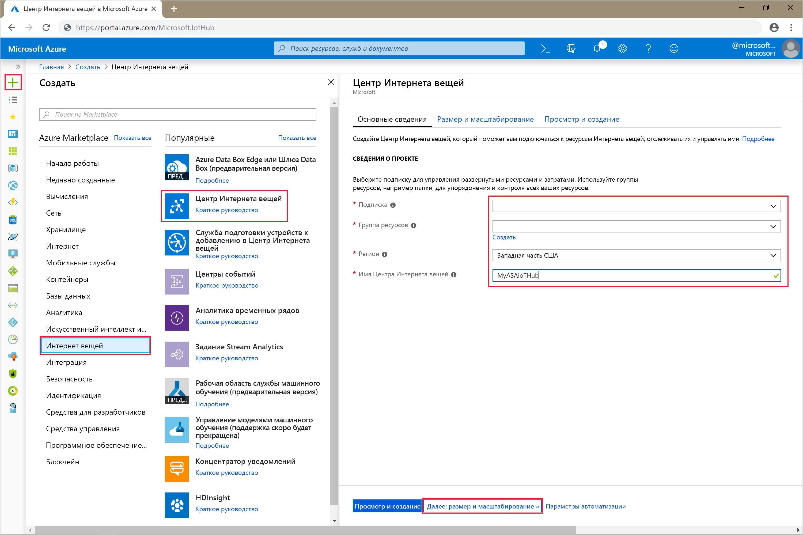
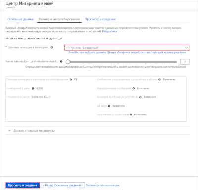
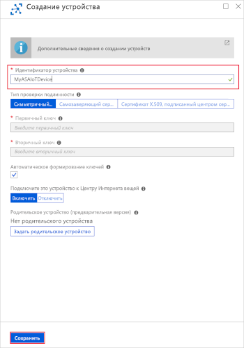
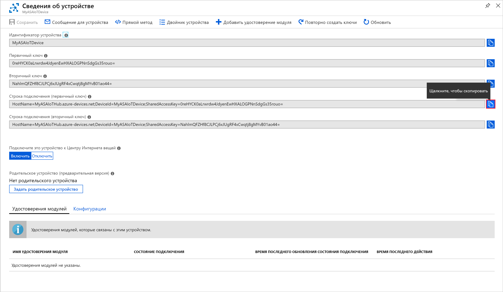
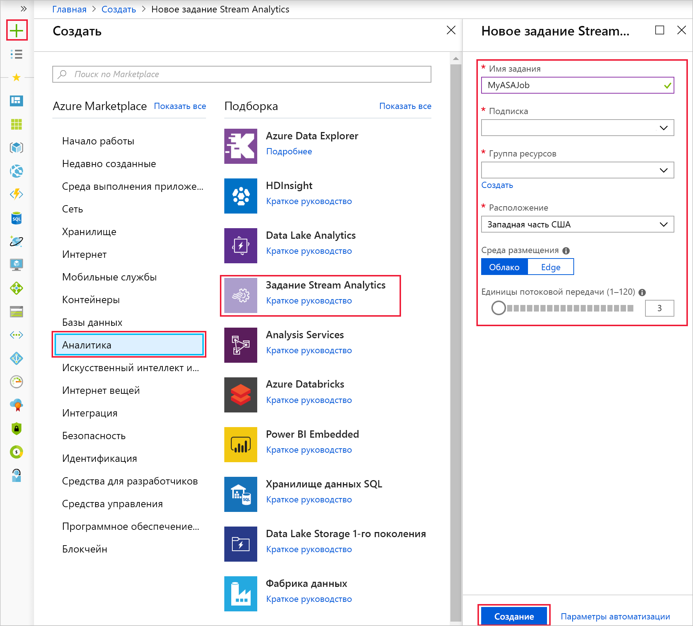
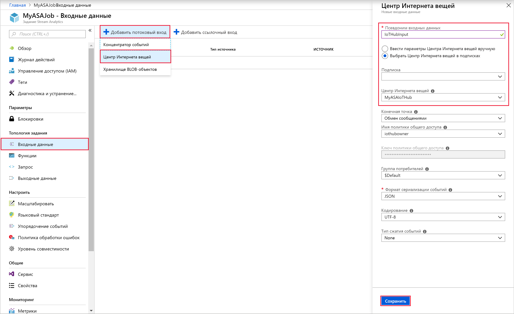
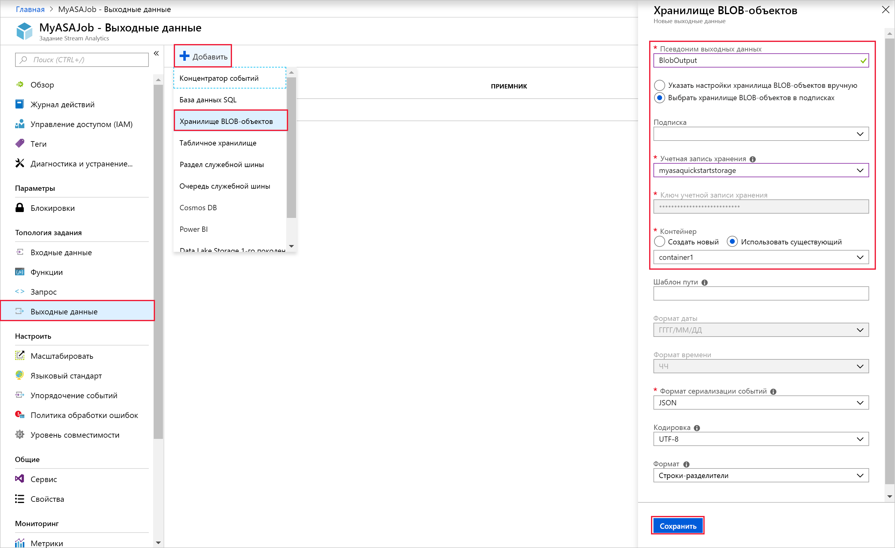

# <a name="quickstart-create-a-stream-analytics-job-by-using-the-azure-portal"></a>Краткое руководство. Создание задания Stream Analytics с помощью портала Azure

В этом кратком руководстве описано, как приступить к созданию заданий Stream Analytics. С его помощью вы определите задание Stream Analytics, в рамках которого считываются потоковые данные в реальном времени и фильтруются сообщения со значениями температуры выше 27. В рамках задания Stream Analytics будут считываться данные с устройства Центра Интернета вещей, затем данные будут преобразовываться и записываться в контейнер в хранилище BLOB-объектов. Входные данные, используемые в этом кратком руководстве, создаются онлайн-симулятором Raspberry Pi. 

## <a name="before-you-begin"></a>Перед началом работы

* Если у вас еще нет подписки Azure, создайте [бесплатную учетную запись Azure](https://azure.microsoft.com/free/).

* Войдите на [портале Azure](https://portal.azure.com/).

## <a name="prepare-the-input-data"></a>Подготовка входных данных

Прежде чем определить задание Stream Analytics, необходимо подготовить данные, которые позже настраиваются в качестве входных данных для задания. Чтобы подготовить входные данные, необходимые для задания, выполните следующие действия:

1. Войдите на [портале Azure](https://portal.azure.com/).

2. Выберите **Создать ресурс** > **Интернет вещей** > **Центр Интернета вещей**.

3. В области **Центр Интернета вещей** введите следующие сведения:
   
   |**Параметр**  |**Рекомендуемое значение**  |**Описание**  |
   |---------|---------|---------|
   |Подписка  | \<Ваша подписка\> |  Выберите подписку Azure, которую нужно использовать. |
   |Группа ресурсов   |   asaquickstart-resourcegroup  |   Выберите **Создать** и введите новое имя группы ресурсов для учетной записи. |
   |Регион  |  \<Выберите ближайший к пользователям регион\> | Выберите географическое расположение для Центра Интернета вещей. Используйте ближайшее к пользователям расположение. |
   |Имя Центра Интернета вещей  | MyASAIoTHub  |   Выберите имя для Центра Интернета вещей.   |

   

4. По завершении выберите **Next: Set size and scale** (Далее: задать размер и масштаб).

5. Выберите **ценовую категорию и уровень масштабирования**. Для этого краткого руководства выберите уровень **F1 — "Бесплатный"** , если он доступен для вашей подписки. Дополнительные сведения см. на странице [цен на Центр Интернета вещей Azure](https://azure.microsoft.com/pricing/details/iot-hub/).

   

6. Выберите **Review + create** (Просмотреть и создать). Просмотрите сведения о Центре Интернета вещей и щелкните **Создать**. Создание Центра Интернета вещей может занять несколько минут. Ход создания можно отслеживать на панели **уведомлений**.

7. В меню навигации Центра Интернета вещей щелкните **Добавить** в области **устройств Интернета вещей**. Добавьте **идентификатор устройства** и щелкните **Сохранить**.

   

8. Создав устройство, откройте его из списка **устройств Интернета вещей**. Скопируйте значение из поля **Connection string -- primary key** (Строка подключения — первичный ключ) и сохраните его с помощью Блокнота для последующего использования.

   

## <a name="create-blob-storage"></a>Создание хранилища BLOB-объектов

1. В верхнем левом углу окна портала Azure выберите **Создать ресурс** > **Хранилище** > **Учетная запись хранения**.

2. В области **создания учетной записи хранения** введите имя для учетной записи хранения, расположение и группу ресурсов. Выберите такое же расположение и группу ресурсов, как и для созданного Центра Интернета вещей. Щелкните **Просмотр и создание**, чтобы создать учетную запись.

   

3. После создания учетной записи хранения щелкните плитку **BLOB-объекты** в области **Обзор**.

   

4. На странице **службы BLOB-объектов** выберите **Контейнер**, укажите имя для контейнера, такое как *container1*. Для параметра **уровня общего доступа** оставьте значение **Private (no anonymous access)** (Частный (без анонимного доступа)) и нажмите кнопку **ОК**.

   

## <a name="create-a-stream-analytics-job"></a>Создание задания Stream Analytics

1. Войдите на портал Azure.

2. Щелкните **Создать ресурс** в верхнем левом углу окна портала Azure.  

3. В списке результатов выберите **Аналитика** > **Задание Stream Analytics**.  

4. Заполните страницу задания Stream Analytics такими значениями:

   |**Параметр**  |**Рекомендуемое значение**  |**Описание**  |
   |---------|---------|---------|
   |Имя задания   |  MyASAJob   |   Введите имя для определения задания Stream Analytics. Имя задания Stream Analytics может содержать только буквенно-цифровые символы, дефисы и знаки подчеркивания. Длина должна составлять от 3 до 63 символов. |
   |Подписка  | \<Ваша подписка\> |  Выберите подписку Azure, которую вы хотите использовать для этого задания. |
   |Группа ресурсов   |   asaquickstart-resourcegroup  |   Выберите ту же группу ресурсов, что и для Центра Интернета вещей. |
   |Расположение  |  \<Выберите ближайший к пользователям регион\> | Выберите географическое местоположение, в котором вы можете разместить задание Stream Analytics. Используйте расположение, наиболее близкое к вашим пользователям, для повышения производительности и снижения стоимости передачи данных. |
   |Единицы потоковой передачи  | 1  |   Единица потоковой передачи предоставляет вычислительные ресурсы, которые необходимы для выполнения задания. По умолчанию установлено значение 1. Чтобы узнать о масштабировании единиц потоковой передачи, ознакомьтесь со статьей [Обзор и настройка единиц потоковой передачи](stream-analytics-streaming-unit-consumption.md).   |
   |Среда размещения  |  Облако  |   Задания Stream Analytics можно развернуть в облаке или на граничных устройствах. Значение "Облако" позволяет выполнять развертывание в облако Azure, а "Edge" — на устройство IoT Edge. |

   

5. Установите флажок **Закрепить на панели мониторинга**, чтобы закрепить задание на панели мониторинга, и нажмите кнопку **Создать**.  

6. В правом верхнем углу окна браузера отобразится надпись *Выполняется развертывание...* 

## <a name="configure-job-input"></a>Настройка входных данных для задания

В рамках этого раздела вы настроите входные данные устройства центра Интернета вещей для задания Stream Analytics. Используйте Центр Интернета вещей, созданный в предыдущем разделе краткого руководства.

1. Перейдите в задание Stream Analytics.  

2. Выберите **Входные данные** > **Add Stream input (Добавить потоковые входные данные)**  > **Центр Интернета вещей**.  

3. На странице **Центр Интернета вещей** укажите такие значения:

   |**Параметр**  |**Рекомендуемое значение**  |**Описание**  |
   |---------|---------|---------|
   |Псевдоним входных данных  |  IoTHubInput   |  Введите имя для определения входных данных задания.   |
   |Подписка   |  \<Ваша подписка\> |  Выберите подписку Azure, в которой создана учетная запись хранения. Учетная запись хранения может находиться в той же или в другой подписке. В этом примере предполагается, что вы создали учетную запись хранения в одной и той же подписке. |
   |Центр Интернета вещей  |  MyASAIoTHub |  Введите имя Центра Интернета вещей, созданного при работе с предыдущим разделом. |

4. Оставьте значения по умолчанию для других параметров и нажмите кнопку **Сохранить**, чтобы сохранить параметры.  

   
 
## <a name="configure-job-output"></a>Настройка выходных данных для задания

1. Перейдите к заданию Stream Analytics, которое вы создали ранее.  

2. Последовательно выберите **Выходные данные** > **Добавить** > **Хранилище BLOB-объектов**.  

3. Заполните страницу **Хранилище BLOB-объектов** следующими значениями:

   |**Параметр**  |**Рекомендуемое значение**  |**Описание**  |
   |---------|---------|---------|
   |Псевдоним выходных данных |   BlobOutput   |   Введите имя для определения выходных данных задания. |
   |Подписка  |  \<Ваша подписка\>  |  Выберите подписку Azure, в которой создана учетная запись хранения. Учетная запись хранения может находиться в той же или в другой подписке. В этом примере предполагается, что вы создали учетную запись хранения в одной и той же подписке. |
   |Учетная запись хранения |  asaquickstartstorage |   Выберите или введите имя учетной записи хранения. Имена учетных записей автоматически обнаруживаются, если они создаются в одной и той же подписке.       |
   |Контейнер |   container1  |  Выберите существующий контейнер, созданный в вашей учетной записи хранения.   |

4. Оставьте значения по умолчанию для других параметров и нажмите кнопку **Сохранить**, чтобы сохранить параметры.  

   
 
## <a name="define-the-transformation-query"></a>Определение запроса преобразования

1. Перейдите к заданию Stream Analytics, которое вы создали ранее.  

2. Щелкните **Запрос** и обновите запрос следующим образом:  

   ```sql
   SELECT *
   INTO BlobOutput
   FROM IoTHubInput
   HAVING Temperature > 27
   ```

3. В этом примере выполняется запрос на считывание данных из Центра Интернета вещей. Затем данные копируются в новый файл в BLOB-объекте. Щелкните **Сохранить**.  

   

## <a name="run-the-iot-simulator"></a>Запуск IoT-симулятора

1. Откройте [онлайн-симулятор Raspberry Pi для Интернета вещей Azure](https://azure-samples.github.io/raspberry-pi-web-simulator/).

2. Замените значения заполнителя в 15 строке строкой подключения устройства Центра Интернета вещей, которую вы сохранили при работе с предыдущим разделом.

3. Щелкните **Выполнить**. В выходных данных должны присутствовать показания датчика и сообщения, отправляемые в Центр Интернета вещей.

   

## <a name="start-the-stream-analytics-job-and-check-the-output"></a>Запуск задания Stream Analytics и просмотр выходных данных

1. Вернитесь на страницу обзора задания и нажмите кнопку **Запуск**.

2. В разделе **запуска задания**выберите **Сейчас** для поля **Время начала создания выходных данных задания**. Выберите **Запустить**, чтобы запустить задание.

3. Через несколько минут на портале найдите учетную запись хранения и контейнер, который вы настроили в качестве выходных данных для задания. Теперь вы можете увидеть выходной файл в контейнере. Задание запустится через несколько минут и после запуска будет продолжать работать по мере поступления данных.  

   

## <a name="clean-up-resources"></a>Очистка ресурсов

Ставшие ненужными группу ресурсов, задание потоковой передачи и все связанные ресурсы можно удалить. При удалении задания будет прекращена тарификация за единицы потоковой передачи, потребляемые заданием. Если вы планируете использовать это задание в будущем, вы можете остановить и перезапустить его позже. Если вы не собираетесь использовать это задание дальше, удалите все ресурсы, созданные в ходе работы с этим руководством, выполнив следующие шаги:

1. В меню слева на портале Azure выберите **Группы ресурсов**, а затем выберите имя созданного ресурса.  

2. На странице группы ресурсов выберите **Удалить**, в текстовом поле введите имя ресурса для удаления и щелкните **Удалить**.

## <a name="next-steps"></a>Дополнительная информация

В этом кратком руководстве вы развернули простое задание Stream Analytics, используя портал Azure. Вы можете также развертывать задания Stream Analytics, используя [PowerShell](stream-analytics-quick-create-powershell.md), [Visual Studio](stream-analytics-quick-create-vs.md) и [Visual Studio Code](quick-create-vs-code.md).

Дополнительные сведения о настройке других источников входных данных и обнаружении в режиме реального времени см. в следующей статье:

> [!div class="nextstepaction"]
> [Приступая к работе с Azure Stream Analytics: выявление мошенничества в режиме реального времени](stream-analytics-real-time-fraud-detection.md)

