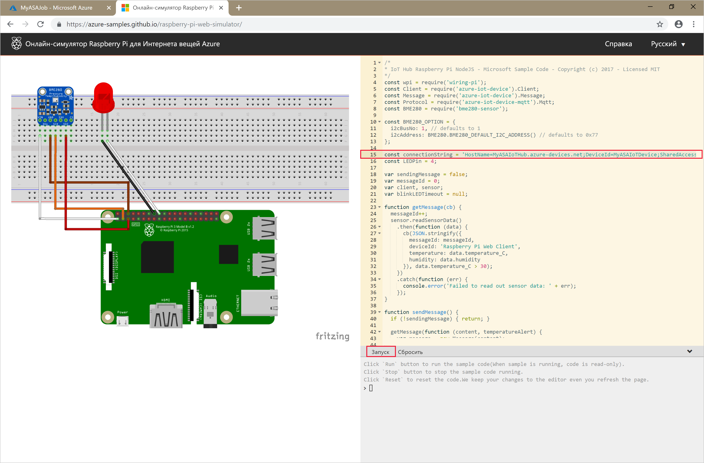

# <a name="quickstart-create-a-stream-analytics-job-using-azure-powershell"></a>Краткое руководство. Создание задания Stream Analytics с помощью Azure PowerShell

Модуль PowerShell используется для создания ресурсов Azure и управления ими с помощью командлетов или скриптов PowerShell. В этом кратком руководстве описывается, как с помощью модуля Azure PowerShell развернуть и запустить задание Azure Stream Analytics.

Пример задания считывает данные потоковой передачи из устройства Центра Интернета вещей. Входные данные создаются онлайн-симулятором Raspberry Pi. Далее задание Stream Analytics преобразует данные с использованием языка запросов Stream Analytics для фильтрации сообщений с температурой больше 27 градусов. Наконец, оно записывает результирующие выходные события в файл в хранилище BLOB-объектов.

## <a name="before-you-begin"></a>Перед началом работы

[!INCLUDE [updated-for-az](../../includes/updated-for-az.md)]

* Если у вас еще нет подписки Azure, [создайте бесплатную учетную запись Azure](https://azure.microsoft.com/free/).

* Для работы с этим кратким руководством требуется модуль Azure PowerShell. Запустите `Get-Module -ListAvailable Az`, чтобы найти версию, установленную на вашем локальном компьютере. Если вам необходимо выполнить установку или обновление, см. статью [об установке модуля Azure PowerShell](https://docs.microsoft.com/powershell/azure/install-Az-ps).

* Некоторые действия Центра Интернета вещей не поддерживаются в Azure PowerShell и должны быть выполнены с помощью Azure CLI версии 2.0.24 или более поздней и расширения Интернета вещей для Azure CLI. [Установите Azure CLI](https://docs.microsoft.com/cli/azure/install-azure-cli?view=azure-cli-latest) и используйте `az extension add --name azure-cli-iot-ext` для установки расширения Интернета вещей.


## <a name="sign-in-to-azure"></a>Вход в Azure

Войдите в свою подписку Azure с помощью команды `Connect-AzAccount` и введите учетные данные Azure во всплывающем окне браузера.

```powershell
# Connect to your Azure account
Connect-AzAccount
```

Если у вас есть несколько подписок, выберите ту, которую вы хотите использовать при работе с этим кратким руководством, запустив следующие командлеты. Не забудьте заменить `<your subscription name>` именем своей подписки:

```powershell
# List all available subscriptions.
Get-AzSubscription

# Select the Azure subscription you want to use to create the resource group and resources.
Get-AzSubscription -SubscriptionName "<your subscription name>" | Select-AzSubscription
```

## <a name="create-a-resource-group"></a>Создание группы ресурсов

Создайте группу ресурсов Azure с помощью командлета [New-AzResourceGroup](https://docs.microsoft.com/powershell/module/az.resources/new-azresourcegroup). Группа ресурсов — это логический контейнер, в котором происходит развертывание ресурсов Azure и управление ими.

```powershell
$resourceGroup = "StreamAnalyticsRG"
$location = "WestUS2"
New-AzResourceGroup `
    -Name $resourceGroup `
    -Location $location
```

## <a name="prepare-the-input-data"></a>Подготовка входных данных

Прежде чем определить задание Stream Analytics, подготовьте данные, которые настроены как входные данные задания.

Следующий блок кода Azure CLI выполняет много команд, чтобы подготовить входные данные, необходимые для задания. Просмотрите разделы, чтобы понять код.

1. В окне PowerShell запустите команду [az login](https://docs.microsoft.com/cli/azure/authenticate-azure-cli?view=azure-cli-latest), чтобы войти в учетную запись Azure.

    После успешного входа Azure CLI возвращает список подписок. Скопируйте подписку, используемую для этого краткого руководства, и выполните команду [az account set](https://docs.microsoft.com/cli/azure/manage-azure-subscriptions-azure-cli?view=azure-cli-latest#change-the-active-subscription), чтобы выбрать эту подписку. Выберите ту же подписку, что и в предыдущем разделе при использовании PowerShell. Не забудьте заменить `<your subscription name>` именем своей подписки.

    ```azurecli
    az login

    az account set --subscription "<your subscription>"
    ```

2. Создайте Центр Интернета вещей с помощью команды [az iot hub create](../iot-hub/iot-hub-create-using-cli.md#create-an-iot-hub). Этот пример создает Центр Интернета вещей с именем **MyASAIoTHub**. Так как имена Центров Интернета вещей являются уникальными, необходимо придумать собственное имя Центра Интернета вещей. Задайте для номера SKU значение F1, чтобы использовать уровень "Бесплатный", если он доступен с вашей подпиской. В противном случае выберите следующий самый низкий уровень.

    ```azurecli
    az iot hub create --name "<your IoT Hub name>" --resource-group $resourceGroup --sku S1
    ```

    После создания Центра Интернета вещей получите его строку подключения с помощью команды [az iot hub show-connection-string](https://docs.microsoft.com/cli/azure/iot/hub?view=azure-cli-latest). Скопируйте всю строку подключения и сохраните ее, чтобы использовать во время добавления Центра Интернета вещей в качестве источника входных данных в задание Stream Analytics.

    ```azurecli
    az iot hub show-connection-string --hub-name "MyASAIoTHub"
    ```

3. Добавьте устройство к Центру Интернета вещей с помощью команды [az iothub device-identity create](../iot-hub/quickstart-send-telemetry-c.md#register-a-device). В этом примере создается устройство с именем **MyASAIoTDevice**.

    ```azurecli
    az iot hub device-identity create --hub-name "MyASAIoTHub" --device-id "MyASAIoTDevice"
    ```

4. Получите строку подключения устройства с помощью команды [az iot hub device-identity show-connection-string](/cli/azure/ext/azure-cli-iot-ext/iot/hub/device-identity#ext-azure-cli-iot-ext-az-iot-hub-device-identity-show-connection-string). Скопируйте всю строку подключения и сохраните ее для использования при создании симулятора Raspberry Pi.

    ```azurecli
    az iot hub device-identity show-connection-string --hub-name "MyASAIoTHub" --device-id "MyASAIoTDevice" --output table
    ```

    **Пример выходных данных.**

    ```azurecli
    HostName=MyASAIoTHub.azure-devices.net;DeviceId=MyASAIoTDevice;SharedAccessKey=a2mnUsg52+NIgYudxYYUNXI67r0JmNubmfVafojG8=
    ```

## <a name="create-blob-storage"></a>Создание хранилища BLOB-объектов

Следующий блок кода Azure PowerShell использует команды для создания хранилища BLOB-объектов, принимающего выходные данные задания. Просмотрите разделы, чтобы понять код.

1. Создайте стандартную учетную запись хранения общего назначения с помощью командлета [New-AzStorageAccount](https://docs.microsoft.com/powershell/module/az.storage/New-azStorageAccount).  В этом примере создается учетная запись хранения **myasaquickstartstorage** с локально избыточным хранилищем (LRS) и шифрованием больших двоичных объектов (включено по умолчанию).

2. Получите контекст учетной записи хранения `$storageAccount.Context`, определяющий необходимую учетную запись хранения. Работая в учетной записи хранения, ссылайтесь на контекст, вместо того чтобы многократно предоставлять учетные данные.

3. Создайте контейнер хранилища с помощью командлета [New-AzStorageContainer](https://docs.microsoft.com/powershell/module/az.storage/new-azstoragecontainer).

4. Скопируйте ключ к хранилищу данных, который выводится в коде, и сохраните этот ключ, чтобы позднее создать выходные данные задания потоковой передачи.

    ```powershell
    $storageAccountName = "myasaquickstartstorage"
    $storageAccount = New-AzStorageAccount `
      -ResourceGroupName $resourceGroup `
      -Name $storageAccountName `
      -Location $location `
      -SkuName Standard_LRS `
      -Kind Storage

    $ctx = $storageAccount.Context
    $containerName = "container1"

    New-AzStorageContainer `
      -Name $containerName `
      -Context $ctx

    $storageAccountKey = (Get-AzStorageAccountKey `
      -ResourceGroupName $resourceGroup `
      -Name $storageAccountName).Value[0]

    Write-Host "The <storage account key> placeholder needs to be replaced in your output json files with this key value:"
    Write-Host $storageAccountKey -ForegroundColor Cyan
    ```

## <a name="create-a-stream-analytics-job"></a>Создание задания Stream Analytics

Создайте задание Stream Analytics с помощью командлета [New-AzStreamAnalyticsJob](https://docs.microsoft.com/powershell/module/az.streamanalytics/new-azstreamanalyticsjob?view=azurermps-5.4.0). Этот командлет принимает имя задания, имя группы ресурсов и определение задания в качестве параметров. Для задания можно присвоить любое понятное описательное имя. Оно может содержать только буквенно-цифровые символы, дефисы и знаки подчеркивания. Длина должна составлять от 3 до 63 символов. Определение задания — это JSON-файл, содержащий свойства, необходимые для создания задания. На вашем локальном компьютере создайте файл с именем `JobDefinition.json` и добавьте в него следующие данные JSON:

```json
{
  "location":"WestUS2",
  "properties":{
    "sku":{
      "name":"standard"
    },
    "eventsOutOfOrderPolicy":"adjust",
    "eventsOutOfOrderMaxDelayInSeconds":10,
    "compatibilityLevel": 1.1
  }
}
```

Затем выполните командлет `New-AzStreamAnalyticsJob`. Замените значение переменной `jobDefinitionFile` путем, по которому вы сохранили JSON-файл с определением задания.

```powershell
$jobName = "MyStreamingJob"
$jobDefinitionFile = "C:\JobDefinition.json"
New-AzStreamAnalyticsJob `
  -ResourceGroupName $resourceGroup `
  -File $jobDefinitionFile `
  -Name $jobName `
  -Force
```

## <a name="configure-input-to-the-job"></a>Настройка входных данных для задания

Добавьте входные данные в задание с помощью командлета [New-AzStreamAnalyticsInput](https://docs.microsoft.com/powershell/module/az.streamanalytics/new-azstreamanalyticsinput?view=azurermps-5.4.0). Этот командлет принимает имя задания, имя входных данных задания, имя группы ресурсов и определение входных данных задания в качестве параметров. Определение входных данных задания — это JSON-файл, содержащий свойства, необходимые для настройки входных данных задания. В этом примере показано, как создать хранилище BLOB-объектов в качестве источника входных данных.

На вашем локальном компьютере создайте файл с именем `JobInputDefinition.json` и добавьте в него следующие данные JSON. Не забудьте заменить значение для параметра `accesspolicykey` частью `SharedAccessKey` строки подключения Центра Интернета вещей, сохраненной в предыдущем разделе.

```json
{
    "properties": {
        "type": "Stream",
        "datasource": {
            "type": "Microsoft.Devices/IotHubs",
            "properties": {
                "iotHubNamespace": "MyASAIoTHub",
                "sharedAccessPolicyName": "iothubowner",
                "sharedAccessPolicyKey": "accesspolicykey",
                "endpoint": "messages/events",
                "consumerGroupName": "$Default"
                }
        },
        "compression": {
            "type": "None"
        },
        "serialization": {
            "type": "Json",
            "properties": {
                "encoding": "UTF8"
            }
        }
    },
    "name": "IoTHubInput",
    "type": "Microsoft.StreamAnalytics/streamingjobs/inputs"
}
```

Затем выполните командлет `New-AzStreamAnalyticsInput`. Не забудьте заменить значение переменной `jobDefinitionFile` путем, по которому вы сохранили JSON-файл с определением входных данных задания.

```powershell
$jobInputName = "IoTHubInput"
$jobInputDefinitionFile = "C:\JobInputDefinition.json"
New-AzStreamAnalyticsInput `
  -ResourceGroupName $resourceGroup `
  -JobName $jobName `
  -File $jobInputDefinitionFile `
  -Name $jobInputName
```

## <a name="configure-output-to-the-job"></a>Настройка выходных данных для задания

Добавьте выходные данные в задание с помощью командлета [New-AzStreamAnalyticsOutput](https://docs.microsoft.com/powershell/module/az.streamanalytics/new-azstreamanalyticsoutput?view=azurermps-5.4.0). Этот командлет принимает имя задания, имя выходных данных задания, имя группы ресурсов и определение выходных данных задания в качестве параметров. Определение выходных данных задания — это JSON-файл, содержащий свойства, необходимые для настройки выходных данных задания. В этом примере в качестве выходных данных используется хранилище BLOB-объектов.

На вашем локальном компьютере создайте файл с именем `JobOutputDefinition.json` и добавьте в него следующие данные JSON. Не забудьте заменить значение `accountKey` ключом доступа к учетной записи хранения, который являет собой значение, хранящееся в $storageAccountKey.

```json
{
    "properties": {
        "datasource": {
            "type": "Microsoft.Storage/Blob",
            "properties": {
                "storageAccounts": [
                    {
                      "accountName": "asaquickstartstorage",
                      "accountKey": "<storage account key>"
                    }
                ],
                "container": "container1",
                "pathPattern": "output/",
                "dateFormat": "yyyy/MM/dd",
                "timeFormat": "HH"
            }
        },
        "serialization": {
            "type": "Json",
            "properties": {
                "encoding": "UTF8",
                "format": "LineSeparated"
            }
        }
    },
    "name": "BlobOutput",
    "type": "Microsoft.StreamAnalytics/streamingjobs/outputs"
}
```

Затем выполните командлет `New-AzStreamAnalyticsOutput`. Не забудьте заменить значение переменной `jobOutputDefinitionFile` путем, по которому вы сохранили JSON-файл с определением выходных данных задания.

```powershell
$jobOutputName = "BlobOutput"
$jobOutputDefinitionFile = "C:\JobOutputDefinition.json"
New-AzStreamAnalyticsOutput `
  -ResourceGroupName $resourceGroup `
  -JobName $jobName `
  -File $jobOutputDefinitionFile `
  -Name $jobOutputName -Force
```

## <a name="define-the-transformation-query"></a>Определение запроса преобразования

Добавьте преобразование в задание с помощью командлета [New-AzStreamAnalyticsTransformation](https://docs.microsoft.com/powershell/module/az.streamanalytics/new-azstreamanalyticstransformation?view=azurermps-5.4.0). Этот командлет принимает имя задания, имя преобразования задания, имя группы ресурсов и определение преобразования задания в качестве параметров. На вашем локальном компьютере создайте файл с именем `JobTransformationDefinition.json` и добавьте в него следующие данные JSON. JSON-файл содержит параметр запроса, который определяет запрос преобразования:

```json
{
    "name":"MyTransformation",
    "type":"Microsoft.StreamAnalytics/streamingjobs/transformations",
    "properties":{
        "streamingUnits":1,
        "script":null,
        "query":" SELECT * INTO BlobOutput FROM IoTHubInput HAVING Temperature > 27"
    }
}
```

Затем выполните командлет `New-AzStreamAnalyticsTransformation`. Не забудьте заменить значение переменной `jobTransformationDefinitionFile` путем, по которому вы сохранили JSON-файл с определением преобразования задания.

```powershell
$jobTransformationName = "MyJobTransformation"
$jobTransformationDefinitionFile = "C:\JobTransformationDefinition.json"
New-AzStreamAnalyticsTransformation `
  -ResourceGroupName $resourceGroup `
  -JobName $jobName `
  -File $jobTransformationDefinitionFile `
  -Name $jobTransformationName -Force
```
## <a name="run-the-iot-simulator"></a>Запуск IoT-симулятора

1. Откройте [онлайн-симулятор Raspberry Pi для Интернета вещей Azure](https://azure-samples.github.io/raspberry-pi-web-simulator/).

2. Замените значения заполнителя в 15-й строке строкой подключения устройства Центра Интернета вещей, которую вы сохранили при работе с предыдущим разделом.

3. Щелкните **Выполнить**. В выходных данных должны присутствовать показания датчика и сообщения, отправляемые в Центр Интернета вещей.

    

## <a name="start-the-stream-analytics-job-and-check-the-output"></a>Запуск задания Stream Analytics и просмотр выходных данных

Запустите задание с помощью командлета [Start-AzStreamAnalyticsJob](https://docs.microsoft.com/powershell/module/az.streamanalytics/start-azstreamanalyticsjob?view=azurermps-5.4.0). Этот командлет принимает имя задания, имя группы ресурсов, режим начала вывода задания и время запуска в качестве параметров. `OutputStartMode` принимает значения `JobStartTime`, `CustomTime` или `LastOutputEventTime`. Дополнительные сведения о том, к чему относится каждое из этих значений, см. в разделе [параметров](https://docs.microsoft.com/powershell/module/az.streamanalytics/start-azstreamanalyticsjob?view=azurermps-5.4.0) в документации по PowerShell.

После запуска следующего командлета, если задание запустится, будет возвращено значение `True` в качестве выходных данных. В контейнере хранилища будет создана выходная папка с преобразованными данными.

```powershell
Start-AzStreamAnalyticsJob `
  -ResourceGroupName $resourceGroup `
  -Name $jobName `
  -OutputStartMode 'JobStartTime'
```

## <a name="clean-up-resources"></a>Очистка ресурсов

Ставшие ненужными группу ресурсов, задание потоковой передачи и все связанные ресурсы можно удалить. При удалении задания будет прекращена тарификация за единицы потоковой передачи, потребляемые заданием. Если вы планируете использовать задание в дальнейшем, остановите его и не выполняйте процедуру его удаления. Если вам больше не нужно это задание, удалите все ресурсы, созданные в ходе работы с этим кратким руководством, выполнив следующий командлет.

```powershell
Remove-AzResourceGroup `
  -Name $resourceGroup
```

## <a name="next-steps"></a>Дополнительная информация

В этом кратком руководстве вы развернули простое задание Stream Analytics, используя PowerShell. Вы также можете развертывать задания Stream Analytics, используя [портал Azure](stream-analytics-quick-create-portal.md) и [Visual Studio](stream-analytics-quick-create-vs.md).

Дополнительные сведения о настройке других источников входных данных и обнаружении в режиме реального времени см. в следующей статье:

> [!div class="nextstepaction"]
> [Приступая к работе с Azure Stream Analytics: выявление мошенничества в режиме реального времени](stream-analytics-real-time-fraud-detection.md)
