# <a name="quickstart-create-a-stream-analytics-job-by-using-the-azure-stream-analytics-tools-for-visual-studio"></a>Краткое руководство. Создание задания Stream Analytics с использованием инструментов Azure Stream Analytics для Visual Studio

В этом кратком руководстве описано, как создать и запустить задание Stream Analytics используя инструменты Azure Stream Analytics для Visual Studio. Пример задания считывает данные потоковой передачи из устройства Центра Интернета вещей. Вы определяете задание, которое вычисляет среднюю температуру, когда она превышает 27 °, и записывает полученный результат события в новый файл в хранилище BLOB-объектов.

## <a name="before-you-begin"></a>Перед началом работы

* Если у вас еще нет подписки Azure, создайте [бесплатную учетную запись Azure](https://azure.microsoft.com/free/).

* Войдите на [портале Azure](https://portal.azure.com/).

* Установите Visual Studio 2017, Visual Studio 2015 или Visual Studio 2013 с обновлением 4. Поддерживаются выпуски Enterprise (Ultimate/Premium), Professional и Community. Выпуск Express не поддерживается.

* Следуйте [инструкциям по установке](https://docs.microsoft.com/azure/stream-analytics/stream-analytics-tools-for-visual-studio-install), чтобы установить средства Stream Analytics для Visual Studio.

## <a name="prepare-the-input-data"></a>Подготовка входных данных

Прежде чем определить задание Stream Analytics, необходимо подготовить данные, которые позже настраиваются в качестве входных данных для задания. Чтобы подготовить входные данные, необходимые для задания, выполните следующие действия:

1. Войдите на [портале Azure](https://portal.azure.com/).

2. Выберите **Создать ресурс** > **Интернет вещей** > **Центр Интернета вещей**.

3. В области **Центр Интернета вещей** введите следующие сведения:
   
   |**Параметр**  |**Рекомендуемое значение**  |**Описание**  |
   |---------|---------|---------|
   |Подписка  | \<Ваша подписка\> |  Выберите подписку Azure, которую нужно использовать. |
   |Группа ресурсов   |   asaquickstart-resourcegroup  |   Выберите **Создать** и введите новое имя группы ресурсов для учетной записи. |
   |Регион  |  \<Выберите ближайший к пользователям регион\> | Выберите географическое расположение для Центра Интернета вещей. Используйте ближайшее к пользователям расположение. |
   |Имя Центра Интернета вещей  | MyASAIoTHub  |   Выберите имя для Центра Интернета вещей.   |

   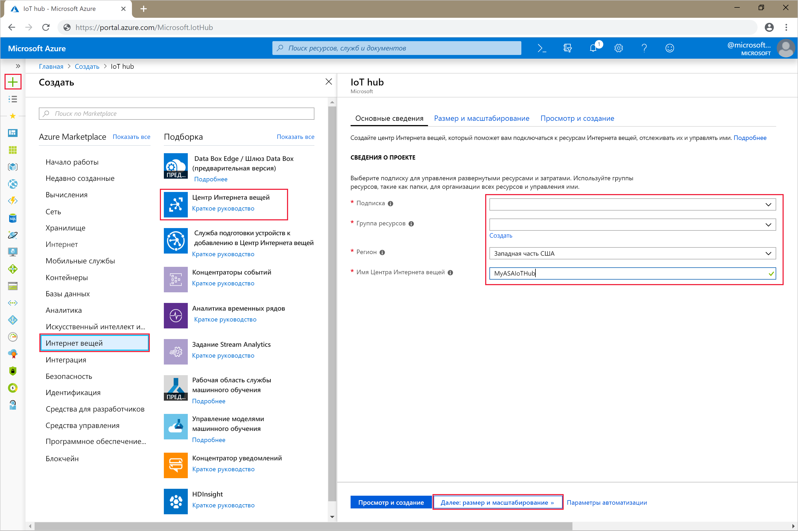

4. По завершении выберите **Next: Set size and scale** (Далее: задать размер и масштаб).

5. Выберите **ценовую категорию и уровень масштабирования**. Для этого краткого руководства выберите уровень **F1 — "Бесплатный"**, если он доступен для вашей подписки. Если ценовая категория "Бесплатный" недоступна, выберите минимальную доступную категорию. Дополнительные сведения см. на странице [цен на Центр Интернета вещей Azure](https://azure.microsoft.com/pricing/details/iot-hub/).

   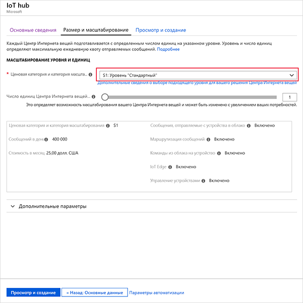

6. Выберите **Review + create** (Просмотреть и создать). Просмотрите сведения о Центре Интернета вещей и щелкните **Создать**. Создание Центра Интернета вещей может занять несколько минут. Ход создания можно отслеживать на панели **уведомлений**.

7. В меню навигации Центра Интернета вещей щелкните **Добавить** в области **устройств Интернета вещей**. Добавьте **идентификатор устройства** и щелкните **Сохранить**.

   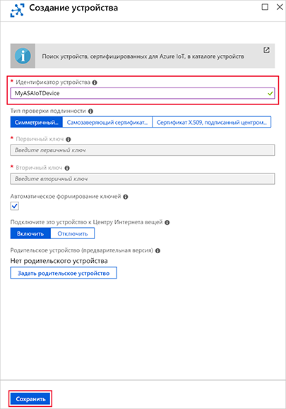

8. Создав устройство, откройте его из списка **устройств Интернета вещей**. Скопируйте значение из поля **Connection string -- primary key** (Строка подключения — первичный ключ) и сохраните его с помощью Блокнота для последующего использования.

   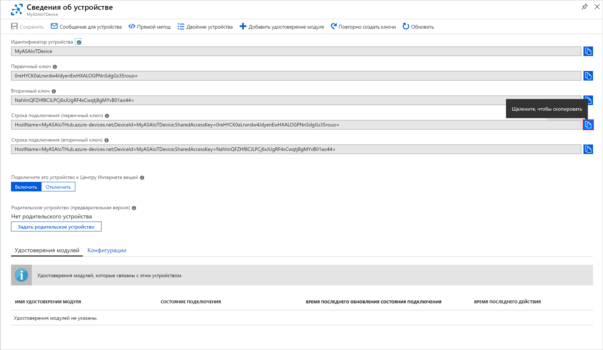

## <a name="create-blob-storage"></a>Создание хранилища BLOB-объектов

1. В верхнем левом углу окна портала Azure выберите **Создать ресурс** > **Хранилище** > **Учетная запись хранения**.

2. В области **создания учетной записи хранения** введите имя для учетной записи хранения, расположение и группу ресурсов. Выберите такое же расположение и группу ресурсов, как и для созданного Центра Интернета вещей. Щелкните **Просмотр и создание**, чтобы создать учетную запись.

   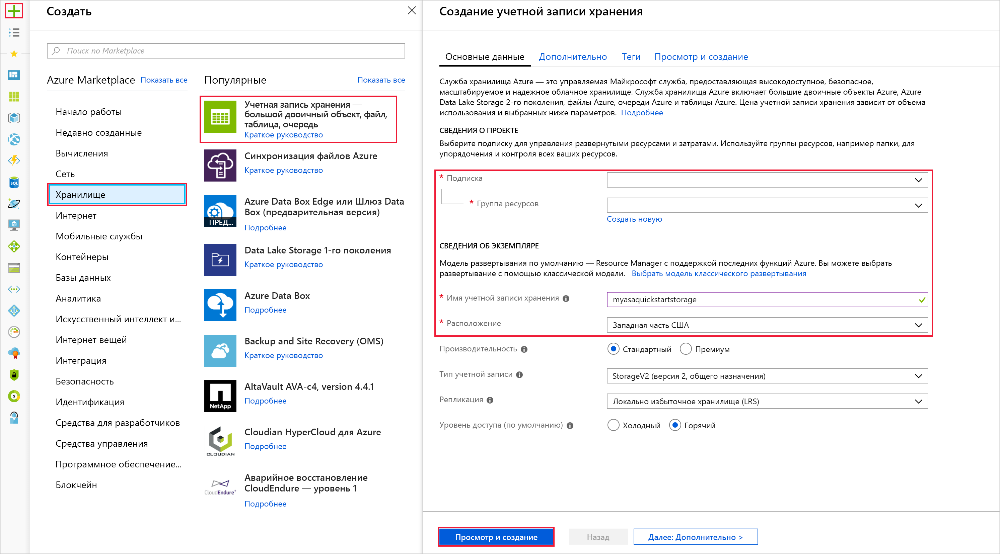

3. После создания учетной записи хранения щелкните плитку **BLOB-объекты** в области **Обзор**.

   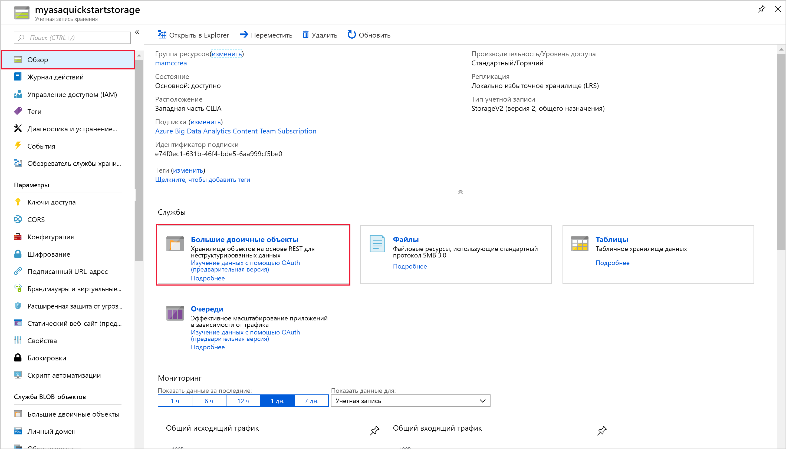

4. На странице **службы BLOB-объектов** выберите **Контейнер**, укажите имя для контейнера, такое как *container1*. Для параметра **уровня общего доступа** оставьте значение **Private (no anonymous access)** (Частный (без анонимного доступа)) и нажмите кнопку **ОК**.

   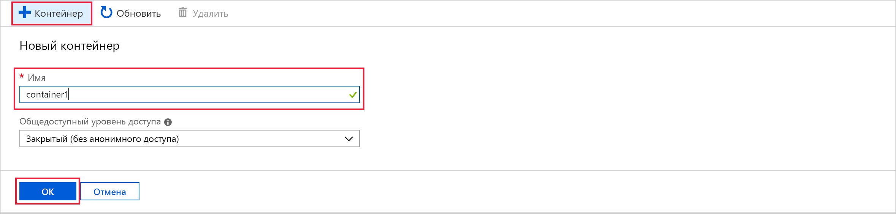

## <a name="create-a-stream-analytics-project"></a>Создание проекта Stream Analytics

1. Запустите Visual Studio.

2. Выберите **Файл > Новый проект**.  

3. Из списка шаблонов слева выберите **Stream Analytics** и щелкните **Azure Stream Analytics Application** (Приложение Azure Stream Analytics).  

4. Введите в проекте**Имя**, **Расположение** и **Имя решения**, а затем нажмите кнопку **ОК**.

   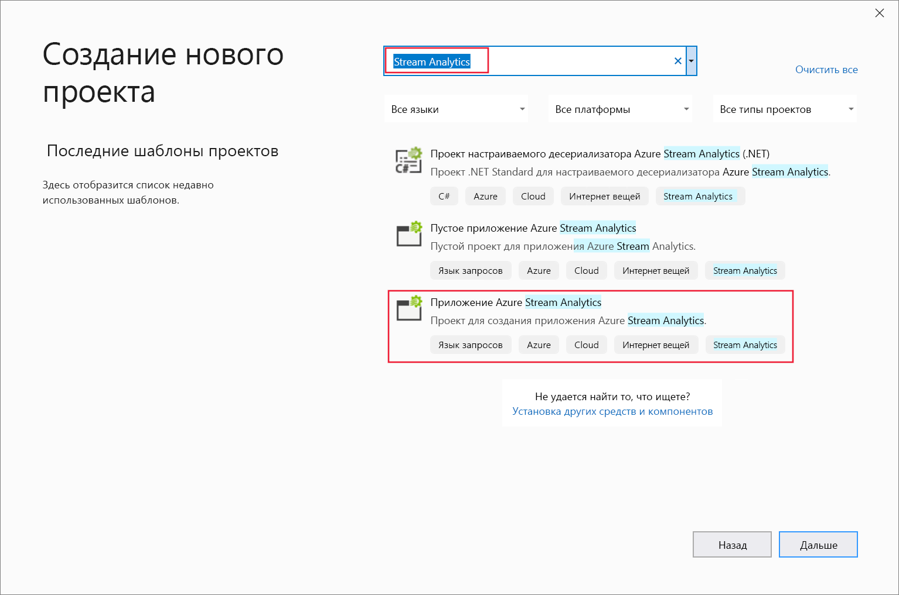

Обратите внимание на элементы, которые включены в проект Azure Stream Analytics.

   


## <a name="choose-the-required-subscription"></a>Выбор требуемой подписки

1. В Visual Studio в меню **Вид** выберите **Обозреватель серверов**.

2. Щелкните правой кнопкой мыши **Azure**, выберите **Подключиться к подписке Microsoft Azure** и войдите в систему с помощью учетной записи Azure.

## <a name="define-input"></a>Определение ввода

1. В **Обозревателе решений** разверните узел **Входные данные** и дважды щелкните **Input.json**.

2. Заполните область **Stream Analytics Input Configuration** следующими значениями.

   |**Параметр**  |**Рекомендуемое значение**  |**Описание**   |
   |---------|---------|---------|
   |Псевдоним входных данных  |  Входные данные   |  Введите имя для определения входных данных задания.   |
   |Тип источника   |  Поток данных |  Выберите соответствующий источник ввода: поток данных или эталонные данные.   |
   |Источник  |  Центр Интернета вещей |  Выберите соответствующий источник ввода.   |
   |Ресурс  | Выберите источник данных из текущей учетной записи | Выберите ввод данных вручную или существующую учетную запись.   |
   |Подписка  |  \<Ваша подписка\>   | Выберите подписку Azure, в которой размещен созданный Центр Интернета вещей.   |
   |Центр Интернета вещей  |  MyASAIoTHub   |  Выберите или введите имя вашего Центра Интернета вещей. Имена Центра Интернета вещей автоматически обнаруживаются, если они создаются в одной и той же подписке.   |
   
3. Оставьте значения по умолчанию для других параметров и нажмите кнопку **Сохранить**, чтобы сохранить параметры.  

   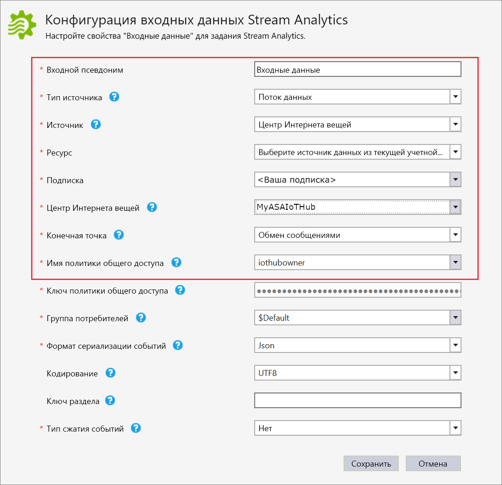

## <a name="define-output"></a>Определение выходных данных

1. В **обозревателе решений** разверните узел **Выходные данные** и дважды щелкните **Output.json**.

2. Заполните область **Stream Analytics Output Configuration** следующими значениями.

   |**Параметр**  |**Рекомендуемое значение**  |**Описание**   |
   |---------|---------|---------|
   |Псевдоним выходных данных  |  Выходные данные   |  Введите имя для определения выходных данных задания.   |
   |Приемник   |  Хранилище BLOB-объектов |  Выберите соответствующий приемник.    |
   |Ресурс  |  Укажите параметры источника данных вручную |  Выберите ввод данных вручную или существующую учетную запись.   |
   |Подписка  |  \<Ваша подписка\>   | Выберите подписку Azure, в которой создана учетная запись хранения. Учетная запись хранения может находиться в той же или в другой подписке. В этом примере предполагается, что вы создали учетную запись хранения в одной и той же подписке.   |
   |Учетная запись хранения  |  asaquickstartstorage   |  Выберите или введите имя учетной записи хранения. Имена учетных записей автоматически обнаруживаются, если они создаются в одной и той же подписке.   |
   |Контейнер  |  container1   |  Выберите существующий контейнер, созданный в вашей учетной записи хранения.   |
   |Шаблон пути  |  output   |  Введите путь к файлу, который будет создан в контейнере.   |
   
3. Оставьте значения по умолчанию для других параметров и нажмите кнопку **Сохранить**, чтобы сохранить параметры.  

   

## <a name="define-the-transformation-query"></a>Определение запроса преобразования

1. Откройте файл **Script.asaql** в **обозревателе решений** в Visual Studio.

2. Добавьте следующий запрос:

   ```sql
   SELECT *
   INTO BlobOutput
   FROM IoTHubInput
   HAVING Temperature > 27
   ```

## <a name="submit-a-stream-analytics-query-to-azure"></a>Отправка запроса Stream Analytics в Azure

1. В **редакторе запросов** щелкните **Отправить в Azure** в редакторе сценариев.

2. Выберите **Создать задание Azure Stream Analytics** и введите **Имя задания**. Выберите **Подписка**, **Группа ресурсов** и **Расположение**, которое использовалось в начале этого краткого руководства.

   

## <a name="run-the-iot-simulator"></a>Запуск IoT-симулятора

1. Откройте [онлайн-симулятор Raspberry Pi для Интернета вещей Azure](https://azure-samples.github.io/raspberry-pi-web-simulator/) в новой вкладке или новом окне браузера.

2. Замените значения заполнителя в 15 строке строкой подключения устройства Центра Интернета вещей, которую вы сохранили при работе с предыдущим разделом.

3. Щелкните **Выполнить**. В выходных данных должны присутствовать показания датчика и сообщения, отправляемые в Центр Интернета вещей.

   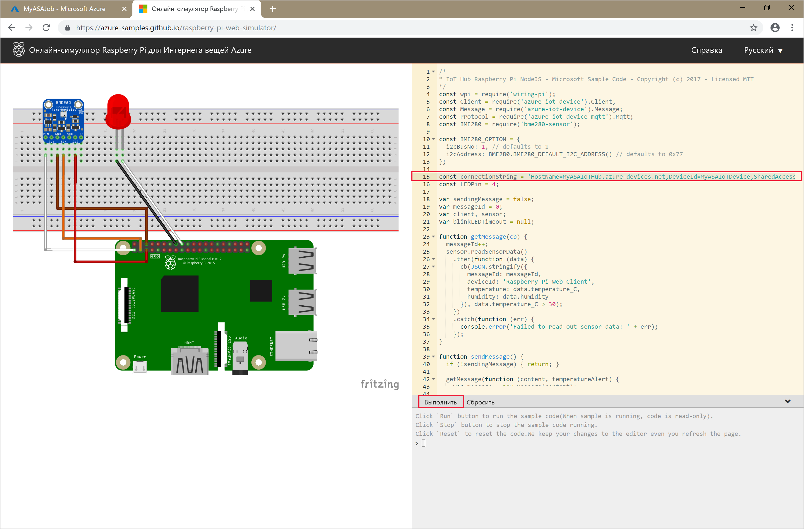

## <a name="start-the-stream-analytics-job-and-check-output"></a>Запуск задания Stream Analytics и просмотр выходных данных

1. Когда задание создано, автоматически откроется представление задания. Чтобы запустить задание, нажмите кнопку с зеленой стрелкой.

   

2. Измените значение **Режим начала вывода задания** на **JobStartTime** и щелкните **Запустить**.

   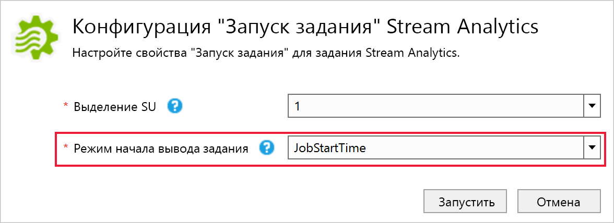

3. Обратите внимание, что состояние задания изменилось на **Выполняется** и поступают события ввода и вывода. Это может занять несколько минут.

   

4. Чтобы просмотреть результаты, в меню **Представление** выберите **Cloud Explorer**и перейдите к учетной записи хранилища в группе ресурсов. В разделе **Контейнеры больших двоичных объектов** дважды щелкните **container1**, а затем путь к файлу **вывода данных**.

   

## <a name="clean-up-resources"></a>Очистка ресурсов

Ставшие ненужными группу ресурсов, задание потоковой передачи и все связанные ресурсы можно удалить. При удалении задания будет прекращена тарификация за единицы потоковой передачи, потребляемые заданием. Если вы планируете использовать это задание в будущем, вы можете остановить и перезапустить его позже. Если вы не собираетесь использовать это задание дальше, удалите все ресурсы, созданные в ходе работы с этим руководством, выполнив следующие шаги:

1. В меню слева на портале Azure выберите **Группы ресурсов**, а затем выберите имя созданного ресурса.  

2. На странице группы ресурсов выберите **Удалить**, в текстовом поле введите имя ресурса для удаления и щелкните **Удалить**.

## <a name="next-steps"></a>Дополнительная информация

В этом кратком руководстве вы развернули простое задание Stream Analytics, используя Visual Studio. Вы также можете развертывать задания Stream Analytics, используя [портал Azure](stream-analytics-quick-create-portal.md) и [PowerShell](stream-analytics-quick-create-powershell.md). 

Чтобы узнать об инструментах Azure Stream Analytics для Visual Studio, перейдите к следующей статье:

> [!div class="nextstepaction"]
> [Просмотр заданий Azure Stream Analytics с помощью Visual Studio](stream-analytics-vs-tools.md)
