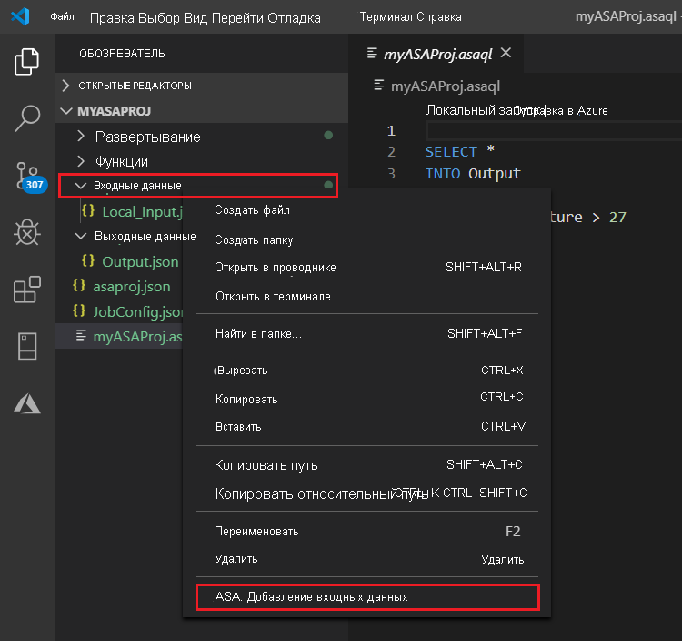
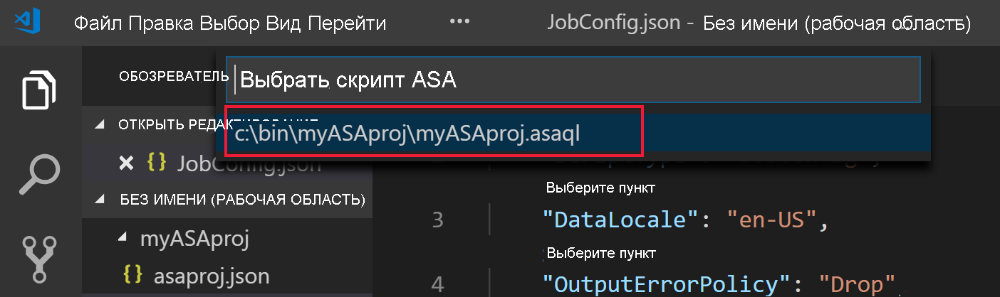

# Тестирование Stream Analytics запросов локально для входа в динамический поток с помощью Visual Studio Code

Azure Stream Analytics инструменты можно использовать для Visual Studio Code для локального тестирования заданий Stream Analytics в потоке ввода в режиме реального времени. Входные данные могут поступать из источника, такого как концентраторы событий Azure или центр Интернета вещей Azure. Выходные результаты отправляются в виде JSON-файлов в папку в проекте с именем **локалрунаутпутс**.

## Предварительные требования

* Установите [пакет SDK для .NET Core](https://dotnet.microsoft.com/download) и перезапустите Visual Studio Code.

* Используйте [это краткое руководство](quick-create-visual-studio-code.md) , чтобы узнать, как создать Stream Analytics задание с помощью Visual Studio Code.

## Определение входного потока в реальном времени

1. Щелкните правой кнопкой мыши папку **Inputs** в проекте Stream Analytics. Теперь выберите **ASA: добавить входные данные** в контекстном меню.

   

   Можно также нажать **клавиши CTRL + SHIFT + P** , чтобы открыть палитру команд, и ввести **ASA: Add input**.

   

2. Выберите тип источника входных данных из раскрывающегося списка.

   

3. Если вы добавили источник входных данных с помощью палитры команд, выберите скрипт запроса Stream Analytics, который будет использовать этот источник. Здесь будет автоматически указан путь к файлу **myASAproj.asaql**.

   

4. Щелкните **Выбрать подписку Azure** в раскрывающемся списке.

    

5. Настройте созданный JSON файл. Функция CodeLens помогает вводить строки, выбирать значения в раскрывающихся списках и редактировать текст непосредственно в файле. На следующем снимке экрана показано, как **выбрать подписку в списке**.

   

## Предварительный просмотр входных данных

Чтобы убедиться, что входные данные получены, выберите **Предварительный просмотр данных** в динамическом входном файле конфигурации в верхней строке. Некоторые входные данные поступают из центра Интернета вещей и отображаются в окне предварительного просмотра. Просмотр может занять несколько секунд.

 

## Локальное выполнение запросов.

Вернитесь в редактор запросов и выберите **запустить локально**. Затем выберите **использовать динамический вход** из раскрывающегося списка.

Результат отображается в правом окне и обновляется каждые 3 секунды. Можно выбрать **Запуск** для повторного тестирования. Можно также выбрать пункт **Открыть в папке** , чтобы просмотреть файлы результатов в проводнике и открыть их с помощью Visual Studio Code или такого средства, как Excel. Обратите внимание, что файлы результатов доступны только в формате JSON.

По умолчанию задано время начала создания выходных данных для задания, равное **Now**. Время можно настроить, нажав кнопку **время начала вывода** в окне результатов.

## Дальнейшие шаги

* [Просмотр Azure Stream Analytics заданий с помощью Visual Studio Code (Предварительная версия)](visual-studio-code-explore-jobs.md)

* [Настройка конвейеров CI/CD с использованием пакета npm](setup-cicd-vs-code.md)
