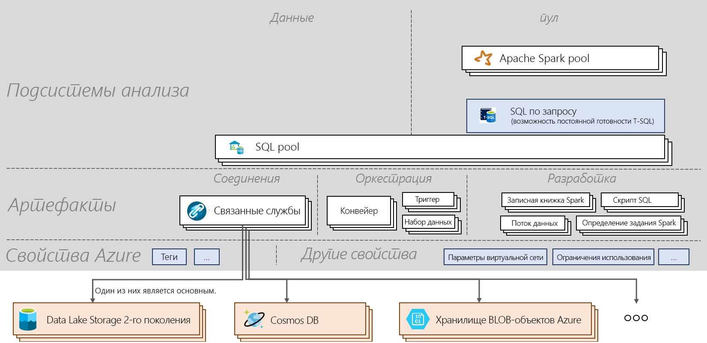

# Памятка по Azure Synapse Analytics

[!INCLUDE [preview](includes/note-preview.md)]

В памятке по Azure Synapse Analytics вы узнаете об основных понятиях службы и важных командах. Эта статья полезна как для начинающих, так и для тех, кто хочет узнать важные сведения об Azure Synapse.

## Architecture

> [!div class="mx-imgBorder"]
>

## Терминология
| Термин                         | Определение      |
|:---                                 |:---                 |
| **Рабочая область Synapse (предварительная версия)** | Защищаемая ограниченная область совместной работы для выполнения облачной корпоративной аналитики в Azure. Рабочая область развертывается в определенном регионе и с ней сопоставляются учетная запись и файловая система ADLS 2-го поколения (для хранения временных данных). Рабочая область принадлежит к группе ресурсов. |
| **Synapse SQL**   | Позволяет выполнять аналитику с пулами или с возможностями по требованию.  |
| **Пул SQL**   | В рабочей области можно развернуть от 0 до N подготовленных к работе ресурсов SQL с соответствующими базами данных. Каждый пул SQL связан с базой данных. Пул SQL можно масштабировать, а его работу можно приостанавливать и возобновлять вручную или автоматически. Пул SQL масштабируется от 100 до 30 000 DWU.       |
| **SQL по запросу (предварительная версия)**   | Созданная для крупномасштабных данных система распределенной обработки данных позволяет выполнять запросы T-SQL к данным в озере. Ее бессерверная инфраструктура сокращает необходимость в управлении.       |
|**Apache Spark для Synapse** | Среда выполнения Spark, используемая в пуле Spark. Поддерживаемая текущая версия — Spark 2.4 с Python 3.6.1, Scala 2.11.12, поддержка .NET для Apache Spark 0.5 и Delta Lake 0.3.  | 
| **Пул Apache Spark (предварительная версия)**  | В рабочей области можно развернуть от 0 до N подготовленных к работе ресурсов Spark с соответствующими базами данных. Работу пула Spark можно приостанавливать и возобновлять вручную или автоматически, а сам пул можно масштабировать.  |
| **Приложение Spark**  |   Его работа построена на процессе драйвера и наборе процессов исполнителя. Приложение Spark выполняется в пуле Spark.            |
| **Сеанс Spark**  |   Единая точка входа приложения Spark. Она предоставляет способ взаимодействия с различными функциями Spark, используя меньшее количество конструкций. Чтобы запустить записную книжку, необходимо создать сеанс. Сеанс можно настроить для выполнения с помощью указанного количества исполнителей определенного размера. Конфигурация по умолчанию для сеанса записной книжки предусматривает работу с помощью двух исполнителей среднего размера. |
| **Запрос SQL**  |   Такие операции, как запрос, выполняются через пул SQL или использование SQL по запросу. |
|**Интеграция данных**| Позволяет принимать данные из различных источников и управлять действиями, выполняемыми в рабочей области или вне ее.| 
|**Артефакты**| Инкапсулирует все объекты, необходимые пользователю для управления источниками данных, разработки, оркестрации и визуализации.|
|**Записная книжка**| Интерактивный и реактивный интерфейс обработки, анализа и инжиниринга данных с поддержкой Scala, PySpark, C# и SparkSQL. |
|**Определение задания Spark**|Интерфейс для отправки задания Spark с помощью JAR-файла сборки, содержащего код и его зависимости.|
|**Поток данных**|  Предоставляет полностью визуальную среду для преобразования больших данных без написания кода. Все операции оптимизации и выполнения обрабатываются бессерверным способом. |
|**Скрипт SQL**| Сохраненный в файле набор команд SQL. Скрипт SQL может содержать одну и более инструкций SQL. Его можно использовать для выполнения запросов SQL через пул SQL или SQL по запросу.|
|**Конвейер**| Логическая группа действий, которые вместе позволяют выполнить задачу.|
|**Действие**| Определяет действия, выполняемые с данными, например копирование данных, запуск записной книжки или скрипта SQL.|
|**Триггер**| Выполняет конвейер. Может запускаться вручную или автоматически (по расписанию, с помощью "переворачивающегося" окна или на основе событий).|
|**Связанная служба**| Строки подключения, определяющие сведения о соединении, необходимые для подключения рабочей области к внешним ресурсам.|
|**Набор данных**|  Именованное представление данных, которое указывает данные для использования в действии, разделяя их на входные и выходные. Принадлежит связанной службе.|

## Дальнейшие действия

- [Создание рабочей области](quickstart-create-workspace.md)
- [Использование Synapse Studio](quickstart-synapse-studio.md)
- [Создание пула SQL](quickstart-create-sql-pool-portal.md)
- [Использование службы SQL по запросу](quickstart-sql-on-demand.md)
- [Создание пула Apache Spark](quickstart-create-apache-spark-pool-portal.md)

