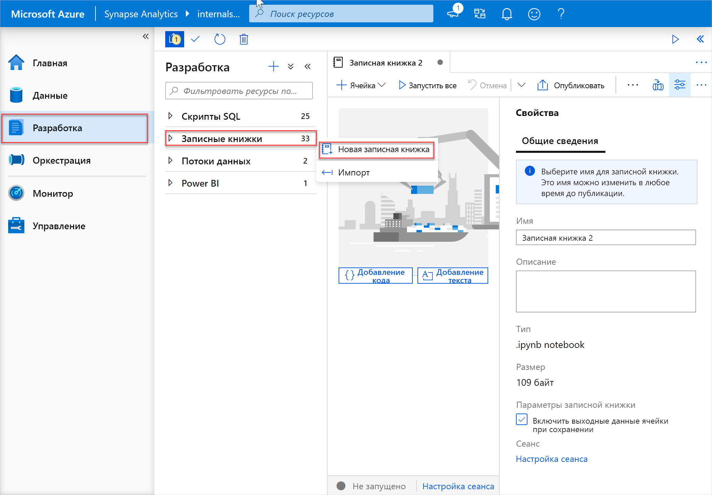
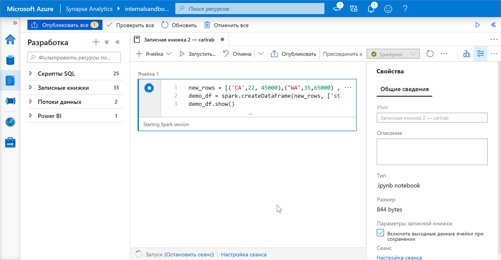
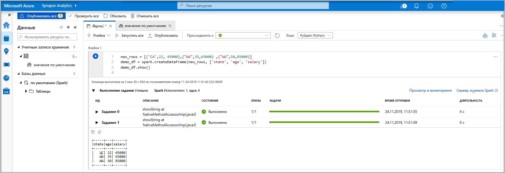
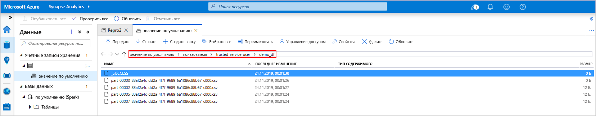
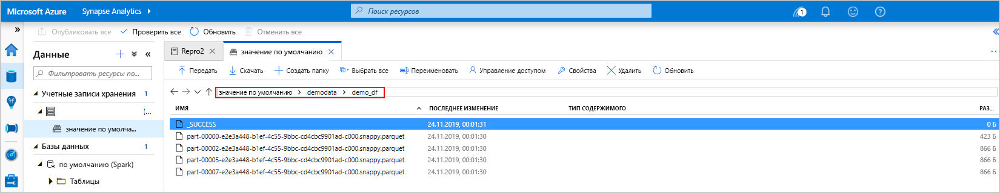
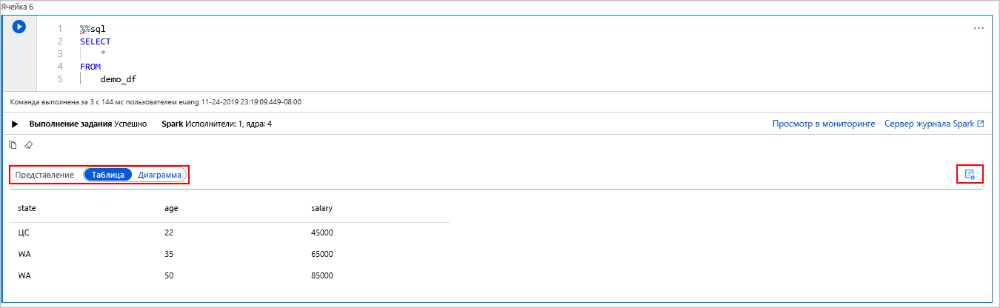
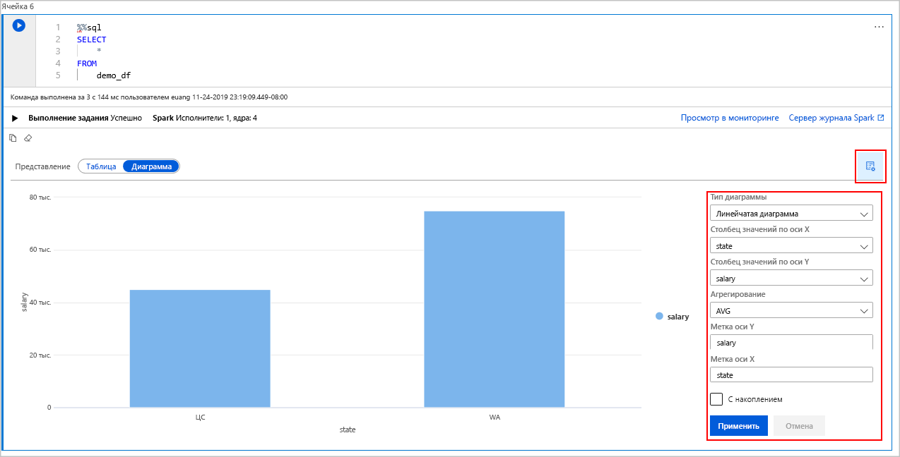

# <a name="quickstart-create-a-serverless-apache-spark-pool-in-azure-synapse-analytics-using-web-tools"></a>Краткое руководство. Создание бессерверного пула Apache Spark в Azure Synapse Analytics с помощью веб-инструментов

Из этого краткого руководства вы узнаете, как создать бессерверный пул Apache Spark в Azure Synapse с помощью веб-инструментов. Затем вы научитесь подключаться к этому пулу Apache Spark и выполнять SQL-запросы Spark по файлам и таблицам. Apache Spark обеспечивает быстрый анализ данных и кластерные вычисления, используя обработку в памяти. Сведения о Spark в Azure Synapse см. в статье [Что такое Apache Spark в Azure Synapse Analytics](./spark/apache-spark-overview.md).

> [!IMPORTANT]
> Экземпляры Spark оплачиваются пропорционально за каждую минуту, независимо от их использования. Не забудьте завершить работу экземпляра Spark после его использования или задайте короткое время ожидания. Дополнительные сведения см. в разделе **Очистка ресурсов** этой статьи.

Если у вас еще нет подписки Azure, [создайте бесплатную учетную запись](https://azure.microsoft.com/free/), прежде чем начинать работу.

## <a name="prerequisites"></a>Предварительные требования

- Подписка Azure — [создайте бесплатную учетную запись](https://azure.microsoft.com/free/).
- [Рабочая область Synapse Analytics](quickstart-create-workspace.md).
- [Бессерверный пул Apache Spark.](quickstart-create-apache-spark-pool-studio.md)

## <a name="sign-in-to-the-azure-portal"></a>Вход на портал Azure

Войдите на [портал Azure](https://portal.azure.com/).

Если у вас еще нет подписки Azure, [создайте бесплатную учетную запись Azure](https://azure.microsoft.com/free/), прежде чем начинать работу.

## <a name="create-a-notebook"></a>Создание записной книжки

Записная книжка представляет собой интерактивную среду с поддержкой нескольких языков программирования. Она позволяет работать с данными, объединять код с разметкой, использовать текстовые данные и простые визуализации.

1. В представлении нужной рабочей области Azure Synapse на портале Azure выберите действие **Запуск Synapse Studio**.
2. Когда откроется Synapse Studio, выберите вкладку **Разработка**. Затем щелкните значок " **+** ", чтобы добавить новый ресурс.
3. И выберите пункт **Записная книжка**. Будет создана и открыта записная книжка с автоматически созданным именем.
 
     

4. В окне **Свойства** укажите имя для этой записной книжки.
5. На панели инструментов щелкните **Опубликовать**.
6. Если в рабочей области есть только один пул Apache Spark, он будет выбран по умолчанию. В противном случае используйте раскрывающийся список, чтобы выбрать нужный пул Apache Spark.
7. Щелкните **Add code** (Добавить код). По умолчанию используется язык `Pyspark`. Здесь вы будете совмещать Pyspark и Spark SQL, поэтому вариант по умолчанию хорошо подходит. Также поддерживаются такие языки, как Scala и .NET для Spark.
8. Вы создадите в Spark простой объект DataFrame для дальнейших операций. В нашем примере для его создания применяется код. В нем есть три столбца и три строки.

   ```python
   new_rows = [('CA',22, 45000),("WA",35,65000) ,("WA",50,85000)]
   demo_df = spark.createDataFrame(new_rows, ['state', 'age', 'salary'])
   demo_df.show()
   ```

9. Теперь выполните код в ячейке одним из следующих способов:

   - Нажмите **SHIFT + ВВОД**.
   - Щелкните синий значок воспроизведения слева от ячейки.
   - Нажмите кнопку **Запустить все** на панели инструментов.

       

10. Если экземпляр пула Apache Spark еще не запущен, он запускается автоматически. Сведения о состоянии экземпляра пула Apache Spark отображаются под ячейкой, которую вы выполняете, а также на панели состояния в нижней части записной книжки. В зависимости от размера пула выполнение кода в ячейке займет от 2 до 5 минут. Когда завершится выполнение кода, под ячейкой отобразятся сведения о длительности и результате выполнения. Выходные данные отобразятся в предназначенной для этого ячейке.

    

11. Теперь в DataFrame сохранены данные, которые можно использовать различными способами. В остальной части этого краткого руководства описано использование данных в разных форматах.
12. Введите приведенный ниже код в другой ячейке и выполните его, чтобы создать таблицу Spark, CSV-файл и файл Parquet с копиями этих данных.

    ```python
     demo_df.createOrReplaceTempView('demo_df')
     demo_df.write.csv('demo_df', mode='overwrite')
     demo_df.write.parquet('abfss://<<TheNameOfAStorageAccountFileSystem>>@<<TheNameOfAStorageAccount>>.dfs.core.windows.net/demodata/demo_df', mode='overwrite')
    ```

    В обозревателе хранилища вы можете наблюдать влияние двух использованных выше способов записи файла. Если файловая система не указана, используется вариант по умолчанию, в нашем примере это `default>user>trusted-service-user>demo_df`. Эти данные сохраняются в расположение в указанной файловой системе.

    Обратите внимание, что в форматах CSV и Parquet для операций записи создается папка с множеством секционированных файлов.

    

    

## <a name="run-spark-sql-statements"></a>Выполнение инструкций SQL Spark

SQL — это наиболее распространенный и широко используемый язык для создания запросов и определения данных. Spark SQL работает как расширение Apache Spark для обработки структурированных данных с использованием знакомого синтаксиса SQL.

1. Вставьте указанный ниже фрагмент кода в пустую ячейку и выполните этот код. Эта команда выводит список таблиц в пуле.

   ```sql
   %%sql
   SHOW TABLES
   ```

   При использовании Notebook с пулом Apache Spark для Azure Synapse вы получаете предустановленный объект `sqlContext` для выполнения запросов с помощью Spark SQL. `%%sql` указывает, что записная книжка должна использовать предустановленный `sqlContext` для выполнения запроса. Этот запрос извлекает первые 10 строк из системной таблицы, которая по умолчанию входит в состав всех пулов Apache Spark для Azure Synapse.

2. Выполните другой запрос, чтобы вывести данные из таблицы `demo_df`.

    ```sql
    %%sql
    SELECT * FROM demo_df
    ```

    Этот код создает две выходные ячейки, одна из которых содержит результаты операций с данными, а другая — представление задания.

    По умолчанию в представлении результатов отображается сетка. Но под этой сеткой есть переключатель, который позволяет перейти к представлению графа и обратно.

    

3. Установите переключатель **Представление** в положение **Диаграмма**.
4. Щелкните значок **View options** (Параметры представления) справа.
5. В поле **Тип диаграммы** выберите "Линейчатая диаграмма".
6. В поле столбца для оси X выберите "state".
7. В поле столбца для оси Y выберите "salary".
8. В поле **Агрегирование** выберите AVG (Среднее).
9. Нажмите кнопку **Применить**.

   

10. Вы можете получить такой же результат выполнения кода SQL для других языков, не переключая их. Для этого замените представленную выше ячейку SQL следующим примером ячейки PySpark. Вы получите такие же выходные данные, так как применяется команда **display**:

    ```python
    display(spark.sql('SELECT * FROM demo_df'))
    ```

11. Каждая из ранее выполненных ячеек позволяет перейти к **серверу журнала** или **мониторингу**. Щелкая соответствующие ссылки, вы будете переходить в разные части пользовательского интерфейса.

> [!NOTE]
> Некоторые из [официальных документов по Apache Spark](https://spark.apache.org/docs/latest/) предполагают использование консоли Spark, которая недоступна в Synapse Spark. Вместо этого используйте интерфейсы [записной книжки](quickstart-apache-spark-notebook.md) или [IntelliJ](./spark/intellij-tool-synapse.md).

## <a name="clean-up-resources"></a>Очистка ресурсов

Azure Synapse сохраняет данные в Azure Data Lake Storage. Вы можете спокойно завершить работу экземпляра Spark, когда он не используется. Плата взимается за все время работы бессерверного пула Apache Spark, независимо от реального использования. 

Поскольку стоимость пула во много раз превышает стоимость хранилища, экономически целесообразно завершать работу неиспользуемых экземпляров Spark.

Чтобы правильно завершить работу экземпляра Spark, завершите все подключенные сеансы (записные книжки). Пул Apache Spark завершит работу автоматически, когда истечет указанное для него **время простоя**. Можно также выполнить команду **завершения сеанса** из строки состояния в нижней части записной книжки.

## <a name="next-steps"></a>Дальнейшие действия

Из этого краткого руководства вы узнали, как создать бессерверный пул Apache Spark и выполнить простой SQL-запрос Spark.

- [Azure Synapse Analytics](overview-what-is.md)
- [Документация по .NET для Apache Spark](/dotnet/spark?toc=/azure/synapse-analytics/toc.json&bc=/azure/synapse-analytics/breadcrumb/toc.json)


