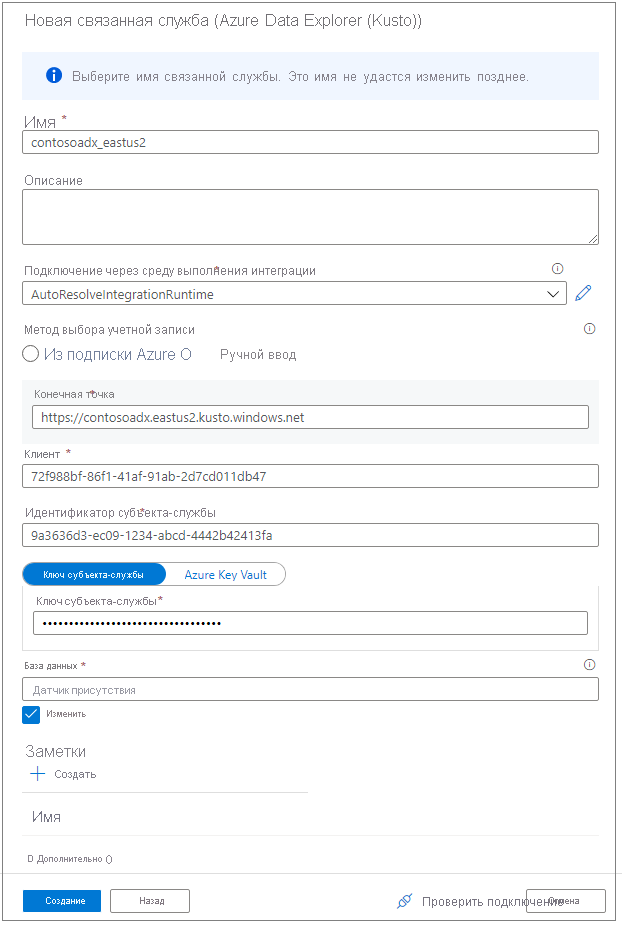

# Подключение к Azure Data Explorer с помощью Synapse Apache Spark

В этой статье описывается, как получить доступ к базам данных Azure Data Explorer из Synapse Studio с помощью Synapse Apache Spark. 

## Предварительные требования

* [Создайте кластер и базу данных Azure Data Explorer](/azure/data-explorer/create-cluster-database-portal).
* имеющаяся рабочая область Synapse (можно также создать новую рабочую область, следуя инструкциям в этом [кратком руководстве](./quickstart-create-workspace.md)). 
* Существующий пул Apache Spark (можно также создать новый пул, следуя инструкциям в этом [кратком руководстве](./quickstart-create-apache-spark-pool-portal.md)).
* [Создайте приложение Azure AD, выполнив подготовку приложения Azure AD.](/azure/data-explorer/kusto/management/access-control/how-to-provision-aad-app)
* Предоставьте приложению Azure AD доступ к базе данных, как описано в разделе [Управление разрешениями базы данных Azure Data Explorer](/azure/data-explorer/manage-database-permissions)

## Перейдите в Synapse Studio

В рабочей области Synapse выберите **Запуск Synapse Studio**. На домашней странице Synapse Studio выберите **Данные**, чтобы перейти в **обозреватель объектов данных**.

## Подключение базы данных Azure Data Explorer к рабочей области Synapse

Подключение базы данных Azure Data Explorer к рабочей области выполняется через связанную службу. Связанная служба Azure Data Explore позволяет пользователям просматривать и изучать данные, а также считывать и записывать их из Apache Spark для Azure Synapse Analytics и выполнять задания интеграции в конвейере.

В обозревателе объектов данных выполните следующие действия, чтобы создать прямое соединение с кластером Azure Data Explorer.

1. Щелкните значок **+** рядом с данными.
2. Выберите **Подключение** к внешнем данным
3. Выберите **Azure Data Explorer (Kusto)**
5. Выберите **Продолжить**
6. Присвойте имя связанной службе. Имя будет отображаться в обозревателе объектов и использоваться во время выполнения Synapse для подключения к базе данных. Рекомендуем использовать понятное имя
7. Выберите кластер Azure Data Explore из подписки или введите универсальный код ресурса (URI).
8. Введите значения для пунктов "Идентификатор субъекта-службы" и "Ключ субъекта-службы" (убедитесь, что у субъекта-службы есть доступ на просмотр данных в базе данных для операций чтения и получения доступа для приема данных).
9. Введите имя базы данных Azure Data Explorer
10. Щелкните **Проверить подключение**, чтобы убедиться в наличии нужных разрешений.
11. Нажмите кнопку **Создать**

    

    > [!NOTE]
    > (Необязательно) Проверка подключения не проверяет наличие доступа на запись. Убедитесь, что идентификатору субъекта-службы предоставлен доступ на запись в базу данных Azure Data Explorer.

12. Кластеры и базы данных Azure Data Explorer отображаются на вкладке **Связанные** в разделе Azure Data Explorer. 

    

    > [!NOTE] 
    > В текущем выпуске объекты базы данных заполняются на основе разрешений учетной записи AAD в базах данных Azure Data Explorer. При запуске записных книжек Apache Spark или заданий интеграции будут использоваться учетные данные в службе каналов (например, субъект-служба).

## Быстрое взаимодействие с созданными кодом действиями

* Если щелкнуть правой кнопкой мыши базу данных или таблицу, появится список жестов, которые активируют пример записной книжки Spark для чтения данных, записи данных и потоковой передачи данных в Azure Data Explorer. 
    

* Ниже приведен пример считывания данных. Подключите записную книжку к пулу Spark и запустите ячейку  (Создать записную книжку для чтения)

   > [!NOTE] 
   > Первый запуск сеанса Spark может занять более трех минут. Последующие выполнения будут завершаться значительно быстрее.  

## Ограничения
Соединитель Azure Data Explorer в настоящее время не поддерживается в управляемой виртуальной сети Azure Synapse.

## Дальнейшие действия

* [Пример кода с дополнительными параметрами](https://github.com/Azure/azure-kusto-spark/blob/master/samples/src/main/python/SynapseSample.py)
* [Соединитель Spark Azure Data Explorer (Kusto)](https://github.com/Azure/azure-kusto-spark)