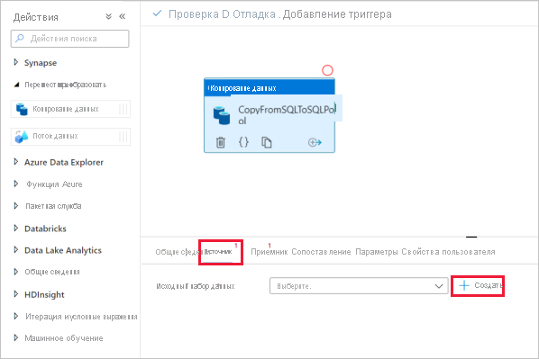
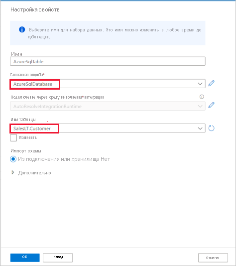

# Краткое руководство. Загрузка данных в выделенный пул SQL с помощью действия копирования

Azure Synapse Analytics предлагает различные механизмы аналитики, упрощающие прием, преобразование, моделирование и анализ данных. Выделенный пул SQL предусматривает возможности вычисления и хранения на основе T-SQL. После создания выделенного пула SQL в рабочей области Synapse данные можно загружать, моделировать, обрабатывать и доставлять для быстрого получения аналитических сведений.

Из этого краткого руководства вы узнаете, как *загрузить данные из Базы данных SQL Azure в Azure Synapse Analytics*. Чтобы копировать данные из других типов хранилищ, необходимо выполнить аналогичные шаги. Эта последовательность действий применяется к копированию данных между другим источником и приемником.

## Предварительные требования

* Подписка Azure. Если у вас еще нет подписки Azure, [создайте бесплатную учетную запись](https://azure.microsoft.com/free/), прежде чем начинать работу.
* Рабочая область Azure Synapse: Создайте рабочую область Synapse с помощью портала Azure, следуя инструкциям, приведенным в статье [Краткое руководство по созданию рабочей области Synapse](quickstart-create-workspace.md)).
* Подключение к базе данных SQL Azure и При прохождении этого учебника вы скопируете данные из примера набора данных Adventure Works LT в Базу данных SQL Azure. Этот пример базы данных можно создать в Базе данных SQL, следуя инструкциям в кратком руководстве [Создание отдельной базы данных в Базе данных SQL Azure](../azure-sql/database/single-database-create-quickstart.md). Кроме того, можно использовать другие хранилища данных, выполнив следующие аналогичные действия.
* Учетная запись хранения Azure: Служба хранилища Azure используется в качестве *промежуточной* области во время операции копирования. Если у вас нет учетной записи хранения Azure, см. инструкции по [ее созданию](../storage/common/storage-account-create.md).
* Azure Synapse Analytics. Выделенный пул SQL используется в качестве хранилища данных приемника. Если у вас нет экземпляра Azure Synapse Analytics, выполните действия, приведенные в статье [Краткое руководство. Создание выделенного пула SQL (предварительная версия) с помощью портала Azure](quickstart-create-sql-pool-portal.md), чтобы создать его.

### Переход к Synapse Studio

После создания рабочей области Synapse Studio можно открыть двумя способами:

* Откройте рабочую область Synapse на [портале Azure](https://ms.portal.azure.com/#home). Щелкните **Открыть** на карточке "Открыть Synapse Studio" в разделе "Начало работы".
* Откройте [Azure Synapse Analytics](https://web.azuresynapse.net/) и войдите в рабочую область.

Для целей этого краткого руководства в качестве примера мы используем рабочую область с именем adftest2020. При этом вы автоматически перейдете на домашнюю страницу Synapse Studio.

## Создание связанных служб

В Azure Synapse Analytics связанная служба используется для определения сведений о подключении к другим службам. В этом разделе вы создадите следующие два типа связанных служб: База данных SQL Azure и связанные службы Azure Data Lake Storage 2-го поколения (ADLS 2-го поколения).

1. На домашней странице Synapse Studio в левой области навигации выберите вкладку **Управление**.
1. В разделе Внешние подключения выберите Связанные службы.
  
   

1. Чтобы добавить связанную службу, выберите **Создать**.
1. В коллекции выберите **База данных SQL Azure** и щелкните **Продолжить**. Вы можете ввести текст "sql" в поле поиска, чтобы отфильтровать соединители.

   

1. На странице New Linked Service (Новая связанная служба) в соответствующих раскрывающихся списках выберите имя сервера и базы данных, а также укажите имя пользователя и пароль. Щелкните **Проверить подключение**, чтобы проверить настройки, а затем нажмите **Создать**.

   

1. Повторите шаги 3–4, однако на этот раз выберите **Azure Data Lake Storage 2-го поколения** из коллекции. На странице New Linked Service (Новая связанная служба) выберите из раскрывающегося списка имя учетной записи хранения. Щелкните **Проверить подключение**, чтобы проверить настройки, а затем нажмите **Создать**. 

   
 
## Создание конвейера

Конвейер содержит логический поток для выполнения набора действий. В этом разделе показано, как создать конвейер, содержащий действие копирования, которое принимает данные из Базы данных SQL Azure в выделенный пул SQL.

1. Перейдите на вкладку **Integrate** (Интеграция). Нажмите значок плюса рядом с заголовком конвейеров и выберите "Конвейер".

   

1. В разделе *Move and Transform* (Перемещение и преобразование) на панели *Действия* перетащите **Копирование данных** на холст конвейера.
1. Выберите действие копирования и перейдите на вкладку "Источник". Выберите **Создать**, чтобы создать исходный набор данных.

   

1. Выберите **База данных SQL Azure** в качестве хранилища данных, а затем — **Продолжить**.
1. В области *Свойства набора* выберите связанную службу Базы данных SQL Azure, созданную ранее. 
1. В разделе "Имя таблицы" выберите пример таблицы, который будете использовать в следующем действии копирования. Для целей этого краткого руководства мы используем в качестве примера таблицу SalesLT.Customer. 

   
1. Выберите **ОК** после завершения.
1. Выберите действие копирования и перейдите на вкладку "Приемник". Выберите **Создать**, чтобы создать набор данных приемника.
1. Выберите **Azure Synapse dedicated SQL pool** (Выделенный пул SQL Azure Synapse) в качестве хранилища данных и щелкните **Продолжить**.
1. В области **Свойства набора** выберите пул SQL Analytics, созданный ранее. Если вы выполняете запись в существующую таблицу, выберите ее из раскрывающегося списка в разделе *Имя таблицы*. В противном случае установите флажок "Изменить" и введите новое имя таблицы. Выберите **ОК** после завершения.
1. Для параметров набора данных раздела "Приемник" включите параметр **Auto create table** (Автоматическое создание таблицы) в поле Table option (Параметр таблицы).

   

1. На странице **Параметры** установите флажок напротив **Enable staging** (Включить промежуточный режим). Этот параметр применяется, если исходные данные несовместимы с PolyBase. В разделе **Staging settings** (Параметры промежуточного хранения) выберите связанную службу Azure Data Lake Storage 2-го поколения, созданную ранее в качестве промежуточного хранилища. 

    Это хранилище используется для промежуточного хранения данных перед их загрузкой в Azure Synapse Analytics с помощью PolyBase. После завершения копирования промежуточные данные в Azure Data Lake Storage 2-го поколения автоматически очищаются.

   

1. Чтобы проверить конвейер, выберите **Проверить** на панели инструментов. Результат проверки конвейера отобразится в правой части страницы. 

## Отладка и публикация конвейера

Завершив настройку конвейера, можно выполнить отладку перед публикацией артефактов, чтобы убедиться, что все правильно.

1. Чтобы выполнить отладку конвейера, на панели инструментов щелкните **Отладка**. Состояние выполнения конвейера вы можете найти на вкладке **Выходные данные** в нижней части окна. 

   

1. После успешного запуска конвейера на верхней панели инструментов выберите **Опубликовать все**. Это действие опубликует сущности (наборы данных и конвейеры), которые вы создали в службе Synapse Analytics.
1. Дождитесь сообщения **Successfully published** (Публикация выполнена). Чтобы отобразить уведомления, нажмите кнопку в виде колокольчика в правом верхнем углу. 

## Активация и мониторинг конвейера

Проходя этот раздел, вы вручную активируете конвейер, опубликованный ранее. 

1. Выберите **Добавить триггер** на панели инструментов, а затем **Trigger Now** (Запустить сейчас). На странице **Запуск конвейера** щелкните **ОК**.  
1. Перейдите на вкладку **Монитор** на левой боковой панели. Вы увидите выполнение конвейера, которое вы только что активировали вручную. 
1. После успешного запуска конвейера выберите ссылку в столбце **Имя конвейера**, чтобы просмотреть сведения о выполнении действия или перезапустить конвейер. В нашем примере определено только одно действие, поэтому в списке вы увидите только одну запись. 
1. Чтобы увидеть сведения об операции копирования, щелкните ссылку **Сведения** (значок очков) в столбце **Название действия**. Вы можете отслеживать такие сведения, как объем данных, копируемых из источника в приемник, пропускная способность данных, шаги выполнения с длительностью и используемые параметры.

   

1. Чтобы вернуться к представлению "Запуски конвейера", выберите ссылку **Все запуски конвейеров** в верхней части окна. Щелкните **Обновить**, чтобы обновить список.
1. Убедитесь, что данные правильно записаны в выделенный пул SQL.

## Дальнейшие действия

Перейдите к следующей статье, чтобы узнать о поддержке Azure Synapse Analytics:

> [!div class="nextstepaction"]
> [Конвейер и действия](https://docs.microsoft.com/azure/data-factory/concepts-pipelines-activities?toc=/azure/synapse-analytics/toc.json&bc=/azure/synapse-analytics/breadcrumb/toc.json)
> [Общие сведения о соединителе](https://docs.microsoft.com/azure/data-factory/connector-overview?toc=/azure/synapse-analytics/toc.json&bc=/azure/synapse-analytics/breadcrumb/toc.json)
> [Действие копирования](https://docs.microsoft.com/azure/data-factory/copy-activity-overview?toc=/azure/synapse-analytics/toc.json&bc=/azure/synapse-analytics/breadcrumb/toc.json)