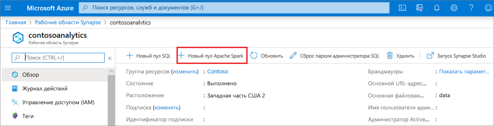
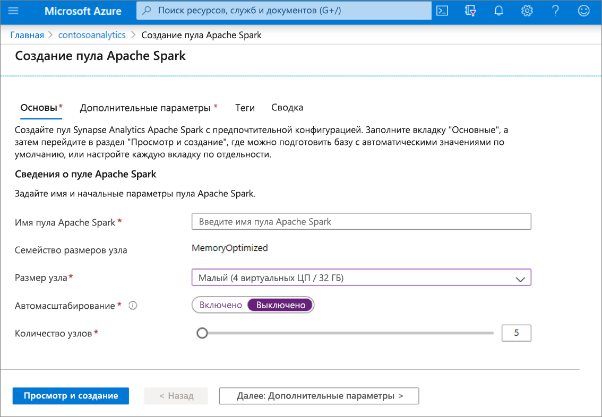
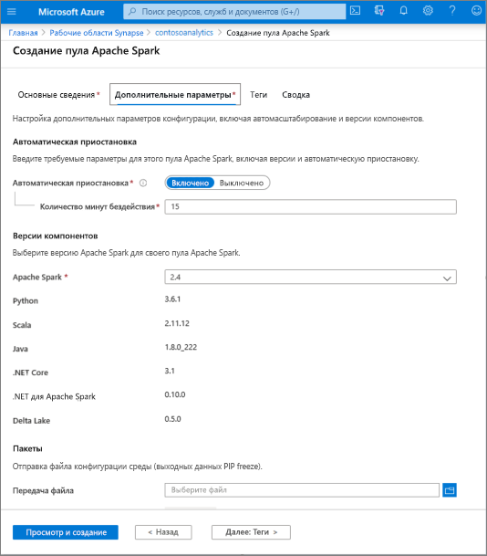
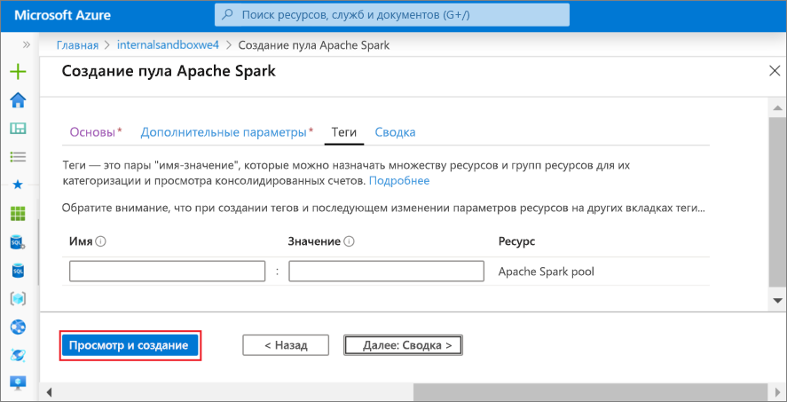
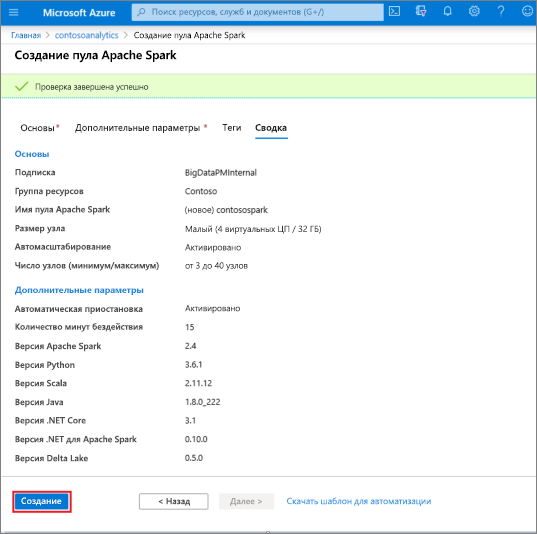
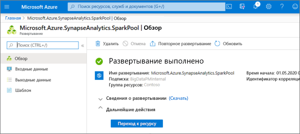
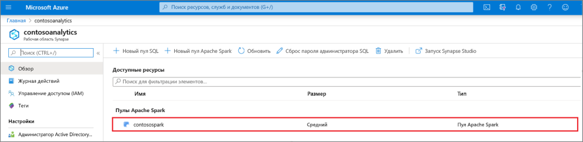
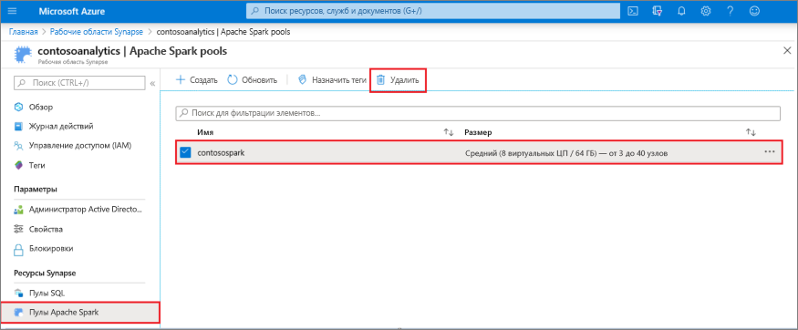
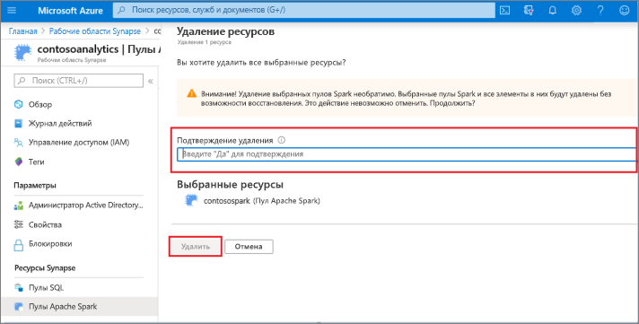

# Краткое руководство. Создание пула Apache Spark с помощью портала Azure

Azure Synapse Analytics предлагает различные механизмы аналитики, упрощающие прием, преобразование, моделирование, анализ и распространение данных. Пул Apache Spark предлагает возможности для вычислений больших данных с открытым кодом. После создания пула Apache Spark в рабочей области Synapse вы сможете загружать, моделировать, обрабатывать и распространять данные для быстрого получения аналитических сведений.

В этом кратком руководстве вы узнаете, как использовать портал Azure для создания пула Apache Spark в рабочей области Synapse.

> [!IMPORTANT]
> Экземпляры Spark оплачиваются пропорционально за каждую минуту, независимо от их использования. Не забудьте завершить работу экземпляра Spark после его использования или задайте короткое время ожидания. Дополнительные сведения см. в разделе **Очистка ресурсов** этой статьи.

Если у вас еще нет подписки Azure, [создайте бесплатную учетную запись](https://azure.microsoft.com/free/), прежде чем начинать работу.

## Предварительные требования

- Подписка Azure — [создайте бесплатную учетную запись](https://azure.microsoft.com/free/).
- [Рабочая область Synapse Analytics](quickstart-create-workspace.md).

## Вход на портал Azure

Войдите на [портал Azure](https://portal.azure.com/)

## Переход в рабочую область Synapse 
1. Перейдите к рабочей области Synapse, в которой будет создан пул Apache Spark, введя имя службы (или напрямую имя ресурса) в строке поиска.

1. В списке рабочих областей введите имя (или часть имени) рабочей области, которую нужно открыть. В нашем примере будет использоваться рабочая область с именем **contosoanalytics**.

## Создание пула Apache Spark

1. В рабочей области Synapse, в которой необходимо создать пул Apache Spark, выберите **Новый пул Apache Spark**.
    
2. Введите следующие сведения на вкладке **Основные сведения**:

    |Параметр | Рекомендуемое значение | Описание |
    | :------ | :-------------- | :---------- |
    | **Имя пула Apache Spark** | Допустимое имя пула | Это имя, которое будет у пула Apache Spark. |
    | **Размер узла** | "Small (4 vCPU / 32 GB)" (Малый (4 виртуальных ЦП / 32 ГБ)) | Задайте минимальный размер, чтобы сократить затраты по работе в рамках этого краткого руководства. |
    | **Автомасштабирование** | Выключено | Для этого краткого руководства автомасштабирование не требуется |
    | **Количество узлов** | 5 | Задайте минимальный размер, чтобы сократить затраты на выполнение этого краткого руководства. |

    
    > [!IMPORTANT]
    > Обратите внимание, что для имен, которые могут использовать пулы Apache Spark, существуют определенные ограничения. Имя должно содержать только буквы и цифры, его длина не должна превышать 15 символов. Имя должно начинаться с буквы, быть уникальными в рабочей области, но не должно содержать зарезервированные слова.

3. Щелкните **Далее: дополнительные параметры** и проверьте предложенные по умолчанию параметры. Не изменяйте параметры по умолчанию.
    

4. Выберите **Далее: теги**. Не удаляйте теги.
    

5. Выберите **Review + create** (Просмотреть и создать).

6. Убедитесь, что подробные сведения на основе ранее введенных данных указаны правильно, и щелкните **Создать**.
    

7. На этом этапе запустится поток подготовки ресурсов, а затем проинформирует о своем завершении.
    

8. После завершения подготовки в рабочей области будет показана новая запись для созданного пула Apache Spark.
    

9. На этом этапе нет работающих ресурсов, плата за Spark не взимается. Вы создали метаданные об экземплярах Spark, которые вам необходимо создать.

## Очистка ресурсов

Выполните действия ниже, чтобы удалить пул Apache Spark из рабочей области.
> [!WARNING]
> При удалении пула Apache Spark аналитический модуль будет удален из рабочей области. Вы больше не сможете подключиться к пулу, а все запросы, конвейеры и записные книжки, использующие этот пул Apache Spark, перестанут работать.

Если вы хотите удалить пул Apache Spark, выполните следующие действия:

1. Перейдите в колонку "Пулы Apache Spark" в рабочей области.
2. Выберите пул Apache Spark для удаления (в нашем примере это **contosospark**).
3. Нажмите кнопку **Удалить**
 
4. Подтвердите удаление и нажмите кнопку **Удалить**.
 
5. После успешного завершения процесса пул Apache Spark больше не будет указываться в ресурсах рабочей области.

## Дальнейшие действия

- См. [Краткое руководство. Создание записной книжки Apache Spark](quickstart-apache-spark-notebook.md).
- См. [Краткое руководство. Создание пула SQL Synapse с помощью портала Azure](quickstart-create-sql-pool-portal.md).
