# Краткое руководство. Создание пула Apache Spark (предварительная версия) с помощью Synapse Studio

Azure Synapse Analytics предлагает различные аналитические модули, упрощающие прием, преобразование, моделирование, анализ и предоставление данных. Пул Apache Spark предоставляет возможности для вычислений больших данных из открытых источников. После создания пула Apache Spark в рабочей области Synapse данные можно загружать, моделировать, обрабатывать и обслуживать для получения аналитических сведений.  

Из этого краткого руководства вы узнаете, как создать пул Apache Spark в рабочей области Synapse с помощью Synapse Studio.

> [!IMPORTANT]
> Экземпляры Spark оплачиваются пропорционально за каждую минуту, независимо от их использования. Не забудьте завершить работу экземпляра Spark после его использования или задайте короткое время ожидания. Дополнительные сведения см. в разделе **Очистка ресурсов** этой статьи.

Если у вас еще нет подписки Azure, [создайте бесплатную учетную запись](https://azure.microsoft.com/free/), прежде чем начинать работу.

## Предварительные требования

- Подписка Azure — [создайте бесплатную учетную запись](https://azure.microsoft.com/free/).
- [Рабочая область Synapse](./quickstart-create-workspace.md)

## Вход на портал Azure

Войдите на [портал Azure](https://portal.azure.com/)

## Переход в рабочую область Synapse

1. Перейдите к рабочей области Synapse, в которой будет создан пул Apache Spark, введя имя службы (или напрямую имя ресурса) в строке поиска.
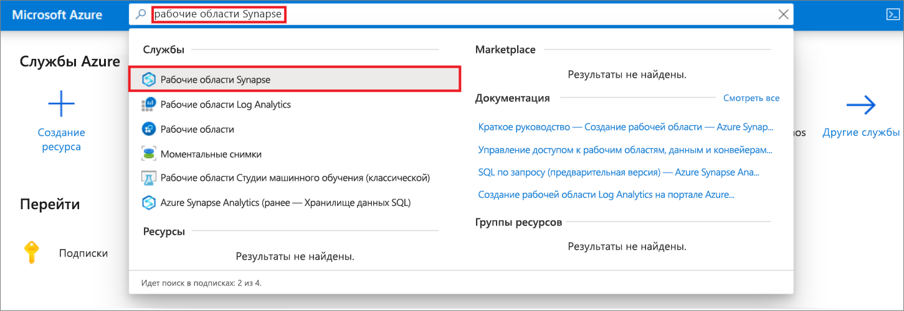
1. В списке рабочих областей введите имя (или часть имени) рабочей области, которую нужно открыть. В нашем примере будет использоваться рабочая область с именем **contosoanalytics**.
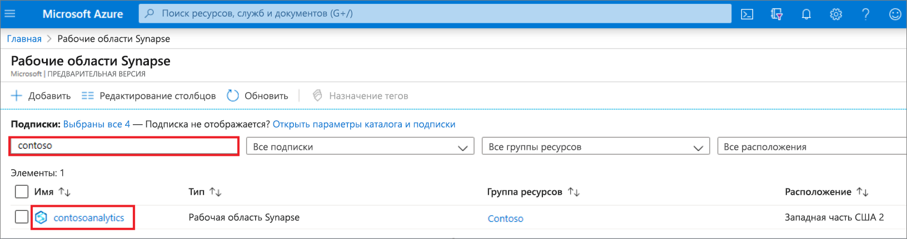

## Запуск Synapse Studio 

1. В окне обзора рабочей области выберите **Запуск Synapse Studio**, чтобы открыть расположение, в котором будет создан пул Apache Spark. В строке поиска введите имя службы или непосредственно ресурса.
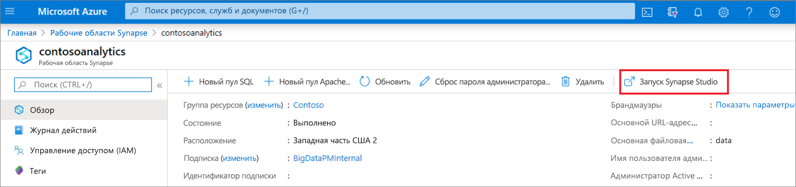

## Создание пула Apache Spark в Synapse Studio

1. На домашней странице Synapse Studio перейдите в **центр управления**, щелкнув в области навигации слева значок **Управление**.
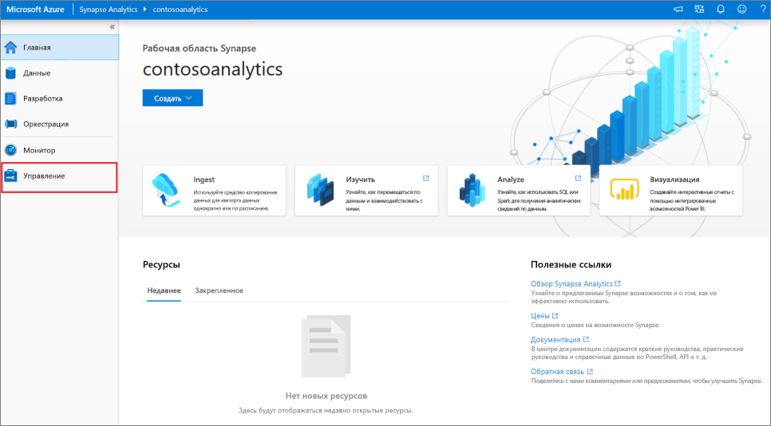

1. В центре управления перейдите в раздел **Пулы Apache Spark** и просмотрите текущий список пулов Apache Spark, доступных в этой рабочей области.
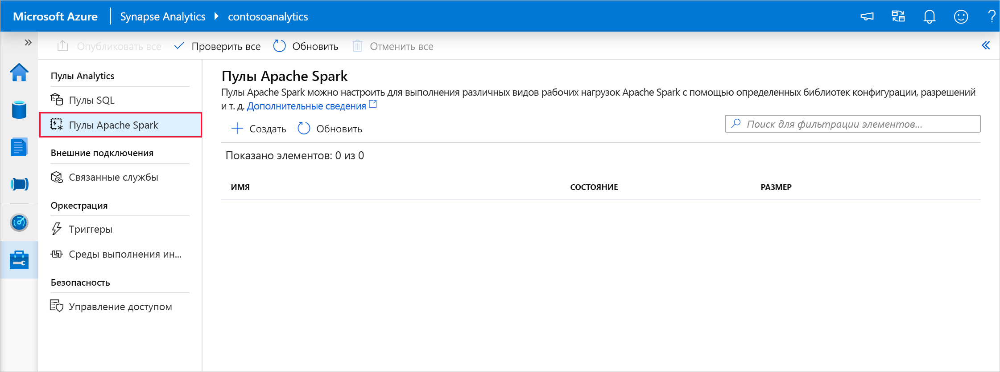

1. Выберите **+ Создать**. Запустится мастер создания пула Apache Spark. 
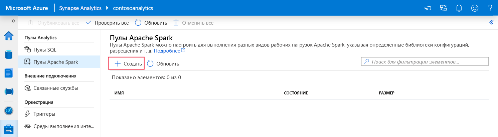

1. Введите следующие сведения на вкладке **Основные сведения**:

    | Параметр | Рекомендуемое значение | Описание |
    | :------ | :-------------- | :---------- |
    | **Имя пула Apache Spark** | contosospark | Это имя, которое будет у пула Apache Spark. |
    | **Размер узла** | "Small (4 vCPU / 32 GB)" (Малый (4 виртуальных ЦП / 32 ГБ)) | Задайте минимальный размер, чтобы сократить затраты по работе в рамках этого краткого руководства. |
    | **Автомасштабирование** | Выключено | Для целей этого краткого руководства автомасштабирование не требуется. |
    | **Количество узлов** | 8 | Задайте минимальный размер, чтобы сократить затраты на выполнение этого руководства.|
    
    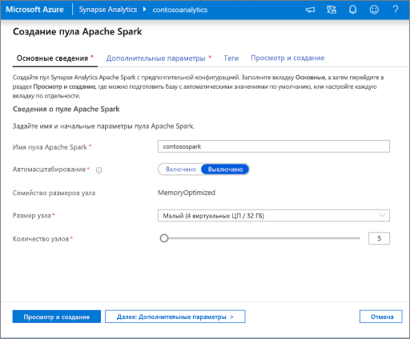
    > [!IMPORTANT]
    > Обратите внимание, что для имен, которые могут использовать пулы Apache Spark, существуют определенные ограничения. Имя должно содержать только буквы и цифры, его длина не должна превышать 15 символов. Имя должно начинаться с буквы, быть уникальными в рабочей области, но не должно содержать зарезервированные слова.

1. На вкладке "Дополнительные параметры" (следующая вкладка), оставьте значения по умолчанию и нажмите кнопку **Просмотр и создание** (мы не будем добавлять теги).
 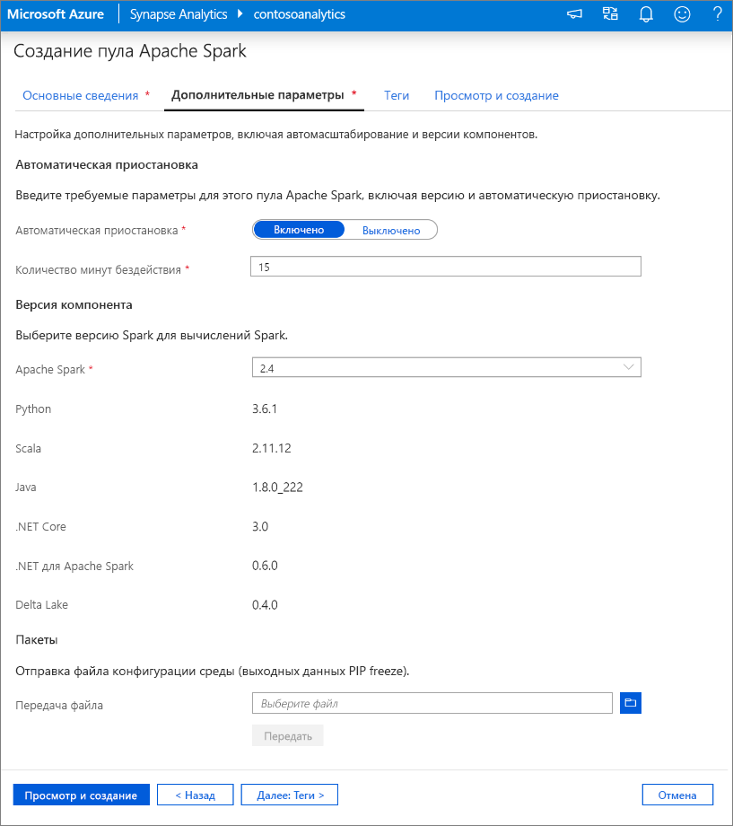

1. В этот раз мы не будем добавлять теги, поэтому выберите **Просмотр и создание**.

1. На вкладке **Просмотр и создание** убедитесь, что подробные сведения на основе ранее введенных данных указаны правильно, и нажмите кнопку **Создать**. 
 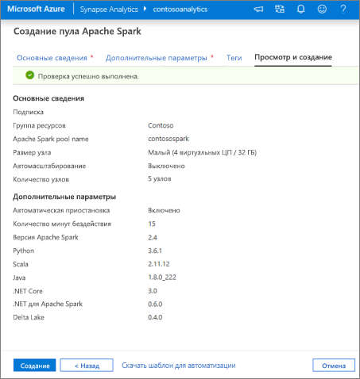

1. Пул Apache Spark начнет процесс подготовки к работе.
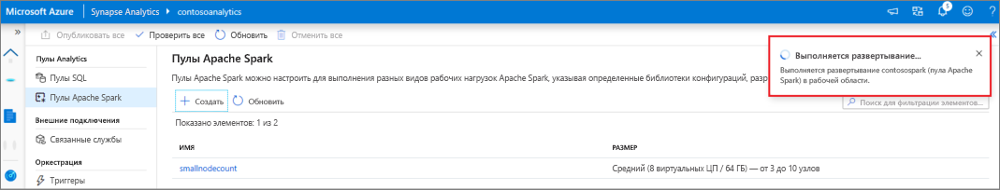

1. После завершения подготовки новый пул Apache Spark появится в списке.
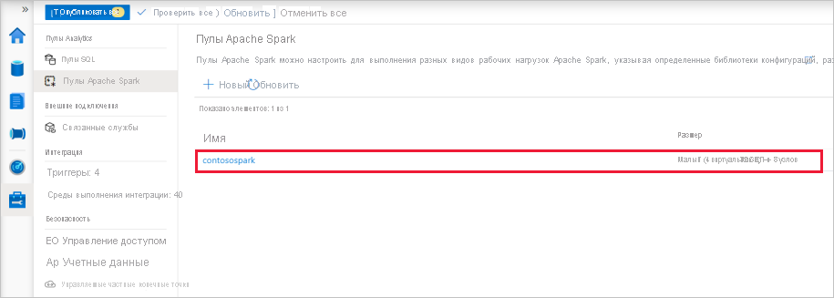

## Очистка ресурсов пула Apache Spark с помощью Synapse Studio

Чтобы удалить пул Apache Spark из рабочей области с помощью Synapse Studio, выполните приведенные ниже действия.
> [!WARNING]
> При удалении пула Spark аналитический модуль будет удален из рабочей области. Вы больше не сможете подключиться к пулу, а все запросы, конвейеры и записные книжки, использующие этот пул Spark, перестанут работать.

Если вы хотите удалить пул Apache Spark, выполните следующие действия:

1. Перейдите к пулам Apache Spark в центре управления Synapse Studio.
1. Щелкните многоточие рядом с удаляемым пулом Apache (в данном случае **contosospark**), чтобы отобразить команды для пула Apache Spark.
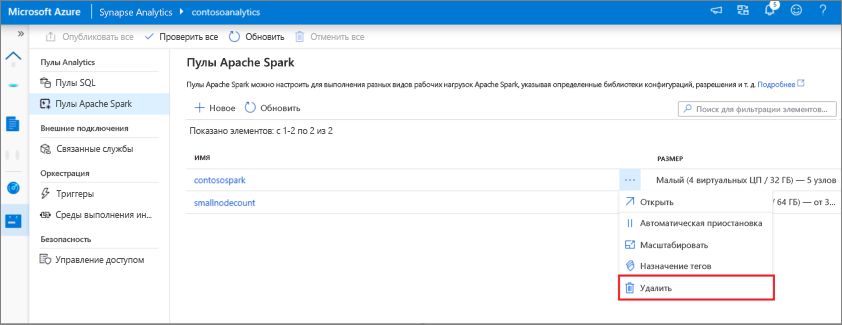
1. Нажмите кнопку **Удалить**
1. Подтвердите удаление и нажмите кнопку **Удалить**.
 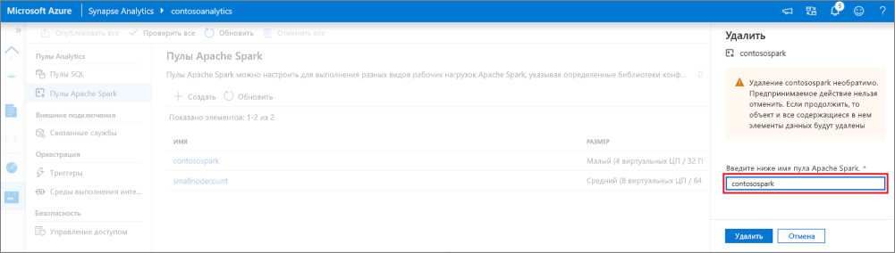
1. После успешного завершения процесса пул Apache Spark больше не будет указываться в ресурсах рабочей области. 

## Дальнейшие действия

- См. [Краткое руководство. Создание пула Apache Spark в Synapse Studio с помощью веб-средств](quickstart-apache-spark-notebook.md).
- См. [Краткое руководство. Создание пула Apache Spark с помощью портала Azure](quickstart-create-apache-spark-pool-portal.md).
