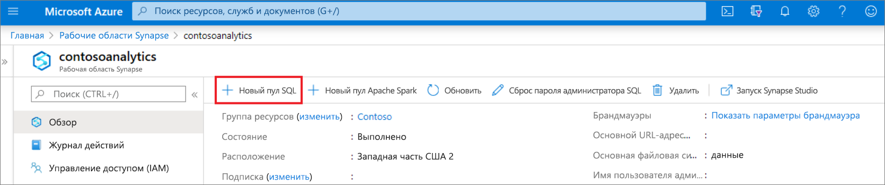
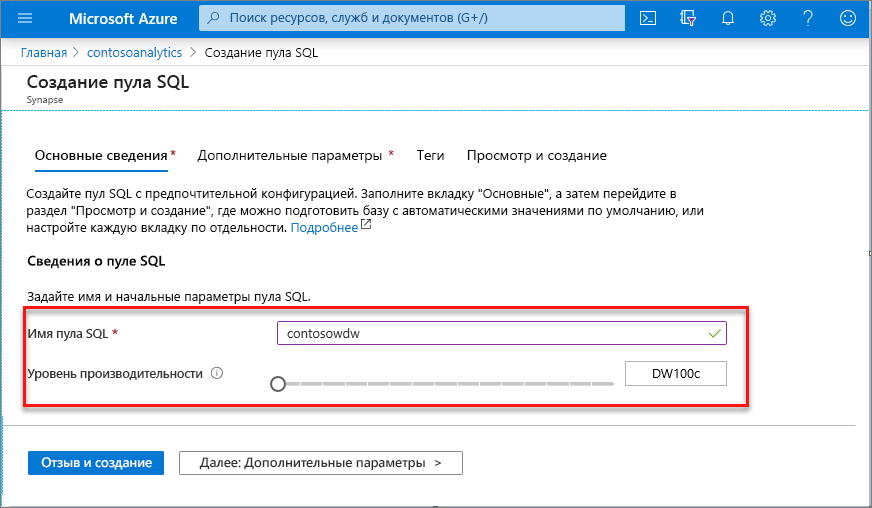
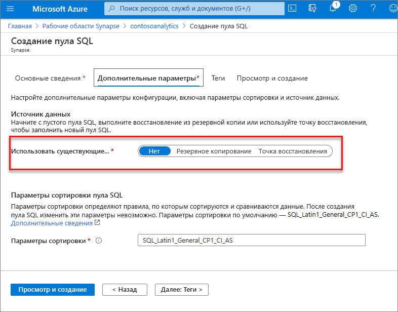
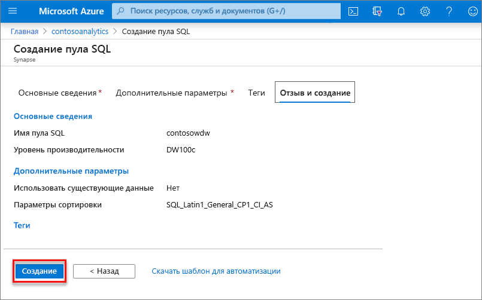
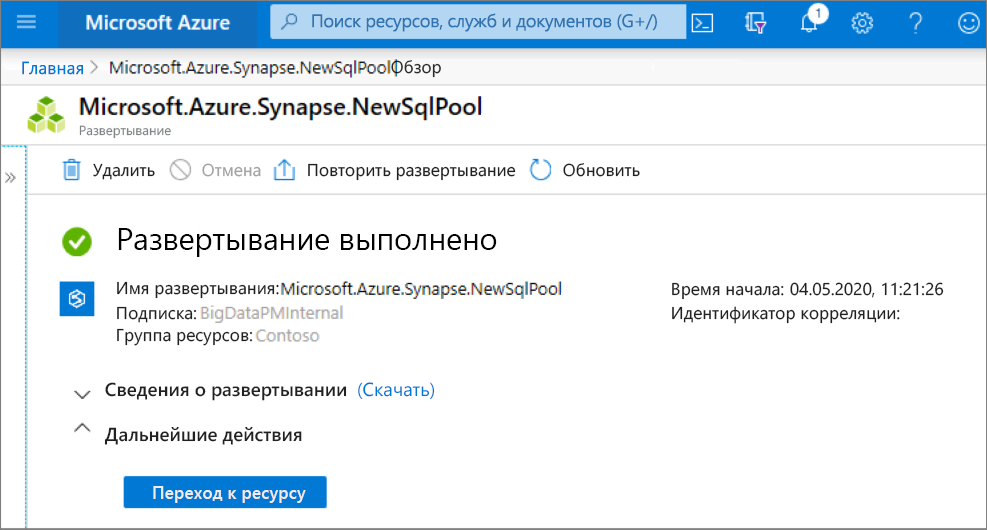
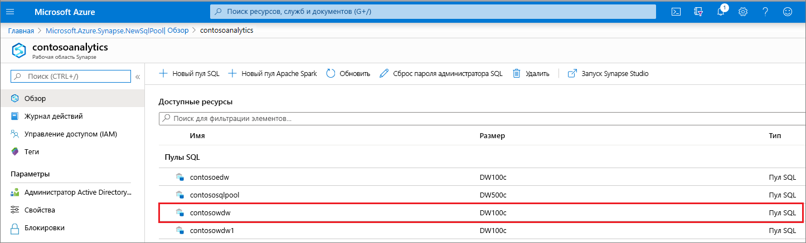
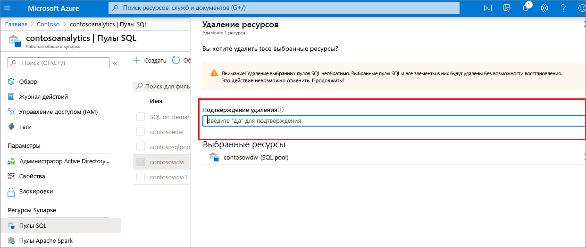

# Краткое руководство. Создание пула Synapse SQL (предварительная версия) с помощью портала Azure

Azure Synapse Analytics предлагает различные механизмы аналитики, упрощающие прием, преобразование, моделирование и анализ данных. Пул SQL предусматривает возможности вычисления и хранения на основе T-SQL. После создания пула SQL в рабочей области Synapse данные можно загружать, моделировать, обрабатывать и доставлять для более быстрого получения аналитических сведений.

В этом кратком руководстве вы узнаете, как создать пул SQL в рабочей области Synapse с помощью портала Azure.

Если у вас еще нет подписки Azure, [создайте бесплатную учетную запись, прежде чем начинать работу](https://azure.microsoft.com/free/).

## Предварительные требования

- Подписка Azure — [создайте бесплатную учетную запись](https://azure.microsoft.com/free/).
- [Рабочая область Synapse](./quickstart-create-workspace.md)

## Вход на портал Azure

Войдите на [портал Azure](https://portal.azure.com/)

## Переход в рабочую область Synapse

1. Перейдите к рабочей области Synapse, в которой будет создан пул SQL, введя имя службы (или напрямую имя ресурса) в строке поиска.
. 
1. В списке рабочих областей введите имя (или часть имени) рабочей области, которую нужно открыть. В нашем примере будет использоваться рабочая область с именем **contosoanalytics**.

## Создание пула SQL

1. В рабочей области Synapse, в которой необходимо создать пул SQL, щелкните команду **New SQL pool** (Новый пул SQL) на верхней панели.

2. Введите следующие сведения на вкладке **Основные сведения**:

    | Параметр | Рекомендуемое значение | Описание |
    | :------ | :-------------- | :---------- |
    | **Имя пула SQL** | Любое допустимое имя | Имя пула SQL. |
    | **Уровень производительности** | DW100c | Задайте минимальный размер, чтобы сократить затраты по работе в рамках этого краткого руководства. |

  
    
    > [!IMPORTANT]
    > Обратите внимание, что для имен, которые могут использовать пулы SQL, существуют определенные ограничения. Имена не могут содержать специальные символы, их должно быть не более 15. Имена также не должны содержать зарезервированных слов и должны быть уникальными в рабочей области.

3. По завершении выберите **Next: Дополнительные параметры**.
4. Выберите **Никакие**, чтобы подготовить к работе пул SQL без данных. Примите параметры сортировки по умолчанию.

5. Выберите **Review + create** (Просмотреть и создать).
6. Убедитесь, что подробные сведения на основе ранее введенных данных указаны правильно. Нажмите кнопку **создания**.

7. На этом этапе запустится поток подготовки ресурсов.
 

8. После завершения подготовки в рабочей области будет показана новая запись для созданного пула SQL.
 

После создания пул SQL становится доступным в рабочей области для загрузки данных, обработки потоков, чтения из озера и т. д.

## Очистка ресурсов

Чтобы удалить пул SQL из рабочей области, выполните действия ниже.
> [!WARNING]
> Удаление пула SQL приведет к удалению аналитического модуля и данных, хранящихся в базе данных удаленного пула SQL, из рабочей области. Вы больше не сможете подключиться к пулу, а все запросы, конвейеры и записные книжки, которые считывают данные из этого пула SQL или записывают их туда, перестанут работать.

Чтобы удалить пул SQL, выполните следующие действия:

1. Перейдите в колонку "Пулы SQL" в колонке рабочей области.
1. Выберите пул SQL для удаления (в этом случае — **contosowdw**).
1. После выбора щелкните **Удалить**.
1. Подтвердите удаление и нажмите кнопку **Удалить** 
1. После успешного завершения процесса пул SQL больше не будет указываться в ресурсах рабочей области.

## Дальнейшие действия

- См. [Краткое руководство. Создание пула Apache Spark в Synapse Studio с помощью веб-средств](quickstart-apache-spark-notebook.md).
- См. [Краткое руководство. Создание пула Apache Spark с помощью портала Azure](quickstart-create-apache-spark-pool-portal.md).
