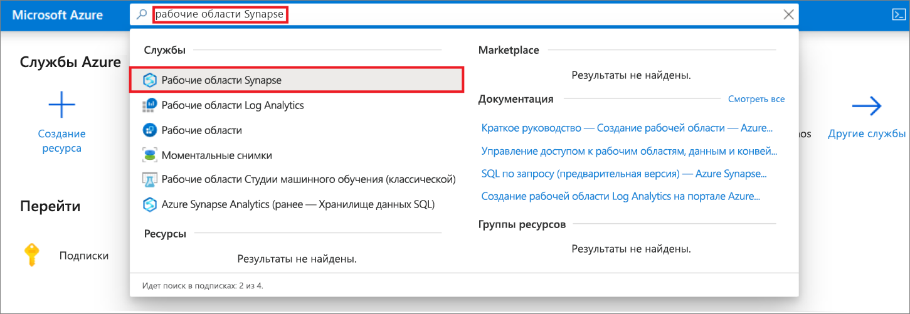
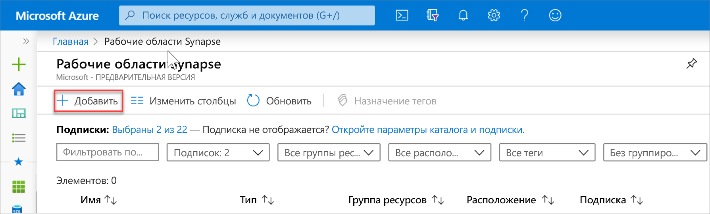
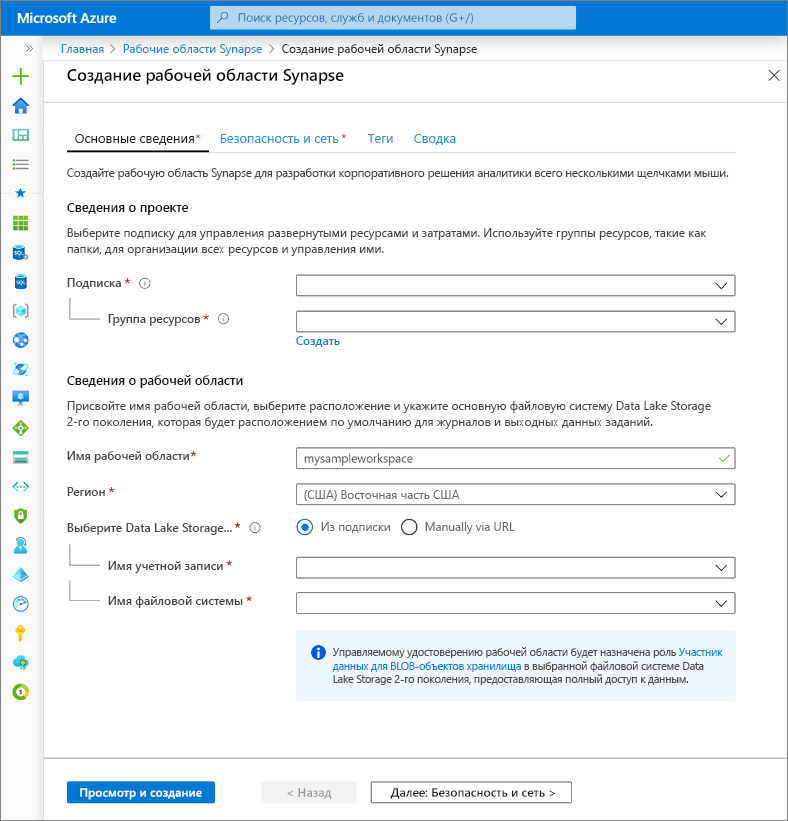
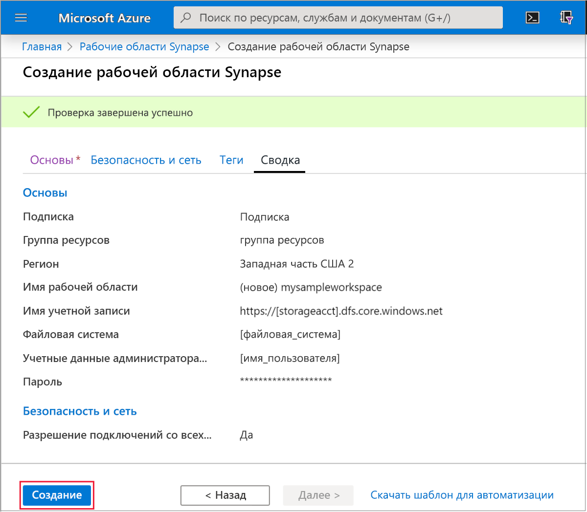
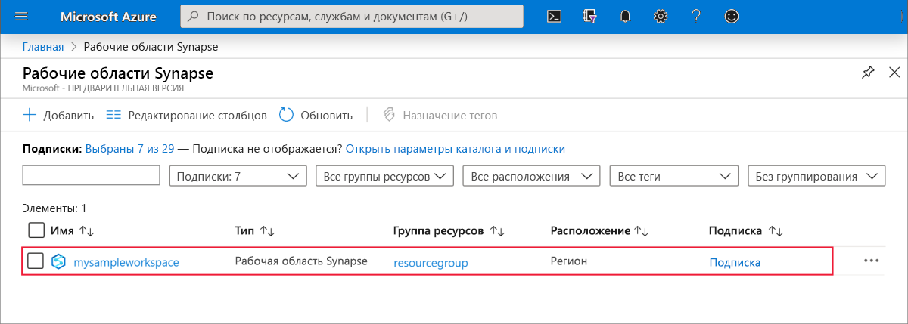
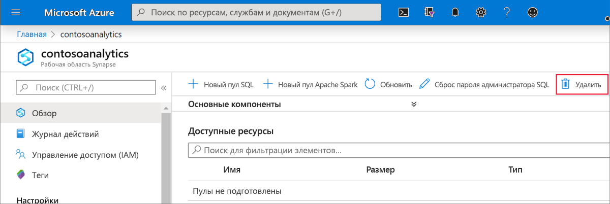
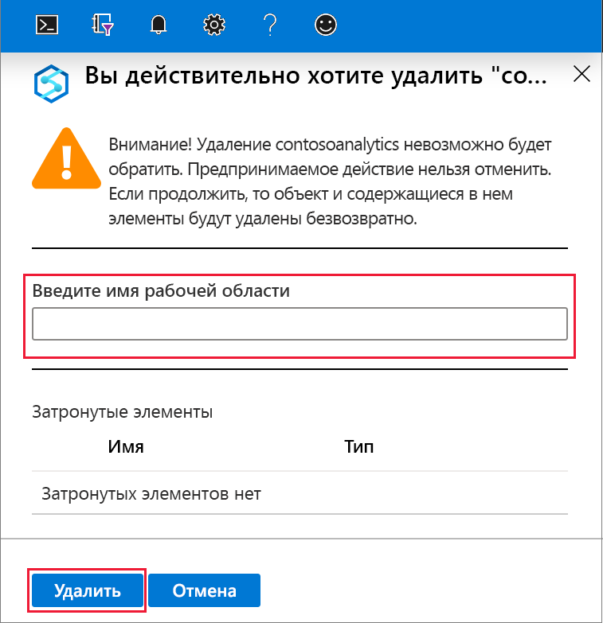

# Краткое руководство. Создание рабочей области Synapse

В этом кратком руководстве описаны действия по созданию рабочей области Azure Synapse с помощью портала Azure.

Если у вас еще нет подписки Azure, [создайте бесплатную учетную запись, прежде чем начинать работу](https://azure.microsoft.com/free/).

## Предварительные требования

- [Учетная запись хранения Azure Data Lake Storage 2-го поколения](../storage/common/storage-account-create.md?toc=/azure/synapse-analytics/toc.json&bc=/azure/synapse-analytics/breadcrumb/toc.json)

## Вход на портал Azure

Войдите на [портал Azure](https://portal.azure.com/)

## Создание рабочей области Azure Synapse с помощью портала Azure

1. В области поиска Microsoft Azure введите **Рабочая область Synapse**, а затем выберите эту службу.

2. На странице **Рабочие области Synapse** щелкните **+ Добавить**.

3. Заполните форму **Рабочая область Azure Synapse**, указав следующую информацию:

    | Параметр | Рекомендуемое значение | Описание |
    | :------ | :-------------- | :---------- |
    | **Подписка** | *Ваша подписка* | Дополнительные сведения о подписках см. [здесь](https://account.windowsazure.com/Subscriptions). |
    | **Группа ресурсов** | *Любая группа ресурсов* | Допустимые имена групп ресурсов см. в статье о [правилах и ограничениях именования](/azure/architecture/best-practices/resource-naming?toc=/azure/synapse-analytics/toc.json&bc=/azure/synapse-analytics/breadcrumb/toc.json&view=azure-sqldw-latest). |
    | **Имя рабочей области** | mysampleworkspace | Указывает имя рабочей области, которое также будет использоваться для конечных точек подключения.|
    | **Регион** | восточная часть США 2 | Указывает расположение рабочей области.|
    | **Data Lake Storage 2-го поколения** | Учетная запись —`storage account name`.   Файловая система —`root file system to use`. | Указывает имя учетной записи хранения ADLS 2-го поколения для использования в качестве основного хранилища, а также используемую файловую систему.|
    ||||

    

    Учетная запись хранения можно указать такими способами:
    - выбрать в списке учетных записей ADLS 2-го поколения, доступных в вашей подписке;
    - ввести, используя имя учетной записи.

    > [!IMPORTANT]
    > В рабочей области Azure Synapse должна быть возможность считывать данные в выбранной учетной записи ADLS 2-го поколения и выполнять запись в нее. Кроме того, для любой учетной записи хранения, связываемой в качестве основной учетной записи хранения, необходимо включить **иерархическое пространство имен** при создании учетной записи хранения.
    >
    > Под полями выбора ADLS 2-го поколения есть примечание о том, что управляемому удостоверению рабочей области будет назначена роль **Участник для данных BLOB-объектов хранилища** в выбранной файловой системе Data Lake Storage 2-го поколения и предоставлен полный доступ.

4. (Необязательно) Измените параметры по умолчанию на вкладке **Security + networking** (Безопасность и сеть).
5. (Необязательно) Добавьте теги на вкладке **Теги**.
6. На вкладке **Сводка** будут выполнены необходимые проверки возможности создания рабочей области. После завершения проверки нажмите кнопку **Создать**. 
7. После успешного завершения подготовки ресурсов вы увидите запись для созданной рабочей области в списке рабочих областей Synapse. 

## Очистка ресурсов

Выполните действия ниже, чтобы удалить рабочую область Azure Synapse.
> [!WARNING]
> Удаление рабочей области Azure Synapse приведет к удалению модулей аналитики и данных, хранящихся в базе данных автономных пулов SQL и метаданных рабочей области. В этом случае невозможно будет подключиться к конечным точкам SQL и Apache Spark. Все артефакты кода будут удалены (запросы, записные книжки, определения заданий и конвейеры).
>
> Удаление рабочей области **не** влияет на данные в Azure Data Lake Store 2-го поколения, связанные с рабочей областью.

Если вы хотите удалить рабочую область Azure Synapse, выполните следующие действия:

1. Перейдите к рабочей области Azure Synapse, которую нужно удалить.
1. На панели команд щелкните **Удалить**.
 
1. Подтвердите удаление и нажмите кнопку **Удалить**.
 
1. После успешного завершения процесса рабочая область Azure Synapse больше не будет отображаться в списке рабочих областей.

## Дальнейшие действия

Теперь можно создать пулы [SQL](quickstart-create-sql-pool-studio.md) или [Apache Spark](quickstart-create-apache-spark-pool-studio.md), чтобы начать анализ и изучение данных.
